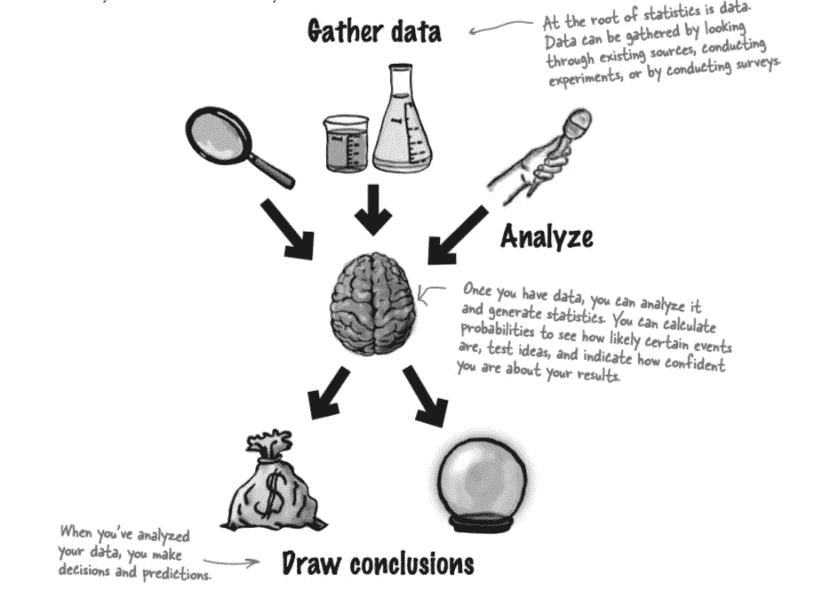
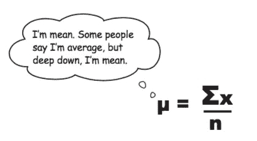
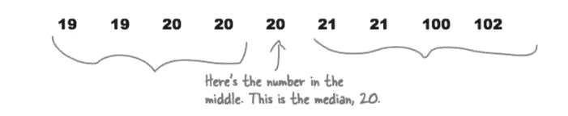
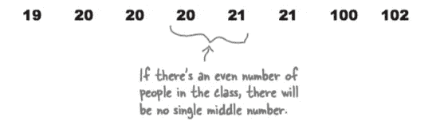
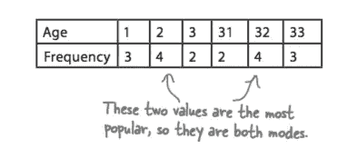

# 统计学:数据的收集、分析和推断(上)

> 原文：<https://towardsdatascience.com/statistics-the-collection-analysis-and-inference-of-data-part-i-b733f5eb1ac6?source=collection_archive---------13----------------------->

## 统计学的定义

统计数字是以某种有意义的方式总结原始事实和数字的数字。他们提出了一些关键的想法，这些想法仅仅通过查看原始数据可能不会立即显现出来，我们所说的数据是指我们可以从中得出结论的事实或数字。

## 为什么要学统计学？

要做出客观的决定，做出看似鼓舞人心的准确预测，并尽可能以最有效的方式传达你想要的信息。这是总结数据关键事实的一种便捷方式。对统计学有很好的理解会使你处于有利地位。当统计数据不准确或具有误导性时，你更容易判断出来。换句话说，学习统计学是确保你不被愚弄的好方法。

## 处理数据:分类与数字

当您处理数据时，您需要弄清楚的一个关键问题是您正在处理哪种数据。一旦你明白了这一点，你会发现对你的数据作出关键决策会更容易。

*   **分类或定性数据**被分成描述质量或特征的类别。定性数据的一个例子是游戏类型；每个流派形成一个独立的类别。
*   **数值型或定量型**数据则与数字相反。数据中的值具有数字的含义，这涉及到测量或计数。数值型数据又称为定量型数据，因为它描述的是数量。

## 测量中心趋势

有时候你只需要抓住事情的核心。在一大堆数字中很难看出模式和趋势，找到平均值通常是看到更大画面的第一步。有了平均值，您将能够快速找到数据中最具代表性的值，并得出重要的结论。

## 平均值

很可能你以前被要求算出平均值。求一串数的平均值的一种方法是把所有的数加在一起，然后除以有多少个数。

在统计学中，这叫做 ***意思是*** 。它由以下等式表示:

## 模糊含义的情况

让我们考虑一个简单的例子。假设我们计算了所有员工的平均工资，以及工资比其他员工高得多的首席执行官的平均工资。平均值会受到首席执行官工资的影响，因此我们无法推断给定群体的正确信息。在这里，首席执行官的工资被称为 ***离群值*。当数据集中出现异常值时，均值会向异常值移动，从而给我们错误的信息。**

当我们绘制包含异常值的数据时，它要么向左倾斜，要么向右倾斜，如下所示:

## 中位数

如果平均值因为数据失真和异常值而变得有误导性，那么我们需要一些其他的方法来说明什么是典型值。我们可以通过取中间值做到这一点。这是一种不同的平均值，它被称为*中值。让我们考虑一组中位数待定的数字。*

****

*如果你有一组偶数，就取中间两个数的**平均值。**在这种情况下，中值计算为 20.5。*

## *方式*

*在某些情况下，中位数不能给出正确的数据解释。假设中间值(在奇数个数据集的情况下)或两个中间值的平均值(在偶数个数据集的情况下)可能甚至不接近该组中的其余数据点。在这种情况下，就引入了 ***模式*** 的概念。*

*一组数据的众数是最受欢迎的值，出现频率最高的值。与平均值和中值不同，绝对模式*的*是数据集中的一个值，并且是最常见的值。*

**

*该模式不仅适用于数字数据；它也适用于分类数据。事实上，只有*和*这种平均值才能处理分类数据。当您处理分类数据时，模式是最常出现的类别。*

*以上三种方法是统计分析数据的基本方法。在我即将发布的帖子中，我还会涉及更多的话题。所以，在那之前请继续关注！*