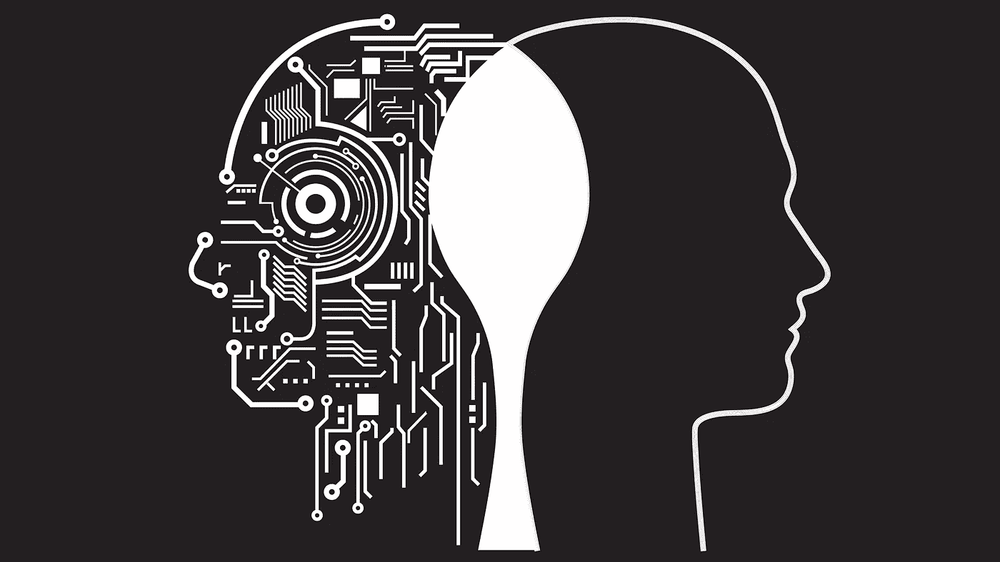
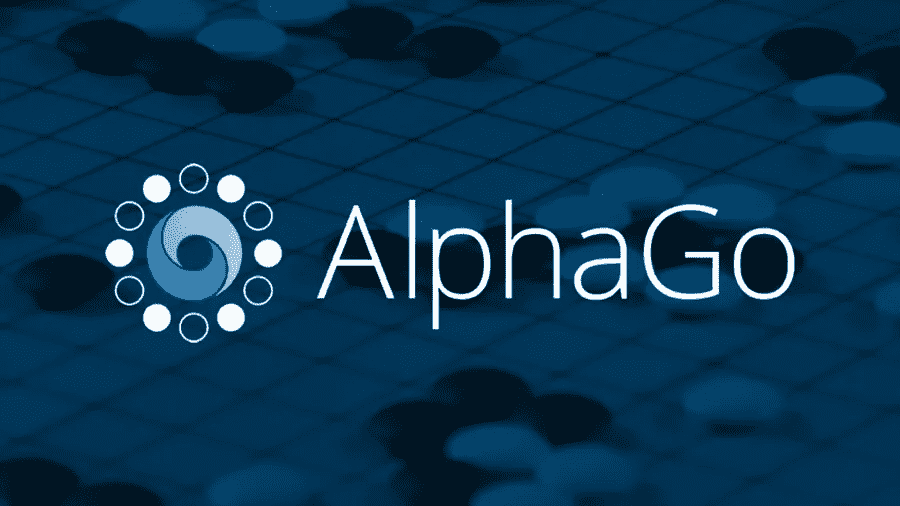
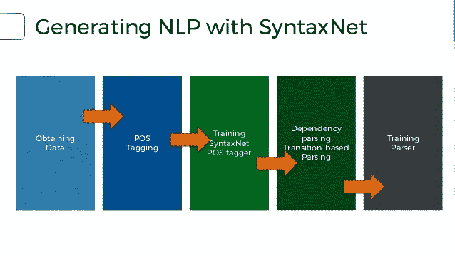
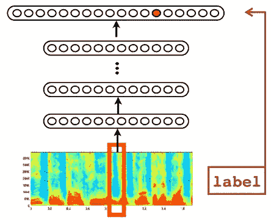
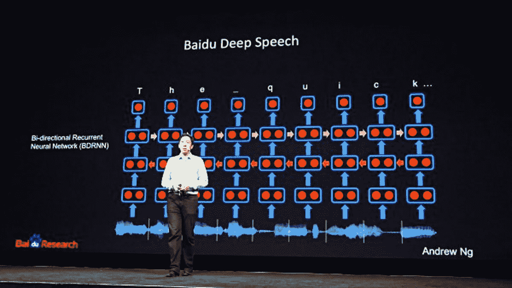
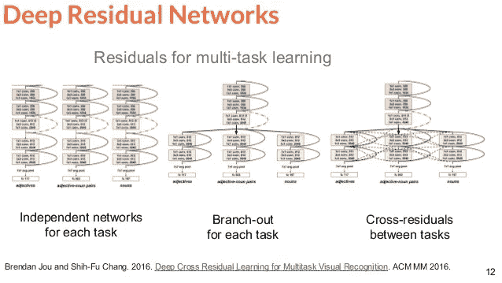

# 远离端到端深度学习

> 原文：<https://towardsdatascience.com/steering-away-from-end-to-end-deep-learning-d387f55eeb5f?source=collection_archive---------3----------------------->

# 或者混合软件 1.0 和 2.0

在为客户端问题设计攻击策略时，我经常观察到*最佳*解决方案结合了**基于实例编程**(机器/深度学习，软件 **2.0** )和**基于规则编程**/基于规则(RB，软件 **1.0** )两种风格。我之前的[帖子](https://medium.com/towards-data-science/when-not-to-use-dl-ml-ai-24103f147dd0)讨论了这两种极端风格之间的拉锯战。

**重述一下:**给定一堆输入/输出对*例子*，你需要**猜测**一个函数 *f* ，这样对于每一对 *f(i) = o* 。那么，你是自己编写 f *中的**规则***还是使用一个从这些输入/输出例子中学习 *f* 的 ML/DL 算法。或者，更好的是，将它们结合起来以克服其中任何一个的缺点。

有趣的是，对于大多数客户问题，我发现 ***组合最有效***——事实上，人们经常需要设计出创造性的方法来结合这两种风格。你可以有一个*断裂的*组合，其中 RB 和 ML 组件之间的边界非常明显，或者一个更加*密集的*组合。交互可以是单向的或双向的。

令人惊讶的是，网上几乎没有关于这种混合编程风格的讨论。因此，这篇文章:我将列出并解释一堆问题的解决方案，所有这些都是这种混合风格的*最好解决的*。这些应用跨越了各种领域——NLP、视觉和语音，以及强化学习——所有这些都适用于深度学习。

**更新:** Andrej Karpathy 最近写了一篇[文章](https://medium.com/@karpathy/software-2-0-a64152b37c35)关于**软件 2.0** (程序带实例)将如何吞噬**软件 1.0 (** 程序带规则)。相反，这篇文章解释了软件 1.0 和 2.0 将如何很好地结合在一起。

**AlphaGo** 。也许混合学习最著名的例子是 AlphaGo(现在，自我游戏 [AlphaGo Zero](https://www.nature.com/articles/nature24270.epdf?author_access_token=VJXbVjaSHxFoctQQ4p2k4tRgN0jAjWel9jnR3ZoTv0PVW4gB86EEpGqTRDtpIz-2rmo8-KG06gqVobU5NSCFeHILHcVFUeMsbvwS-lxjqQGg98faovwjxeTUgZAUMnRQ) )。像通常的深度强化学习(RL)方法一样，它学习一个深度网络 **N** (卷积残差层)来预测每个状态的*值*(我会赢的概率)以及在每个状态下要采取的*下一步行动*(策略)。现在，我们如何获得目标状态和动作值(~基本事实)来训练每个状态下的网络？这就是有趣的地方。

一种方法是*根据从同一网络 **N** 或 **N** 的较早快照*获得的*下一状态的预测来推断* *当前状态*目标。当试图扩展时，这种方法有许多缺点。相反，AlphaGo Zero 采用了一种混合的[方法](https://applied-data.science/static/main/res/alpha_go_zero_cheat_sheet.jpg)。

为了估计目标，它从当前状态进行一系列*模拟*(蒙特卡罗树搜索)。这些模拟不是随机的:它们由来自 **N** 的预测*引导*，即，在从当前状态开始的树扩展期间，基于 **N** 的预测贪婪地选择边。构建这棵树让算法*能够预见未来*(每个 MCTS 1600 次模拟)。最后，使用该树上的局部反向计算来获得当前状态的目标值/动作估计。

简而言之，为了征服围棋，AlphaGo Zero 在核心部分采用了基于神经网络的值和动作预测，**与图形探索/动态编程之类的规则精细地交织在一起**。注意这里的联轴器是*双向* DL < - > MCTS(或者 ML < - > RB)。为什么这样

神经网络需要*个例子*来学习:基于规则的 MCTS+推理帮助神经网络获得*个好的*目标值。另一方面，MC 树搜索很容易迷失在巨大的搜索空间中:NN 预测使 MC 搜索*集中于*更小的一组更高回报的动作和状态。

**文/NLP** 。

尽管围绕端到端(e2e)深度学习大肆宣传，但实际上 NLP 解决方案依赖于基于规则的(RB)引擎，该引擎由 ML 引擎提供的结果**输入。这种耦合在大多数情况下是*单向* ML - > RB(也不像 AlphaGo 那样纠结)。**

例如，考虑一下**将自然语言查询 Q 转换成 SQL 查询 s 的问题。**一个常见的解决方案是首先用名词/动词/标记查询 Q..标签，或者使用**依存解析器**从 Q 中提取中心修饰关系。接下来，我们在 tags/dependency-parse 之上编写一堆 **if-then-else 规则**，以提取实体、关系并推断 SQL 语句的正确嵌套。这种组合工作得很好，因为解析器公开了一个句子的组成结构，足以让我们编写一堆特别的规则来解决最终目标。

**依存句法分析**——是自然语言处理中的一个基本问题，用来计算一个句子的*成分结构。几个高阶的 NLP 问题(如上图)依赖于一个好的依赖解析器。为了找到给定句子 **S** 中的中心词和修饰语，必须比较 **S** 和**中的每一对词，并对这对词进行评分**。为了正确评分，你必须理解两个单词在*和*中的上下文，然后给单词评分。给上下文中的成对单词打分是很困难的——我们需要使用一个 ML 引擎从例子中学习分数。*

在深度学习中，双 LSTM (+MLP)被[用于](http://u.cs.biu.ac.il/~yogo/DepLing2017invited.pdf)获得分数。给定评分引擎，**外部循环**迭代地给几对评分，并挑选出具有最佳评分的依存关系树，例如，使用最小生成树算法。在这里，RB 外环和基于 ML 的评分引擎的组合是*断裂*，但足以解决问题。

聊天机器人。与人类进行自动化目标驱动对话的关键步骤是定位口语句子中的关键实体。关键问题是序列标记(槽填充),并通过使用 RNNs 从例子中学习来解决。这个肯尼亚[支付聊天机器人](https://medium.com/lets-ongair/building-the-m-pesa-charges-bot-c63f66822870)集合了基于 ML 的槽填充规则，用于检测一些货币提及。另一个最近的例子是 [Edina](https://arxiv.org/abs/1709.09816) ，一个学习如何对话的社交机器人。与大多数分散的方法不同，Edina 以无缝的方式从 RB 转移到 ML 方法。

[本文](https://arxiv.org/abs/1603.07185)将 **SQL 查询**与**单词嵌入**结合在一起，在数据库中查找不完全匹配(平滑 DB 搜索)。在这里，学习到的嵌入被输入到基于规则的 SQL 语法和执行引擎中。现在，这是 RB 和 ML 方法之间的密集组合，对于解决结构化+非结构化文本领域的搜索至关重要。

**形象、言语。**

**预处理**原始图像或语音数据包括应用一组*已知的*滤波器将原始输入编码成特征。一个 ML 引擎发现使用这些特性来合成 *f* 更容易。例如，图像可以被 ZCA 白化、直方图均衡化以提高对比度、归一化等。本质上，预处理包括应用*已知的转换规则*，其输出被输入学习引擎。有趣的是，这是 RB - > ML 的一个实例(我们之前看到的 ML - > RB 的反例)。

**表格 OCR** ，从图像中提取表格结构的问题，例如申请表、收据等。该解决方案通常依次由两个模块组成。使用 ML/DL 可以更好地完成底层的工作(线条、字符边缘、文本边界框检测)。更高级的布局发现可以通过边界框上的一组解析规则来更直接地解决。当然，您可以使用 e2e 学习公式，它以适当的编码格式输出表格布局。然而，我的经验是，数据设置和训练比编写第二部分的规则更麻烦。

原始的*时间*-域**语音数据**通过计算快速傅立叶变换的变体( **FFT** )被变换到*频率*域，随后在馈送到学习引擎之前将频率宁滨到以人为中心的标度(例如梅尔标度/ **MFCC** )。一些方法摆脱了这种固定层，以实现基于 e2e 深度学习的语音解决方案，但它们几乎不是主流。也许网络发现学习 *FFT 方程*或 *Mel 系数*很难。即便如此，一遍又一遍地学习这些方程也是没有意义的，如果他们最终每次都学到了这些的话。我认为这个问题是一个很好的例子，说明了我们为什么更喜欢一个破碎的 RB+ML 方法，而不是 e2e ML 方法。

[**表示**](https://people.xiph.org/~jm/demo/rnnoise/) 。这篇最近的论文使用了一种破碎规则+ ML 的方法来从语音中去除噪声。这是一个有趣的案例研究，它如何结合:(I)使用现有的(RB)语音滤波器和 bark 系数作为特征；(ii)选择一种网络架构，将任务分解为预定义的组件:语音活动检测、噪声估计、减去噪声；(iii)用深度网络实现每个组件，通过跳过连接(ML)进行组合；(iv)允许多任务学习。我发现(ii)特别有趣:尽管它坚持 e2e 学习范式，但是*架构*选择的**反映了**我们将如何手动分解问题。

在这篇文章中，我们看到了混合(ML+Rules)学习如何用于解决实际问题的几个例子:它解决了严格规则方法的覆盖限制和严格 ML 方法的缺乏保证。

我将以一些关于 *e2e 与断裂*途径之间**紧张**的想法来结束我的发言。给定一个复杂的问题，人类很快将其分解为子任务(更容易解决，可以重用众所周知的解决方案)。虽然 e2e 深度学习承诺通过隐藏网络架构内部的分解来使生活变得更容易，但我相信我们有一种倾向，那就是回到我们的(有偏见的)解决方案分解，并使它们显化(也许通过使用一种分裂的方法)。

这导致了基于规则和基于例子的问题解决方式之间的内在矛盾。事实上，像 [RNNnoise](https://people.xiph.org/~jm/demo/rnnoise/) 或[this](https://arxiv.org/abs/1611.01587)这样的方法，试图通过*挑选反映我们预定义的问题分解的架构*来将世界聚集在一起，并一次性学习*几个任务*。

我希望这篇文章有助于阐明我们如何从例子中进行混合学习。我会继续在这篇文章中添加其他混合学习的例子。