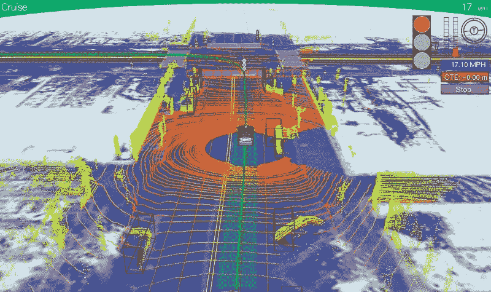
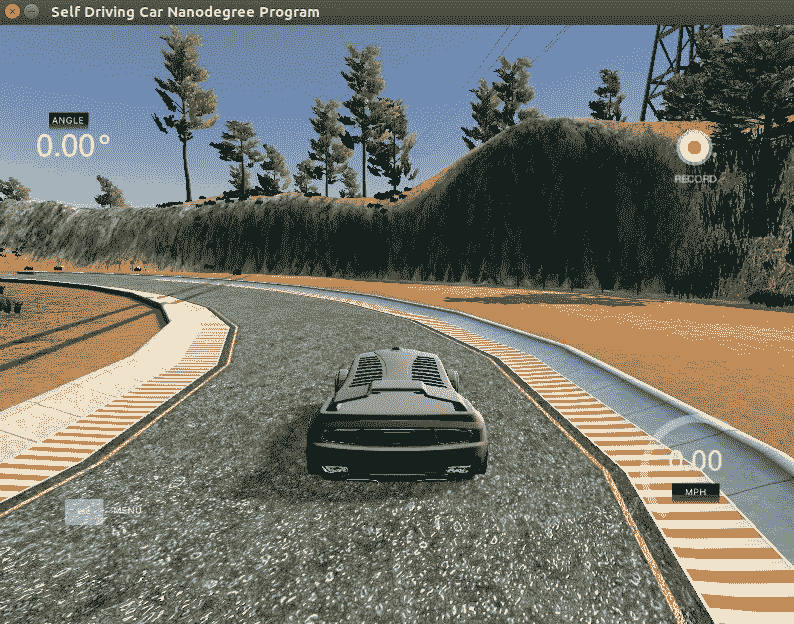
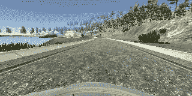
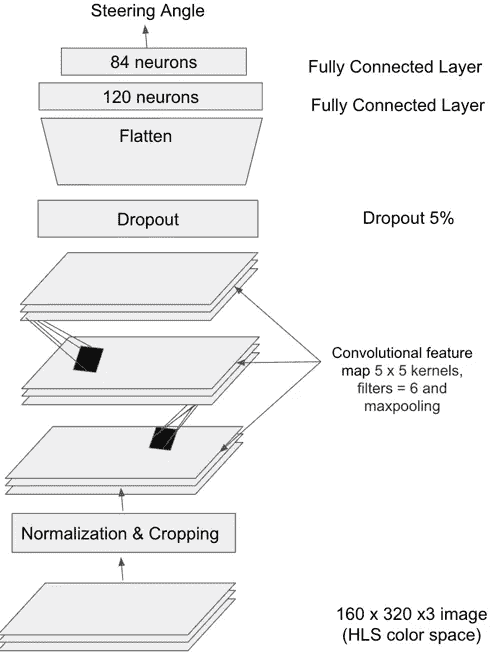

# 无激光雷达自动驾驶汽车转向

> 原文：<https://towardsdatascience.com/steering-self-driving-car-without-lidar-a6b0a4d2e2f1?source=collection_archive---------4----------------------->

自动驾驶汽车使用各种技术来检测周围环境，如[雷达](https://en.wikipedia.org/wiki/Radar)、[激光](https://en.wikipedia.org/wiki/Lidar)、 [GPS](https://en.wikipedia.org/wiki/GPS) 、[里程计](https://en.wikipedia.org/wiki/Odometry)和[计算机视觉](https://en.wikipedia.org/wiki/Computer_vision)。S [传感器信息](https://en.wikipedia.org/wiki/Sensory_information)用于识别导航路径、障碍物和路标。自动驾驶汽车的控制系统能够分析传感数据，以区分道路上的不同汽车，检测车道线并预测转向角度

像[激光雷达](https://en.wikipedia.org/wiki/Lidar)这样的传感器很贵。激光雷达的领先制造商威力登公司以 8000 美元的价格出售其目前用于原型机器人汽车的机械旋转激光雷达设备。有没有可能使用简单的相机图像和其他负担得起的感官数据来让自动驾驶汽车在道路上行驶？

对于行为克隆[项目](https://github.com/linux-devil/behavioral-cloning)的想法是训练一个深度神经网络来克隆驾驶行为，以预测转向角度。 [Udacity 的](https://www.udacity.com/)模拟器用于收集训练数据，也用于测试模型性能。训练数据由来自不同摄像机(中央、左侧和右侧)的一系列图像以及油门、速度、转向角度和制动的相应测量值组成。

Udacity Simulator

Training image from simulator

对于左边的图像，我们在模拟器上驾驶这辆车后记录了转向角测量值。在模拟器上记录 4 圈的训练数据

每个图像的尺寸为 160×320×3(RGB 图像),进一步用于训练深度神经网络以预测转向角。在我进入模型架构之前，让我给你看一下汽车在模拟器中自动驾驶的视频。

Behavioral Cloning Track Simulation

[我使用的 CNN](https://en.wikipedia.org/wiki/Convolutional_neural_network) 架构的灵感来自 [Nvidia 的架构](https://arxiv.org/pdf/1604.07316v1.pdf):

## 数据预处理

使用模拟器 160 x 320 x 3 尺寸(RGB 图像)获得的训练图像，因为模拟器转向角训练期间的大部分时间为零。我不得不在零转向角的情况下随机清除 80%的数据。这是在预测过程中考虑偏差所必需的。并且为了更好的预测，RGB 图像也被裁剪并转换到 HLS 颜色空间。裁剪是必要的，因为它有助于从数据中去除噪声，因为与天空和风景相比，转向角度更依赖于对道路和转弯的感知。不用说，模型在进行数据预处理后表现得更好。

当 lap 向任一方向(左或右)转弯时，即使训练后数据也可能有偏差。为了避免这种情况，cv2。 [flip](http://docs.opencv.org/2.4/modules/core/doc/operations_on_arrays.html#void flip(InputArray src, OutputArray dst, int flipCode)) 用于扩充数据并生成更多数据集。左右图像用于恢复，转向校正系数为 0.20。

## 神经网络结构和超参数

在探索了 comma.ai 和 Nvidia 的架构之后，我决定从简单的架构开始。想法是从简单开始，如果需要，增加更多的复杂性。架构与上面张贴的图表相同。应用 5%的下降以避免过度拟合，并且所有层都跟随有 RELU 激活，以便引入非线性。

“MSE”用于计算优化器的损失和“adam”。我发现这个[博客](http://sebastianruder.com/optimizing-gradient-descent/index.html#adam)真的有助于理解不同的梯度下降优化算法。五个时期用于 20%验证分割的训练。经过五个时期的训练后，我的训练损失大约为 3 %,验证损失大约为 5%。

## 结论和讨论

虽然这个项目很有挑战性，但最终在模拟器中看到汽车自动驾驶的快乐让我意识到这是值得努力的。仔细收集训练数据很重要。我也不确定这种技术在弱光条件下是否有效。不用说，深度学习，或一类机器学习算法，正显示出巨大的前景，主要是因为它正在取得成果。我相信还有很多不同的技术有待探索，但这是一个很好的开始。

下面是[链接](https://github.com/linux-devil/behavioral-cloning)到我的 github repo 与 [keras](https://keras.io/) 实现上面的代码并写上去。

## 参考

[Udacity](https://www.udacity.com/drive) 自动驾驶汽车工程师纳米学位。

关于卷积神经网络的 [CS231n](http://cs231n.github.io/) 课程和[安德烈·卡帕西](https://medium.com/u/ac9d9a35533e?source=post_page-----a6b0a4d2e2f1--------------------------------)的[视频讲座](https://www.youtube.com/watch?v=g-PvXUjD6qg&list=PLlJy-eBtNFt6EuMxFYRiNRS07MCWN5UIA)。

我的 github 回购:[https://github.com/linux-devil/behavioral-cloning](https://github.com/linux-devil/behavioral-cloning)

英伟达[架构](https://arxiv.org/pdf/1604.07316v1.pdf)

Comma.ai [架构](https://github.com/commaai/research)

[行为克隆项目](https://github.com/udacity/CarND-Behavioral-Cloning-P3)