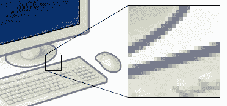
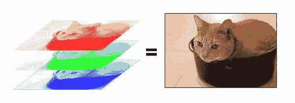
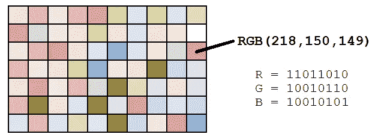
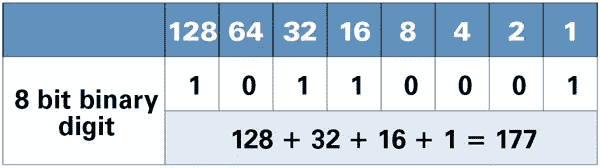
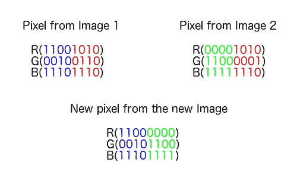
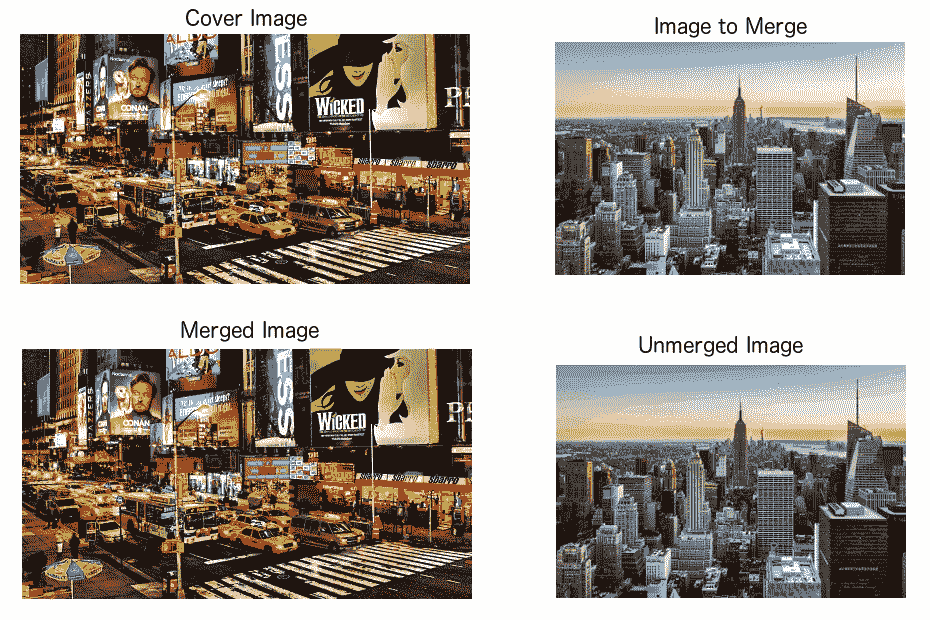

# 隐写术:将一幅图像隐藏在另一幅图像中

> 原文：<https://towardsdatascience.com/steganography-hiding-an-image-inside-another-77ca66b2acb1?source=collection_archive---------1----------------------->

在这个故事中，我们将学习一些图像处理的概念，以及如何将一个图像隐藏在另一个图像文件中。

为了提供一个功能示例，实现了一个 [**Python** 类](https://github.com/kelvins/steganography/blob/master/steganography.py)来执行本故事结尾提到的过程。

首先我们来了解一下什么是隐写术，数字图像，像素，颜色模型。

## 什么是隐写术？

> [隐写术](https://en.wikipedia.org/wiki/Steganography)是将一个文件、消息、图像或视频隐藏在另一个文件、消息、图像或视频中的做法。

## 隐写术比密码学有什么优势？

> 隐写术相对于单独的[密码术](https://en.wikipedia.org/wiki/Cryptography)的优势在于，预期的秘密消息不会引起对其自身作为审查对象的注意。显而易见的加密信息，无论如何无法破解，都会引起人们的兴趣，而且在加密不合法的国家，这些信息本身可能会被定罪。

换句话说，当我们想要发送秘密信息时，隐写术比密码学更谨慎。另一方面，隐藏的信息更容易提取。

## 什么是数字图像？

好了，现在我们知道了隐写术的基础知识，让我们学习一些简单的图像处理概念。

在了解如何将一幅图像隐藏在另一幅图像中之前，我们需要了解什么是数字图像。

我们可以将数字图像**描述为一组有限的数字值，称为像素。像素是图像中最小的单个元素，包含代表给定颜色在任何特定点的亮度的值。所以我们可以把一幅图像想象成一个包含固定数量的行和列的像素矩阵(或二维数组)。**

当在此使用“**数字图像**术语时，我们指的是“**光栅图形**，它基本上是一种点阵数据结构，代表像素网格，进而可以存储在不同格式的图像文件中。你可以在[维基百科](https://en.wikipedia.org/wiki/Main_Page)网站上阅读更多关于[数字图像](https://en.wikipedia.org/wiki/Digital_image)、[光栅图形](https://en.wikipedia.org/wiki/Raster_graphics)和[位图](https://en.wikipedia.org/wiki/Bitmap)的内容。

## 像素概念和颜色模型

如前所述，像素是图像的最小元素。因此，每个像素都是原始图像的样本。这意味着，更多的样本可以更准确地再现原始图像。每个像素的强度[是可变的。在彩色成像系统中，一种颜色通常由三种或四种分量强度表示，如](https://en.wikipedia.org/wiki/Intensity_(physics))[红色、绿色和蓝色](https://en.wikipedia.org/wiki/RGB_color_model)，或[青色、品红色、黄色和黑色](https://en.wikipedia.org/wiki/CMYK_color_model)。

这里，我们将使用 [RGB 颜色模型](https://en.wikipedia.org/wiki/RGB_color_model)。可以想象，RGB 颜色模型有 3 个通道，红、绿、蓝。

> **RGB 颜色模型**是一种加色[颜色模型](https://en.wikipedia.org/wiki/Color_model)，其中红色、绿色和蓝色光以各种方式相加在一起，以再现各种颜色。该型号的名称来自三种加色原色的首字母，即红、绿和蓝。RGB 颜色模型的主要用途是用于电子系统(如电视和计算机)中图像的感测、表示和显示，尽管它也用于传统的[摄影](https://en.wikipedia.org/wiki/Photography)。

因此，图像中的每个像素由 3 个值(红、绿、蓝)组成，这 3 个值是 [8 位](https://en.wikipedia.org/wiki/8-bit)值(范围是 0–255)。

正如我们在上面的图像中看到的，对于每个像素，我们有三个值，可以用[二进制代码](https://en.wikipedia.org/wiki/Binary_code)(计算机语言)来表示。

处理二进制代码时，我们有较高的有效位和较低的有效位，如下图所示。

最左边的**位**是**最高有效位**。如果我们改变最左边的位，它将对最终值有很大的影响。例如，如果我们将最左边的位从 **1** 更改为 **0** ( **11111111** 更改为 **01111111** )它会将十进制值从 **255** 更改为 **127** 。

另一方面，**最右边的**位是**最低有效位**。如果我们改变最右边的位，对最终值的影响会更小。例如，如果我们将最左边的位从 **1** 更改为**0**(**111111111**更改为 **11111110** )它会将十进制值从 **255** 更改为 **254** 。注意，最右边的位在 256 的范围内只改变 1(它表示小于 1%)。

**总结:**每个像素有三个值(RGB)，每个 RGB 值都是 8 位(意味着我们可以存储 8 个二进制值)，最右边的位不太重要。因此，如果我们改变最右边的位，它将对最终图像有一个小的视觉影响。这是将一幅图像隐藏在另一幅图像中的隐写术密钥。更改一幅图像的较低有效位，并包含另一幅图像的最高有效位。

## 将图像隐藏在另一个图像中

既然我们理解了像素概念和颜色模型，我们就可以讨论将一个图像隐藏到另一个图像中的过程。

在本节中，我们可以找到使用 Python 代码的隐藏和显示过程的一步一步。

**隐藏图像**:

1.  要将一个图像隐藏在另一个图像中，被隐藏的图像最多需要与隐藏它的图像大小相同。

2.我们必须创建两个循环来遍历图像的所有行和列(实际上是每个像素)。

3.因此，我们从图像 1 和图像 2 获得 RGB 二进制值:

我们可以使用 **__int_to_bin** 方法将十进制值转换为二进制值:

4.我们将图像 1 的最高有效位与图像 2 的最高有效位合并:

使用 **__merge_rgb** 方法:

请注意， **__merge_rgb** 函数使用每幅图像的 4 个最高有效位，但也可以改变。请记住，使用隐藏图像中较少的位会导致恢复图像的质量较低。

5.最后，我们将新的二进制值转换为十进制值:

使用 **__bin_to_int** 方法:

并将其设置为结果图像中的新像素位置。

现在我们有了一个隐藏在另一个图像中的图像。

整个**合并**的方法可以在[这里找到](https://github.com/kelvins/steganography/blob/master/steganography.py#L49)。

**露出一个形象**:

1.  要显示一幅图像，我们必须知道用了多少位来隐藏图像。在这种情况下，我们使用固定数量的 4 位。
2.  首先，我们需要创建两个循环来遍历图像中的所有像素:

3.因此，我们从当前像素中提取每个 RGB 通道作为二进制值:

使用 **__int_to_bin** 方法:

4.然后，我们创建一个新的 RGB 值，只将当前像素最右边的 4 位与零值连接起来(以创建一个新的 8 位值):

5.最后，我们将二进制值转换为十进制值，并将其设置为新图像中的当前像素:

6.当隐藏的图像小于隐藏它的图像时，所开发的算法只有最后一步来去除黑边。

通过这个简单的代码，我们可以从另一幅图像中提取一幅图像。

整个**解合并**方法可以在[这里](https://github.com/kelvins/steganography/blob/master/steganography.py#L88)找到。

**您可以在下图**中查看结果:

左上角的图像将隐藏右上角的图像。左下图像是两个合并的图像，右下图像是提取的(未合并的)图像。

正如你在上面的图像中看到的，我们在这个过程中损失了一些图像质量，但这并不影响对图像的理解。

你可以在 https://github.com/kelvins/steganography 的**Github**:上找到**隐写术 Python 代码**