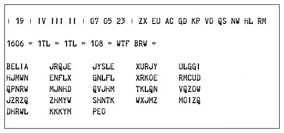
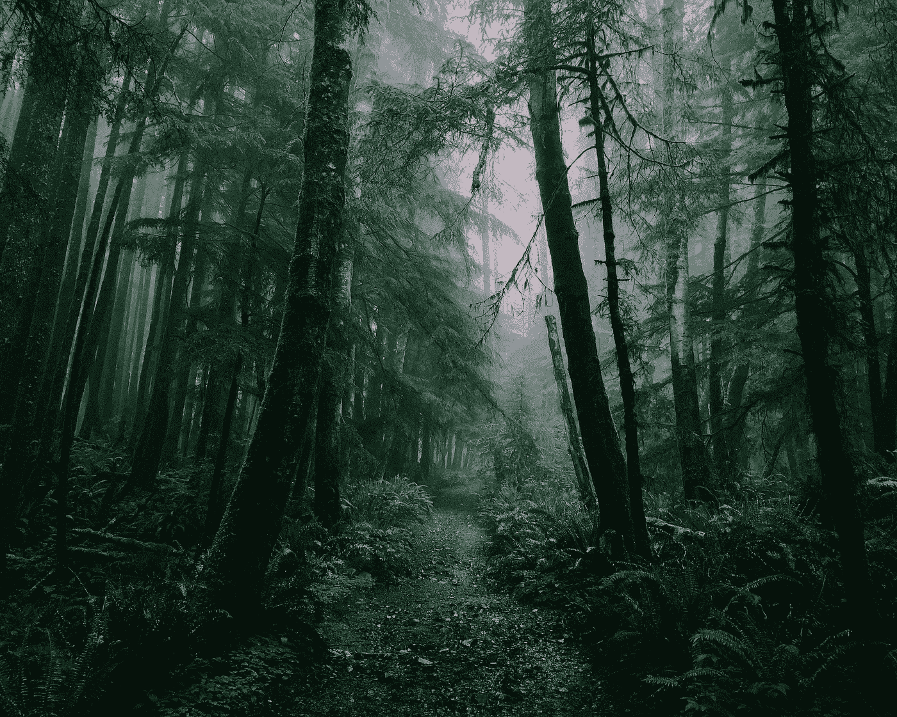
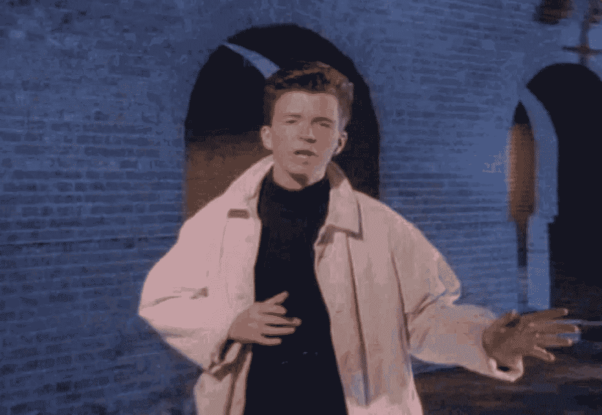
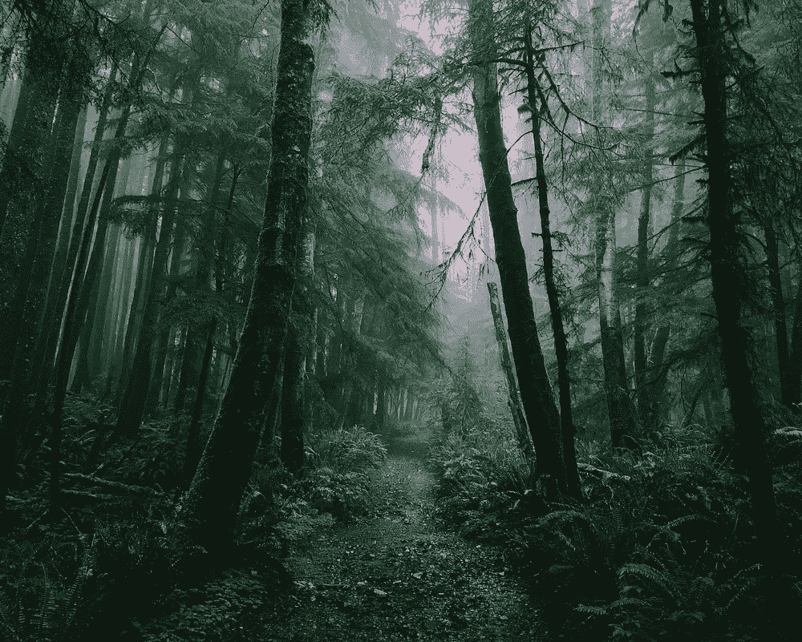
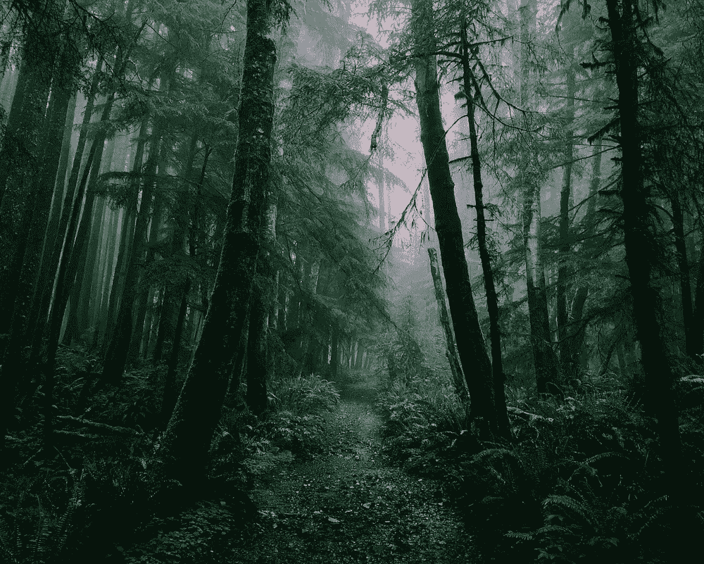
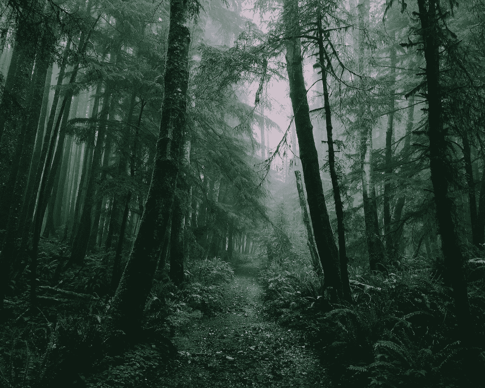

# 隐写术:间谍如何相互欺骗

> 原文：<https://towardsdatascience.com/steganography-how-spies-rickroll-each-other-6a831d7df39e?source=collection_archive---------4----------------------->

> ste ga no 图形 y
> 
> ˌste-gə-ˈnä-grə-fē
> 
> *名词*
> 
> 将一个消息、图像或文件隐藏在另一个消息、图像或文件中的艺术或实践

我是 Greg Rafferty，湾区的数据科学家。你可以在我的 [github](https://github.com/raffg/steganography) 上查看这个项目的代码。如有任何问题，请随时联系我！

第二次世界大战期间，盟军截获的德国电文如下:

他们要求他们最好的密码学家对隐藏的信息进行解码，因为显然这比看起来要复杂得多。但如果他们截获了一些德国人互相发送 1942 年的 Instagrams，他们可能不会费心去过多解读它。

Just a picture of a forest? Or something more ominous…?

“Steganography”来自希腊语 *steganos，*意为“被覆盖”或“沉默寡言”。密码学关注的是隐藏信息的内容，而隐写术关注的是隐藏信息的存在这一事实，这阻止了潜在的密码破译者深入研究。

这篇文章是关于某种隐写术，称为最低有效位(或 LSB 隐写术)。如果我给你 00000000 美元，并告诉你在我把钱交给你之前，你只能换其中的一个数字，只有傻瓜才会换最右边的数字并索要 00000001 美元。很明显，改变最左边的数字会得到 10，000，000 美元，或*1000 万美元*，而改变最右边的数字只会得到 1 美元。即使在这两种情况下，我们只是改变了一个数字，最右边的数字是最不重要的，因为它对总数的影响最小。这和 LSB 隐写术是一个概念。

O 一个字节的数据由 8 位组成——8 个 0 或 1 的数字，如 00011010。如果这个字节代表图像中一个像素的颜色，我们可以改变最右边的数字，并且只能非常细微地改变那个像素的颜色。我们可以将我们的秘密信息编码在这些最低有效位中，这样整个图像对人眼来说不会改变太多，也不会引起对其本身的注意，然后提取这些位来揭示秘密。

这里有一个直观的例子。计算机屏幕上的颜色可以用红、绿、蓝的各种平衡来表示。这被称为 RGB 颜色模型，每个像素可以有一个 0 到 255 之间的值。在上图中，左边的红色方块是由`R=240, G=64, B=64`的红色、绿色和蓝色像素值创建的。转换成二进制表示，这些数字就是`R=11110000, G=0100000, B=0100000`。右边的下一个方块将每个颜色通道的最低有效位从 0 更改为 1，从而得到`R=1111000**1**, G=010000**1**, B=010000**1**`的值。这个正方形和第一个正方形的颜色完全一样，我们在这个像素中编码了 3 位信息。下一个平方也改变了第二个最低有效位，导致值为`R=111100**11**, G=01000**11**, B=01000**11**`。每个方块的下一个最低有效位都发生了变化，您可以看到，直到我们到达序列的中间，颜色才会发生变化(这只是因为我们能够将其与原始值进行比较)。当我们到达最后一个方块时，红色、绿色和蓝色通道的每个字节中的每一位都被交换了，颜色已经完全改变了。当转换回整数值时，我们现在处于像素值`R=**0000111**, G=**10111111**, B=**10111111**`或`R=15, G=191, B=191`。

为了将最大量的信息编码到一个像素中而不改变太多，我选择丢弃 4 个最低有效位。因此，为了将一个图像隐藏在另一个图像中，我取封面图像的 4 个最高**有效位和隐藏图像的 4 个最高**有效位。我将隐藏图像的 4 位移动到最低**有效位的位置，并将它们与封面图像的 4 位合并。然后，瞧！，封面图像看起来一点也没有改变，但它现在包含了重建隐藏图像所必需的信息。******

这是一个展示这一过程的动画:

我们首先遍历封面图像(上面视频中的红框)和隐藏图像(绿色)的每个像素，

1.  将每个颜色通道的 RGB 值转换为二进制
2.  同样，对于每个通道，从封面图像中取出 4 个最高有效位，从隐藏图像中取出 4 个最高有效位
3.  将隐藏图像的 4 位移动到*最低有效位*的位置，并将它们与封面图像的 4 位组合
4.  将 RGB 通道组合在一起，创建一个新像素，由封面图像的 4 个有效位控制，但隐藏图像的 4 个最高有效位编码在其中。由于隐藏在最低有效位的信息，颜色会稍微改变*(注意，红色方块现在只是稍微变得*橙色)**
5.  **要解码隐藏图像，从新像素中取出 4 个最低有效位，并将它们移回到最高有效位的位置**
6.  **用 0 填充空出的最低有效位(这是我们由于编码而永远丢失的信息)**
7.  **隐藏的图像现在会出现，由于最低有效位的数据丢失，与原始图像略有不同(看，它有点暗)**

**还记得上面那张森林的照片吗？里面藏着一幅图像。我已经用隐藏图像的最高有效位替换了所有最低有效位。所以，如果我拿这张图像，去掉每个像素的四个最高有效位，把最低有效位移过来，会出现什么？里克·阿斯特利！**

****

**You’ve been rickrolled!**

**没有看到那片森林的原始照片(即使你看到了！)，很难知道里面藏着什么图像。我故意选择了一个“忙碌”的图像，有很多随机的线条和对比，因为变化更难被注意到。不过，阿斯特利的解码图片确实显示了一些因最低有效位丢失而产生的伪像。看下面的图片；顺利(这么顺利！)阿斯特利前额和脸颊的皮肤在解码图像中显示出一些色调分离，其中颜色没有平滑过渡地突然变化。你也可以在砖块中看到，特别是在他右肩(左肩)上方的拱门开始处，砖块中的许多细节都丢失了，它们看起来是一种连续的颜色。**

****************

**Top Left: original cover image; Top Right: coded image; Lower Left: original hidden image; Lower Right: decoded hidden image**

**对于 LSB 隐写术*而不是*来说，使用来自公共领域的图像是很重要的，因为人们可以很容易地将原始图像与编码图像进行比较。在这里，我已经采取了森林的原始图像，并从中减去编码图像。这将减去每个像素值，并有效地显示两张照片之间的差异。**

****

**A ghoulish rickroll emerges from the forest**

**森林图像大部分丢失，因为它的所有最高有效位已经彼此相减。我们只剩下最不重要的部分，这就是阿斯特利的藏身之处。此外，里克·阿斯特利的照片有不同的长宽比，所以照片底部的 1/8 没有任何隐藏的图像。上图的亮度也显著增加了。图像的变化如此难以察觉，以至于未增强的差异显示为纯黑色。**

**SB 隐写术不仅仅是间谍使用的工具。例如，电影工作室也经常使用这种技术。当他们需要在向公众发布电影之前将电影发送给审查者时，他们会在电影的一些帧中隐藏水印。这种水印是特定于每个提前拷贝的接收者的，所以如果电影后来在海盗湾上映，电影工作室只需要从拷贝中解码隐藏的水印，就可以发现是谁泄露了它。至关重要的是，如果图像被压缩，这些隐藏的图像仍然可以被解码——因为隐藏的图像只是其自身的“变暗”版本(不完全正确，但只是顺其自然)，即使图像被调整大小、压缩或裁剪，它仍然会在那里。**

**还可以用 LSB 隐写术将纯文本隐藏在另一幅图像中。但是文本需要稍微不同的过程；文本首先被转换成一个字节数组，然后每一位被依次覆盖到图像的最低有效位。因为顺序很重要，并且每个像素包含一长串位的一部分，所以图像必须保存为位图文件，并且不能被压缩(除非以无损格式保存，如. png 格式)、裁剪、调整大小、增强或任何其他会改变像素的过程。与隐藏另一个图像相反，在隐藏另一个图像时，对封面图像的任何改变都会改变但不会破坏隐藏的图像，而隐藏文本时，对底层像素值的任何改变都会完全破坏文本。对于大量的文本来说，这显然很不方便，因为生成的位图文件会非常大(我将《战争与和平》的全部内容编码到一张 243 兆字节的图像中)。这是森林图像的另一个版本，它包含的文本字符串比“战争与和平”短得多:**

****

**这幅图像中隐藏着什么？**

> **我们对爱情并不陌生
> 你知道规则，我也知道
> 完全的承诺是我所想的
> 你不会从任何其他人那里得到这种承诺**
> 
> **我只想告诉你我的感受，让你明白**
> 
> **永远不会放弃你
> 永远不会让你失望
> 永远不会跑来跑去抛弃你
> 永远不会让你哭泣
> 永远不会说再见
> 永远不会说谎伤害你**
> 
> **我们相识已久
> 你的心一直在痛，但你羞于启齿
> 我们都知道发生了什么
> 我们知道这个游戏，我们会玩下去**
> 
> **如果你问我感觉如何，不要告诉我你太盲目而看不到**
> 
> **永远不会放弃你
> 永远不会让你失望
> 永远不会到处乱跑抛弃你
> 永远不会让你哭泣
> 永远不会说再见
> 永远不会说谎伤害你
> 永远不会放弃你
> 永远不会让你失望
> 永远不会到处乱跑抛弃你
> 永远不会让你哭泣
> 永远不会说再见
> 永远不会说谎伤害你**
> 
> **永不放弃，永不放弃
> (放弃你)
> (哦)永不放弃，永不放弃
> (放弃你)**
> 
> **我们相识已久
> 你的心一直在痛，但你羞于启齿
> 内心深处我们都知道发生了什么
> 我们知道这个游戏，我们会玩下去**
> 
> **我只想告诉你我的感受，让你明白**
> 
> **永远不会放弃你
> 永远不会让你失望
> 永远不会到处乱跑抛弃你
> 永远不会让你哭泣
> 永远不会说再见
> 永远不会说谎伤害你
> 永远不会放弃你
> 永远不会让你失望
> 永远不会到处乱跑抛弃你
> 永远不会让你哭泣
> 永远不会说再见
> 永远不会说谎伤害你
> 永远不会 我会放弃你，永远不会让你失望，永远不会到处乱跑，抛弃你，永远不会让你哭泣，T21**