# Tensorflow 中用代码实现奇异值分解的逐步反向传播

> 原文：<https://towardsdatascience.com/step-by-step-backpropagation-through-singular-value-decomposition-with-code-in-tensorflow-8056f7fbcbf3?source=collection_archive---------8----------------------->

Photo by [Rahul Bhosale](https://unsplash.com/photos/yBgC-qVCxMg?utm_source=unsplash&utm_medium=referral&utm_content=creditCopyText) on [Unsplash](https://unsplash.com/search/photos/dream?utm_source=unsplash&utm_medium=referral&utm_content=creditCopyText)

奇异值分解，也被称为线性代数的基本定理，是一个惊人的概念，让我们将一个矩阵分解成三个更小的矩阵。(请[点击此处](http://web.mit.edu/18.06/www/Essays/newpaper_ver3.pdf)阅读关于四个基本子空间的更深入内容:4 行)。就像特征值分解一样，梯度也可以计算。

就个人而言，这是一个巨大的里程碑，我相信知道这个算法将打开许多大门，当涉及到训练一个深度神经网络 ***而没有*** 依靠自动微分时。

请注意，这篇文章是为了我自己的教育目的，如果发现任何错误，请在下面评论。

**我认为最好的参考**

Paper from this [website](https://j-towns.github.io/papers/svd-derivative.pdf)

上面的论文详细描述了这个过程，讲述了如何进行这种求导。

**假设以及基本概念回顾**

Image from this [website](https://www.quora.com/What-is-the-difference-between-columns-and-rows)

我要假设的第一件事是，我们将使用一个维数为(m，n)的矩阵，m 将总是大于 n(m≤n)。这很重要，因为当我们执行奇异值分解时，我们可以计算全矩阵，也可以不计算全矩阵。所以当我们把矩阵分解成三部分时，每一部分都有维度…

**U(左奇异向量)** → (m，n)
**S(奇异值，对角矩阵)** → (n，n)
**V(右奇异向量)** → (n，n)

为了给出一个具体的例子，让我们假设我们的原始数据矩阵“数据”具有如下所示的维度。

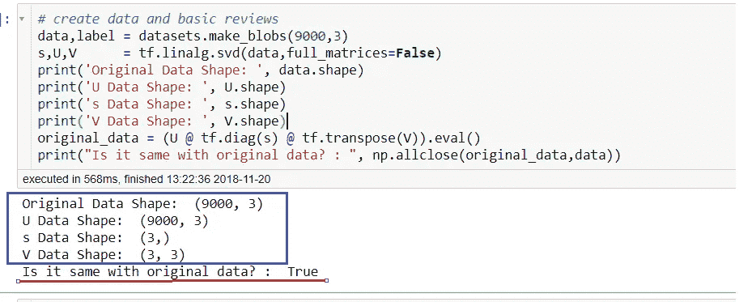

**蓝框** →显示每个矩阵的维度
**红框** →比较原始数据和重建数据

现在让我们继续讨论其他基本的线性代数概念，首先我们要讨论正交矩阵。

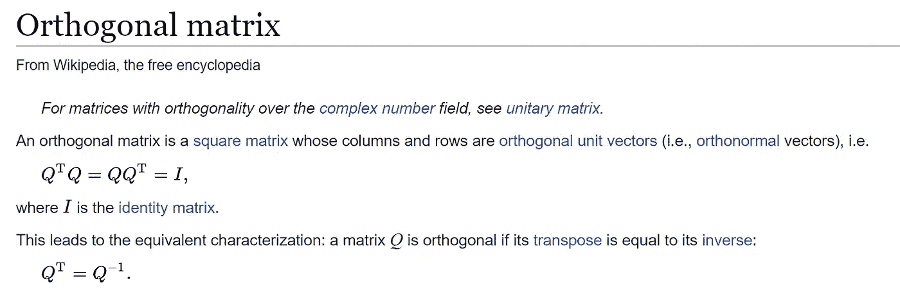

我已经假设读者已经知道了这个概念，但是让我们看看这是如何在代码中实现的。由于每个奇异向量(左和右)都是各自空间的基向量，所以它们是正交矩阵。

**蓝框→** 该性质适用于左右奇异矩阵
**红框** →当我们计算全矩阵时，该性质适用于左奇异矩阵。

现在，再次记住我们没有计算全矩阵的事实，一个性质不适用于左奇异向量，然而，当我们计算全矩阵时，我们看到该性质适用于两个方向上的两个奇异向量。

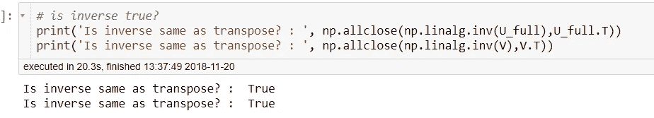

最后，让我们看看逆矩阵==转置性质适用于两个矩阵。(正交矩阵)接下来我们将讨论正交补码。

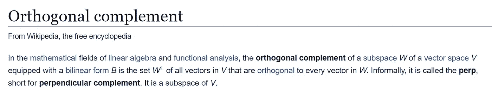

上面的描述并不能帮助我理解这个概念，所以，下面我附上了两个与这个话题相关的视频。

Video from this [website](https://www.youtube.com/watch?v=QOTjdgmNqlg)

video from this [website](https://www.youtube.com/watch?v=Kpc5ELrOt5E)

现在让我们看看这些属性在代码中是如何体现的。(注意:我将使用这个 [git repo](https://github.com/statsmodels/statsmodels/issues/3039) 中的代码来寻找正交补码。)

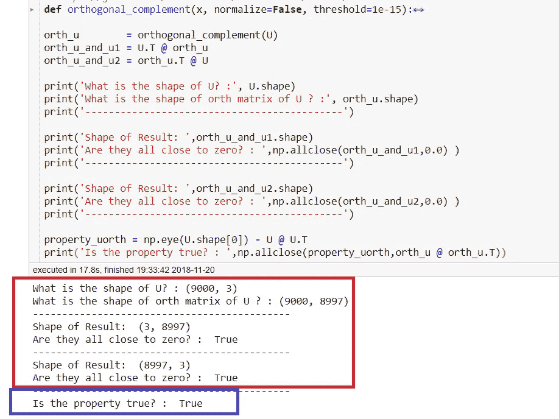

**红框**→U 的原始形状和 U 的 perp，当我们在它们之间进行点积时，所有的结果都将接近于零。

**蓝框** →计算以下属性为真。

现在请把注意力集中在蓝色的盒子上，有一分钟的时间，我没有解释这个属性，但是我想证明下面的属性是真实的。

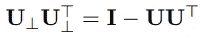

我们将在通过 SVD 反向传播时使用这个属性。最后，让我们来看看偏斜矩阵。

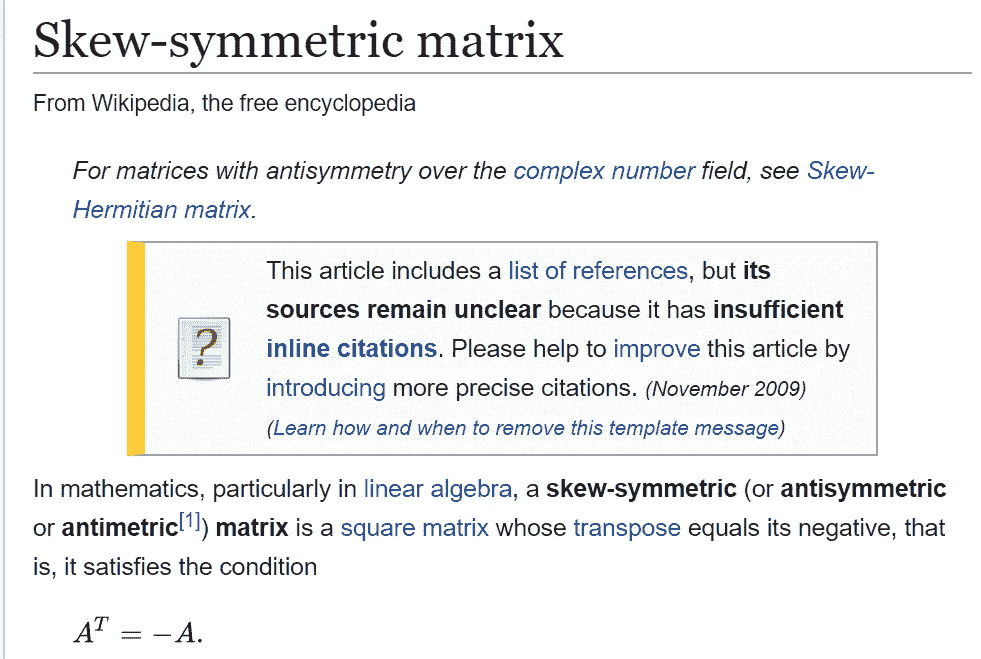

Image from this [website](https://en.wikipedia.org/wiki/Skew-symmetric_matrix)

非常简单的概念，现在让我们看一下代码，让我们的理解更加完整。

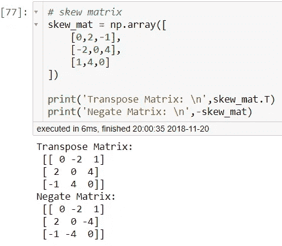

请注意，上述矩阵的对角线值都是零。

**步骤 0 执行奇异值分解**

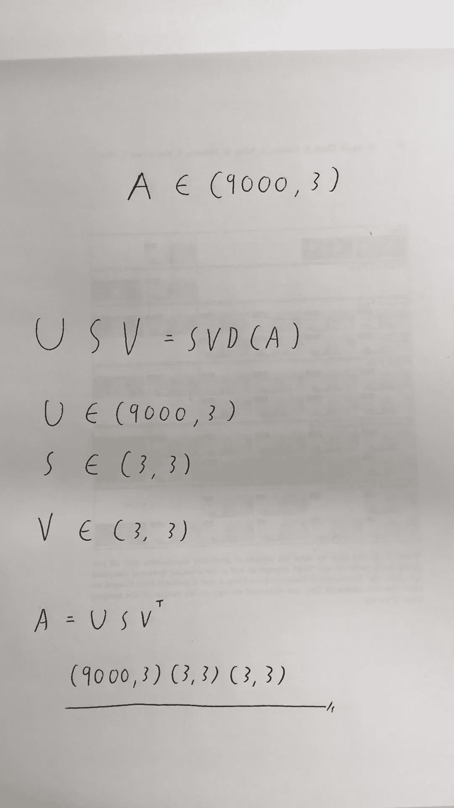

从上述示例中，我们探索了一些属性，现在我们将执行 SVD，从原始数据(A)中，我们将获得 U、S 和 V，为了重建原始数据，我们可以简单地执行 U、S 和 V 转置之间的点积。

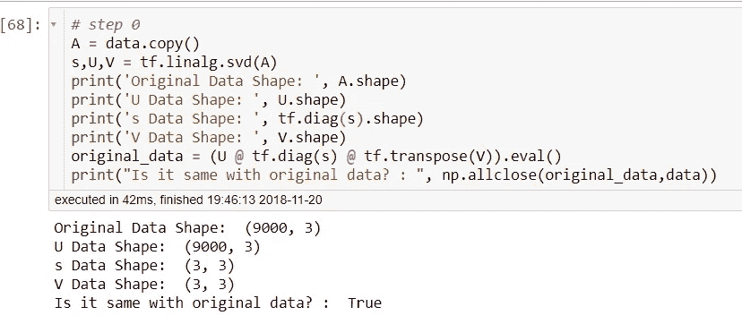

**步骤 1 确定一些属性**

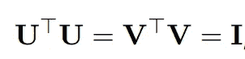

从奇异值分解的定义中，我们注意到 U 和 V 都是正交矩阵，因此与自身的点积会产生一个单位矩阵。现在让我们只关注右边的部分，也就是转置(U) @ U。

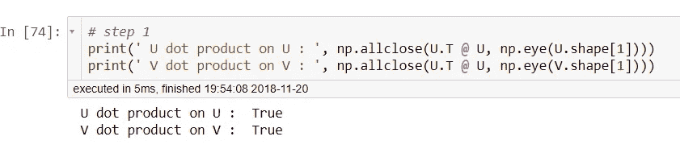

上面的代码显示了 identity 属性。

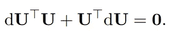

当我们对上面的方程求导，我们得到上面的公式，从那里我们注意到一些东西。

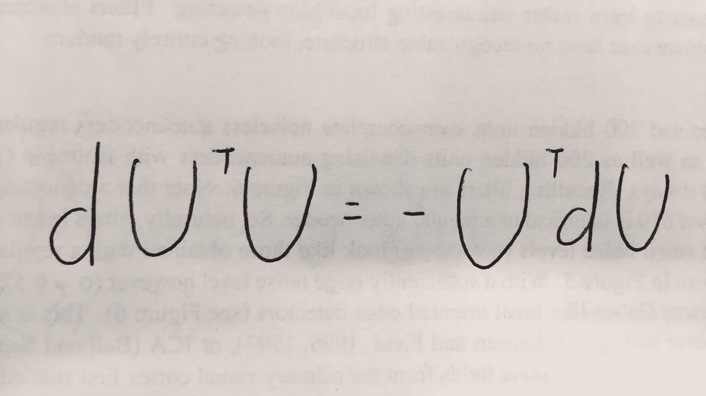

当我们将等式的右边移到左边时，符号发生了变化，然后我们注意到 dU^T U 是一个斜矩阵。(类似的论点适用于右奇异向量 V)

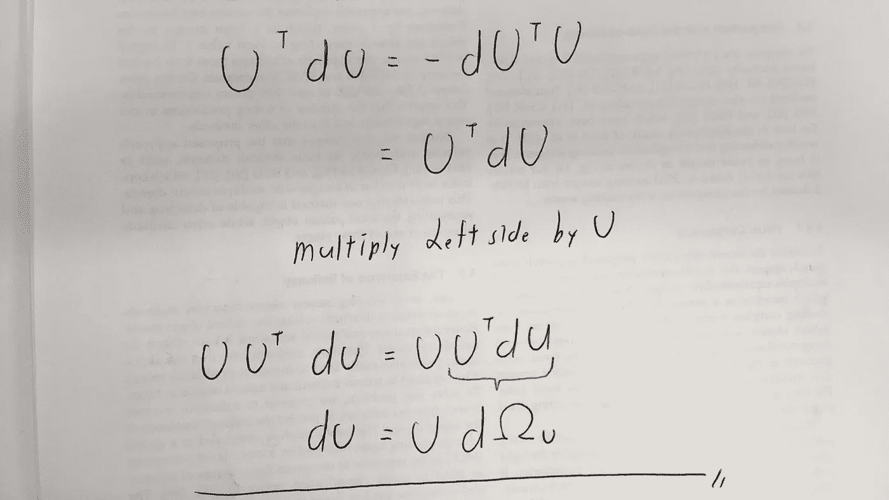

最后，利用斜矩阵的性质，我们将 dU 定义如下。(请注意，类似的论点也适用于 V。)

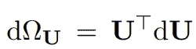

**步骤 2 使用正交补码推进属性**

我们的原始矩阵 U 的维数为(9000，3)，现在我们要创建一个形状为(9000，8997)的正交补矩阵。如果我们将两个矩阵都附加到轴 1 上，我们会得到一个形状为(9000，9000)的正交矩阵。

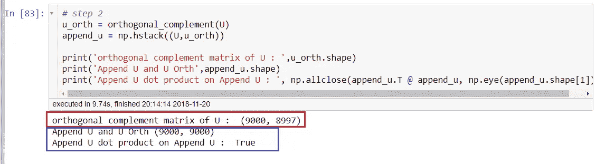

**红框**→U 的正交补矩阵的形状
**蓝框**→U 与正交补 U 之间的附加矩阵的形状，表示单位矩阵的性质。

然后导数杜灿被展开，看起来像下面这样。

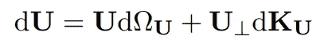

其中 dKu 是形状为(8997，3)的无约束矩阵。有关为什么会发生这种情况的详细信息，请[点击此处](http://math.mit.edu/~edelman/publications/geometry_of_algorithms.pdf)。

***目前我还不完全理解为什么上述属性成立，但是它确实有意义。在执行 SVD 时，我们没有计算完整的矩阵，但是原始矩阵 A 由奇异值为 s 的奇异向量 U 和 V 中的所有元素组成。因此，当我们通过 SVD 反向传播时，我们也需要考虑它们。之所以需要 U 的正交补矩阵，是因为全矩阵 U 是正交矩阵。*

**第三步求奇异值分解关于 A 的微分，并按摩方程**

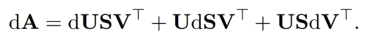

现在，如果我们对 SVD 对变量 A 求导，注意，全微分是由对 U，S 和 v 的偏导数得到的。

让我们用 transpose(U)左乘上面的函数，用 V 右乘，得到下面的函数。

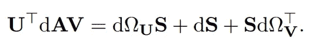

**步骤 4 利用反对称矩阵的性质**

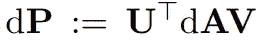

让我们首先把等式的右边改写成上面这样。接下来，我们注意到 dωU 和 dωV 都是反对称矩阵，因此它们的对角线值将为零。使得 dP 的对角线值只与 dS 项有关，这个关系可以写成如下。

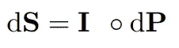

现在让我们考虑非对角的情况，首先我要声明一个与单位矩阵相反的项。 ***其中每一个对角元素都是 0，其他地方都是 1***。(我将用 I 来表示这一项，上面有一个横杠。)

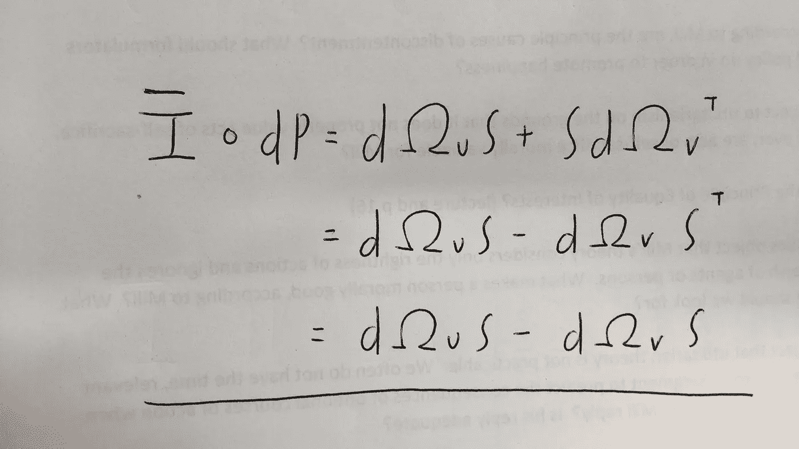

注意使用反对称矩阵和对角矩阵的性质，我们可以用公式表示上面的方程。

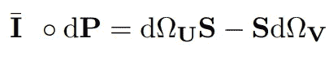

当我们转置 dP 项时，我们会得到如下结果。(dP^T)

最后，当我们将 dP 右乘 s，左乘 dP^T，并将两项相加，我们会得到如下结果。

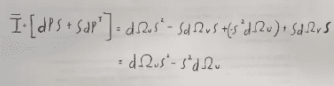

如果写得更正式一些，它看起来会像下面这样。

最后，dωU 可通过以下等式求解。

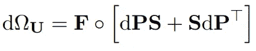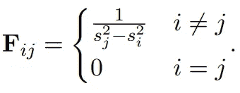

使用类似的逻辑，我们也可以求解 dωV。

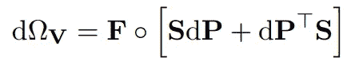

**步骤 4 求无约束矩阵 dKu**

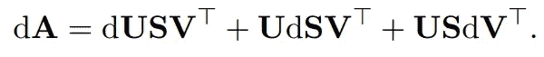

让上面的等式与 u 的正交补码的转置相乘。

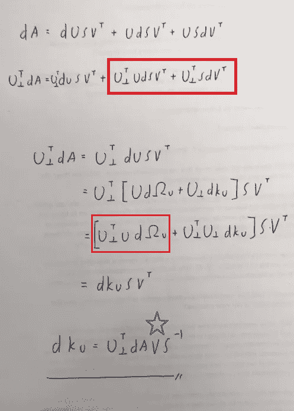

**红框** →利用 U 和 U 的正交补码之间的点积为零的事实，从而抵消

**蓝星** →利用正交矩阵的逆是它的转置这一事实。

让我们一步一步地在代码中看到上述事实。

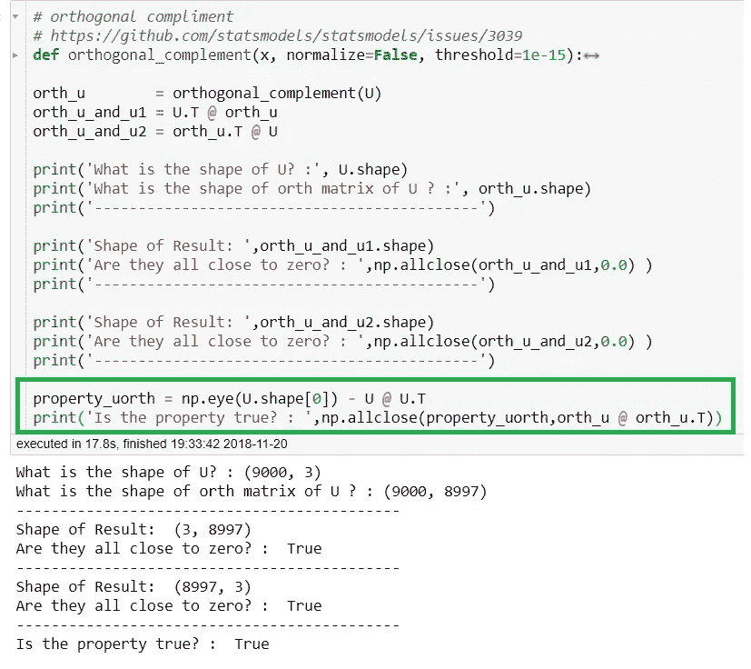

**绿框** →我们将用来消除 U 的正交补的重要性质

上面可以看到使红框为真的属性，此外，请查看绿框属性。

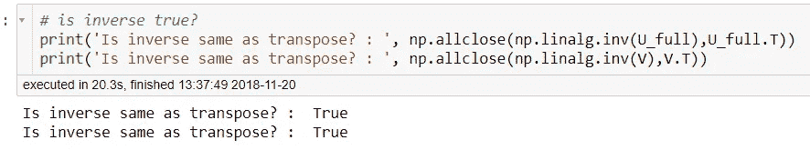

上面可以看到使蓝框为真的属性。

**第五步利用最终性质推导偏导数**

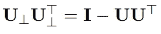

最后，利用上面看到的性质，我们将得到偏导数。让我们首先收集我们需要解决的所有术语。

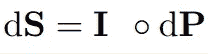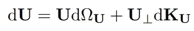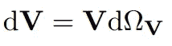

现在让我们把上面我们已经解决的所有术语收集起来。

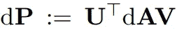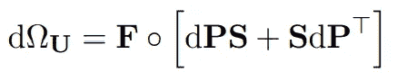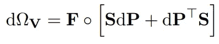

代入所有的项，我们最终得到我们的方程。

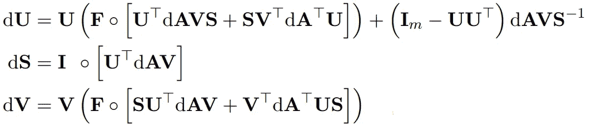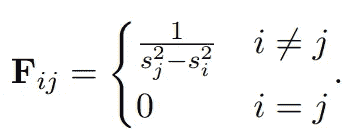

**这篇博文的代码**

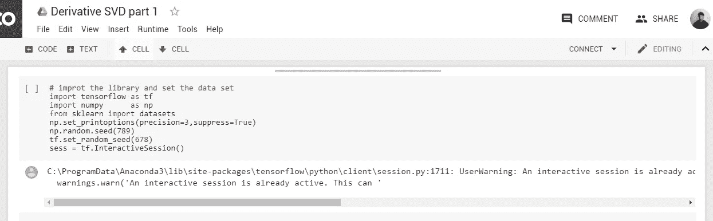

*对于谷歌实验室，你需要一个谷歌帐户来查看代码，你也不能在谷歌实验室运行只读脚本，所以在你的操场上做一个副本。最后，我永远不会请求允许访问你在 Google Drive 上的文件，仅供参考。编码快乐！*

要获取这篇博文的代码，请点击[这里](https://colab.research.google.com/drive/15yuLZ5uwBwjl8U3zUVFDh35PYnxaaNbk)。

**遗言**

最后，我想提一下我知道的另外两篇论文(一篇来自 CVPR 的文章)计算 SVD 的导数。我知道这些文件存在，但是我没有深入研究这些文件。

paper from this [website](https://arxiv.org/pdf/1509.07838.pdf)

Paper from this [website](http://people.maths.ox.ac.uk/gilesm/files/NA-08-01.pdf)

Paper from this [website](https://hal.inria.fr/inria-00072686/document)

**参考**

1.  (2018).Arxiv.org。检索于 2018 年 11 月 19 日，来自[https://arxiv.org/pdf/1509.07838.pdf](https://arxiv.org/pdf/1509.07838.pdf)
2.  (2018).j-towns . github . io . 2018 年 11 月 19 日检索，来自[https://j-towns.github.io/papers/svd-derivative.pdf](https://j-towns.github.io/papers/svd-derivative.pdf)
3.  (2018).Web.mit.edu。检索于 2018 年 11 月 19 日，来自[http://web.mit.edu/18.06/www/Essays/newpaper_ver3.pdf](http://web.mit.edu/18.06/www/Essays/newpaper_ver3.pdf)
4.  (2018).Arxiv.org。检索于 2018 年 11 月 20 日，来自[https://arxiv.org/pdf/1509.07838.pdf](https://arxiv.org/pdf/1509.07838.pdf)
5.  (2018).People.maths.ox.ac.uk 检索 2018 年 11 月 20 日，来自[http://people.maths.ox.ac.uk/gilesm/files/NA-08-01.pdf](http://people.maths.ox.ac.uk/gilesm/files/NA-08-01.pdf)
6.  (2018).Hal.inria.fr 于 2018 年 11 月 20 日检索，来自[https://hal.inria.fr/inria-00072686/document](https://hal.inria.fr/inria-00072686/document)
7.  Anon，(2018)。[在线]见:[https://www . quora . com/What-is-the-difference-between-columns-and-rows](https://www.quora.com/What-is-the-difference-between-columns-and-rows)【2018 年 11 月 20 日获取】。
8.  正交补码|交替坐标系(基)|线性代数|可汗学院。(2018).YouTube。检索于 2018 年 11 月 20 日，来自[https://www.youtube.com/watch?v=QOTjdgmNqlg](https://www.youtube.com/watch?v=QOTjdgmNqlg)
9.  正交补码。(2018).YouTube。检索于 2018 年 11 月 20 日，来自 https://www.youtube.com/watch?v=Kpc5ELrOt5E
10.  ENH: linalg 助手:matrix Issue # 3039 stats models/stats models 的正交补充。(2018).GitHub。检索于 2018 年 11 月 20 日，来自 https://github.com/statsmodels/statsmodels/issues/3039
11.  反对称矩阵。(2018).En.wikipedia.org。检索于 2018 年 11 月 21 日，来自[https://en.wikipedia.org/wiki/Skew-symmetric_matrix](https://en.wikipedia.org/wiki/Skew-symmetric_matrix)
12.  (2018).Math.mit.edu。检索于 2018 年 11 月 21 日，来自[http://math . MIT . edu/~ Edelman/publications/geometry _ of _ algorithms . pdf](http://math.mit.edu/~edelman/publications/geometry_of_algorithms.pdf)