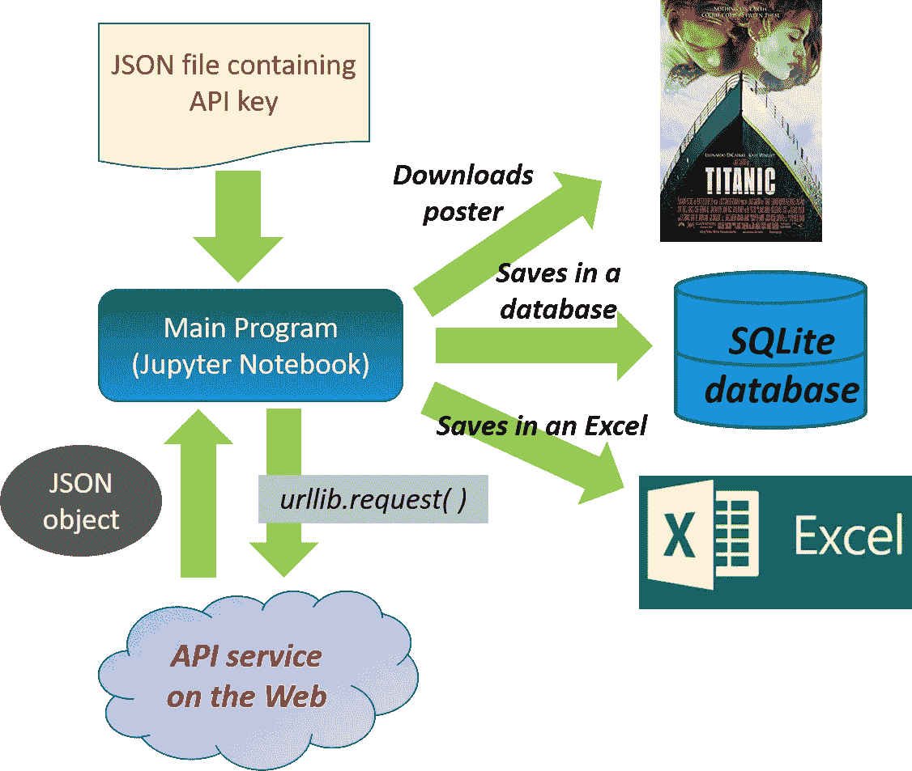
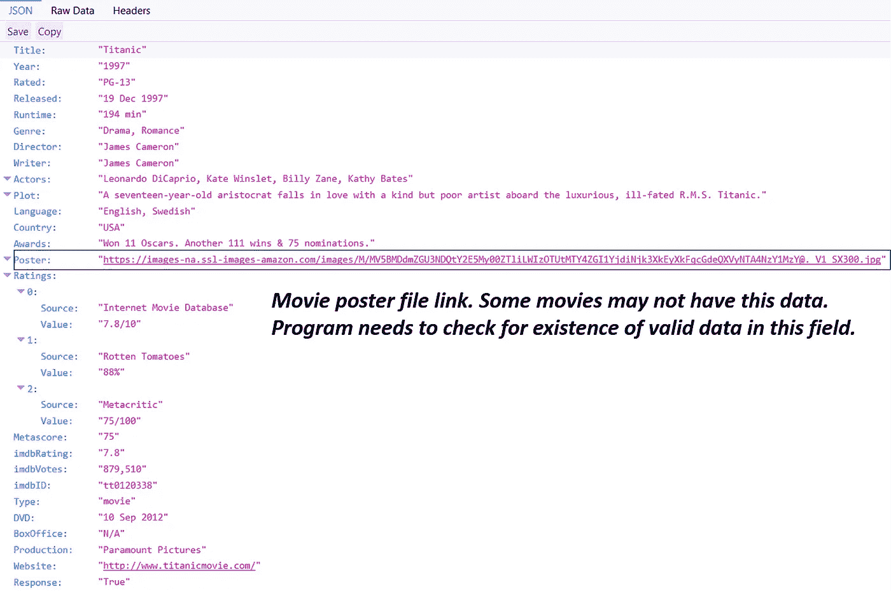

# 构建您自己的“迷你 IMDB”数据库的分步指南

> 原文：<https://towardsdatascience.com/step-by-step-guide-to-build-your-own-mini-imdb-database-fc39af27d21b?source=collection_archive---------0----------------------->

## 如何使用简单的 Python 库和内置功能从 web 中抓取电影信息，并将其存储在本地 SQLite 数据库中。


Photo by [Charles Deluvio 🇵🇭🇨🇦](https://unsplash.com/@charlesdeluvio?utm_source=medium&utm_medium=referral) on [Unsplash](https://unsplash.com?utm_source=medium&utm_medium=referral)

在学习了几门 Python 入门课程后，初学者常常想知道如何编写一个很酷的 Python 程序，展示该语言的一些高级功能，如 web 抓取或数据库操作。在本文中，我将展示如何使用简单的 Python 库和内置功能来抓取 web 上的电影信息，并将它们存储在本地 SQLite 数据库中，稍后可以使用电影信息查询该数据库进行数据分析。请将此视为构建您自己的迷你 IMDB 数据库的项目！

> **这种类型的数据工程任务——从网络上收集数据并建立数据库连接——通常是数据分析项目的第一步。**在你做任何酷的预测建模之前，你需要掌握这一步。这一步通常是杂乱无章的，也就是说，没有一步到位的公式或一站式商店为你做所有的事情。**所以，你必须从网络中提取数据，检查它的结构，并构建你的代码来完美地浏览它。**

具体来说，本演示将展示以下功能的用法:

*   Python **urllib** 库
*   **Web API 服务(带密钥)**用于检索数据
*   Python **json** 库
*   Python **OS** 模块
*   Python **SQLite** 库

下面给出了这些的简要描述，

## Python *urllib* 模块

Python 到 web 的网关是通过 [urllib 模块](https://docs.python.org/3/howto/urllib2.html)完成的。它是一个用于获取 URL(统一资源定位器)的 Python 模块。它以 urlopen 函数的形式提供了一个非常简单的接口。这能够使用各种不同的协议获取 URL。它还提供了一个稍微复杂一点的接口来处理常见情况——比如基本身份验证、cookies、代理等等。这些是由称为处理程序和打开程序的对象提供的。

## **Web API 服务(带密钥)**用于检索数据

Web 抓取通常由外部网站托管的 API 服务来完成。可以把它们想象成存储库或远程数据库，您可以通过自己的小程序发送搜索字符串来查询它们。在这个特定的例子中，我们将从[开放电影数据库(OMDB)网站](http://www.omdbapi.com/)获得帮助，该网站向注册用户提供 API 密钥，用于下载电影信息。因为这是一项免费服务，他们每天有 1000 个请求的限制。请注意，您必须在他们的网站上注册，并获得自己的 API 密钥，以便从您的 Python 程序发出请求。

从这个 API 服务获得的数据以 JSON 文件的形式返回。因此，我们需要将 JSON 文件解析/转换成一个 Python 对象，这样我们就可以轻松地工作了。


## Python *json* 模块

JSON 是一种轻量级的数据交换格式。对人类来说，读和写很容易。机器很容易解析生成。它基于 [JavaScript 编程语言](http://javascript.crockford.com/)，[标准 ECMA-262 第三版——1999 年 12 月](http://www.ecma-international.org/publications/files/ecma-st/ECMA-262.pdf)。JSON 是一种完全独立于语言的文本格式，但是它使用了 C 语言系列的程序员所熟悉的约定，包括 C、C++、C#、Java、JavaScript、Perl、Python 和许多其他语言。这些特性使 JSON 成为理想的数据交换语言。

[json 库](http://docs.python-guide.org/en/latest/scenarios/json/)可以从字符串或文件中解析 JSON 页面。该库将 JSON 解析成 Python 字典或列表。它还可以将 Python 字典或列表转换成 JSON 字符串。这是一个非常有用的模块，学习起来非常简单。这个模块很可能在任何基于 Python 的 web 数据分析程序中使用，因为现在大多数网页在返回数据时使用 JSON 作为主要对象类型。

## Python 操作系统模块

该模块提供了一种使用操作系统相关功能的可移植方式。如果你只是想读或写一个文件，参见`[open()](https://docs.python.org/3/library/functions.html#open)`，如果你想操作路径，参见`[os.path](https://docs.python.org/3/library/os.path.html#module-os.path)`模块，如果你想在命令行上读取所有文件中的所有行，参见`[fileinput](https://docs.python.org/3/library/fileinput.html#module-fileinput)`模块。创建临时文件和目录见`[tempfile](https://docs.python.org/3/library/tempfile.html#module-tempfile)`模块，高级文件和目录处理见`[shutil](https://docs.python.org/3/library/shutil.html#module-shutil)`模块。在这个演示中，我们将使用操作系统模块方法来检查现有的目录，并操作文件来保存一些数据。

## SQLite 和 Python SQLite3

SQLite 是一个 C 库，它提供了一个轻量级的基于磁盘的数据库，不需要单独的服务器进程，并允许使用 SQL 查询语言的非标准变体来访问数据库。一些应用程序可以使用 SQLite 进行内部数据存储。还可以使用 SQLite 构建应用程序原型，然后将代码移植到更大的数据库，如 PostgreSQL 或 Oracle。Python 的 [sqlite3 模块](https://www.pythoncentral.io/introduction-to-sqlite-in-python/)提供了符合 DB-API 2.0 规范的 SQL 接口。

## 程序的主要流程

程序的流程如下所示。**请注意** [**锅炉板块代码在我的**](https://github.com/tirthajyoti/Web-Database-Analytics-Python/blob/master/Movie_Database_Build.ipynb) [**Github 资源库**](https://github.com/tirthajyoti) 中有 **。喜欢的请下载/叉/星。**



Fig: Main flow of the program

基本思想是向外部 API 发送带有用户输入的电影标题的请求。然后，该程序试图下载数据，如果成功，打印出来。

```
def search_movie(title):
    if len(title) < 1 or title==’quit’: 
    print(“Goodbye now…”)
    return Nonetry:
    url = serviceurl + urllib.parse.urlencode({‘t’: title})+apikey
    print(f’Retrieving the data of “{title}” now… ‘)
    uh = urllib.request.urlopen(url)
    data = uh.read()
    json_data=json.loads(data)

 if json_data[‘Response’]==’True’:
     print_json(json_data)except urllib.error.URLError as e:
    print(f"ERROR: {e.reason}")
```

例如，JSON 文件如下所示:



Fig: An example JSON file retrieved from the API.

如果程序找到了电影海报的图像文件的链接，它会询问用户是否想下载它。如果用户同意，它会将图像文件下载到本地目录，并以电影标题作为文件名。

```
# Asks user whether to download the poster of the movie
if json_data['Poster']!='N/A':
    poster_yes_no=input ('Poster of this movie can be downloaded. Enter "yes" or "no": ').lower()
    if poster_yes_no=='yes':
        save_poster(json_data)
```

接下来，它询问用户是否想在本地数据库中保存一些关于电影的基本信息。如果用户点头，它将创建或插入一个 SQLite 数据库中下载电影信息的子集。

```
#Asks user whether to save the movie information in a local databasesave_database_yes_no=input ('Save the movie info in a local database? Enter "yes" or "no": ').lower()if save_database_yes_no=='yes':
    save_in_database(json_data)
```

下面是要保存在数据库中的函数定义。

笔记本还包含将现有数据库中的信息保存为 Excel 文件的功能。

## 关于秘密 API 密匙的一句话

您会注意到程序使用一个秘密的 API 密钥来访问数据。该密钥可以通过访问 OMDB 网站免费获得，每天最多可使用 1000 次。使用秘密(特定于用户的)密钥进行 web 抓取是一种非常常见的做法。我保护个人 API 密匙完整性的方法是在 Jupyter 笔记本的同一个目录下创建一个小 JSON 文件，名为 **APIkeys.json** 。该文件的内容对将看到我的代码的外部用户是隐藏的。我的 Jupyter 笔记本将这个 JSON 文件作为字典读取，复制对应于电影网站的密钥，并将其附加到由`urllib.request`方法发送的编码 URL 请求字符串。

```
with open(‘APIkeys.json’) as f:
    keys = json.load(f)
    omdbapi = keys[‘OMDBapi’]serviceurl = '[http://www.omdbapi.com/?'](http://www.omdbapi.com/?')
apikey = '&apikey='+omdbapi
```

## 摘要

本文通过一个演示 Python 笔记本来说明如何使用免费的 API 服务检索关于电影的基本信息，并将电影海报和下载的信息保存在一个轻量级 SQLite 数据库中。

> 最重要的是，它演示了 Python 库的简单使用，如 **urllib、json 和 sqlite3** ，这些库对于数据分析/ web 数据挖掘任务来说是非常有用(和强大)的工具。

我希望读者可以从提供的笔记本文件中受益，并根据自己的要求和想象来构建它。更多网络数据分析笔记本， [**请看我的知识库。**](https://github.com/tirthajyoti/Web-Database-Analytics-Python)

如果您有任何问题或想法要分享，请联系作者在[**tirthajyoti【AT】Gmail . com**](mailto:tirthajyoti@gmail.com)。你也可以查看作者的 [**GitHub 资源库**](https://github.com/tirthajyoti?tab=repositories) 中其他有趣的 Python、R 或 MATLAB 代码片段和机器学习资源。如果你像我一样对机器学习/数据科学充满热情，请随时[在 LinkedIn 上添加我](https://www.linkedin.com/in/tirthajyoti-sarkar-2127aa7/)或[在 Twitter 上关注我。](https://twitter.com/tirthajyotiS)