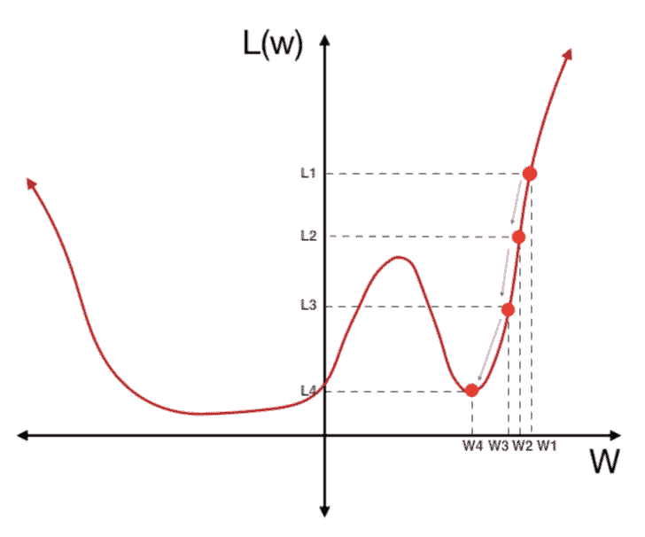
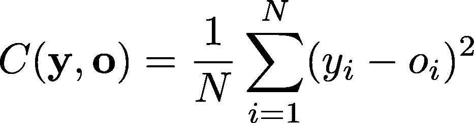
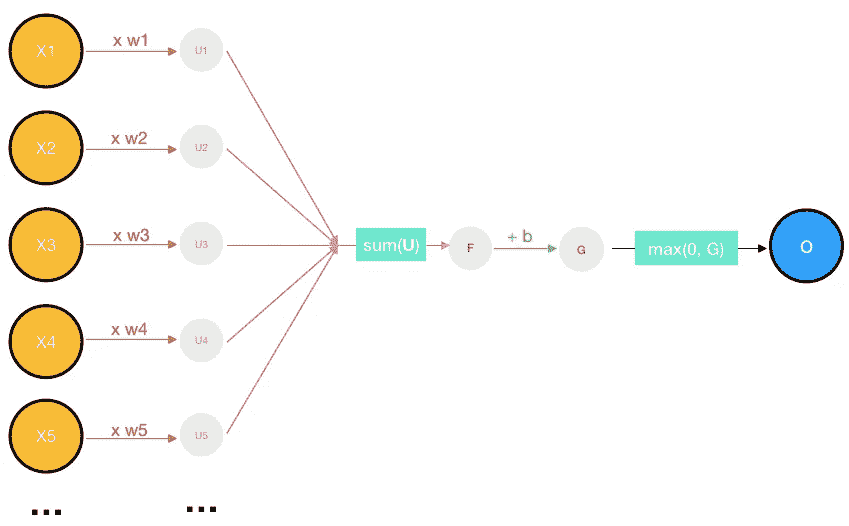
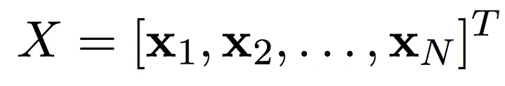
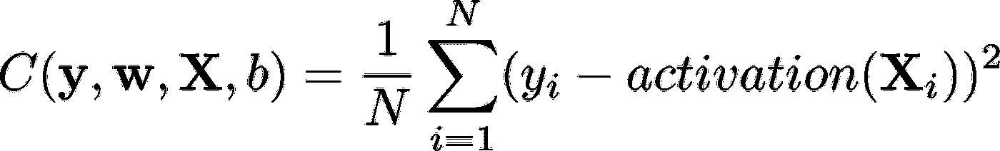
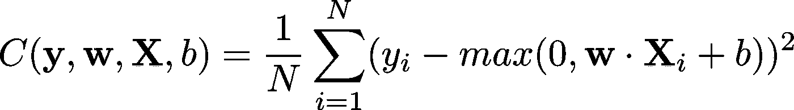

# 寻找神经网络的成本函数

> 原文：<https://towardsdatascience.com/step-by-step-the-math-behind-neural-networks-490dc1f3cfd9?source=collection_archive---------2----------------------->

## 一步一步:神经网络背后的数学

Title image: [Source](https://pixabay.com/en/math-symbols-blackboard-classroom-1500720/)

特伦斯·帕尔和杰瑞米·霍华德的论文， [*深度学习所需的矩阵演算*](https://arxiv.org/abs/1802.01528) *，*提供了很多关于深度学习库(如 Tensorflow 或 PyTorch)如何真正工作的见解。如果不理解深度学习背后的数学，我们所做的只是编写几行抽象代码——建立模型，编译它，训练它，评估它——而没有真正学会欣赏支持所有这些功能的所有复杂的错综复杂之处。

这篇(以及接下来的几篇)文章将是我从 Terence 和 Jeremy 的论文中学到的思考。本文将介绍这个问题，我们将在接下来的文章中解决它。我将解释大部分的数学知识，并加入一些我的见解，但要了解更多信息，请查看原始论文。

这些文章(和论文)都假设了高中水平的微积分基础知识(即导数规则和如何应用它们)。如果你想重温的话，可以看看可汗学院的视频。

这就是我们的问题。我们有一个只有一层(为了简单起见)和一个损失函数的神经网络。这一层是一个简单的全连接层，只有一个神经元，许多权重 *w₁，w₂，w₃* …，一个偏置 *b* ，以及一个 ReLU 激活。我们的损失函数是常用的均方误差(MSE)。知道了我们的网络和损失函数，我们如何调整权重和偏差来最小化损失？

为了减少损失，我们使用梯度下降的概念。正如这里的[所解释的](/the-beginners-guide-to-gradient-descent-c23534f808fd)(如果你不熟悉梯度下降的工作原理，请阅读此处)，梯度下降计算损失函数的斜率，然后根据该斜率将权重和偏差转移到更低的损失。

Image 1: Shifting the weights and biases of to minimize loss

我们需要找到损失函数的斜率。然而，在此之前，让我们定义一下损失函数。MSE 简单地平方每个网络输出和真实标签之间的差，并取平均值。下面是 MSE 方程，其中 *C* 是我们的损失函数(也称为*代价函数*)， *N* 是训练图像的数量， **y** 是真实标签的向量(**y**=【*目标(* **x** ₁ *)，目标(***x**₂*)…目标(*【t28)(如果你还没有注意到，粗体字**中的变量是向量。)**

Image 2: Loss function

我们可以进一步扩展这个等式。网络输出是什么？我们将一个向量输入——姑且称之为**x**——给我们的全连接层。该层的激活是我们的网络输出。我们的全连接层的激活是什么？向量输入中的每一项都乘以一定的权重。然后，将所有这些产品加在一起，并在此基础上添加一个偏差。最后，该值通过 ReLu 传递，形成全连接层中一个神经元的激活。

Image 3: Fully-connected layer, expanded. The orange circles are the input values, the blue circle is the output value (the prediction, since our network only has 1 layer), and the gray circles are just intermediate values used in the calculation. Each red line represents multiplication by a certain weight, the pink lines represent summing up all the values, and the green line represents addition with a certain bias.

对每个输入值和每个权重的乘积求和，本质上是输入 **x** 和一个权重向量(姑且称之为 **w** )之间的向量点积。ReLU 只是一个将任何负值转换为 0 的函数。让我们将其重命名为 *max(0，z)* 函数，如果 z 为正，则返回 z，如果 z 为负，则返回 0。

综上所述，我们得到了神经元激活的方程式:

*激活(****x****)= max(*0，**w**∙**x**+*b)*

现在让我们把它代入损失函数。因为我们使用多个输入进行训练，所以让我们将 **X** 定义为所有输入的集合:

Image 4: X // [Source](https://arxiv.org/pdf/1802.01528.pdf)

由于我们只有一层(有一个神经元)，这个神经元的激活就是我们模型的预测。因此，我们可以用我们的激活 in 代替损失函数中的 *o* :

Image 5: Loss function with activation substituted in

然后替换激活函数:

Image 6: Loss function

这是我们要求斜率的损失函数。

为了找到斜率，我们必须找到损失函数的导数。然而，不是任何导数，它必须是相对于权重和偏差的偏导数(因为这些是我们正在调整的值)。

查看[第 2 部分](https://medium.com/@reina.wang/step-by-step-the-math-behind-neural-networks-ac15e178bbd)了解如何计算偏导数！

跳到其他文章:

*   [第二部分:偏导数](/step-by-step-the-math-behind-neural-networks-ac15e178bbd)
*   [第三部分:向量微积分](/step-by-step-the-math-behind-neural-networks-d002440227fb)
*   [第 4 部分:把所有的东西放在一起](/calculating-gradient-descent-manually-6d9bee09aa0b)

这里下载原论文[。](https://arxiv.org/abs/1802.01528)

如果你喜欢这篇文章，别忘了留下一些掌声！如果您有任何问题或建议，请在下面留下您的评论:)