# 如何求函数的偏导数？

> 原文：<https://towardsdatascience.com/step-by-step-the-math-behind-neural-networks-ac15e178bbd?source=collection_archive---------4----------------------->

## 一步一步:神经网络背后的数学

Title image: [Source](https://pixabay.com/en/geometry-mathematics-volume-surface-1044090/)

在[第一部分](/step-by-step-the-math-behind-neural-networks-490dc1f3cfd9)中，我们被给了一个问题:计算这个损失函数的梯度:

Image 1: Loss function

求梯度本质上就是求函数的导数。然而，在我们的例子中，因为有许多我们可以调整的独立变量(所有的权重和偏差)，我们必须找到每个变量的导数。这就是所谓的偏导数，符号是∂.

# 偏导数:

计算简单函数的偏导数很容易:只需将方程中的其他变量视为常数，然后找到通常的标量导数。以下是一些标量导数规则作为提醒:

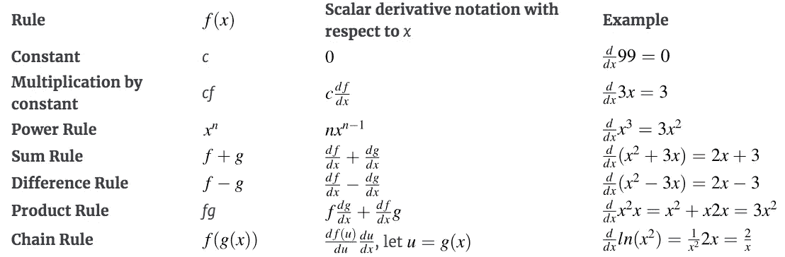

Image 2: Scalar derivative rules // [Source](http://explained.ai/matrix-calculus/index.html)

考虑函数 *f(x，y) = 3x y* 中关于 *x* 的偏导数(即 *y* 如何随着 *x* 的变化而变化)。将 *y* 视为常数，我们可以求出 x 的偏导数:

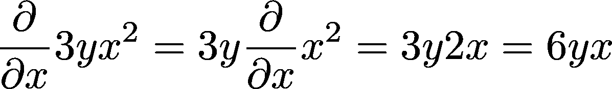

Image 3: Partial with respect to x

同样，我们可以找到 y 的偏导数:

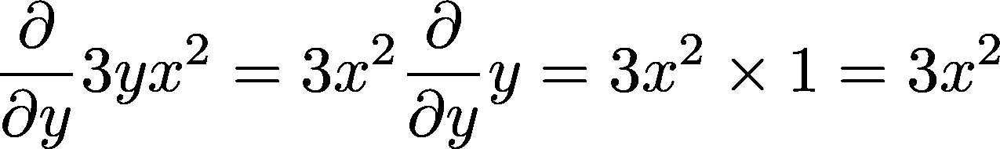

Image 4: Partial with respect to y

函数 *f(x，y) = 3x y* 的梯度是一个水平向量，由两个分向量组成:

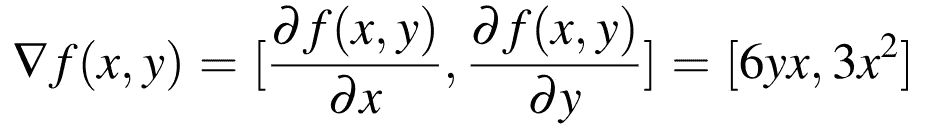

Image 5: Gradient of *f(x,y) //* [*Source*](http://explained.ai/matrix-calculus/index.html)

这应该很清楚:因为相对于 *x* 的偏导数是函数在 x 方向上的梯度，相对于 *y* 的偏导数是函数在 y 方向上的梯度，所以总梯度是由两个偏导数组成的向量。这个可汗学院的视频提供了一个非常简洁的偏导数的图形解释，如果你想形象化我们正在做的事情。

# 链规则:

对于像 *f(x，y) = 3x y* 这样的简单函数，我们只需要知道这些。然而，如果我们想要计算更复杂函数的偏导数——例如那些具有嵌套表达式的函数，如 *max(0，****w****∙****X****+b)*——我们需要能够利用多元链规则，在本文中称为*单变量全导数链规则*。

## 单变量链规则

我们先来回顾一下单变量链规则。考虑函数 *y=f(g(x))=sin(x)。为了得到这个表达式的导数，我们将外部表达式的导数与内部表达式的导数相乘，或者“将各个部分连接在一起”。换句话说:*

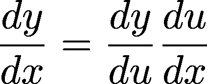

Image 6: Single-variable chain rule where u is the intermediate variable for nested subexpressions

对于我们的例子， *u=x* 和 *y=sin(u)* 。因此:

Image 7: Derivatives // [Source](http://explained.ai/matrix-calculus/index.html)

和

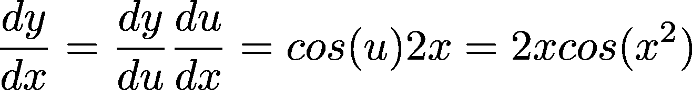

Image 8: Derivative of the whole expression // [Source](http://explained.ai/matrix-calculus/index.html)

把单变量链规则想象成 *x* 经过的操作图是很好的，就像这样:

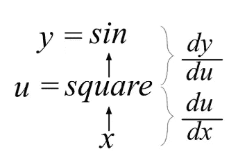

Image 9: Diagram of chain of operations for y=sin(x*²)*

当处理多变量链式法则时，将方程可视化为图表的概念将会非常方便。此外，如果您使用 Tensorflow(或 Keras)和 TensorBoard，在您构建模型和编写训练代码时，您可以看到与此类似的操作图。

## 多变量链式法则

多变量链规则，也称为*单变量全导数链规则*，如文中所称，是标量链规则的变体。与它的名字所暗示的不同，它可以应用于只有一个变量的表达式。但是，表达式应该有多个中间变量。

为了说明这一点，让我们考虑等式 *y=f(x)=x+x* 。使用标量附加导数规则，我们可以立即计算导数:

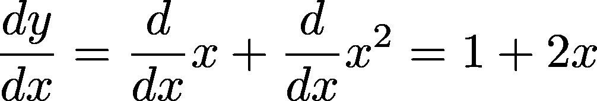

Image 10: Derivative of x+x*²*

让我们试着用链式法则来做。首先，我们引入中间变量: *u₁(x) = x* 和 *u₂(x，u₁) = x + u₁.*如果我们应用单变量链规则，我们得到:

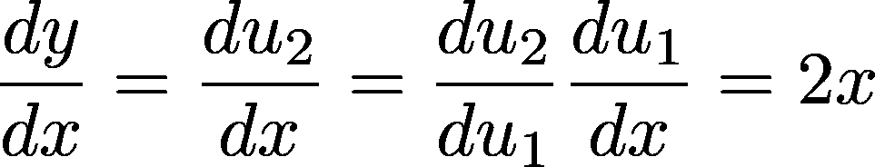

Image 11: Using the single-variable chain rule

很明显，2x≠1+2x，所以这里有问题。让我们画出方程式的图表:

Image 12: Diagram of chain of operations for y = x+x*² //* // [Source](http://explained.ai/matrix-calculus/index.html)

图 12 中的图不再是线性的，所以我们必须考虑图中所有导致最终结果的路径。由于 *u₂* 有两个参数，偏导数开始起作用。为了计算这个函数的导数，我们必须计算关于 u₁). u₂(x*的 *x* 的偏导数*这里， *x* 的变化以两种方式反映在 *u₂* 中:作为加法的操作数和作为平方运算符的操作数。在符号中，*ŷ=(x+δx)+(x+δx)*和*δy = ŷ-y*，其中 *ŷ* 是调整后的 *x.* 处的 y 值

因此，为了计算 *u₂(x，u₁)* 的偏差值，我们需要合计从 *x* 的变化到 *y* 的变化的所有可能的贡献。 *u₂(x，u₁)* 的总导数由下式给出:

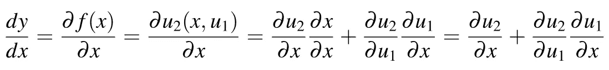

Image 13: Derivative of y = x+x*²* // [Source](http://explained.ai/matrix-calculus/index.html)

更简单地说，你**把 x 的变化直接对 u₂的影响和 x 的变化通过 u₁对 u₂.的影响加起来**我发现通过图表更容易形象化:

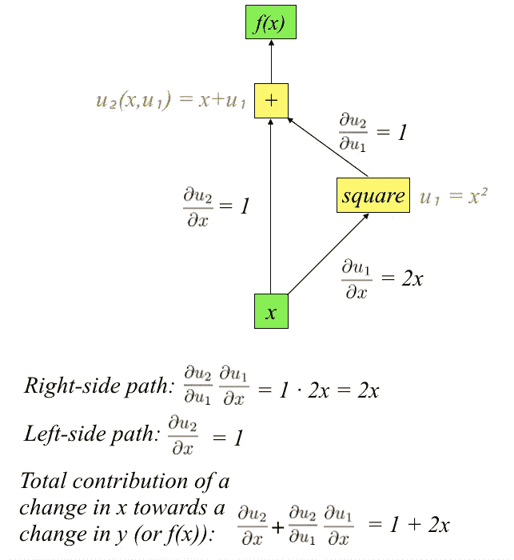

Image 14: Graph of y = x+x*², with partials included*

就是这样！我们得到了正确答案:1+2x。我们现在可以用一个规则来概括这个过程，即多变量链式规则(或单变量全导数链式规则):

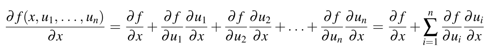

Image 15: Multivariable chain rule // [Source](http://explained.ai/matrix-calculus/index.html)

如果我们为 x 引入一个别名，如 x=u(n+1)，那么我们可以将公式改写成最终形式，这样看起来更简洁:

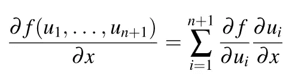

Image 16: Multivariable chain rule // [Source](http://explained.ai/matrix-calculus/index.html)

仅此而已！复习一下，我们再做一个例子: *f(x)=sin(x+x )* 。我们的 3 个中间变量是: *u₁(x) = x，u₂(x，u₁)=x+u₁，*和 *u₃(u₂) = sin(u₂)* 。我们可以再次绘制图表:

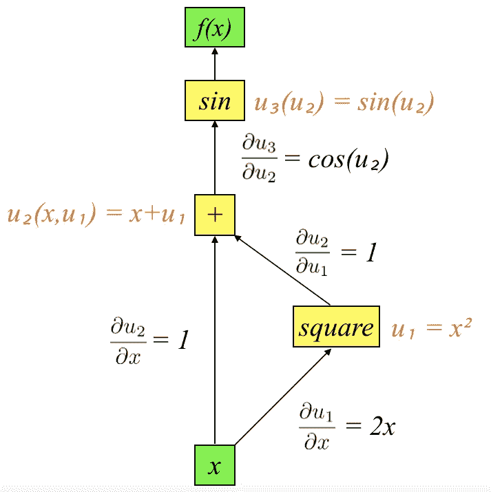

Image 17: Graph of y = sin(x+x*²), with partials included*

计算我们的偏角:

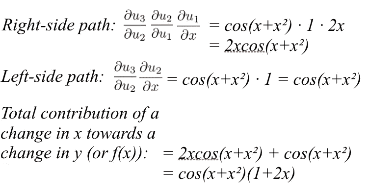

Image 18: Partials for the function y = sin(x+x*²)*

因此 *f(x)=sin(x+x )* 的导数为 *cos(x+x )(1+2x)* 。

这和我们的问题有什么关系？记住，我们需要找到损失函数相对于 **w** (我们所有权重的向量)和 *b* (偏差)的偏导数。然而，我们的损失函数并不那么简单——有多个嵌套的子表达式(即多个中间变量)需要我们使用链规则。

Image 19: Loss function

还有一个问题。如你所见，我们的损失函数不仅仅接受标量作为输入，它也接受向量。如何计算向量方程的偏导数，向量链规则是什么样的？

看看[第三部](/step-by-step-the-math-behind-neural-networks-d002440227fb)就知道了！

如果你还没有，点击[这里](/step-by-step-the-math-behind-neural-networks-490dc1f3cfd9)阅读第 1 部分！

跳到其他文章:

*   [第三部分:向量微积分](/step-by-step-the-math-behind-neural-networks-d002440227fb)
*   [第 4 部分:将所有内容整合在一起](/calculating-gradient-descent-manually-6d9bee09aa0b)

此处下载原文[。](https://arxiv.org/abs/1802.01528)

如果你喜欢这篇文章，别忘了留下一些掌声！如果您有任何问题或建议，请在下面留下您的评论:)