# 求向量函数的梯度

> 原文：<https://towardsdatascience.com/step-by-step-the-math-behind-neural-networks-d002440227fb?source=collection_archive---------2----------------------->

## 一步一步:神经网络背后的数学

Title image: [Source](https://pixabay.com/en/matrix-communication-software-pc-2953869/)

在[第一部分](/step-by-step-the-math-behind-neural-networks-490dc1f3cfd9)中，我们被给了一个问题:计算这个损失函数的梯度:

Image 1: Loss function

为了求梯度，我们必须求函数的导数。在[第二部分](https://medium.com/@reina.wang/step-by-step-the-math-behind-neural-networks-ac15e178bbd)中，我们学习了如何计算函数对每个变量的偏导数。然而，这个损失函数中的大部分变量都是向量。当神经网络处理大量数据时，能够找到向量变量的偏导数尤其重要。向量和矩阵运算是一种简单的方法来表示有这么多数据的运算。确切地说，你怎样才能找到一个向量函数的梯度呢？

## 标量函数的梯度

假设我们有一个函数， *f(x，y) = 3x y* 。我们的偏导数是:

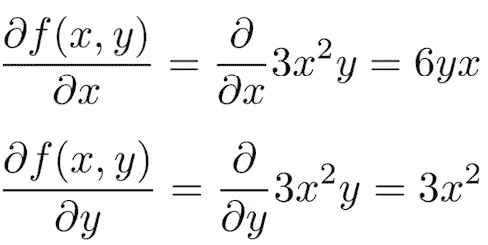

Image 2: Partial derivatives

如果我们把这些分音组织成一个水平向量，我们得到 *f(x，y)* 的**梯度**，或者 *∇ f(x，y)* :

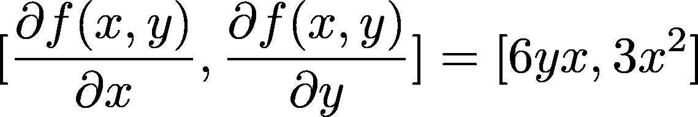

Image 3: Gradient of f(x,y)

*6yx* 是 *f(x，y)* 相对于 *x* 的变化，而 *3x* 是 *f(x，y)* 相对于 *y* 的变化。

当我们有两个函数时会发生什么？让我们添加另一个函数， *g(x，y) = 2x+y⁸* 。偏导数是:

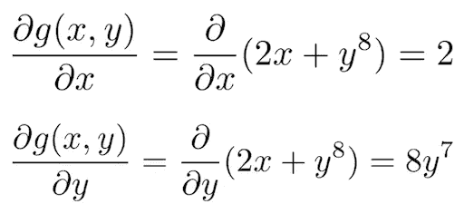

Image 4: Partials for g(x,y)

所以 g(x，y)的梯度是:

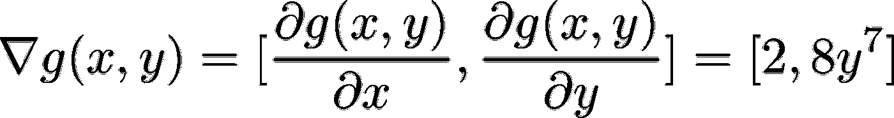

Image 5: Gradient of g(x,y)

## 表示函数

当我们有一个带有多个参数的函数时，用一种更简单的方式来表示它们通常是有用的。我们可以将函数的多个参数组合成一个向量自变量， **x** ，如下所示:

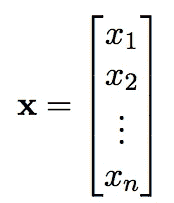

Image 6: Vector **x**

因此， *f(x，y，z)* 会变成 *f(x₁,x₂,x₃)* 从而变成 *f(* **x** *)。*

我们也可以将多个函数组合成一个向量，就像这样:

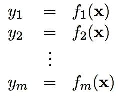

Image 7: Vector **y**

现在， **y=f(x)** 其中 **f(x)** 是【f₁( **x** 、f₂( **x** 、f₃( **x** )…fn( **x** )】的向量

对于我们前面的两个函数的例子， *f(x，y)f(***x***)*和 *g(x，y)g(***x***)。*此处，向量**x**=【x₁，x₂】，其中 *x₁=x* ，以及 *x₂=y* 。为了进一步简化，我们可以将我们的函数组合起来:[f( **x** )、g( **x** )] = [f₁( **x** )、f₂(**x**)]=**f(x)= y .**

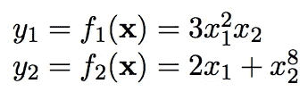

Image 8: Equations within vector function **y**

通常，函数的数量和变量的数量是相同的，因此每个变量都有一个解。

## 向量函数的梯度

现在有了两个函数，怎么求两个函数的梯度呢？如果我们把它们的梯度组织成一个单一的矩阵，我们就从向量演算进入了矩阵演算。这个矩阵以及具有多个变量的多个函数的梯度的组织被称为**雅可比矩阵**。

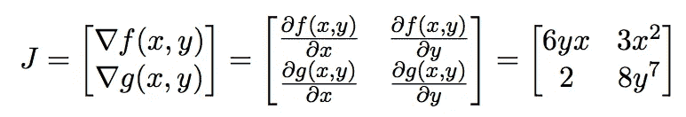

Image 9: The Jacobian

有多种方法来表示雅可比矩阵。这种布局，我们垂直堆叠渐变，被称为**分子布局**，但其他论文将使用**分母布局**，它只是对角翻转:

Image 10: Denominator layout of the Jacobian

## 恒等函数的梯度

我们取恒等式函数， **y = f(x) = x** ，其中*fi(***x***)= Xi*，求其梯度:

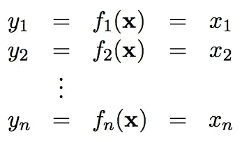

Image 11: Identity function

正如我们创建之前的雅可比矩阵一样，我们可以找到每个标量函数的梯度，并将它们垂直堆叠起来，以创建恒等函数的雅可比矩阵:

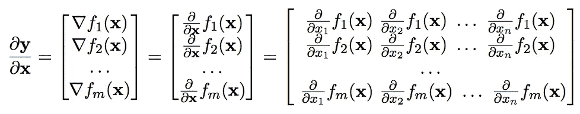

Image 12: Jacobian of the identity function

既然是恒等函数，f₁( **x** ) = x₁，f₂( **x** ) = x₂，以此类推。因此，

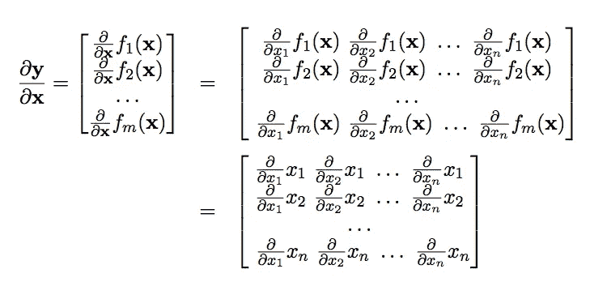

Image 13: Jacobian of the identity function

函数对不在函数中的变量的偏导数为零。比如 2x 对 y 的偏导数是 0。换句话说，

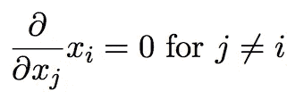

Image 14: The partial derivative of a function with respect to a variable that’s not in the function is zero

因此，不在雅可比对角线上的一切都变为零。同时，任何变量对自身的偏导数都是 1。例如， *x* 相对于 *x* 的偏导数为 1。因此，雅可比就变成了:

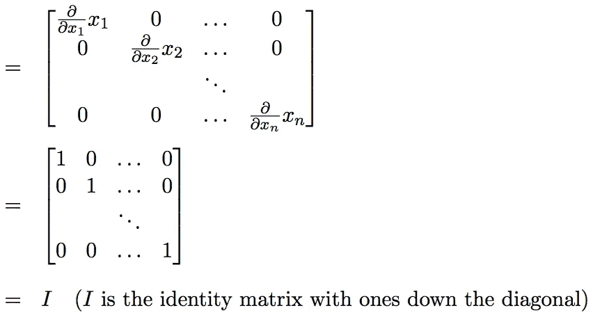

Image 15: Jacobian of the identity function

## 元素式向量函数组合的梯度

**基于元素的二元运算符**是连续应用运算符的运算(如加法 **w** + **x** 或 **w** > **x** ，从两个向量的第一项开始获得第一项输出，然后从两个向量的第二项获得第二项输出……依此类推。

本文用以下符号表示元素式二元运算:

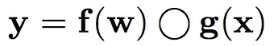

Image 16: Element-wise binary operation with f(x) and g(x)

这里，◯指的是任何元素操作符(比如+)，而不是函数的组合。

那么如何找到两个向量的元素运算的梯度呢？

由于我们有两组函数，我们需要两个雅可比矩阵，一个表示相对于 **x** 的梯度，一个表示相对于 **w** 的梯度:

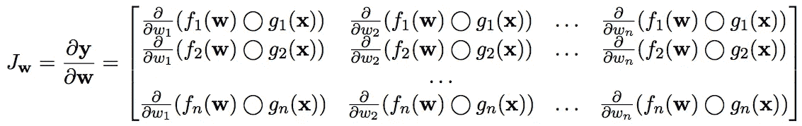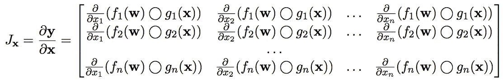

Image 17: Jacobian with respect to **w** and **x**

我们需要的大多数算术运算都很简单，所以 **f(w)** 通常就是向量 **w** 。换句话说， *fi(wi) = wi* 。例如，操作 **w+x** 符合这一类别，因为它可以表示为 **f(w)+g(x)** ，其中 *fi(wi) + gi(xi) = wi +xi。*

在这种情况下，两个雅可比矩阵中的每个元素都简化为:

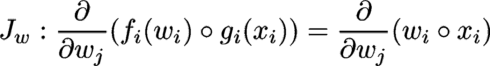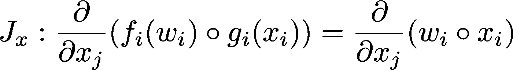

Image 18: Elements in the Jacobian

在对角线上，i=j，所以偏导数存在一个值。然而，离开对角线，i≠j，所以偏导数变为零:

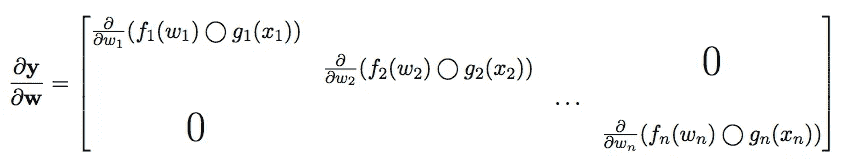

Image 19: Diagonal jacobian

我们可以更简洁地表示为:

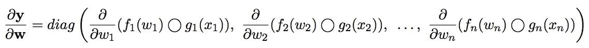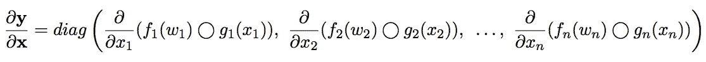

Image 20: The Jacobian with respect to **w** and **x**

我们试着求函数 **w+x** 的梯度。我们知道对角线以外的一切都是 0。对角线上相对于 **w** 和 **x** 的分数值为:

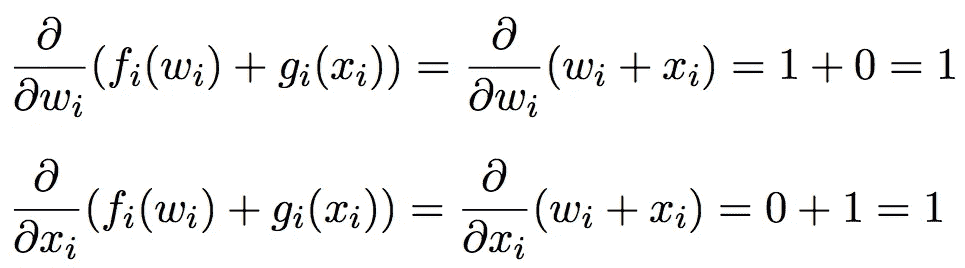

Image 21: Partials with respect to **w** and **x**

所以两个雅可比行列式的对角线都是 1。这看起来很熟悉…这是单位矩阵！

我们用乘法来试试: **w*x** 。对角线上相对于 **w** 和 **x** 的分数值为:

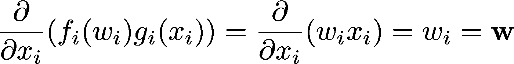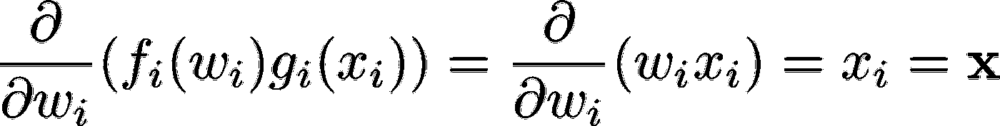

Image 22: Partials with respect to **w** and **x**

因此， **w*x** 相对于 **w** 的梯度为*diag(***x***)*，而 **w*x** 相对于 **x** 的梯度为 *diag(* **w** *)。*

用同样的步骤做减法和除法，我们可以总结出:

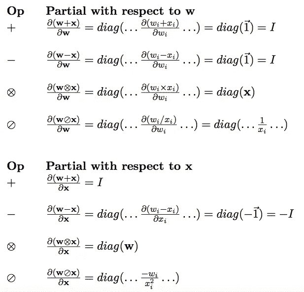

Image 23: Gradients of common element-wise binary operations

## 向量和的梯度

深度学习中最常见的运算之一就是求和运算。如何求函数*y = sum(***x***)*的梯度？

*y = sum(***)x***)*也可以表示为:

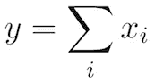

Image 24: y=sum(**x**)

因此，梯度可以表示为:

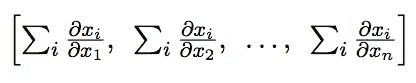

Image 25: Gradient of y=sum(**x**)

因为函数对不在函数中的变量的偏导数为零，所以可以进一步简化为:

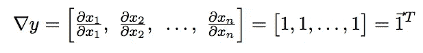

Image 26: Gradient of y=sum(**x**)

请注意，结果是一个水平向量。

*y = sum(***x***z)*的梯度呢？唯一的区别是我们用常数 z 乘以每个偏导数:

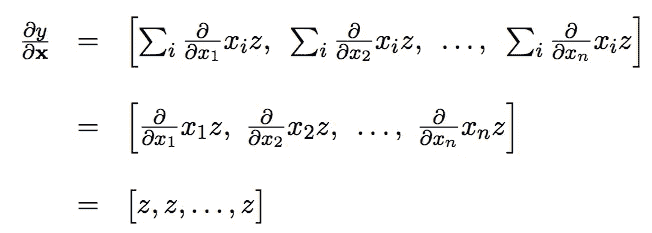

Image 27: Gradient of y=sum(**x**z) with respect to **x**

虽然这是相对于 **x** 的导数，但是相对于标量 *z* 的导数仅仅是一个数字:

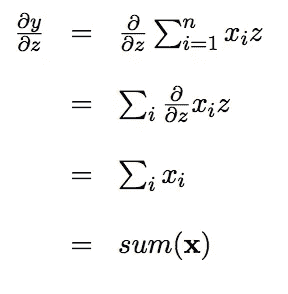

Image 28: Gradient of y=sum(**x**z) with respect to z

## 链式法则向量函数组合的梯度

在[第二部分](/step-by-step-the-math-behind-neural-networks-ac15e178bbd)中，我们学习了多变量链式法则。然而，这只对标量有效。让我们看看如何将它整合到矢量计算中！

让我们取一个向量函数， **y** = **f** *(x)* ，求它的梯度。让我们将该函数定义为:

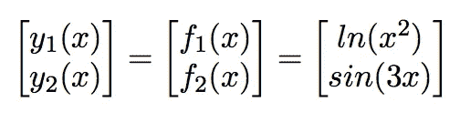

Image 29: **y** = **f**(x)

*f₁(x)* 和 *f₂(x)* 都是复合函数。让我们为 *f₁(x)* 和 *f₂(x)* 引入中间变量，并重写我们的函数:

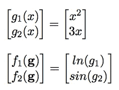

Image 30: **y** = **f**(**g**(x))

现在，我们可以使用多变量链式法则来计算矢量 **y** 的导数。简单计算 *f₁(x)* 和 *f₂(x)* 的导数，并将它们一个放在另一个上面:

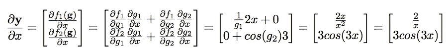

Image 31: Gradient of **y** = **f**(**g**(x))

瞧啊。我们有梯度。然而，我们已经用标量规则得出了我们的解决方案，仅仅是将数字组合成一个向量。有没有办法表示向量的多变量链式法则？

现在，我们的梯度计算如下:

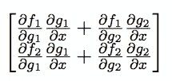

Image 32: Gradient of **y** = **f**(**g**(x))

注意， *f₁(x)* 和 *f₂(x)* 的梯度的第一项都包括 *g₁* 对 *x* 的部分，而 *f₁(x)* 和 *f₂(x)* 的梯度的第二项都包括 *g₂* 对 *x* 的部分。这就跟矩阵乘法一样！因此，我们可以将其表示为:

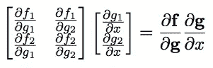

Image 33: Vector representation of the gradient of **y** = **f**(**g**(x))

让我们测试一下向量链规则的新表示:

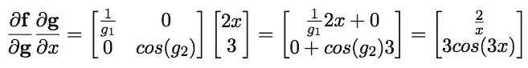

Image 34: Vector chain rule

我们得到与标量方法相同的答案！如果我们有一个向量参数 **x** 而不是单个参数 *x* ，我们只需要稍微改变一下规则就可以得到完整的向量链规则:

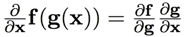

Image 35: Vector chain rule

换句话说:

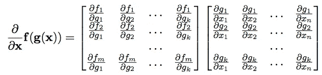

Image 36: Vector chain rule

在我们上面的例子中， *f* 纯粹是 *g* 的函数；即 *fi* 是 *gi* 而不是 *gj* 的函数(每个函数 *f* 恰好匹配 1 个函数 *g* ) *)。*在这种情况下，对角线以外的一切都变为零，并且:

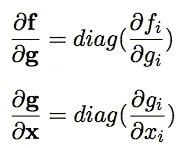

Image 37: Special case of vector chain rule

现在我们有了我们开始系列时找到的神经网络梯度的所有部分:

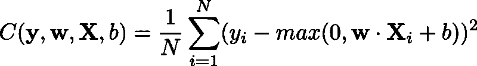

Image 38: Cost function

查看[第 4 部分](/calculating-gradient-descent-manually-6d9bee09aa0b)了解如何计算其导数！

如果您还没有，请阅读第 1 和第 2 部分:

*   [第 1 部分:简介](/step-by-step-the-math-behind-neural-networks-490dc1f3cfd9)
*   [第二部分:偏导数](/step-by-step-the-math-behind-neural-networks-ac15e178bbd)

大结局请看[第四部](/calculating-gradient-descent-manually-6d9bee09aa0b)！

点击下载[原文。](https://arxiv.org/abs/1802.01528)

如果你喜欢这篇文章，别忘了留下一些掌声！如果您有任何问题或建议，请在下面留下您的评论:)