# 教程:带随机梯度下降的线性回归

> 原文：<https://towardsdatascience.com/step-by-step-tutorial-on-linear-regression-with-stochastic-gradient-descent-1d35b088a843?source=collection_archive---------0----------------------->


Photo by [Lindsay Henwood](https://unsplash.com/photos/7_kRuX1hSXM?utm_source=unsplash&utm_medium=referral&utm_content=creditCopyText) on [Unsplash](https://unsplash.com/search/photos/stairs?utm_source=unsplash&utm_medium=referral&utm_content=creditCopyText)

## 在 JavaScript 中实现反向传播

*你可以在这里* *找到反向传播演示* [*。*](https://remykarem.github.io/backpropagation-demo/)

这篇文章应该为我们深入研究深度学习提供了一个良好的开端。让我带你一步一步地计算使用随机梯度下降的线性回归任务。

A short YouTube clip for the backpropagation demo found [here](http://raiboso.me/backpropagation-demo/)

## 内容

1.  [**准备**](#db94)1.1[数据](#1c28)
    1.2 [模型](#15e3)
    1.3 [定义损失功能](#e126)
    1.4 [最小化损失功能](#7aae)

**2。** [**实现**](#0384) **2.1**[**正向传播**](#3b4c)
2.1.1 [初始化权重(一次性)](#3b4c)
2.1.2 [进给数据](#c551)
2.1.3 [计算*ŷ*](#5da9)2 . 2 . 1

# 1 准备

## 1.1 数据

我们有一些数据:当我们观察自变量 *x* ₁和 *x* ₂时，我们也观察因变量(或响应变量) *y* 。

在我们的数据集中，我们有 6 个例子(或观察)。

```
 **x1 x2   y**
**1)**   4  1   2
**2)**   2  8 -14
**3)**   1  0   1
**4)**   3  2  -1
**5)**   1  4  -7
**6)**   6  7  -8
```

## 1.2 模型

下一个要问的问题是:“₁和₂是如何联系在一起的？”

我们认为它们通过以下等式相互联系:

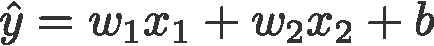

我们今天的工作是找到“最佳”w 和 b*b*值。

> *我用过深度学习约定* **w** *和* **b** *，分别代表* ***权重*** *和* ***偏差*** *。但是注意线性回归不是深度学习。*

## 1.3 定义损失函数

假设在本练习结束时，我们已经算出我们的模型是

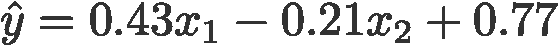

我们如何知道我们的模型做得好不好？

我们简单地通过一个*损失函数比较预测的 *ŷ* 和观测的 *y* 。* 有很多方法来定义损失函数，但在本文中，我们将其定义为 *ŷ* 和 *y* 的平方差。


一般来说 *L* 越小越好。

## 1.4 最小化损失功能

因为我们希望 *ŷ* 和 *y* 之间的差异很小，所以我们希望努力将其最小化。这是通过**随机梯度下降**优化完成的。它基本上是使用梯度值迭代更新 *w* ₁和 *w* ₂的值，如下式所示:


Fig. 2.0: Computation graph for linear regression model with stochastic gradient descent.

该算法试图通过不断更新来找到正确的权重，记住我们正在寻找最小化损失函数的值。

> ***直觉:随机梯度下降***
> 
> *你是* **w** *你在一个图上(损失函数)。你现在的值是* **w** *=5。你想移到图中的最低点(最小化损失函数)。*
> 
> 你也知道，用你当前的值，你的梯度是 2。你必须以某种方式利用这个价值继续生活。
> 
> 根据高中数学，2 意味着你在一个倾斜的斜坡上，你能下来的唯一方法就是向左移动，在这一点上。
> 
> 如果走 5+2 意味着你要去右边爬上斜坡，那么唯一的方法就是走 5–2，它会把你带到左边，向下。所以梯度下降就是从当前值中减去梯度值。

# 2.履行

我们的模型的工作流程很简单:前向传播(或前馈或前向传递)和反向传播。

> ***定义:训练*** *训练简单来说就是定期更新你的权值。*

下面是工作流程。单击以跳转到该部分。

— — — —
**2.1 正向传播**
2.1.1 [初始化权重(一次性)](#3b4c)
2.1.2 [进给数据](#c551)
2.1.3 [计算*ŷ*](#5da9)2 . 1 . 4[计算损耗](#b9e3)

**2.2 反向传播**
2.2.1 [计算偏导数](#e0d5)
2.2.2 [更新权重](#5dd3)
— — — — — — — — —

让我们开始吧。

为了跟踪所有的值，我们首先构建一个“计算图”,其中包含了用颜色编码的节点

1.  **橙色** *—* 占位符( *x* ₁、 *x* ₂和 *y* )，
2.  **深绿色** *—* 重量和偏差( *w* ₁， *w* ₂和 *b* )，
3.  **浅绿色** *—* 型号 ( *ŷ* )连接 *w* ₁、 *w* ₂、 *b* 、 *x* ₁、 *x* ₂，以及
4.  **黄色***—*[损失函数](#d864) ( *L* )连接 *ŷ* 和 *y.*

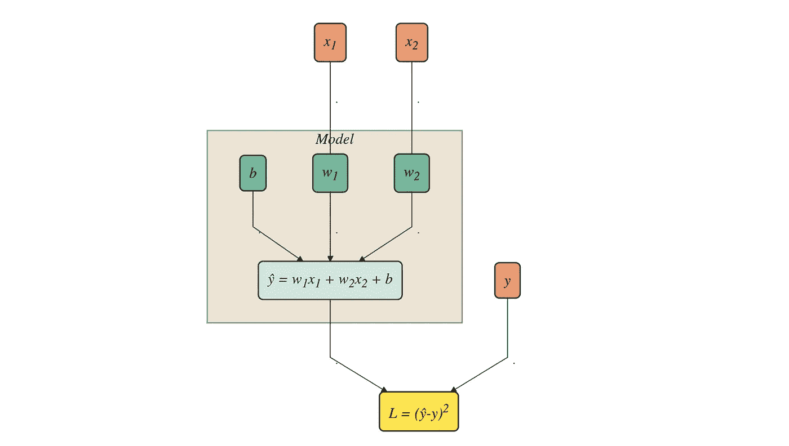

Fig. 2.0: Computation graph for linear regression model with stochastic gradient descent.

对于正向传播，您应该从上到下阅读此图，对于反向传播，您应该从下到上阅读。

> ***注*** *我采用了“占位符”这个术语，这个术语在*[*tensor flow*](https://www.tensorflow.org/api_docs/python/tf/placeholder)*中用来指代这些“数据变量”。
> 我也将使用术语“重量”来统称* w *和* b *。*

## 2.1 正向传播

## 2.1.1 初始化砝码(一次性)

因为梯度下降是关于更新权重的，我们需要它们从一些值开始，称为*初始化*权重。

这里我们初始化权重和偏差如下:

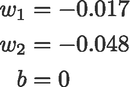

这些反映在下面图 2.1.1 中的**深绿色节点**中:

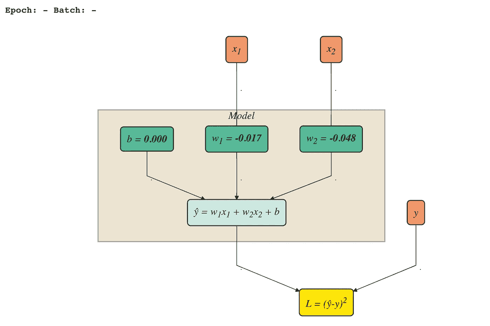

Fig. 2.1.1: Weights initialised (dark green nodes)

有许多初始化权重的方法(0、1、均匀分布、正态分布、截断正态分布等)。)但我们不会在本帖中涉及它们。在本教程中，我们通过使用截尾正态分布和偏差为 0 来初始化权重。

## 进料数据

接下来，我们将批量大小设置为 1，并输入第一批数据。

> ***批次和批次大小***
> 
> *我们可以将数据集分成大小相等的小组。每组称为一个***，由指定数量的样本组成，称为* ***批量*** *。如果我们将这两个数字相乘，我们应该可以得到数据中的观察次数。**
> 
> **在这里，我们的数据集由 6 个示例组成，由于我们在本次培训中将批次大小定义为 1，因此我们总共有 6 个批次。**

*用于输入模型的当前数据批次在下面以粗体显示:*

```
 ***x1 x2   y**
**1)   4  1   2**
**2)**   2  8 -14
**3)**   1  0   1
**4)**   3  2  -1
**5)**   1  4  -7
**6)**   6  7  -8*
```

*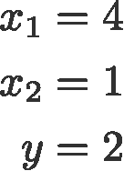*

*Eqn. 2.1.2: First batch of data fed into model*

*在图 2.1.2 中，**橙色节点**是我们输入当前一批数据的地方。*

*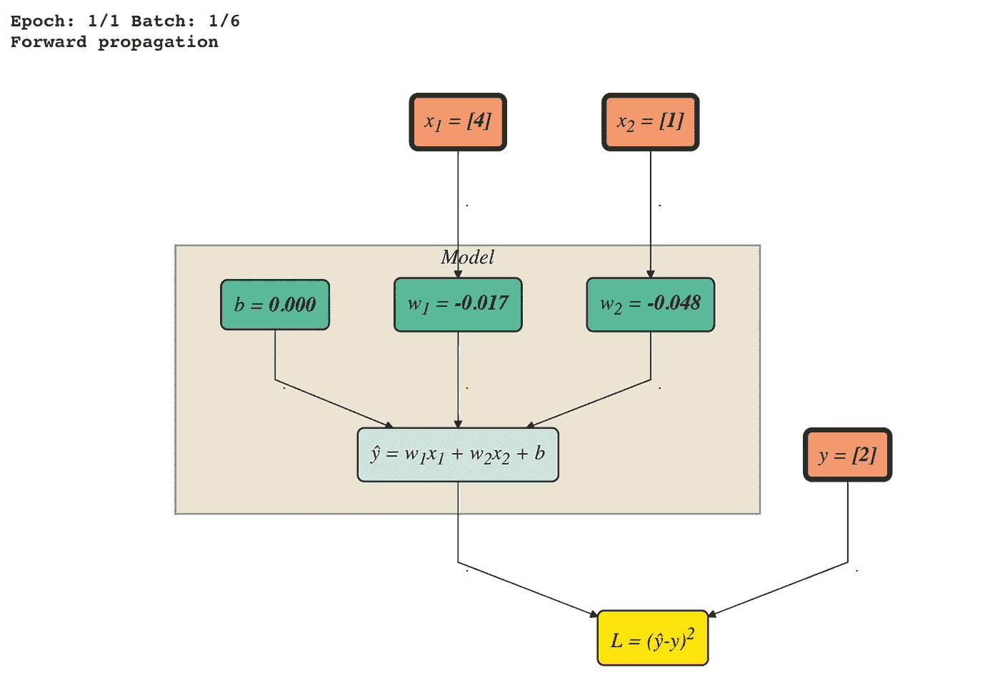*

*Fig. 2.1.2: Feeding data to model with first batch (orange nodes)*

## *2.1.3 计算 ***ŷ****

*现在我们已经有了 *x* ₁、 *x* ₂、 *w* ₁、 *w* ₂和 *b* 的值，让我们计算 *ŷ.**

*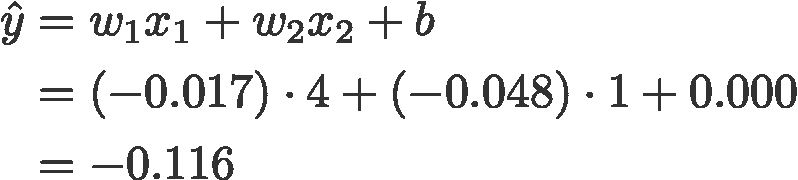*

*Eqn. 2.1.3: Compute *ŷ**

**ŷ* (=-0.1)的值反映在下面的**浅绿色节点**中:*

*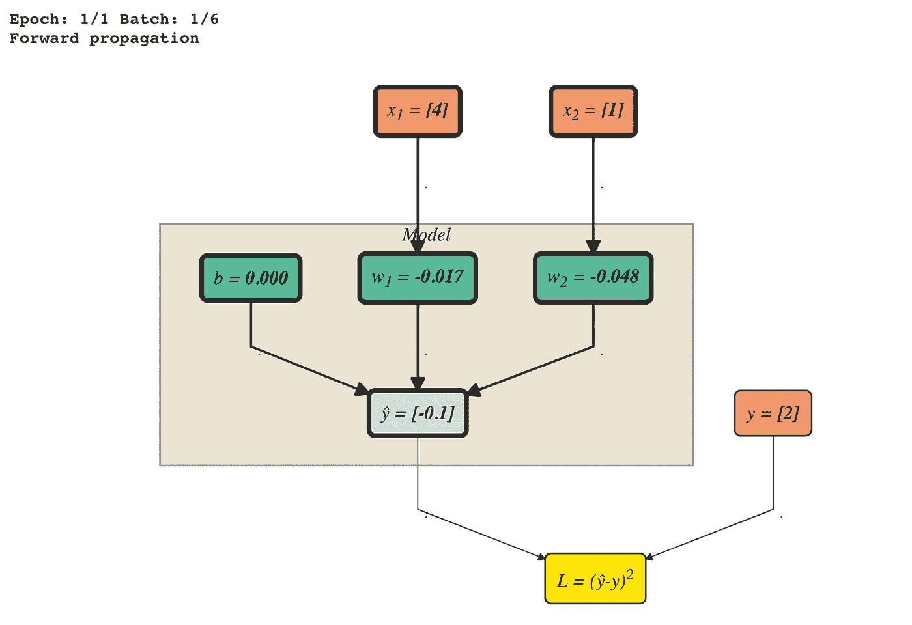*

*Fig. 2.1.3: *ŷ computed (light green node)**

## *计算损失*

*我们预测的 *ŷ* 与给定的 *y* 数据有多远？我们通过计算前面定义的损失函数来比较它们。*

*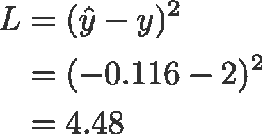*

*Eqn. 2.1.4: Compute the loss*

*您可以在计算图的**黄色节点**中看到该值。*

*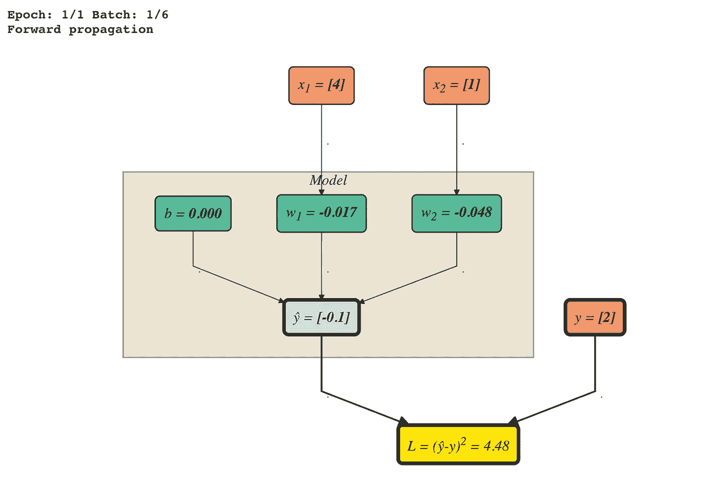*

*Fig. 2.1.4A: L computed (yellow node)*

*通常的做法是记录训练期间的损失，以及其他信息，如纪元、批次和花费的时间。在我的演示中，您可以在**训练进度**面板下看到这一点。*

*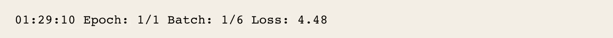*

*Fig. 2.1.4B: Logging loss and other information*

## *2.2 反向传播*

## *计算偏微分*

*在我们开始调整权重和偏差 *w* ₁、 *w* ₂和 *b* 的值之前，让我们首先计算所有的偏差值。这些是我们稍后更新权重时需要的。*

*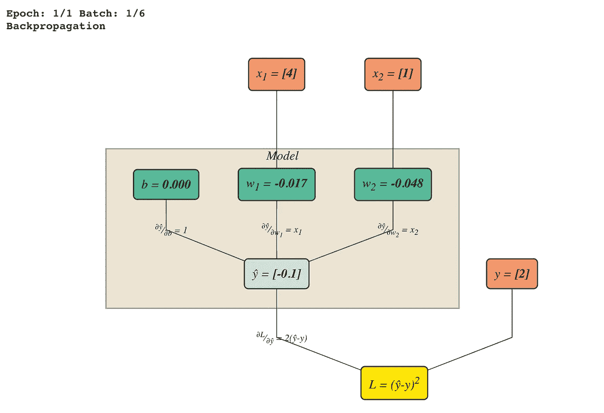*

*Fig. 2.2.1: Indicated partial differentials to the relevant edges on the graph*

*也就是说，我们只计算**通向每个 *w* 和 *b* 的所有可能路径**，因为这些是我们唯一感兴趣更新的变量。从上面的图 2.2.1 中，我们看到有 4 条边被标上了偏导数。*

*回想一下模型和损失函数的等式:*

**

*Model*

*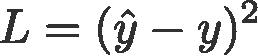*

*Loss function*

*部分差异如下:*

**L* ( **黄色**)——*ŷ*(**浅绿色** ) **:***

*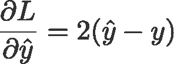*

*Eqn. 2.2.1A: Partial differential of L w.r.t. *ŷ**

**ŷ* ( **浅绿色**)——*b*(**深绿色**):*

*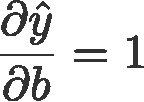*

*Eqn. 2.2.1B: Partial differential of *ŷ* w.r.t. b*

**ŷ* ( **浅绿色**)——*w*₁(**深绿色**):*

*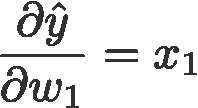*

*Eqn. 2.2.1C: Partial differential of *ŷ* w.r.t. w1*

**ŷ* ( **浅绿色**)——*w*₂(**深绿色**):*

*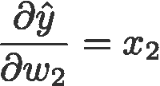*

*Eqn. 2.2.1D: Partial differential of *ŷ* w.r.t. w2*

*注意，偏微分的值遵循当前批次中的**值。例如，在等式 2 中。2.2.1C， *x* ₁ = 4。***

## *更新权重*

*观察下图 2.2.2 中的**深绿色节点**。我们看到三样东西:
i) *b* 从 0.000 变化到 0.212
ii) *w* ₁从-0.017 变化到 0.829
iii) *w* ₂从-0.048 变化到 0.164*

*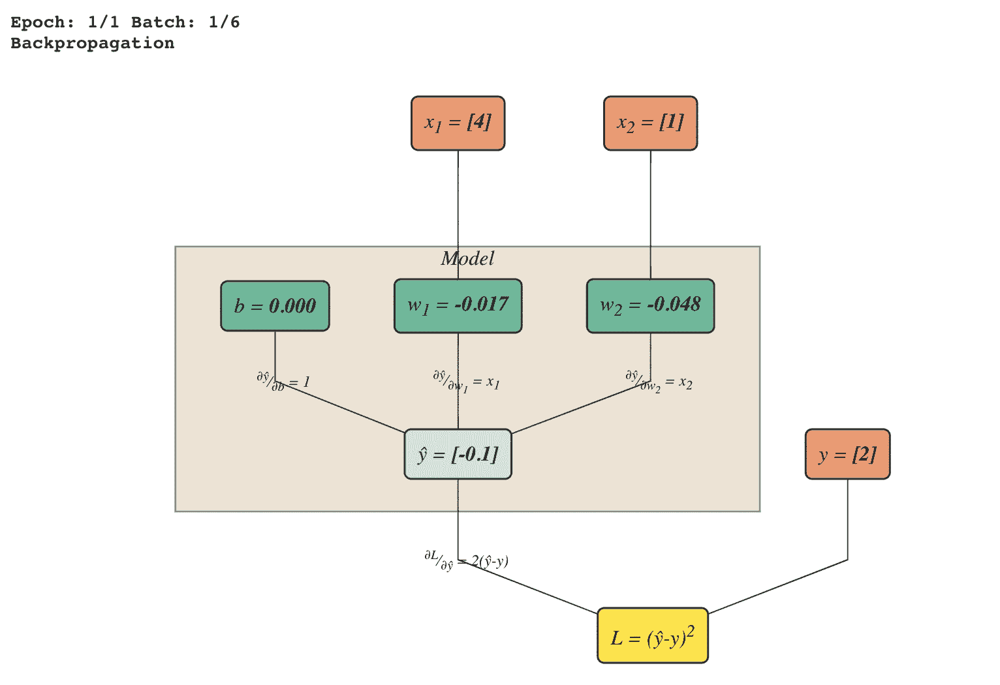*

*Fig. 2.2.2: Updating the weights and bias (dark green nodes)*

*还要注意从**黄色节点**到**绿色节点**的路径的“方向”。他们从下往上走。*

*这是随机梯度下降-使用反向传播更新权重，利用各自的梯度值。*

*先重点更新一下 *b* 。更新 *b* 的公式为*

*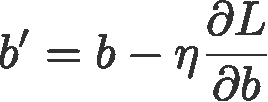*

*Eqn. 2.2.2A: Stochastic gradient descent update for b*

*在哪里*

*   **b***—*当前值**
*   ***b’***—*更新后的值***
*   ****η —* 学习率，设置为 0.05***
*   ****∂L/∂b —* 梯度，即 *L* w.r.t. *b* 的偏微分***

***为了得到梯度，我们需要使用链式法则将从 *L* 到 *b* 的**路径**相乘:***

***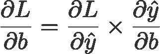***

***Eqn. 2.2.2B: Chain rule for partial differential of L w.r.t. b***

***我们将需要当前批次值 *x* 、 *y、ŷ* 和偏差值，因此我们将它们放在下面以便于参考:***

***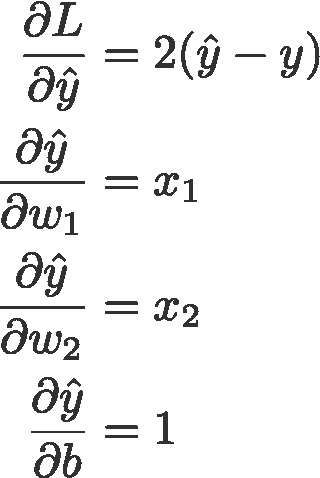***

***Eqn. 2.2.2C: Partial differentials***

***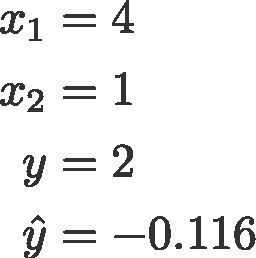***

***Eqn. 2.2.2D: Values from current batch and the predicted *ŷ****

***使用方程中的随机梯度下降方程。2.2.2A 并代入方程中的所有值。2.2.2B-D 为我们提供了:***

***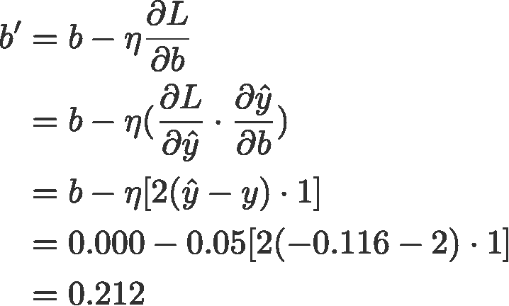***

***更新 *b* 到此为止！唷！我们只剩下更新 *w* ₁和 *w* ₂，我们以类似的方式更新它们。***

***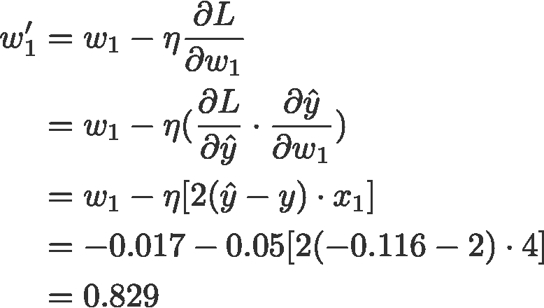******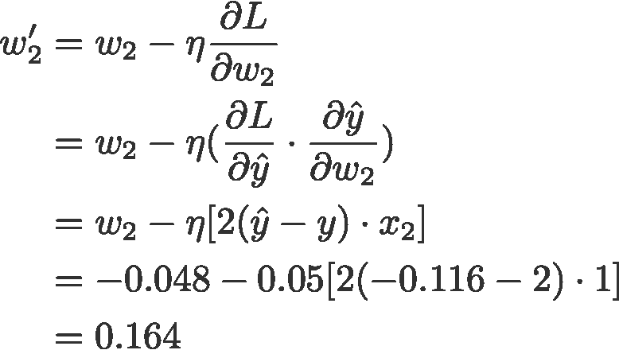***

## ***批处理迭代结束***

***恭喜你。处理第一批就这样！***

```
 *****x1 x2   y**
**1)**   4  1   2  ✔
**2)**  ** 2  8 -14
3)   1  0   1
4)   3  2  -1
5)   1  4  -7
6)   6  7  -8*****
```

***现在我们需要将上述步骤重复到其他 5 个批次，即实施例 2 至 6。***

***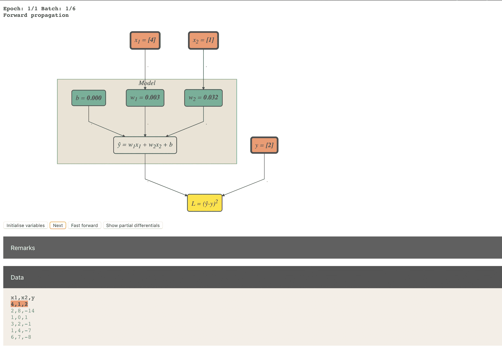***

***Iterating through batch 1 to 6 (apologies for the poor GIF quality! )***

## ***时代结束***

***当模型已经遍历所有批次一次时，我们完成 1 个时期。在实践中，我们将纪元扩展到大于 1。***

> ****一个* ***历元*** *是当我们的设置已经看到了* ***所有*** *在我们的数据集中的观察值一次。但是一个纪元几乎永远不足以让损失收敛。实际上，这个数字是手动调整的。****

***在这一切结束时，你应该得到一个最终的模型，准备好进行推理，比如说:***

******

***让我们用伪代码来回顾一下整个工作流程:***

```
***initialise_weights()for i in epochs: for j in batches: #forward propagation
        feed_batch_data()
        compute_ŷ()
        compute_loss() #backpropagation
        compute_partial_differentials()
        update_weights()***
```

## ***改善培训***

***对于随机梯度下降优化问题，一个历元是远远不够的。记住在[图 4.1](#5701) 中，我们的亏损在 4.48。如果我们增加历元的数量，这意味着增加我们更新权重和偏差的次数，我们可以将其收敛到令人满意的低水平。***

***以下是您可以在培训中改进的地方:***

*   ***将培训扩展到一个以上的时代***
*   ***增加批量***
*   ***改变优化器(见我关于梯度下降优化算法的帖子[这里](/10-gradient-descent-optimisation-algorithms-86989510b5e9))***
*   ***调整学习率(更改学习率值或使用学习率计划程序)***
*   ***拿出一套火车价值测试装置***

## ***关于***

***我用 JavaScript 构建了一个交互式的可探索的线性回归演示。以下是我使用的库:***

*   ***Dagre-D3 (GraphViz + d3.js ),用于呈现图形***
*   ***用于呈现数学符号的 MathJax***
*   ***用于绘制折线图的图表***
*   ***jQuery***

***点击查看互动演示[。](https://remykarem.github.io/backpropagation-demo/)***

***您可能还想看看下面的*使用 TensorFlow 进行线性回归的一行一行的外行指南*，该指南着重于使用 TensorFlow 库对线性回归进行编码。***

***[](https://medium.com/datadriveninvestor/a-line-by-line-laymans-guide-to-linear-regression-using-tensorflow-3c0392aa9e1f) [## 使用 TensorFlow 进行线性回归的逐行外行指南

### 线性回归是机器学习之旅的一个良好开端，因为它非常简单明了…

medium.com](https://medium.com/datadriveninvestor/a-line-by-line-laymans-guide-to-linear-regression-using-tensorflow-3c0392aa9e1f)*** 

## ***参考***

***[](https://colah.github.io/posts/2015-08-Backprop/) [## 计算图上的微积分:反向传播——colah 的博客

### 反向传播是使训练深度模型在计算上易于处理的关键算法。对于现代神经…

colah.github.io](https://colah.github.io/posts/2015-08-Backprop/) 

## 深度学习相关文章

[动画版 RNN、LSTM 和 GRU](/animated-rnn-lstm-and-gru-ef124d06cf45)

[逐行 Word2Vec 实现](/an-implementation-guide-to-word2vec-using-numpy-and-google-sheets-13445eebd281)(关于单词嵌入)

[10 种梯度下降优化算法+备忘单](/10-gradient-descent-optimisation-algorithms-86989510b5e9)

[统计深度学习模型中的参数数量](/counting-no-of-parameters-in-deep-learning-models-by-hand-8f1716241889)

[经办人:图文并茂](/attn-illustrated-attention-5ec4ad276ee3)

[图文并茂:自我关注](/illustrated-self-attention-2d627e33b20a)*** 

****感谢* [*【任杰】*](https://medium.com/@renjietan)*[*德里克*](https://medium.com/@derekchia) *对本文的想法、建议和修正。*****

****关注我上*[*Twitter*](https://www.twitter.com/remykarem)*@ remykarem 或者*[*LinkedIn*](http://www.linkedin.com/in/raimibkarim)*。你也可以通过 raimi.bkarim@gmail.com 联系我。欢迎访问我的网站*[*remykarem . github . io*](https://remykarem.github.io/)*。****