# Google Dataproc 上的 PySpark 情感分析

> 原文：<https://towardsdatascience.com/step-by-step-tutorial-pyspark-sentiment-analysis-on-google-dataproc-fef9bef46468?source=collection_archive---------5----------------------->

## 一步一步的教程


Photo by [Joshua Sortino](https://unsplash.com/@sortino?utm_source=medium&utm_medium=referral) on [Unsplash](https://unsplash.com?utm_source=medium&utm_medium=referral)

我最近有机会通过 Coursera 上的一个专业化课程来体验谷歌云平台；[谷歌云平台专业化](https://www.coursera.org/specializations/gcp-data-machine-learning)上的数据工程。总的来说，我通过这些课程学到了很多东西，这是一个在完成作业的同时免费尝试谷歌云平台(GCP)各种服务的好机会。尽管我目前在工作中没有使用 GCP 的任何服务，但如果有机会，我很乐意将我的部分数据工作迁移到 GCP。

然而，这门课程缺少的一点是你自己发挥创造力的空间。这门课的作业与其说是作业，不如说是辅导课。你基本上遵循已经写好的代码。当然，通过尝试阅读每一行代码并详细理解每一行的作用，您仍然可以学到很多东西。尽管如此，如果不把你学到的知识应用到你自己的问题解决中，就很难把这些知识完全变成你的。这也是讲师[拉克·拉克什马南](https://medium.com/u/247b0630b5d6?source=post_page-----fef9bef46468--------------------------------)在课程结束时的建议。(对 [Lak Lakshmanan](https://medium.com/u/247b0630b5d6?source=post_page-----fef9bef46468--------------------------------) 大喊，谢谢你们的精彩课程！)

**除了我将附上的简短代码块，你可以在本文末尾找到整个 Git 库的链接。*

# 要求

*   家酿([https://brew.sh/](https://brew.sh/))
*   Git([https://Git-SCM . com/book/en/v2/Getting-Started-Installing-Git](https://git-scm.com/book/en/v2/Getting-Started-Installing-Git))

# 在 GCP 上创建免费试用账户

所以我决定利用各种 GCP 服务做一些个人迷你项目。幸运的是，如果你还没有尝试过 GCP，谷歌慷慨地提供了一个免费试用，给你 300 美元的信用，你可以使用超过 12 个月。


You can easily start your free trial by visiting [https://cloud.google.com/gcp/](https://cloud.google.com/gcp/)

我尝试的第一个项目是 Google Dataproc 上的 Spark 情绪分析模型训练。我选择它作为我在 GCP 的第一个项目有几个原因。在我之前的一篇文章中，我已经写了关于 PySpark 情绪分析的文章，这意味着我可以把它作为一个起点，轻松地把它变成一个独立的 Python 程序。另一个原因是我只是想试试 Google Dataproc！我被在 GCP 上运行一个集群的简单和快速迷住了，忍不住在 Coursera 课程之外尝试了一下。

如果您点击了“免费试用 GCP”，并填写了诸如您的计费帐户(即使您设置了计费帐户，除非您升级到付费帐户，否则不会向您收费)等信息，您将被定向到如下所示的页面。

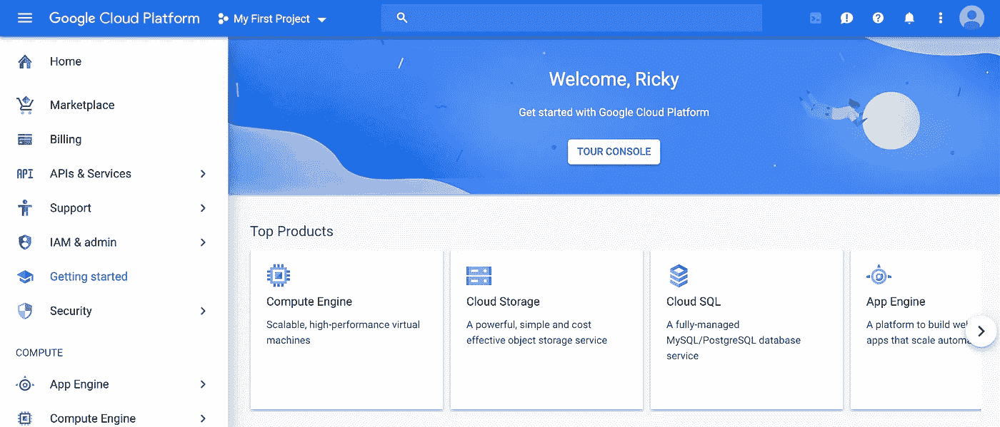

Home screen of GCP web console

在顶部菜单栏，可以看到谷歌云平台旁边的“我的第一个项目”。在 GCP，“项目”是使用 GCP 服务、启用计费等的基础级实体。在第一次登录时，你可以看到谷歌自动为你创建了一个名为“我的第一个项目”的“项目”。点击它来查看当前项目的 ID，复制或记下它，这将在以后使用。通过在 web 控制台主屏幕上点击左侧菜单中的“帐单”,“我的第一个项目”会自动链接到您收到的免费点数。

# 启用 API

在 GCP，有许多不同的服务；计算引擎、云存储、BigQuery、云 SQL、云 Dataproc 等等。为了在您的项目中使用这些服务，您首先必须启用它们。

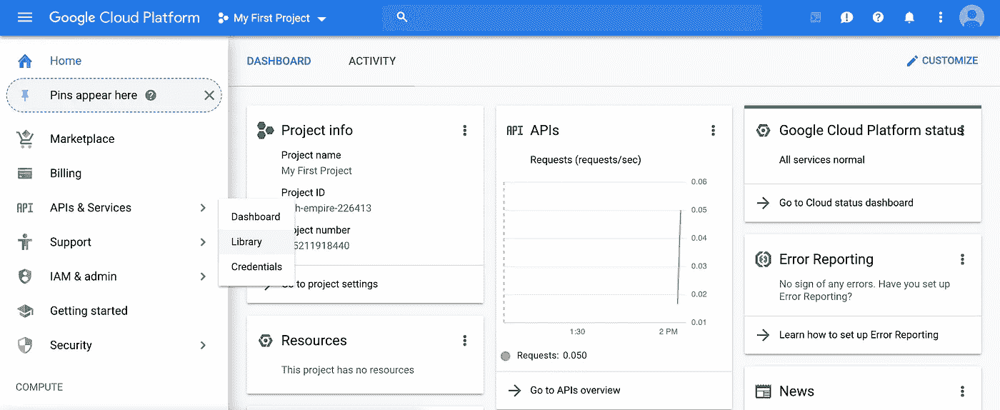

将鼠标放在左侧菜单的“APIs & Services”上，然后点击“Library”。对于这个项目，我们将启用三个 API:clouddataproc、计算引擎和云存储。

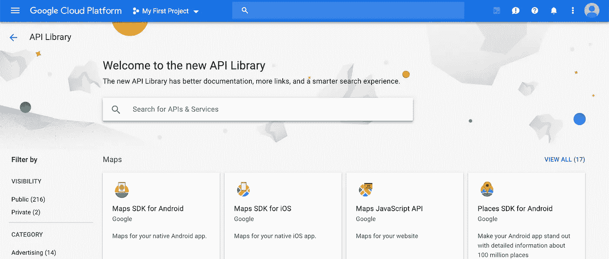

在 API 库页面中，通过在搜索框中键入名称，逐一搜索上述三个 API。点击进入搜索结果，并通过点击屏幕上的“启用”按钮来启用 API。

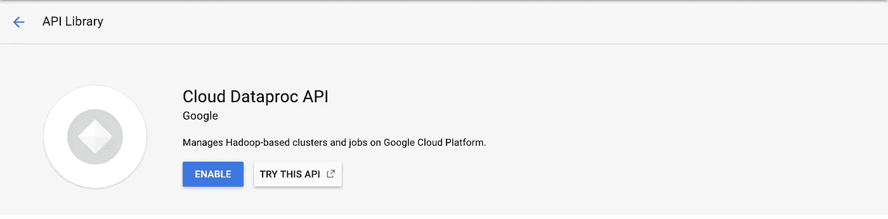

当我自己尝试时，我只需要启用 Cloud Dataproc API，因为当我点击它们时，其他两个(计算引擎、云存储)已经启用了。但是如果你不是这样，请启用计算引擎 API，云存储 API。

# 安装 Google Cloud SDK

如果这是你第一次尝试 GCP，你可能首先要安装谷歌云 SDK，这样你就可以从命令行与 GCP 的许多服务进行交互。你可以从[这里](https://cloud.google.com/sdk/)找到更多关于如何安装的信息。

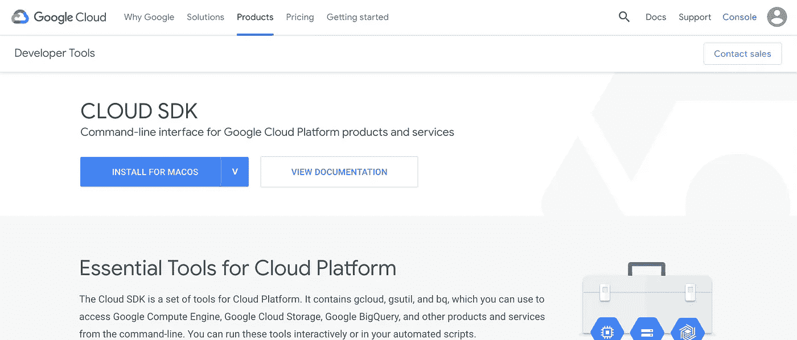

Install Google Cloud SDK by following instructions on [https://cloud.google.com/sdk/](https://cloud.google.com/sdk/)

按照链接中的说明，您将被提示登录(使用您用来开始免费试用的 Google 帐户)，然后选择一个项目和计算区域(项目:选择您从上述步骤中启用 API 的项目如果有多个项目，计算区域:为了减少网络延迟，您可能希望选择一个离您近的区域。您可以从[这里](https://cloud.google.com/compute/docs/regions-zones/)查看每个区域的物理位置。).

# 创建存储桶

因为您已经安装了 Google Cloud SDK，所以您可以从命令行或 web 控制台创建一个 bucket。

## Web 控制台

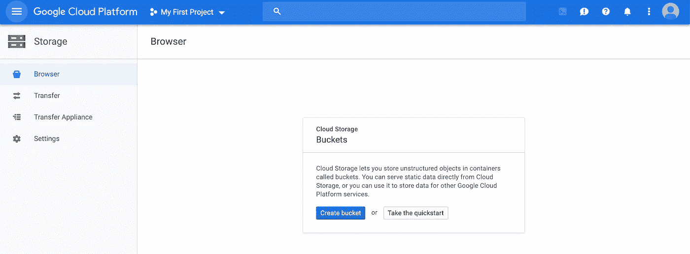

从左侧菜单中点击“存储”，然后你会看到一个类似上面的页面。点击“创建存储桶”

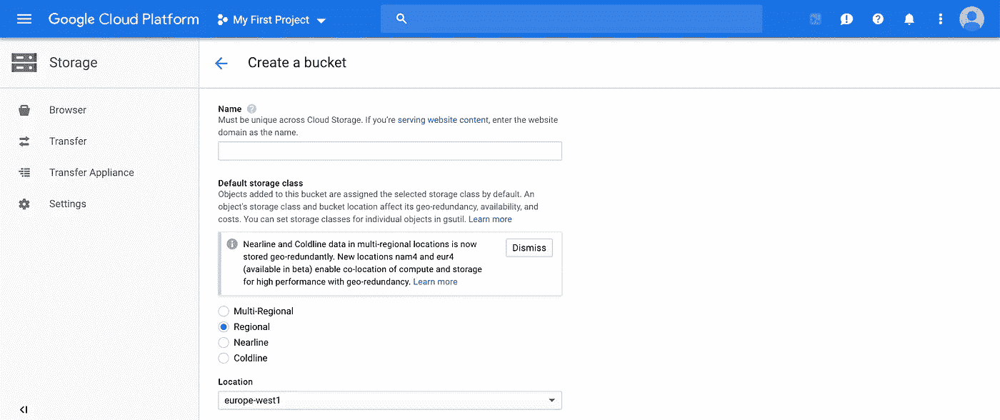

为方便起见，请输入您在“在 GCP 上创建免费试用帐户”阶段结束时检查的项目 ID。您可以只点击“创建”而不改变任何其他细节，或者选择与您的项目相同的位置。

## 谷歌云 SDK

用您复制的项目 id 替换您的 _project_id，并在您的终端上运行下面一行，将 BUCKET_NAME 变量设置为您的项目 ID，并使其可用于子流程。(您稍后需要运行的 Bash 脚本将利用这一点)

```
export PROJECT_ID='your_project_id'
```

然后通过运行 gsutil mb 命令创建一个 bucket，如下所示。

```
gsutil mb gs://${PROJECT_ID}
```

以上命令将使用默认设置创建一个 bucket。如果您想在一个特定的区域或多区域中创建一个 bucket，您可以给它-l 选项来指定区域。您可以从[这里](https://cloud.google.com/storage/docs/locations)看到可用的铲斗位置。

```
#ex1) multi-region europe
gsutil mb -l eu gs://${PROJECT_ID}#ex)2 region europe-west1
gsutil mb -l europe-west1 gs://${PROJECT_ID}
```

# 克隆 Git 仓库

现在，通过在终端中运行下面的命令，克隆我上传的 git 存储库。

```
git clone [https://github.com/tthustla/pyspark_sa_gcp.git](https://github.com/tthustla/pyspark_sa_gcp.git)
```

# 准备数据

一旦您克隆了存储库，它将创建一个名为 pyspark_sa_gcp 的文件夹。进入文件夹，检查有什么文件。

```
cd pyspark_sa_gcp/
ls
```

您将在目录中看到三个文件:data_prep.sh、pyspark_sa.py、train_test_split.py。为了下载训练数据并为训练做准备，让我们运行 Bash 脚本 data_prep.sh。下面是脚本的内容，我添加了注释来解释每一行的作用。

用于训练的原始数据集是“Sentiment140”，它源于斯坦福大学。该数据集有 160 万条带标签的推文。
50%的数据带有负面标签，另 50%带有正面标签。关于数据集的更多信息可以从链接中找到。[http://help.sentiment140.com/for-students/](http://help.sentiment140.com/for-students/)

在上面的 Bash 脚本中，您可以看到它调用了一个 Python 脚本 train_test_split.py。让我们也来看看它做了什么。

现在我们可以运行 Bash 脚本来准备数据。一旦完成，它就会将准备好的数据上传到您之前创建的云存储桶中。上传数据需要 5~6 分钟。

```
./data_prep.sh
```

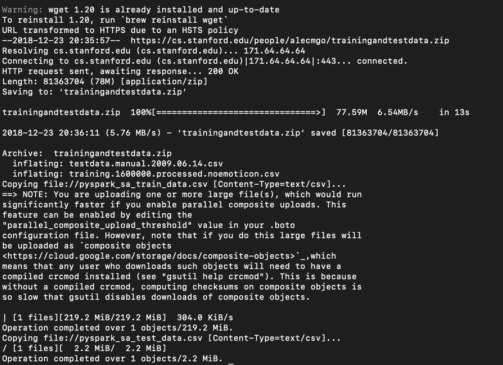

# 检查上传的数据

## Web 控制台

从左侧菜单转到存储，然后单击进入您的存储桶-> pyspark_nlp ->数据。您将看到上传了两个文件。

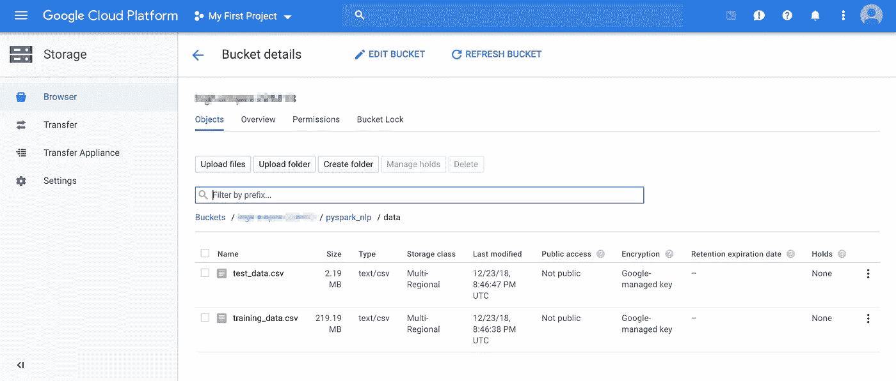

## 谷歌云 SDK

或者您也可以通过运行下面的命令从终端检查您的 bucket 的内容。

```
gsutil ls -r gs://${PROJECT_ID}/**
```

# 创建 Google Dataproc 集群

Cloud Dataproc 是一个 Google 云服务，用于运行 Apache Spark 和 Apache Hadoop 集群。我不得不说，它简单易用得可笑，使用 Google Dataproc 只需要几分钟就可以启动一个集群。此外，如果您需要，Google Dataproc 提供了自动缩放，您可以随时调整集群，即使任务正在集群上运行。


## Web 控制台

从左侧菜单转到 Dataproc(您必须向下滚动一点。在“大数据”部分下)，然后单击“群集”。点击“创建集群”，然后你会看到如下页面。

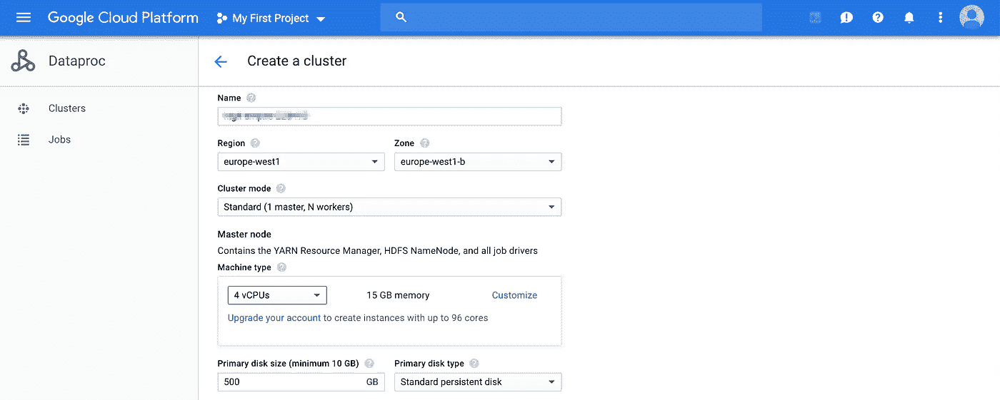

给它一个名字(为了方便，我给了项目 ID 作为它的名字)，选择 Region 和 Zone。为了减少延迟，最好将该区域设置为与您的 bucket 区域相同。这里您需要稍微更改一下 worker 节点的默认设置，因为免费试用版只允许您运行最多 8 个内核。群集的默认设置是一个主节点和两个工作节点，每个节点有 4 个 CPU，这将超过 8 个核心的配额。因此，将 worker 节点的设置更改为 2 个 CPU，然后单击底部的 create。经过几分钟的配置后，您将看到创建的集群包含一个主节点(4 个 CPU、15GB 内存、500GB 标准持久性磁盘)和两个工作节点(2 个 CPU、15GB 内存、500GB 标准持久性磁盘)。

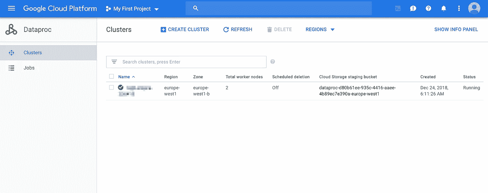

## 谷歌云 SDK

因为我们需要稍微改变一下默认设置，所以我们需要在命令中增加一个参数，但是这很简单。让我们创建一个集群，将其命名为与项目 ID 相同的名称，并将 worker 节点设置为每个有 2 个 CPU。

```
gcloud dataproc clusters create ${PROJECT_ID} \--project=${PROJECT_ID} \--worker-machine-type='n1-standard-2' \--zone='europe-west1-b'
```

您可以将该区域更改为靠近您的存储桶区域。

# 提交 Spark 作业

最后，我们准备在 Google Dataproc 上运行培训。用于培训的 Python 脚本(pyspark_sa.py)包含在您之前克隆的 Git 存储库中。因为我在脚本上做了注释，解释了每一行的作用，所以我就不再赘述代码了。该代码是我在 Jupyter Notebook 中为我的上一篇文章所做的稍微重构的版本。下面是我以前的一些帖子，如果你想了解 PySpark 或 NLP 特征提取的更多细节。

*   [使用 PySpark 进行情感分析](/sentiment-analysis-with-pyspark-bc8e83f80c35)
*   [另一个使用 Python 的 Twitter 情感分析——第 4 部分(计数矢量器，混淆矩阵)](/another-twitter-sentiment-analysis-with-python-part-4-count-vectorizer-b3f4944e51b5)
*   [另一个使用 Python 的 Twitter 情感分析——第 5 部分(TFIDF 矢量器)](/another-twitter-sentiment-analysis-with-python-part-5-50b4e87d9bdd)

让我们看看 Python 脚本是什么样子的。

由于我在脚本中添加了注释来解释每一行的作用，所以我不会详细介绍代码。但简而言之，上面的脚本将采用三个命令行参数:存储训练和测试数据的云存储位置，存储测试数据预测结果的云存储目录，以及存储训练模型的云存储目录。当被调用时，它将首先对训练数据进行预处理->构建管道->拟合管道->并对测试数据进行预测->打印预测的准确性->将预测结果保存为 CSV ->保存拟合的管道模型->加载保存的模型->再次打印测试数据的准确性(以查看模型是否正确保存)。

## Web 控制台

为了通过 web 控制台运行该作业，我们需要首先将 Python 脚本上传到我们的云存储中，以便我们可以指向该作业来读取脚本。让我们通过运行下面的命令来上传脚本。(我假设您仍然在您的终端上的 pyspark_sa_gcp 目录中)

```
gsutil cp pyspark_sa.py gs://${PROJECT_ID}/pyspark_nlp/
```

现在点击 web 控制台上的 Dataproc，点击“作业”,然后点击“提交作业”。

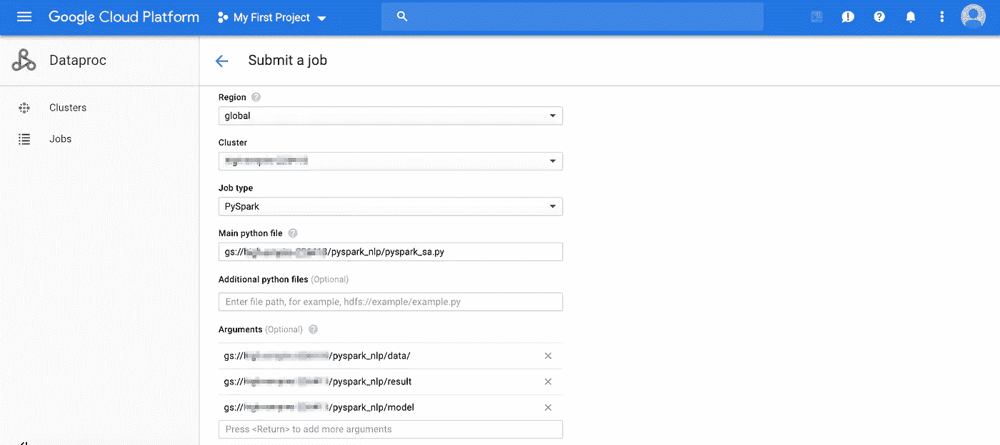

从上面的截图替换模糊的文本部分到你的项目 ID，然后点击底部的“提交”。你可以通过点击查看机器的输出。

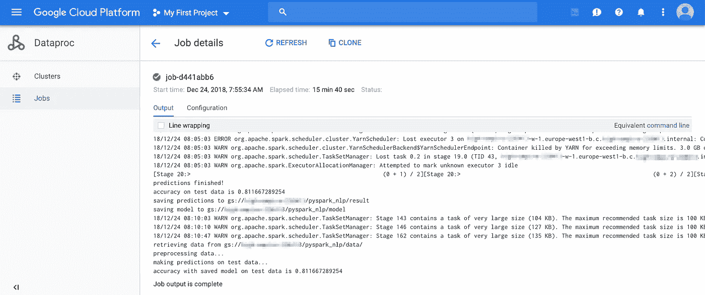

这项工作在 15 分钟后完成，通过查看输出，看起来集群有点挣扎，但尽管如此，预测看起来很好，模型似乎被正确保存。

## 谷歌云 SDK

如果您从命令行提交作业，您甚至不需要将脚本上传到云存储。它将能够获取一个本地文件并移动到 Dataproc 集群来执行。(我再次假设您仍然在终端上的 pyspark_sa_gcp 目录中)

```
gcloud dataproc jobs submit pyspark pyspark_sa.py \--cluster=${PROJECT_ID} \-- gs://${PROJECT_ID}/pyspark_nlp/data/ gs://${PROJECT_ID}/pyspark_nlp/result gs://${PROJECT_ID}/pyspark_nlp/model
```

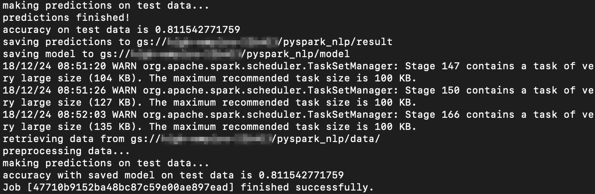

集群似乎又有点挣扎，但仍然正确地保存了结果和模型。(我已经尝试在我的付费帐户上用 4 个 CPUs worker 节点提交相同的作业，然后它没有抛出任何警告)

# 检查结果

去你的桶，然后进入 pyspark_nlp 文件夹。您将看到上述 Spark 作业的结果已保存到“结果”目录(用于预测数据框)和“模型”目录(拟合管道模型)。

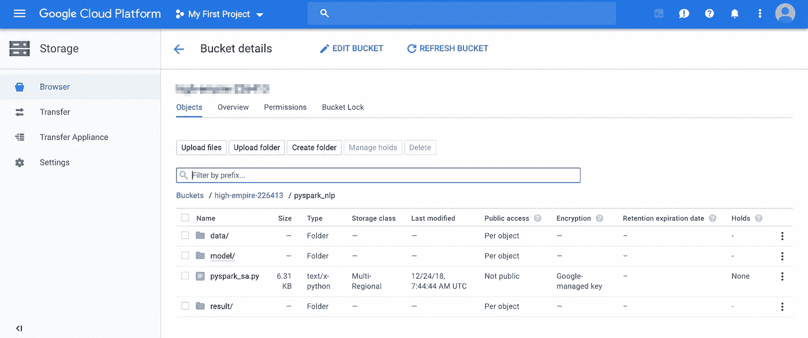

最后，不要忘记删除您已经创建的 Dataproc 集群，以确保它不会耗尽您的信用。

通过这篇文章，我讲述了如何在 Google Dataproc 上训练 Spark ML 模型，并保存训练好的模型以备后用。我在这里展示的只是 GCP 能力的一小部分，我鼓励你探索 GCP 上的其他服务并尝试一下。

感谢您的阅读。您可以从下面的链接中找到 Git 脚本库。

[https://github.com/tthustla/pyspark_sa_gcp](https://github.com/tthustla/pyspark_sa_gcp)