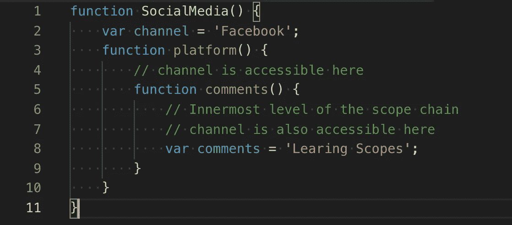
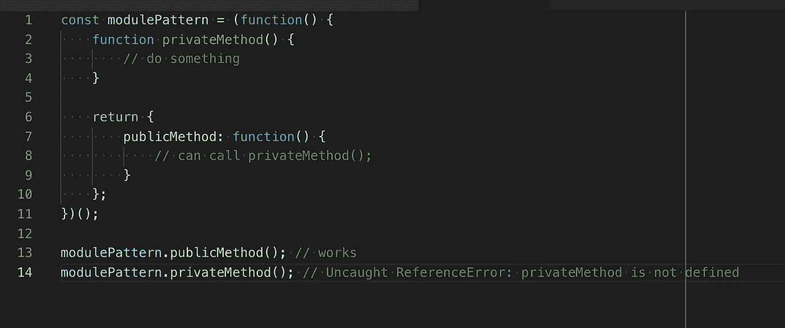

# Javascript 中的作用域

> 原文：<https://towardsdatascience.com/still-confused-in-js-scopes-f7dae62c16ee?source=collection_archive---------8----------------------->


Photo by [sergio souza](https://unsplash.com/@serjosoza?utm_source=medium&utm_medium=referral) on [Unsplash](https://unsplash.com?utm_source=medium&utm_medium=referral)

> 如果您正在学习 javascript，或者对输出问题感到困惑，甚至难以理解 javascript 的其他核心概念，那么这篇文章将会有所帮助。

## 什么是示波器？

范围是运行时代码中某个特定部分的变量、函数或对象的可访问性。

当最小特权的[原则](https://en.wikipedia.org/wiki/Principle_of_least_privilege)应用于编程语言设计时，它们就出现了。

## 我们为什么要学它呢？

它们为你的代码提供了一定程度的安全性，也就是说，只有在真正需要的时候才使用它们。

界定代码的范围有助于提高效率，跟踪和减少错误。

它还解决了不同作用域中同名变量的命名问题，因此减少了命名空间冲突。

## 范围的类型有哪些？

1.  全球和本地
2.  词汇的
3.  街区
4.  公共和私人

让我们用实例逐一查看它们。

## 全局范围和局部范围

任何在函数外部声明的变量都属于全局范围，因此可以从代码中的任何地方访问和修改。

函数内部定义的变量在局部范围内。对于该函数的每次调用，它们都有不同的作用域。这意味着同名的变量可以在不同的函数中使用。这是因为这些变量被绑定到它们各自的函数，每个函数都有不同的作用域，并且不能在其他函数中访问。

新函数=新的局部范围——这是规则。

```
// Gobal
var mouse = "Mouse";function test1() {
  // Local
  var name = "Cat";
  console.log(name);
}function test2() {
  // Local
  var name = "Dog";
  console.log(name);
}test1();
test2();console.log(name);
```

## 词汇范围

当一个函数在另一个函数中时，内部函数可以访问外部函数中的作用域，这称为词法作用域，也称为静态作用域，因为它可能只在定义它的代码块中被*调用*(引用)。



Lexical scope

JavaScript 从最里面的范围开始向外搜索，直到找到它要寻找的变量/对象/函数。

> 需要记住的重要一点是，词法作用域并不向后工作*而不是*。也就是说，在上面的例子中，我们不能访问 SocialMedia 函数和 Platform 函数中的注释变量。

## 块范围

像`if`和`switch`条件或者`for`和`while`循环和{}不像函数这样的块语句，不会创建新的作用域。block 语句中定义的变量将保留在它们原来所在的范围内。

```
// Gobal
var name = "Mouse";{
  // Local
  var name = "Cat";
  console.log(name); // Cat
}console.log(name); // Mouse
```

让我们看看围绕它的一个面试问题(执行上下文、闭包和范围的混合)

```
for (var i = 0; i < 3; i++) {
  setTimeout(function() { console.log(i); }, 1000 + i);
}
```

每次分配相同的变量值时，上面将输出 3，3，3。

> 在第一次迭代中，console.log(i)将被添加到堆栈中，事件循环检测到它有延迟，它被发送到事件队列，这种情况又发生了 2 次，最后当事件循环开始一个接一个地挑选它们来执行时，由于最后的 i++的缘故，变量 I 的最终值是 3，并且由于变量的范围是相同的，所以当它返回时，每个变量的值都变成 3。

然而，ECMAScript 6 引入了`let`和`const`关键字。这些关键字可以用来代替`var`关键字，而`let`和`const`关键字支持在块语句中声明局部作用域。

如果我们把 var i 改成 let i，现在让我们看看区别。

```
for (let i = 0; i < 3; i++) {
  setTimeout(function() { console.log(i); }, 1000 + i);
}
```

每当创建一个新的变量范围时，上面的函数将输出 0，1，2。

## 公共和私有范围

从公共(全局)范围包装函数使它们免受易受攻击的攻击。但是在 JavaScript 中，没有公共或私有范围这种东西。然而，我们可以模仿他们。

```
(function () {   
    var test = function () {
     // do some stuff here   
    }; 
})(); 
// The parenthesis at the end of the function tells the interpreter to execute it as soon as it reads it without invocation.test(); // Uncaught ReferenceError
```

称为模块模式的设计模式也可以用来创建这样的功能。



Private and public scopes in javascript

> modulePattern 的 return 语句包含我们的公共函数。私有函数只是那些不被返回的函数。不返回函数会使它们在 modulePattern 名称空间之外不可访问。但是我们的公共函数可以访问我们的私有函数，这使得它们对于辅助函数来说非常方便。

下一篇文章将讨论什么是 javascript 上下文和关于作用域的执行上下文。

如果您想被添加到我的电子邮件列表中，请考虑在此输入您的电子邮件地址[](https://goo.gl/forms/MOPINWoY7q1f1APu2)****关注我的**[**medium**](https://medium.com/@ideepak.jsd)**阅读更多关于 javascript 的文章，并关注**[**github**](https://github.com/dg92)**查看我的疯狂代码**。如果有什么不清楚或者你想指出什么，请在下面评论。**

**你可能也会喜欢我的其他文章**

1.  **[Javascript 执行上下文和提升](https://levelup.gitconnected.com/javascript-execution-context-and-hoisting-c2cc4993e37d)**
2.  **[Javascript —生成器-产出/下一个&异步-等待🤔](https://medium.com/datadriveninvestor/javascript-generator-yield-next-async-await-8442d2c77185)**
3.  **[理解 Javascript‘this’关键字(上下文)](https://medium.com/datadriveninvestor/javascript-context-this-keyword-9a78a19d5786)。**
4.  **[带有映射、归约、过滤的 Javascript 数据结构](https://levelup.gitconnected.com/write-beautiful-javascript-with-%CE%BB-fp-es6-350cd64ab5bf)**
5.  **[Javascript- Currying VS 部分应用](https://medium.com/datadriveninvestor/javascript-currying-vs-partial-application-4db5b2442be8)**
6.  **[Javascript ES6 —可迭代程序和迭代器](https://medium.com/datadriveninvestor/javascript-es6-iterables-and-iterators-de18b54f4d4)**
7.  **[Javascript —代理](https://medium.com/datadriveninvestor/why-to-use-javascript-proxy-5cdc69d943e3)， [Javascript —作用域](https://medium.com/datadriveninvestor/still-confused-in-js-scopes-f7dae62c16ee)**

## **如果你喜欢这篇文章，请随意分享并帮助他人找到它！**

****谢谢！****