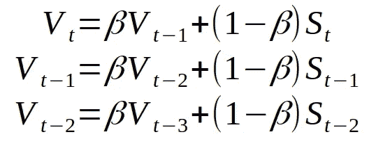
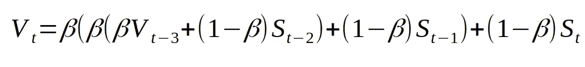
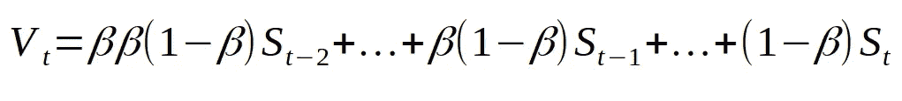
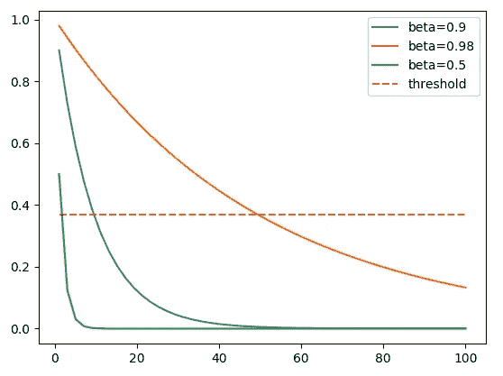
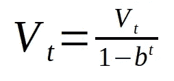
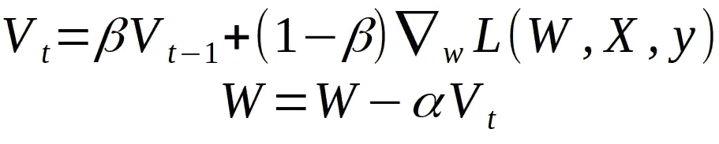
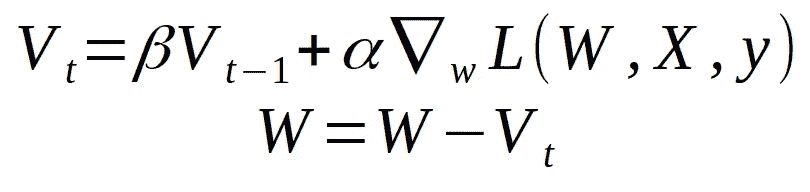
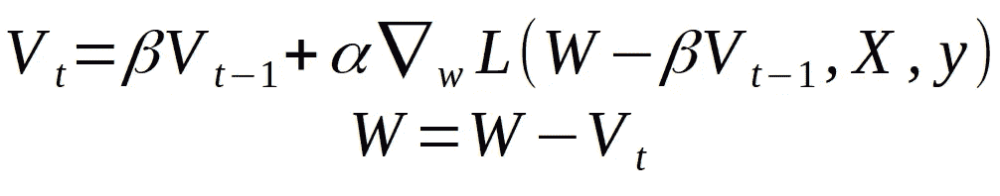
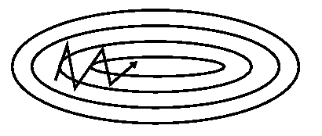

# 带动量的随机梯度下降

> 原文：<https://towardsdatascience.com/stochastic-gradient-descent-with-momentum-a84097641a5d?source=collection_archive---------2----------------------->

这是我关于用于训练神经网络和机器学习模型的优化算法系列的第 2 部分。[第一部分](/how-do-we-train-neural-networks-edd985562b73)讲的是随机梯度下降。在这篇文章中，我假设关于神经网络和梯度下降算法的基本知识。如果你对神经网络或者如何训练神经网络一无所知，在阅读这篇文章之前，请随意阅读我的第一篇文章。

在这篇文章中，我将讨论经典 SGD 算法的简单加法，叫做动量法，它几乎总是比随机梯度下降法更好更快。Momentum [1]或 SGD with momentum 是一种有助于在正确方向上加速梯度向量的方法，从而导致更快的收敛。它是最流行的优化算法之一，许多先进的模型都是用它来训练的。在跳到算法的更新方程之前，让我们看看动量功的数学基础。

# 指数加权平均值

指数加权平均值处理的是数字序列。假设，我们有一些有噪声的序列。对于这个例子，我绘制了余弦函数，并添加了一些高斯噪声。看起来是这样的:

Out sequence.

请注意，尽管这些点看起来非常接近，但它们都没有共享 *x* 坐标。对于每个点来说，这是一个唯一的数字。这个数字定义了序列中每个点的索引。

我们想对这些数据做的是，不是使用它，而是想要某种“移动”平均值，这将对数据进行“去噪”，并使其更接近原始函数。指数加权平均值可以给我们一个看起来像这样的图片:

momentum — data from exponentially weighed averages.

如你所见，这是一个非常好的结果。我们得到的不是有很多噪音的数据，而是更平滑的线，比我们得到的数据更接近原始函数。指数加权平均值用下面的等式定义了新的序列 V:

序列 V 就是上面标为黄色的那个。 *Beta* 是另一个超参数，取值从 0 到 1。上面我用了 *beta* = 0.9。这是一个很好的值，最常用于带动量的 SGD。直觉上，你可以把 *beta* 想成如下。我们对序列的最后*1/(1-β)*个点进行近似平均。让我们看看*β*的选择如何影响我们的新序列 v。

Exponentially weighed averages for different values of beta.

如您所见，beta 值越小，新序列的波动就越大，因为我们对更小数量的样本求平均，因此更接近噪声数据。β值越大，如*β= 0.98*，我们得到的曲线越平滑，但它会向右偏移一点，因为我们对大量的示例进行了平均(对于*β= 0.98*约为 50)。 *Beta = 0.9* 在这两个极端之间提供了一个很好的平衡。

# 数学部分

这一部分对于在你的项目中使用动量是不必要的，所以可以跳过它。但是它提供了更多关于动量如何工作的直觉。

让我们扩展新序列 v 的三个连续元素的指数加权平均值的定义。

V — New sequence. S — original sequence.

将所有这些结合在一起，我们得到:

然后稍微简化一下:

从这个等式中我们看到，新序列的第*个*号的值依赖于所有先前的值 *1..来自 S 的所有值都被赋予一定的权重。这个权重是 s 的第 *(t - i)* 个值的*beta*I*的幂乘以 *(1- beta)* ，因为 beta 小于 1，所以当我们将 beta 取某个正数的幂时，它会变得更小。因此，S 的旧值得到小得多的权重，因此对 v 的当前点的整体值的贡献更小。在某个点上，权重将变得如此之小，以至于我们几乎可以说我们“忘记”了该值，因为它的贡献变得小到无法注意到。当重量变得小于 *1 / e* 时，这是一个很好的近似值。更大的β值要求更大的功率值小于 *1 / e* 。这就是为什么β值越大，我们平均的点数就越多。下图显示了与 threshold = *1 / e* 相比，较旧的 S 值的权重变小的速度，在 threshold =*1/e*中，我们通常会“忘记”较旧的值。

最后要注意的是，前几次迭代将提供一个非常糟糕的平均值，因为我们还没有足够的值来平均。解决方法是不使用 V，我们可以使用 V 的偏差修正版本。

其中*b =β。t 的值很大时，b 的 t 次方与零没有区别，因此根本不会改变 V 的值。但是对于小 t 值，这个等式会产生稍微好一点的结果。有了动量，人们通常不会费心去实现这一部分，因为学习稳定得相当快。*

# 带动量的 SGD

我们已经定义了一种方法来获得一些序列的“移动”平均值，它随着数据一起变化。我们如何将此应用于训练神经网络？可以平均我们的梯度。我将在 momentum 中定义它是如何实现的，然后继续解释为什么它可能会更好。

我将给出 SGD 和动量的两种定义，它们几乎是写同一个方程的两种不同方式。首先，吴恩达在 coursera 上的深度学习专业课程中是如何定义它的。按照他的解释，我们定义了一个动量，它是我们梯度的移动平均值。然后我们用它来更新网络的权重。可以这样写:

其中 *L* —是损失函数，三角形物—梯度 w.r.t 权重， *alpha* —学习率。另一种方法是编写动量更新规则最流行的方法，它不太直观，只是省略了 *(1 - beta)* 项。

这与第一对等式非常相似，唯一的区别是你需要用 *(1 - beta)* 因子来衡量学习率。

# 内斯特罗夫加速梯度

**内斯特罗夫 Momentum** 是 Momentum 更新的一个略有不同的版本，最近越来越受欢迎。在这个版本中，我们首先看当前动量指向的点，并从该点计算梯度。当你看这幅画时，它变得清晰多了。

Source ([Stanford CS231n class](http://cs231n.github.io/neural-networks-3/))

内斯特罗夫动量可以用下面的公式来定义:

# 为什么动量起作用

在这一节中，我想谈一点为什么动量在大多数时候会比经典 SGD 更好。

对于随机梯度下降，我们不计算损失函数的精确导数。相反，我们是在小批量的基础上估算的。这意味着我们并不总是朝着最佳方向前进，因为我们的导数是“嘈杂的”。就像我上面的图表一样。因此，指数加权平均值可以为我们提供更好的估计，比我们嘈杂的计算更接近实际的导数。这就是为什么动量理论可能比经典 SGD 更有效的原因之一。

另一个原因在于沟壑。峡谷是这样一个区域，它的表面在一个维度上比在另一个维度上弯曲得更陡。深谷在深度学习的局部极小值附近是常见的，SGD 在导航它们时有困难。SGD 将倾向于在狭窄的峡谷中振荡，因为负梯度将指向陡峭的一侧，而不是沿着峡谷指向最优值。动量有助于加速正确方向的梯度。这表现在下面的图片中:

Left — SGD without momentum, right— SGD with momentum. (Source: [Genevieve B. Orr](https://www.willamette.edu/~gorr/classes/cs449/momrate.html))

# 结论

我希望这篇文章能给你一些直觉，让你知道 SGD 如何以及为什么有动力。它实际上是深度学习中最流行的优化算法之一，甚至比更高级的算法使用得更频繁。

下面我提供一些参考，在这里你可以学到更多关于深度学习中的优化。

# 参考

[1]钱宁。[关于梯度下降学习算法中的动量项](http://citeseerx.ist.psu.edu/viewdoc/download?doi=10.1.1.57.5612&rep=rep1&type=pdf)。神经网络:国际神经网络学会官方杂志，12(1):145–151，1999

【2】提炼，[为什么动量真的起作用](https://distill.pub/2017/momentum/)

[3] deeplearning.ai

[4] **鲁德** (2016)。[梯度下降优化算法概述](https://arxiv.org/abs/1609.04747)。arXiv 预印本 arXiv:1609.04747

[5] Ruder (2017) [深度学习优化 2017 年亮点](http://ruder.io/deep-learning-optimization-2017/index.html)。

[6] [斯坦福 CS231n 讲义](http://cs231n.github.io/neural-networks-3/)。

【7】[fast . ai](http://fast.ai)