# Python 中的股票分析

> 原文：<https://towardsdatascience.com/stock-analysis-in-python-a0054e2c1a4c?source=collection_archive---------0----------------------->


**使用面向对象编程和附加模型探索财务数据**

人们很容易被大量的数据和可用于数据科学的免费开源工具冲昏头脑。在花了一点时间在 [quandl 金融库](https://www.quandl.com/tools/python)和[先知建模库](https://facebook.github.io/prophet/docs/quick_start.html)之后，我决定尝试一些简单的股票数据探索。几天和 1000 行 Python 代码之后，我完成了一个完整的股票分析和预测工具。虽然我没有足够的信心[(或愚蠢)](http://www.businessinsider.com/foolish-advice-about-selling-stocks-2013-1)用它来投资个股，但在这个过程中，我学习了大量 Python，本着开源的精神，我想分享我的成果和代码，这样其他人也可以受益。


Now more than ever

本文将展示如何使用 Stocker，这是一个基于 Python 类的股票分析和预测工具(这个名称最初是随意取的，但我后来决定它很好地代表了“股票浏览器”)。我曾几次试图攻克类，这是 Python 中面向对象编程的基础，但是和大多数编程主题一样，当我阅读这些书籍时，它们对我来说从来没有什么意义。只有当我深入一个项目，面对一个我以前没有解决的问题时，这个概念才最终实现，这再一次表明经验胜过理论解释！除了探索 Stocker 之外，我们还将触及一些重要的主题，包括 Python 类和附加模型的基础知识。对于任何想使用 Stocker 的人来说，[完整的代码可以在 GitHub](https://github.com/WillKoehrsen/Data-Analysis/tree/master/stocker) 上找到，还有使用文档。Stocker 被设计得易于使用(即使对于那些 Python 新手来说也是如此)，我鼓励任何人去尝试一下。现在，我们来看看 Stocker 的分析能力！

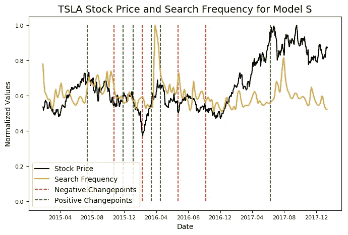

# **储料器入门**

在安装了所需的库之后，我们要做的第一件事就是将 Stocker 类导入到我们的 Python 会话中。我们可以从交互式 Python 会话或 Jupyter 笔记本中使用脚本启动目录来完成这项工作。

```
from stocker import Stocker
```

现在我们的 Python 会话中有了 Stocker 类，我们可以用它来创建该类的一个实例。[在 Python 中，类](https://docs.python.org/3/tutorial/classes.html)的实例被称为对象，创建对象的行为有时被称为实例化或构造。为了创建一个 Stocker 对象，我们需要传入一个[有效股票代码](http://www.nasdaq.com/screening/company-list.aspx) ( **粗体**表示输出)。

```
microsoft = Stocker('MSFT')**MSFT Stocker Initialized. Data covers 1986-03-13 to 2018-01-16.**
```

现在，我们有了一个包含 Stocker 类所有属性的`microsoft`对象。Stocker 是建立在 quandl WIKI 数据库上的，该数据库让我们可以访问超过 3000 只美国股票的多年每日价格数据。对于这个例子，我们将坚持使用微软的数据。尽管微软可能被视为开源的对立面，但他们最近做出了一些让我乐观的改变，他们正在拥抱开源社区(包括 Python)。

Python 中的类由两个主要部分组成:[属性和方法](https://jeffknupp.com/blog/2014/06/18/improve-your-python-python-classes-and-object-oriented-programming/)。不涉及太多细节，属性是与整个类或者与该类的特定实例(对象)相关联的值或数据。方法是包含在类中的函数，可以作用于数据。Stocker 对象的一个属性是特定公司的股票数据，当我们构造它时，这个属性与对象相关联。我们可以访问该属性，并将其赋给另一个变量进行检查:

```
# Stock is an attribute of the microsoft object
stock_history = microsoft.stock
stock_history.head()
```

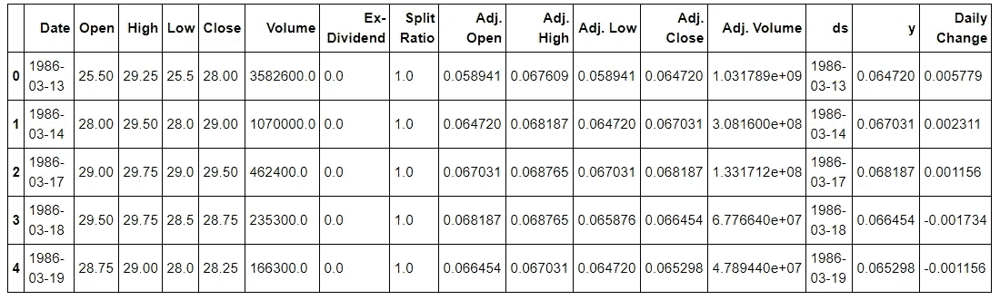

Microsoft Stock Data

Python 类的好处是方法(函数)和它们作用的数据与同一个对象相关联。我们可以使用 Stocker 对象的方法来绘制股票的整个历史。

```
# A method (function) requires parentheses
microsoft.plot_stock()**Maximum Adj. Close = 89.58 on 2018-01-12.
Minimum Adj. Close = 0.06 on 1986-03-24.
Current Adj. Close = 88.35.**
```

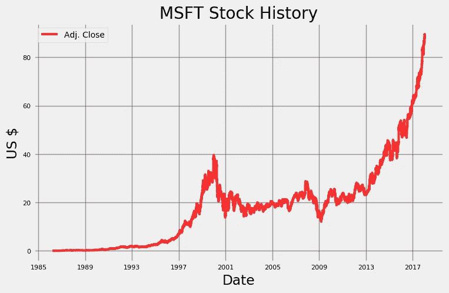

绘制的默认值是调整后的收盘价，它考虑了股票的分割(当[一只股票分割成多只股票](https://www.investopedia.com/terms/s/stocksplit.asp)时，比如说 2 只，每只新股票的价值是原价的 1/2)。

这是一个非常基本的情节，我们可以从谷歌搜索中找到，但用几行 Python 代码自己完成也有令人满意的地方！`plot_stock`函数有许多可选参数。默认情况下，该方法绘制整个日期范围的调整后收盘价，但我们可以选择范围、要绘制的统计数据和绘制类型。例如，如果我们想将价格的每日变化与调整后的交易量(股票数量)进行比较，我们可以在函数调用中指定它们。

```
microsoft.plot_stock(start_date = '2000-01-03',  end_date = '2018-01-16',  stats = ['Daily Change', 'Adj. Volume'],  plot_type='pct')**Maximum Daily Change = 2.08 on 2008-10-13.
Minimum Daily Change = -3.34 on 2017-12-04.
Current Daily Change = -1.75.

Maximum Adj. Volume = 591052200.00 on 2006-04-28.
Minimum Adj. Volume = 7425503.00 on 2017-11-24.
Current Adj. Volume = 35945428.00.**
```

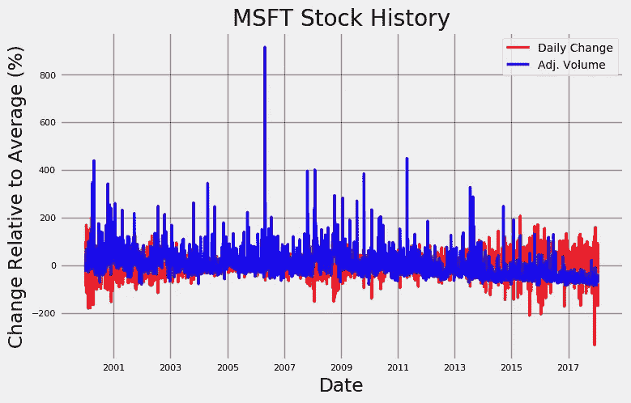

请注意，y 轴是相对于统计平均值的百分比变化。这种规模是必要的，因为每天的交易量最初是以股票为单位的，范围在数亿股，而每天的价格变化通常是几美元！通过转换为百分比变化，我们可以在相似的范围内查看两个数据集。该图显示，交易的股票数量和每日价格变化之间没有相关性。这是令人惊讶的，因为我们可能预计在价格变化较大的日子里会有更多的股票交易，因为人们急于利用波动。然而，唯一真实的趋势似乎是交易量随着时间的推移而减少。2017 年 12 月 4 日的价格也有显著下降，我们可以尝试将这与关于微软的新闻报道联系起来。快速搜索 12 月 3 日的新闻会得到以下结果:

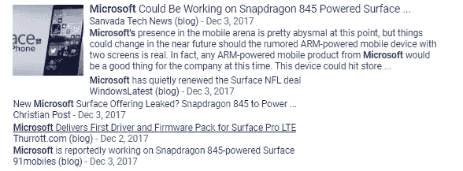

Not sure about the reliability of these sources Google

当然，似乎没有任何迹象表明微软股票将在第二天出现 10 年来最大的价格下跌！事实上，如果我们根据新闻来玩股票市场，我们可能会被诱惑去买股票，因为与 NFL 的交易(第二个结果)听起来是积极的！

使用`plot_stock`，我们可以调查任何日期范围内数据中的任何数量，并寻找与现实世界事件的相关性(如果有的话)。现在，我们将转移到 Stocker 更有趣的部分:制造假币！

让我们假设在[公司首次公开募股](https://techcrunch.com/2017/08/08/a-look-back-in-ipo-microsoft-the-software-success/)(首次公开募股)时，我们镇定自若地投资了 100 股微软股票。我们现在会有多富有？

```
microsoft.buy_and_hold(start_date='1986-03-13', 
                       end_date='2018-01-16', nshares=100)**MSFT Total buy and hold profit from 1986-03-13 to 2018-01-16 for 100 shares = $8829.11**
```

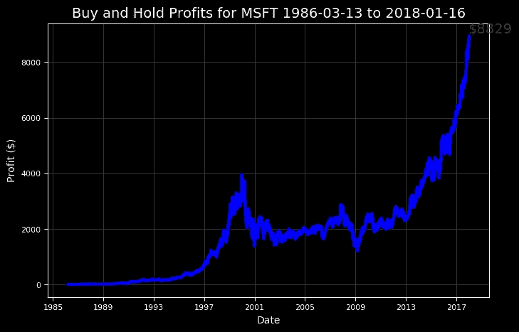

除了让我们感觉更好，使用这些结果将允许我们及时计划我们的旅行，以实现利润最大化。

如果我们感觉过于自信，我们可以试着调整结果来赔钱:

```
microsoft.buy_and_hold(start_date='1999-01-05', 
                      end_date='2002-01-03', nshares=100)**MSFT Total buy and hold profit from 1999-01-05 to 2002-01-03 for 100 shares = $-56.92**
```

出人意料的是，在股市上有可能亏钱！

# 加法模型

加法模型是分析和预测时间序列的强大工具，时间序列是现实世界中最常见的数据类型之一。这个概念很简单:[将时间序列表示为不同时间尺度上的模式和总体趋势的组合。](https://research.fb.com/prophet-forecasting-at-scale/)我们知道微软股票的长期趋势是稳步上涨，但也可能存在以年或日为基础的模式，例如每周二上涨，了解这一点将有利于经济发展。由脸书开发的 Prophet 是一个很好的库，用于分析每日观察的时间序列(比如股票)。Stocker 在幕后使用 Prophet 为我们完成所有建模工作，因此我们可以使用一个简单的方法调用来创建和检查模型。

```
model, model_data = microsoft.create_prophet_model()
```

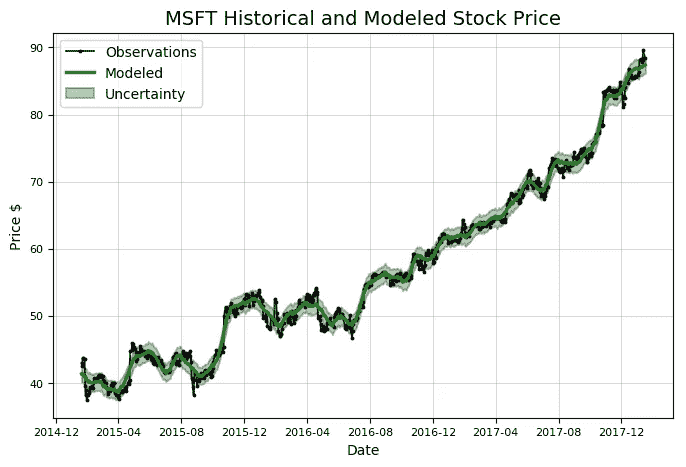

加性模型消除了数据中的噪声，这就是为什么模型线与观测值不完全一致的原因。Prophet 模型还计算不确定性，这是建模的一个重要部分，因为在处理波动的现实生活过程时，我们永远无法确定我们的预测。我们也可以使用先知模型来预测未来，但目前我们更关心过去的数据。注意，这个方法调用返回了两个对象，一个模型和一些数据，我们将它们赋给了变量。我们现在使用这些变量来绘制时间序列的组成部分。

```
# model and model_data are from previous method call
model.plot_components(model_data)
plt.show()
```

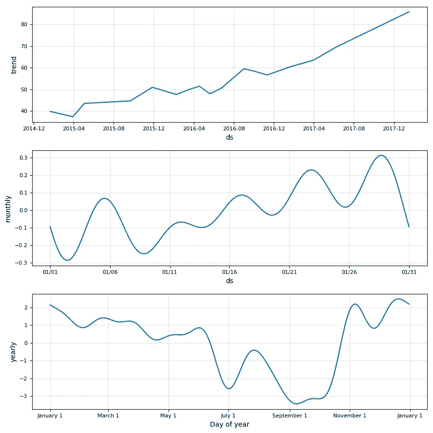

过去三年来，总体趋势是明确的增长。似乎还有一个值得注意的年度模式(下图)，价格在 9 月和 10 月触底，在 11 月和 1 月达到峰值。随着时间尺度的减小，数据变得更加嘈杂。在一个典型的月份里，信号比噪音多。如果我们认为可能有一个周模式，我们可以通过更改 Stocker 对象的`weekly_seasonality`属性将它添加到 prophet 模型中:

```
print(microsoft.weekly_seasonality)
microsoft.weekly_seasonality = True
print(microsoft.weekly_seasonality)**False 
True**
```

`weekly_seasonality`的默认值是 False，但是我们更改了该值，在模型中包含了一个周模式。然后，我们再次调用`create_prophet_model`,并用图形表示结果组件。以下是新模型的每周季节性。

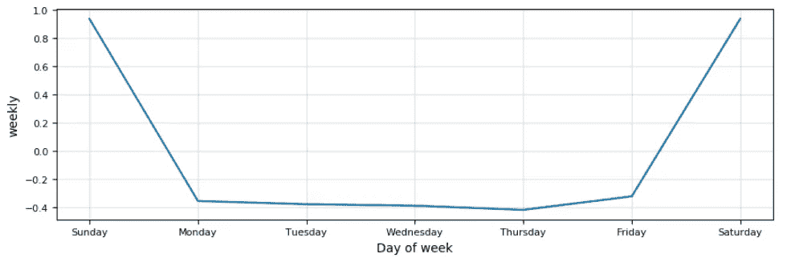

There was no way I could make this graph look good

我们可以忽略周末，因为价格只在一周内变化(实际上，价格在[下班后培训](https://www.investopedia.com/terms/a/afterhourstrading.asp)期间有少量变化，但不影响我们的分析)。不幸的是，没有一周的趋势可供我们使用，在我们继续建模之前，我们将关闭每周季节性。这种行为是意料之中的:对于股票数据，随着时间尺度的减小，噪声开始淹没信号。日复一日，股票的走势基本上是随机的，只有缩小到年度规模，我们才能看到趋势。希望这能很好地提醒你为什么不玩每日股票游戏！

# 变革点

当时间序列从增加到减少或从减少到增加(更严格地说，它们位于时间序列比率的[变化最大的地方)](https://facebook.github.io/prophet/docs/trend_changepoints.html)。这些时间是非常重要的，因为知道一只股票什么时候会达到顶峰或将要起飞可能会带来巨大的经济利益。识别转折点的原因可能会让我们预测股票价值的未来波动。Stocker 对象可以自动为我们找到 10 个最大的变化点。

```
microsoft.changepoint_date_analysis()**Changepoints sorted by slope rate of change (2nd derivative):

          Date  Adj. Close     delta
48  2015-03-30   38.238066  2.580296
337 2016-05-20   48.886934  2.231580
409 2016-09-01   55.966886 -2.053965
72  2015-05-04   45.034285 -2.040387
313 2016-04-18   54.141111 -1.936257**
```

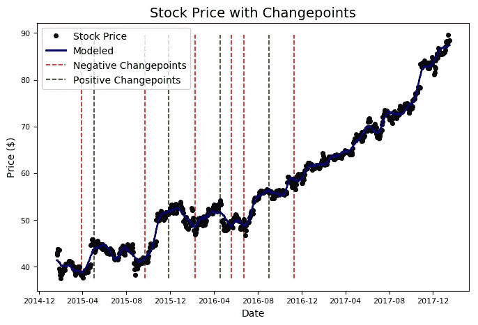

转折点往往与股价的波峰和波谷一致。Prophet 只在前 80%的数据中找到变化点，但是尽管如此，这些结果还是很有用的，因为我们可以尝试将它们与现实世界的事件联系起来。我们可以重复之前所做的，在这些日期手动搜索谷歌新闻，但我认为如果斯托克为我们这样做会更好。你可能见过[谷歌搜索趋势](https://trends.google.com/trends/)工具，它可以让你看到任何搜索术语在谷歌搜索中的流行程度。Stocker 可以自动检索我们指定的任何搜索项的数据，并在原始数据上绘制结果。为了找到并绘制搜索词的频率，我们修改了前面的方法调用。

```
# same method but with a search term
microsoft.changepoint_date_analysis(search = 'Microsoft profit')**Top Related Queries: 

                  query  value
0  microsoft non profit    100
1      microsoft office     55
2                 apple     30
3         microsoft 365     30
4  microsoft office 365     20

 Rising Related Queries: 

                   query  value
0          microsoft 365    120
1   microsoft office 365     90
2  microsoft profit 2014     70**
```

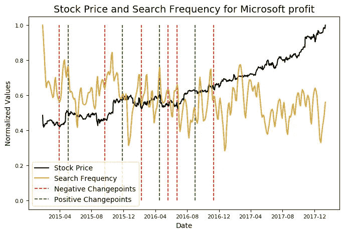

除了绘制相对搜索频率的图表之外，Stocker 还显示了图表日期范围内排名靠前的相关查询和排名靠前的上升查询。在图中，y 轴通过将值除以其最大值而在 0 和 1 之间标准化，从而允许我们比较不同标度的两个变量。从图中可以看出，搜索“微软利润”和微软股票价格之间似乎没有关联。

如果我们发现了相关性，那么还会有因果关系的问题。我们不知道是搜索还是新闻导致了价格的变化，或者是价格的变化导致了搜索。可能会发现一些有用的信息，但也有许多偶然的关联。(关于这种随机关系的幽默，请看[的虚假关联](http://www.tylervigen.com/spurious-correlations)。请随意尝试一些不同的术语，看看您是否能发现任何有趣的趋势！

```
microsoft.changepoint_date_analysis(search = 'Microsoft Office')
```

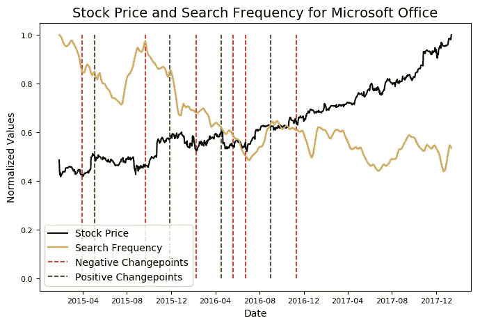

看起来 Office 搜索量的下降导致了股价的上涨。也许应该有人让微软知道。

# 预言

我们只探索了 Stocker 功能的前半部分。后半部分用于预测，或预测未来的股票价格。虽然这可能是徒劳的(或者至少不会有回报)，但在这个过程中仍然有很多东西要学！请继续关注未来关于预测的文章，或者自己开始使用 Stocker 进行预测(查看[文档了解详情](https://github.com/WillKoehrsen/Data-Analysis/tree/master/stocker))。现在，我再给你们看一张图片。

```
# specify number of days in future to make a prediction
model, future = microsoft.create_prophet_model(days=180)**Predicted Price on 2018-07-15 = $97.67**
```

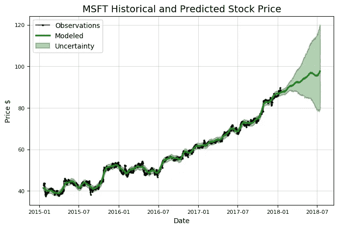

尽管 Stocker 的所有功能可能已经公开可用，但创建这个工具的过程是令人愉快的，更重要的是，它教会了我比任何大学课程都多的关于数据科学、Python 和股票市场的知识。我们生活在一个知识民主化的不可思议的时代，任何人都可以在没有正式指导的情况下学习关于编程的知识，甚至是像机器学习这样的艺术领域。如果你有一个项目的想法，但认为你知道得不够多，或者发现以前有人做过，不要让这阻止你。你可能会开发出一个更好的解决方案，即使你没有，你也会比你从未开始时过得更好，知道得更多！

一如既往，我欢迎建设性的批评和反馈。可以在推特上找到我，电话是 [@koehrsen_will](https://twitter.com/koehrsen_will) 。