# Python 中的股票市场分析

> 原文：<https://towardsdatascience.com/stock-market-analysis-in-python-part-1-getting-data-by-web-scraping-cb0589aca178?source=collection_archive---------2----------------------->

## 第 1 部分:通过 Web 抓取获取数据

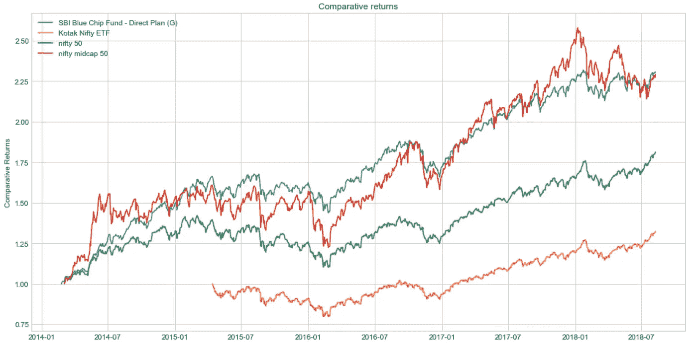

Staying Invested! What was your gain?

自 2013 年以来，全球股市经历了一轮壮观的牛市。在印度，许多公司增长了 10 倍以上。即使是行业领导者，nifty 50 或印度 50 强公司也增长了两倍以上。2017 年，Nifty 50 的年增长率(或回报率)超过 20%，2018 年的趋势似乎也是如此。人们正在投资共同基金和交易所交易基金来跟随这一趋势。

在这种情况下，我们似乎应该更多地投资股票，但如果你看看新闻，你会发现大多数市场分析师都认为目前的市场投资非常昂贵。那么，我们是相信他们的话，还是自己做一些数据分析来找出答案呢？我们如何在一个被高度高估的市场中找到好公司？这是又一次类似比特币/加密货币泡沫的炒作吗？

在这一系列教程中，我们将使用 python 来找出答案。

在第 1 部分中，我们学习如何获取数据。在第 2 部分中，我们将看看如何进行分析。

在本教程(第 1 部分)中，我们将学习

*   通过请求库在 python 中发出 http 请求。
*   使用 chrome 开发工具来查看数据在页面上的位置。
*   使用 BeautifulSoup 库，当数据无法以结构化形式获得时，从下载的页面中抓取数据。
*   将表等数据解析为 python 2D 数组。
*   抓取功能以字典的形式获取数据(键-值对)。

这里需要的 Jupyter 笔记本是[这里是](https://github.com/faizanahemad/data-science-utils/blob/master/data_science_utils/financial/Web%20Scraping%20and%20Financial%20Data%20Exploration%20in%20Python-Tutorial.ipynb)。

# 设置

1.  通过安装[蟒蛇](https://www.anaconda.com/download/)来安装 Jupyter 笔记本。关于在 Linux 服务器上安装，参见我的[上一篇文章](https://medium.com/@faizanahemad/participating-in-kaggle-data-science-competitions-part-1-step-by-step-guide-and-baseline-model-5b0c6973022a)。
2.  确保除了 Anaconda 的默认包集之外，还安装了以下 python 包。

```
beautifulsoup4
fastnumbers
dill
```

3.启动一个 python 3 jupyter 笔记本并添加以下导入。

```
**import** numpy **as** np *# linear algebra*
**import** pandas **as** pd *# pandas for dataframe based data processing and CSV file I/O***import** requests *# for http requests*
**from** bs4 **import** BeautifulSoup *# for html parsing and scraping* **import** bs4**from** fastnumbers **import** isfloat 
**from** fastnumbers **import** fast_float
**from** multiprocessing.dummy **import** Pool **as** ThreadPool 

**import** matplotlib.pyplot **as** plt
**import** seaborn **as** sns
**import** json
**from** tidylib **import** tidy_document *# for tidying incorrect html*

sns.set_style('whitegrid')
%matplotlib inline
**from** IPython.core.interactiveshell **import** InteractiveShell
InteractiveShell.ast_node_interactivity = "all"
```

现在我们准备好开始了。如果有任何困难，请查看我在 Github 上的 [jupyter 笔记本。](https://github.com/faizanahemad/data-science-utils/blob/master/data_science_utils/financial/Web%20Scraping%20and%20Financial%20Data%20Exploration%20in%20Python-Tutorial.ipynb)

# 我们收集数据时需要的一些实用程序

## 字符串到浮点的转换

网页中的很多数字都是用逗号和%符号组成的字符串。我们使用 [fastnumbers](https://pypi.org/project/fastnumbers/) 库中的`fast_float`函数。

```
**def** ffloat(string):
    **if** string **is** **None**:
        **return** np.nan
    **if** type(string)==float **or** type(string)==np.float64:
        **return** string
    **if** type(string)==int **or** type(string)==np.int64:
        **return** string
    **return** fast_float(string.split(" ")[0].replace(',','').replace('%',''),
                      default=np.nan)
```

我们检查输入是否已经是 float/int，然后返回相同的值，否则删除逗号和%,然后转换。

另一个函数来完成字符串列表的转换

```
**def** ffloat_list(string_list):
    **return** list(map(ffloat,string_list))
```

## 从字符串中删除多个空格

当从网页中提取文本时，一些字符串在单词之间有多个空格，以保持一致性。

```
**def** remove_multiple_spaces(string):
    **if** type(string)==str:
        **return** ' '.join(string.split())
    **return** string
```

# 用 Python 发出 Http 请求

为此，我们将使用 python 请求库。您需要知道您将请求的页面的 url。

使用方法`requests.get`发出请求，我们用`response.status_code`和`response.content`分别获取 http 状态和页面内容

```
response **=** requests.get("http://www.example.com/", timeout=240)
response**.**status_code
response**.**content
```

请注意，requests library 并不在页面上运行 javascript，因此在通过 javascript 加载 html 内容之后获取的任何数据/内容都将不可用。这不是一个问题，因为大多数金融网站通常遵循服务器端脚本，并向客户发送完整的页面。

## 获取 Json 内容并解析它

要从页面中获取 json 内容，只需做`response.json()`

```
url **=** "**https://jsonplaceholder.typicode.com/posts/1**"
response **=** requests.get(url, timeout=240)
response.status_code
response.json()

content **=** page_response.json()
content.keys()
```

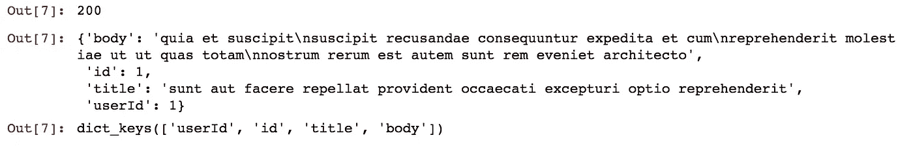

Json Response

为了确保您的请求成功，请务必检查`response.status_code`。

# 通过解析和遍历 HTML 抓取数据

我们将使用 beautifulsoup4 库将 html 字符串解析成树状表示。

## 在 Jupyter 笔记本中呈现 HTML 字符串

```
**from** **IPython.core.display** **import** HTML
HTML("**<b>Rendered HTML</b>**")
```

## 使用 Chrome 检查器(开发工具)获取内容的位置

我们将会看到这个网址:[https://www . money control . com/India/stockprice quote/auto-2-3-wheelers/hero moto corp/HHM](https://www.moneycontrol.com/india/stockpricequote/auto-2-3-wheelers/heromotocorp/HHM)

这是一家在印度生产摩托车的公司的网页。请查看该页面。


Snapshot of the link

现在，要从页面中获取任何内容，您需要知道内容在 HTML 中的位置。所以首先我们会得到标题(“Hero Motocorp Ltd .”)。让我们用 Chrome inspector 检查页面。要在 mac 上使用 chrome inspector，请使用`cmd+option+i`，在 windows 和 linux 上使用`Control+Shift+I`。

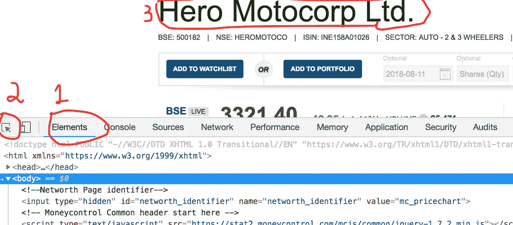

Using inspector

打开 chrome inspector ->点击元素(1) ->点击光标框项目(2) ->指向“Hero Motocorp Ltd .”然后点击。

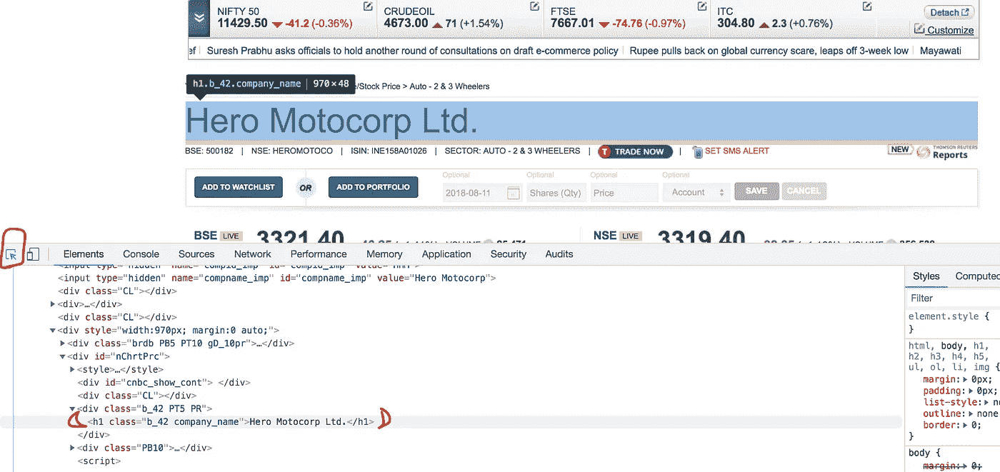

Finding element location

如您所见，公司名称在

# 标签中。接下来，我们看看如何在笔记本中获取这些内容。

## 使用 BeautifulSoup4 解析和显示内容

为此，我们需要获得响应，然后使用`BeautifulSoup`类解析内容。最后，我们从< h1 >标签中获取内容并呈现出来。

```
response **=** requests.get("[**https://www.moneycontrol.com/india/stockpricequote/auto-2-3-wheelers/heromotocorp/HHM**](https://www.moneycontrol.com/india/stockpricequote/auto-2-3-wheelers/heromotocorp/HHM)", timeout=240)
page_content = **BeautifulSoup**(response.content, "**html.parser**")
HTML(**str**(page_content.find("**h1**")))
```

## 通过属性获取 HTML 元素

我们将在 id 为“b_changetext”的

中获取当天的价格变化。为此，您只需将一个`attrs`对象传递给`page_content.find`

```
response = requests.get("[**https://www.moneycontrol.com/india/stockpricequote/auto-2-3-wheelers/heromotocorp/HHM**](https://www.moneycontrol.com/india/stockpricequote/auto-2-3-wheelers/heromotocorp/HHM)", timeout=240)
content = BeautifulSoup(response.content, "**html.parser**")price_div = content.find("**div**",attrs={"**id**":'**b_changetext**'})
HTML(str(price_div))
```

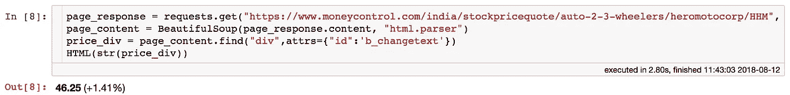

Output of price getter code

find 的一些其他变体如下

```
content.find_all("p")
content.find_next("p",attrs={"class":"my-id"})
```

`.find_all`查找页面中出现的所有给定规格。`.find_next`查找下一个事件。一旦你有了元素，你可以做`.text`来获得它的文本内容(浏览器 DOM 的`innerText`)。

```
elem = content.find("p",attrs={"class":"my-id"})
text = elem.text
```

## 获取子元素

要找到一个元素(通过上述方法找到的元素)的子元素，你需要对这个元素做`.children`。这将给你一个可以在循环中使用的 iterable。

```
list(price_div.children)
```

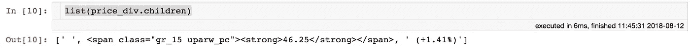

getting children of element

正如你在上面看到的,`.children`给了你 3 个孩子，其中第一个是除了空间什么都没有的元素。我们将创建一个函数来过滤它，只给我们适当的元素。解析后页面上的任何实际元素都由`bs4.element.Tag`类型表示。我们删除任何只有空格或换行符的字符串，除非它们包含在标签元素中。

```
**def** get_children(html_content):
    **return** [item **for** item **in** html_content.children **if** type(item)==bs4.element.Tag **or** len(str(item).replace("**\n**","").strip())>0]
```

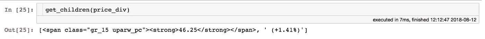

Get children filter function output

## 解析表格

到目前为止，我们已经学会了如何从单个元素中找到我们需要的数据。但是桌子呢？每次一个单元格一个单元格地遍历表格来查找必要的信息将会非常麻烦。注意，可以使用标签创建表格，也可以使用其他标签在 html 中创建类似表格的结构，我们将学习解析这两种类型。

因此，我们将创建一个函数，帮助以 2D 数组格式从表中获取表格数据。

首先，我们创建一个表格并显示它。

```
html = '''
**<table>
    <tr>
        <td>Month</td>
        <td>Price</td>
    </tr>
    <tr>
        <td>July</td>
        <td>2</td>
    </tr>
    <tr>
        <td>August</td>
        <td>4</td>
    </tr>
    <tr>
        <td>September</td>
        <td>3</td>
    </tr>
    <tr>
        <td>October</td>
        <td>2</td>
    </tr>
</table>**'''HTML(html)
```

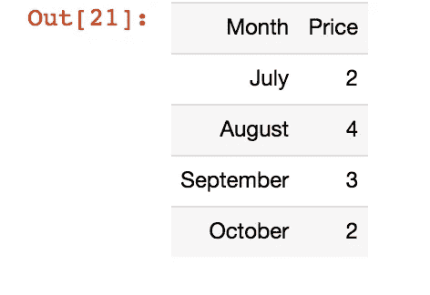

Table to be parsed

在实际实现之前，让我用伪代码解释一下解析过程

```
Step 1: Initialise final **row_data** as empty list.
Step 2: Get all rows in a list
Step 3: **For** each row in the list of rows
        - Initialise **current_row_data** as empty list
        - Get a list of cells in the row.
        - **For** each cell get its text content
          # **if** no text content present skip to next cell 
          # **else** put the text content into **current_row_data
        -** Put **current_row_data** into **row_data** Step 4: return **row_data**
```

以下 python 函数实现了这些步骤。我们将使用它来解析前面的表。

```
**def** *get_table_simple*(table,is_table_tag=**True**):
    elems = table.find_all('tr') **if** is_table_tag **else** get_children(table)
    table_data = list()
    **for** row **in** elems:
        row_data = list()
        row_elems = get_children(row)
        **for** elem **in** row_elems:
            text = elem.text.strip().replace("**\n**","")
            text = remove_multiple_spaces(text)
            **if** ***len***(text)==0:
                **continue**
            row_data.append(text)
        table_data.append(row_data)
    **return** table_data
```

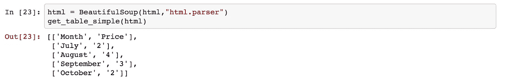

Using get_table_simple

让我们看看它是否能解析另一种类型的表。用

而不是标签创建的。

```
html = '''
<html>
<body>
<div id="table" class="FL" style="width:210px; padding-right:10px">
    <div class="PA7 brdb">
        <div class="FL gL_10 UC">MARKET CAP (Rs Cr)</div>
        <div class="FR gD_12">63,783.84</div>
        <div class="CL"></div>
    </div>
    <div class="PA7 brdb">
        <div class="FL gL_10 UC">P/E</div>
        <div class="FR gD_12">17.27</div>
        <div class="CL"></div>
    </div>
    <div class="PA7 brdb">
        <div class="FL gL_10 UC">BOOK VALUE (Rs)</div>
        <div class="FR gD_12">589.29</div>
        <div class="CL"></div>
    </div>
    <div class="PA7 brdb">
        <div class="FL gL_10 UC">DIV (%)</div>
        <div class="FR gD_12">4750.00%</div>
        <div class="CL"></div>
    </div>
    <div class="PA7 brdb">
        <div class="FL gL_10 UC">Market Lot</div>
        <div class="FR gD_12">1</div>
        <div class="CL"></div>
    </div>
    <div class="PA7 brdb">
        <div class="FL gL_10 UC">INDUSTRY P/E</div>
        <div class="FR gD_12">19.99</div>
        <div class="CL"></div>
    </div>
</div>
</body>
</html>
'''
HTML(html)content = BeautifulSoup(html,"html.parser")
get_table_simple(content.find("div",attrs={"id":"table"}),is_table_tag=**False**)
```

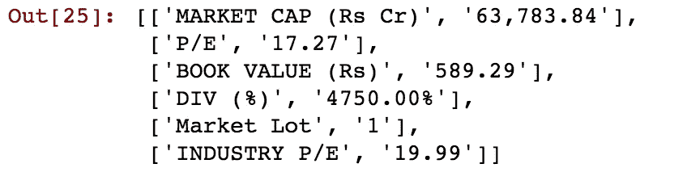

Parsed 2D table in python

如你所见，它也成功地解析了这个。

# 把它放在一起

让我们看看页面上我可以获取数据的地方。

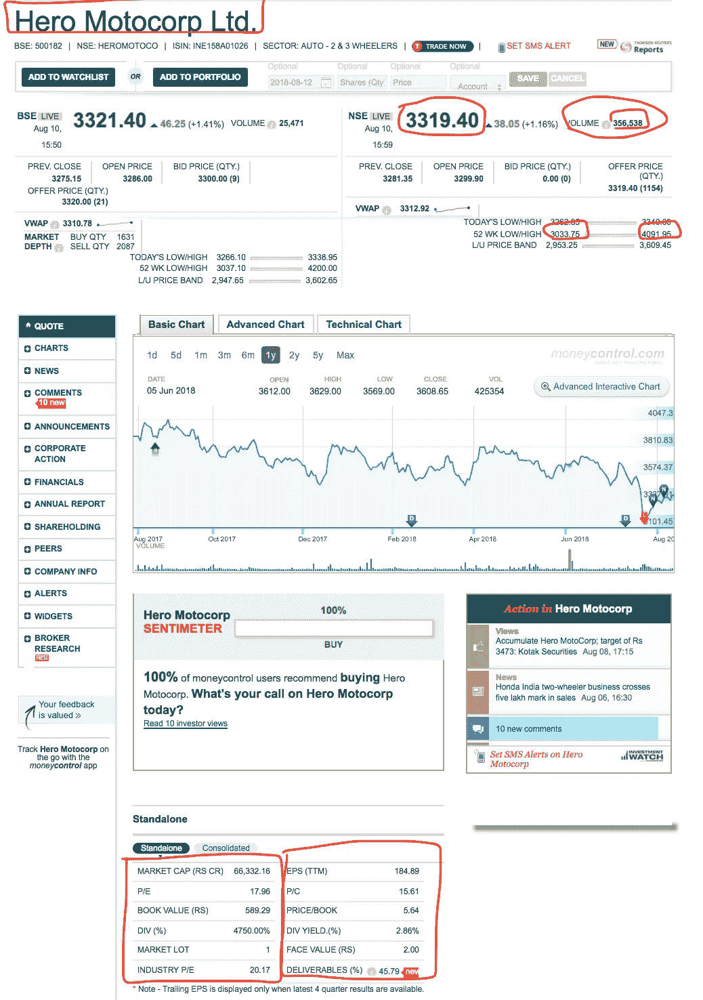

data locations

我使用 chrome 开发工具检查了这些区域，并找到了正确的 id。对于下面的两个大框，我使用了我们之前写的`get_table_simple`函数。分步过程如下

```
Step 1: Get page content using requests
Step 2: Parse page content using BeautifulSoup
Step 3: Use chrome dev tool to find id of each highlighted block
Step 4: Get Price and yearly low, high.
Step 5: Get the lower two boxes enclosing tag.
Step 6: 1st box is 1st child, parse it as table.
Step 7: 2nd box is 2nd child, parse it as table.
Step 8: Combine the tables into a single dict named **collector**.
Step 9: Populate the final dict **key_val_pairs.**
```

最后一个函数如下。

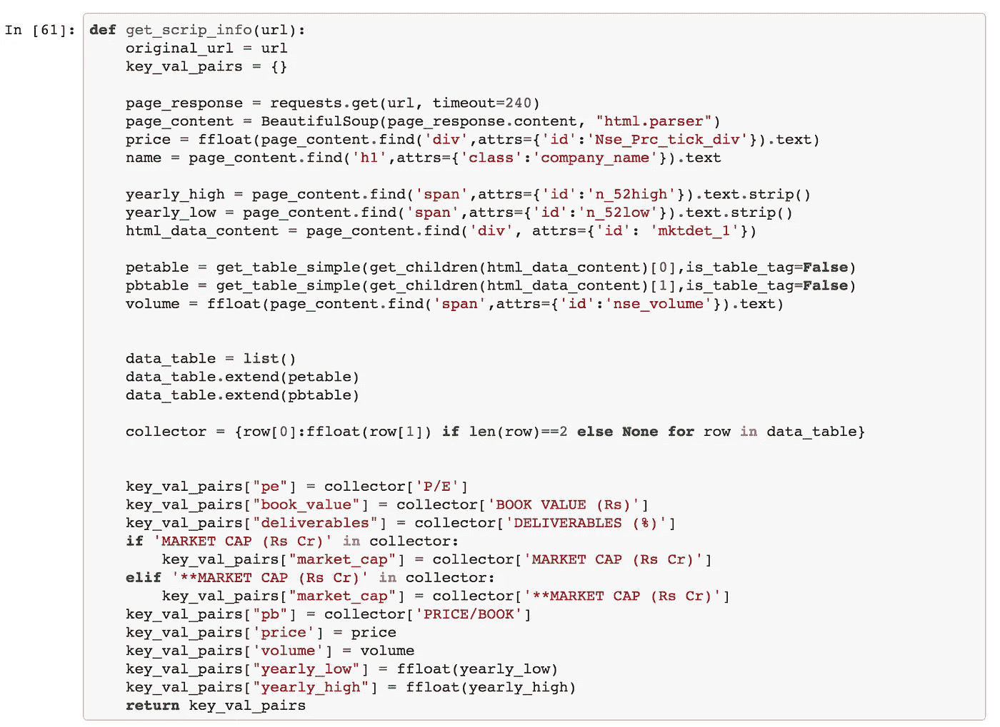

Final Scrapping Function

为了使用这个函数，我们将页面 url 传递给它。

```
get_scrip_info("**https://www.moneycontrol.com/india/stockpricequote/auto-2-3-wheelers/heromotocorp/HHM**")
```

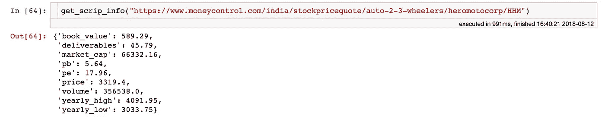

Final Data from Scraping.

# 我们下一步能做什么？

*   按 NSE 脚本名做搜索功能查找。(就像苹果是 APPL 一样，印度股票也有简称)
*   获取过去的价格以分析回报
*   处理 html 不正确的页面(没有语法正确的 html 的页面，浏览器会纠正它们，然后呈现，但是抓取它们会很困难)。
*   简单的地图操作并行化，加快抓取速度。
*   使用 dill 或 pickle 库存储抓取数据的快照。
*   使用各种图探索股票数据，如年度回报和价格偏差。
*   比较 Nifty 50、Nifty 100 和 Nifty Mid-cap 50 等指数的相互表现。ETF 跟踪指数，因此如果你投资 ETF，你需要了解指数的表现。
*   以市盈率、市净率等方式选股。

我将在以后的教程中介绍这些内容。

[笔记本链接供参考。](https://github.com/faizanahemad/data-science-utils/blob/master/data_science_utils/financial/Web%20Scraping%20and%20Financial%20Data%20Exploration%20in%20Python-Tutorial.ipynb)

# 参考

[](https://developers.google.com/web/tools/chrome-devtools/shortcuts) [## 键盘快捷键参考 Web 开发人员工具| Google 开发人员

### Chrome DevTools 中所有快捷键的参考。

developers.google.com](https://developers.google.com/web/tools/chrome-devtools/shortcuts) [](https://ntguardian.wordpress.com/2016/09/19/introduction-stock-market-data-python-1/) [## 用 Python 进行股票市场数据分析的介绍(第 1 部分)

### 这篇文章是过时的:这篇文章信息的更新在这里的链接！(我还打赌 WordPress.com…

ntguardian.wordpress.com](https://ntguardian.wordpress.com/2016/09/19/introduction-stock-market-data-python-1/) [](https://mapattack.wordpress.com/2017/02/14/python-for-stocks-2/) [## 用于股票的 Python

### 这是我上一篇文章的延续，这一次我们将做更多的图表来寻找多重…

mapattack.wordpress.com](https://mapattack.wordpress.com/2017/02/14/python-for-stocks-2/)