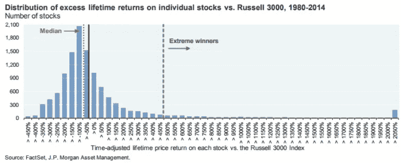
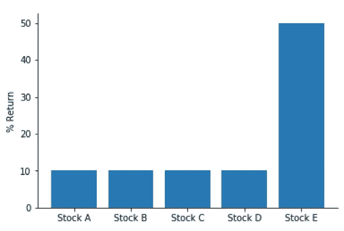
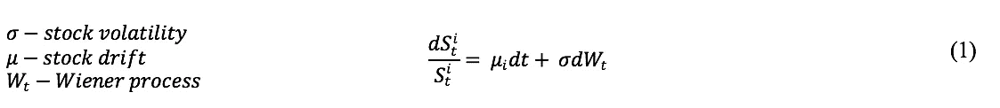
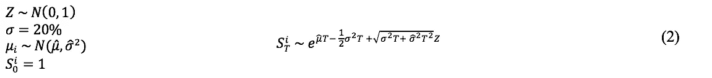
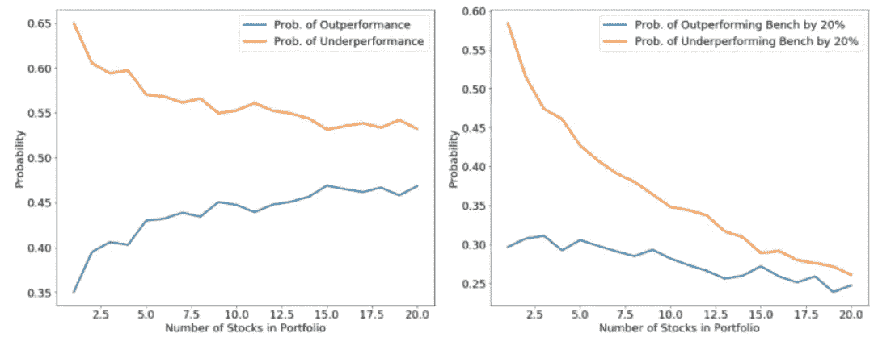
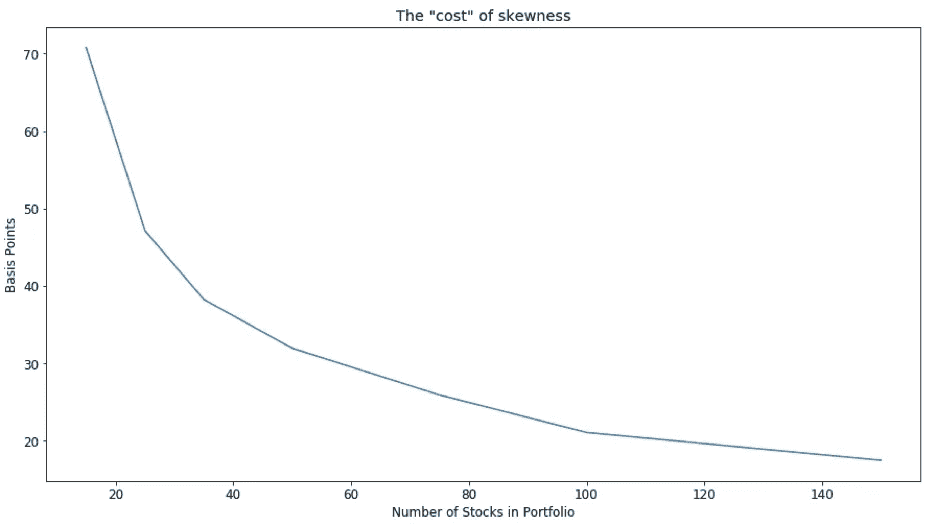
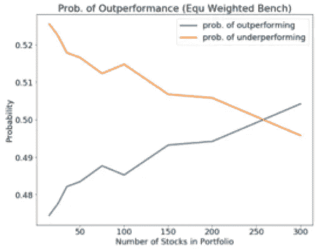
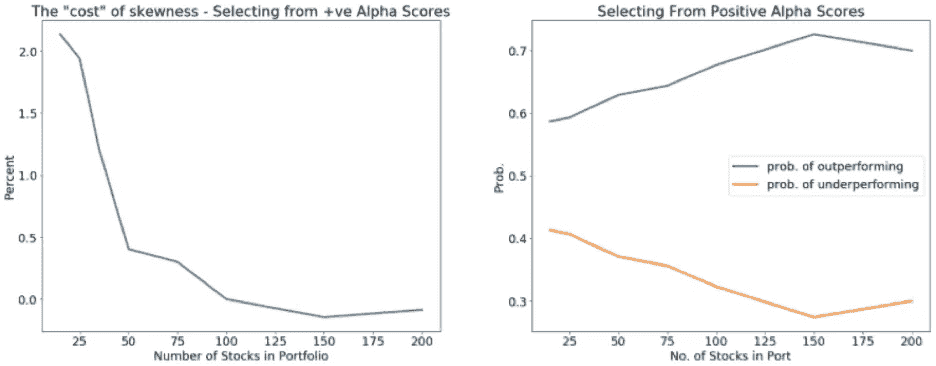

# 选股:傻瓜的黄金

> 原文：<https://towardsdatascience.com/stock-picking-fools-gold-part-1-511159825dab?source=collection_archive---------15----------------------->

## 投资管理中的数据科学

首先，我想说，我不认为成为一名成功的选股人是不可能的，但历史表明这是不可能的。

**数字**

选股难吗，如果难为什么？这些是我希望任何从事投资管理职业的人首先要解决的问题。如果你对这个问题的框架感兴趣，在我们进入为什么它很难之前，让我们从一个事实开始:

> “历史回报的分布呈现正偏态”

这只是意味着，我们将全球指数(如罗素 3000 指数)令人难以置信的表现归功于少数“极端赢家”，即少数股票。从 1926 年到 2016 年，在 25300 家公司中，只有 1092 家公司对美国股市的上涨负责。从 1980 年到 2014 年，罗素 3000 指数中有 40%的股票提供了负回报，尽管该指数回报率为 2633.12%，股票中值跑输市场-54%。然而，最有趣的是，这些股票中的~7%可能被归类为极端赢家(图 1)。应该指出的是，即使我们排除技术和生物技术以避免网络泡沫造成的扭曲，我们也观察到了同样的情况。这个观察结果，很明显是一个呈现正偏态的分布，是直观的，有两个原因；首先，多头头寸的亏损被限制在 100%，其次，上行回报是无限的。

Figure 1

**这对崭露头角的积极管理者有什么意义？**

为了说明偏度的影响，我们从一个简单的模型开始。让我们构建一个权重相等的指数，包含五只股票，其回报曲线如图 2 所示。图 2 中的分布很明显具有我们想要的特性:正偏度。我们有一个明显的赢家，股票 E，我们的加权指数回报 18%。让我们假设一个积极的投资组合经理构建了一个包含 1 或 2 只股票的投资组合，因此，有 15 种可能的组合。

Figure 2

这些投资组合有以下可能的回报:

*   十个投资组合收益 10%；他们不会包括我们的明星，股票 e。
*   一个包含一只股票的投资组合将获得 50%的收益，因为它只持有股票 e。
*   两个股票投资组合将获得 30%的收益，其中一个是股票 e。

从我们的基本数字示例来看，由于忽略了股票 e，三分之二的主动管理投资组合的表现低于指数。此外，投资组合经理的中位数仅赚取 10%，平均经理的投资组合回报将等于我们的指数回报。这个基本例子暗示了以下内容:在我们考虑费用和交易成本之前，正偏度阻碍了积极经理的中位数。为什么？

> 如果主动型经理从指数中随机选择一部分股票，即在选股方面表现不佳，则平均水平的主动型经理的表现很可能会低于指数。

**这取决于投资组合的构建**

扩展这个简单的数字场景，我们使用蒙特卡罗模型试图更好地理解这一现象。让一只股票的价格，S^i，随着时间的推移，根据:

为了简单起见，我们假设所有股票的波动率恒定，𝛔 = 20%。我们在这里所做的，是模拟一个股票世界，这些股票将展现出我们在历史上看到的相同特征。也就是说，我们正在创造一种分布，确保我们产生少量的极端赢家和输家。假设每只股票的起始价格为 1.00 美元，那么我在时间 T 选择的股票价格由下式给出:

在这个模型中，我们将假设随着时间 T = 5(年)，预期指数回报率为 50%，中值回报率为 10%。因此，指数漂移为 4%，波动率为 13%。为了创建我们的投资组合，让我们运行蒙特卡罗模拟来生成 10，000 个模拟股票回报(利用等式 2)。然后，从这一组 10，000 只股票中随机抽样，我们在每个 1-20 只股票的子投资组合中创建 6000 只股票。对于给定的子投资组合规模，我们将跑赢指数的概率定义为随机抽样投资组合中超过指数回报率 50%的比例。绘制出每个子投资组合的优于和劣于表现的概率，我们得到图 3。

Figure 3

图 3(左)显示了随机选择的规模为 n 的投资组合优于或劣于基准的概率。图 3(右)显示了当我们考虑一个更极端的阈值(70%和 30%)时，优于和劣于表现的概率。很简单，与更大的投资组合相比，更大比例的高度集中的投资组合表现优异的可能性更低，表现不佳的可能性更高。

> 传统的主动管理者面临着一个固有的劣势。表现明显不佳的风险总是主导指数表现优于大盘的可能性。

# 怎样才能克服正偏？

抱怨传统的主动型经理很容易，尤其是考虑到他们的历史表现。然而，更有趣的是确定投资组合结构如何克服正偏度现象，这是我们传说中的选股者(宇宙的主人)的逆风。接下来显而易见的是，为什么量化股票产品不应被忽视。

**拆除正偏度**

我们看到，随着股票数量的增加，偏态效应下降。为了确定克服这种现象所需的股票数量，我们将通过观察主动经理投资组合回报的均值和中值之间的差异来量化偏度的影响。这些投资组合(代表我们假设的经理)是通过随机抽样标准普尔 500 从 1991 年到 2016 年的历史回报构建的。

我们首先假设:

*   我们的积极型经理每年年初都会创建买入并持有的投资组合

在构建投资组合时，我们从我们的标准普尔 500 宇宙中随机挑选(不替换)给定年份的固定数量的股票。我们构建了 5000 个这样的投资组合。我们评估的投资组合规模为:15、25、35、50、75 和 150 只股票。为了简单起见，我们还做了以下假设:

*   从我们所有的股票中选择任何一只股票的概率是相等的
*   我们创造同等权重的投资组合

在进一步讨论之前，让我们考虑一下为什么我们关心均值——中值分布。由于偏斜度的增加，我们在蒙特卡洛模型中向投资组合经理展示了这一点，我们随机生成的投资组合偶尔会包含极端赢家。这将增加平均经理的回报，而中位数经理将保持相对不受影响。

**:随着我们增加投资组合中的股票数量，我们将观察到 1991 年至 2016 年投资组合的中值和平均投资组合经理回报率之间的利差更小。**

*这似乎很直观，因为我们增加了投资组合中的股票数量；我们增加了纳入少数极端赢家之一的可能性。为了清晰起见，我总结了一下这个模型。从 1991 年到 2016 年，从标准普尔 500 中选择了 5000 个引导投资组合。我们对 7 个不同的投资组合进行了这样的操作，每个投资组合都有不同的规模(15 支股票到 150 支股票)。然后，我们计算 1991 年至 2016 年在 bootstrap 程序中创建的投资组合回报的均值和中值之间的平均差异。*

*在图 1 中，我们展示了这种差异。我们的观察提供了一些量化股票产品(或低风险主动管理风格)背后的直觉。我们看到，随着持股数量的增加，偏斜度的影响/成本显著非线性下降。在此期间，我们的结果表明，对于持有 15 只股票的投资组合经理，偏差约为 70 个基点。对于拥有约 150 只股票的投资组合，这一偏差低于 20 个基点。尽管对大量股票的影响仍然是可测量的，但我们已经大大降低了由均值-中值差测量的偏斜度相关的成本。*

**

*Figure 1*

*为了将这一点与我们上面的发现联系起来，我们考虑了每个子投资组合的超越概率。让我们考虑一个同等权重的标准普尔 500；我们假设这一点是为了与我们同等权重的 bootstrap 投资组合进行公平比较。如果我们绘制一段时间内表现优于同等权重基准的子投资组合的平均数，我们会得到图 2。*

**

*Figure 2*

*我们已经证明，随着我们纳入越来越多的股票，纳入极端赢家的概率会增加，因此，中等积极投资组合经理有更大的概率跑赢他/她的基准。*

*那么，这与量化股票产品到底有什么关系呢？*

*为了确定这种现象如何影响基于因素的量化策略，我应用了之前使用的 bootstrap 投资组合模型，但是，在这种情况下，我们不会对选择的任何给定股票应用相同的概率。相反，我们执行以下操作:*

*   *我们根据阿尔法分数来偏向标准普尔 500 成分的选择*
*   *指定任何给定成分被选中的概率与其 alpha 分数成比例，即 alpha 分数越高，其被选中的概率越高*

*我们通过组合三个风险溢价的组成“z 分数”(简单地认为是一个排名)来生成“α分数”:*

*   ***价值**:被低估或便宜的股票*
*   ***质量**:基础资产负债表的实力和管理能力*
*   *势头:表现好/差的股票继续表现好/差*

*具体来说，z 值越高，在给定因素下，该股票相对于同行的排名就越好。因此，通过组合这些 z 分数，我们获得了一个 alpha 分数，其中最高的 alpha 分数表示一只股票相对于它的同行来说最能获得所有三个风险溢价。*

*此外，在此过程中，我们通过优化器的构建纳入了小盘股偏好，这将我们的投资组合推向相等的权重，以避免股票特定的风险，因此，在此实验中，我们将对 bootstrap 投资组合进行相等的加权，以反映这一点。随机抽样(没有替换)，我们为每个投资组合规模形成 1000 个投资组合。跑赢基准的投资组合比例是通过确定超额收益为正的投资组合比例来计算的。从 1991 年 12 月 31 日到 2016 年 12 月 30 日的跑赢大盘的概率中值如图 3(右)所示。*

**

*Figure 3*

*在图 3(左)中，我们看到偏斜度的“成本”大幅降低，正如我们在之前的实验中所做的那样。然而，最有趣的是，当我们应用回溯测试的 alpha 分数时，对于中等假设风险溢价的投资组合经理来说，跑赢的概率大于跑输的概率。**我们观察到，在 150 只股票时，表现优异的概率达到峰值，而在 150 只股票时，表现不佳的概率最低**。这并不是说 150 是黄金数；然而，它为我们提供了第一步，以确定一个更优化的投资组合构建方法来对抗正偏度。*

***结束语***

*这两篇文章旨在描述和说明历史收益的一个经常被忽视但极其重要的性质，**正偏度**。*

> *正偏度的含义是，整体指数回报可以由相对较少的股票驱动，这反过来会给集中投资组合的经理带来很大的阻力。*

*在主动与被动的辩论中，焦点通常集中在费用、技能和交易成本上。从提供的证据来看，偏态也应该包括在这些讨论中。*

*我们在一定程度上理解了更大投资组合的好处。量化投资产品，如增强型指数或 smart beta，都包含相对较高数量的股票，以抵消这种影响。*

****注来自《走向数据科学》的编辑:*** *虽然我们允许独立作者根据我们的* [*规则和指导方针*](/questions-96667b06af5) *发表文章，但我们不认可每个作者的贡献。你不应该在没有寻求专业建议的情况下依赖一个作者的作品。详见我们的* [*读者术语*](/readers-terms-b5d780a700a4) *。**

***参考文献***

1.  *h . bessembinder(2017 年)。股票表现优于国库券吗？，[https://ssrn.com/abstract=2900447.](https://ssrn.com/abstract=2900447.)*
2.  *图 1 见[https://www . chase . com/content/dam/private banking/en/mobile/documents/eotm/eotm _ 2014 _ 09 _ 02 _ agonyescstasy . pdf](https://www.chase.com/content/dam/privatebanking/en/mobile/documents/eotm/eotm_2014_09_02_agonyescstasy.pdf)*
3.  *为了简洁起见，省略了推导和进一步的解释。如果读者想更好地理解这些价值观，请参见:[https://papers.ssrn.com/sol3/papers.cfm?abstract_id=2673262](https://papers.ssrn.com/sol3/papers.cfm?abstract_id=2673262)*
4.  *摩根大通。(2014).关注市场，特别版:痛苦与狂喜:集中股票头寸的风险与回报。*
5.  *希顿，J.B .和波尔森，尼克和维特，简·亨德里克。(2017 年 5 月 10 日)。为什么索引有效。https://ssrn.com/abstract=2673262 SSRN[有售](https://ssrn.com/abstract=2673262)*
6.  *伊肯伯里、D.L、R.L .肖克利和 K.L .沃马克。(1992).为什么积极的经理经常跑输 S&P500:规模和偏斜的影响，私人投资组合管理杂志，1(1)，13-26。*