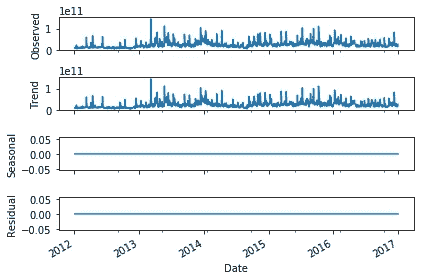
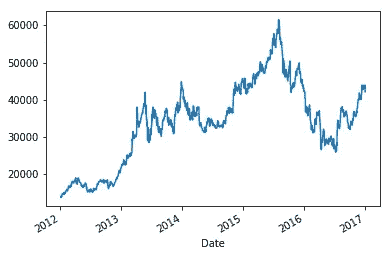
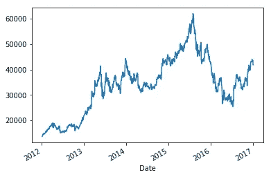
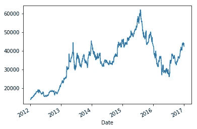
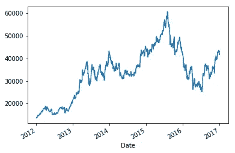
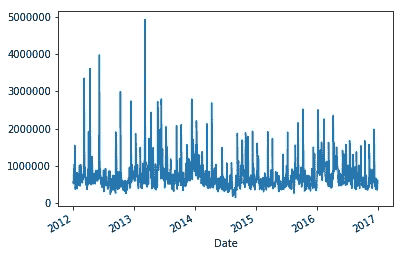
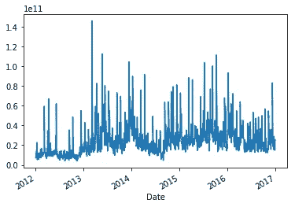
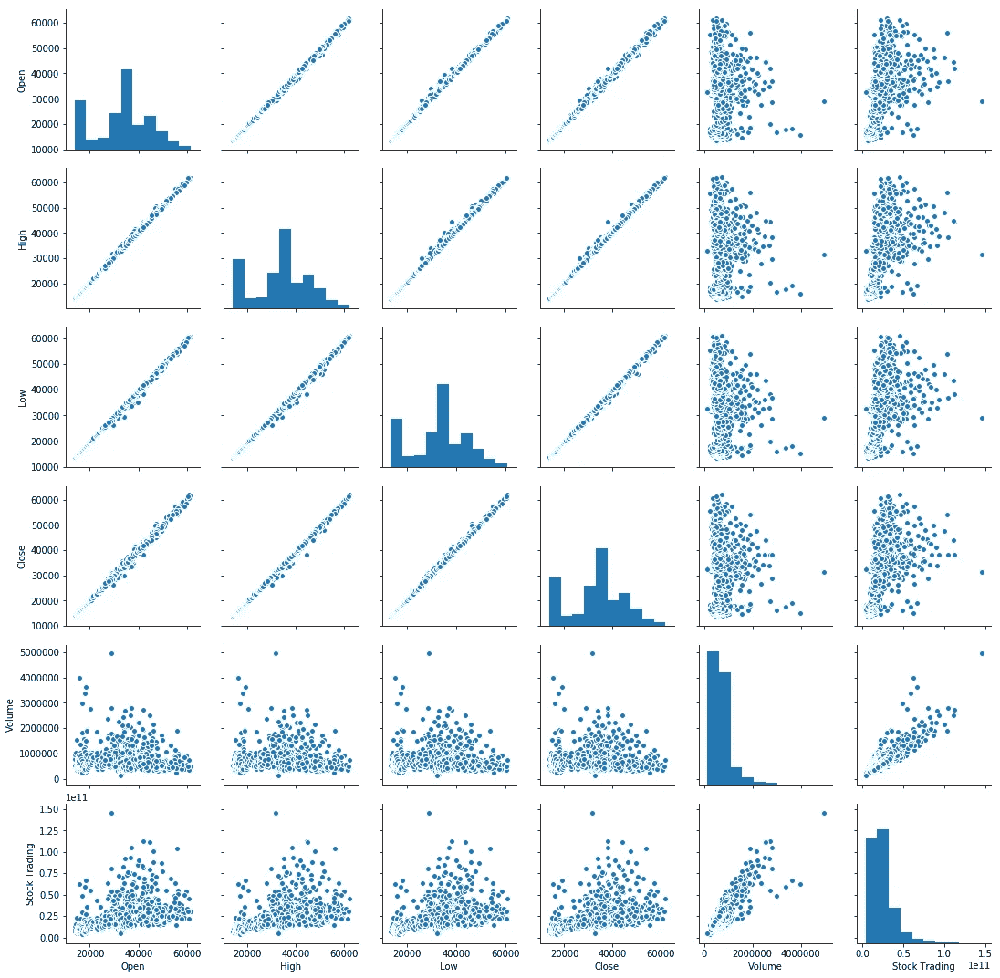
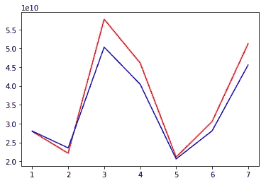
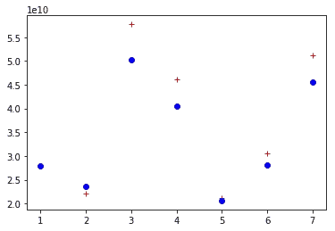

# 股票预测—当天交易

> 原文：<https://towardsdatascience.com/stock-predictions-intraday-trading-e27064884c57?source=collection_archive---------3----------------------->

## 在当今世界，随着计算机科学的巨大进步和硅产业的快速发展，股票是人们所依赖的主要资产之一。大多数人，凭借对市场、统计数据和大量“直觉”的充分了解，正在将他们辛苦赚来的钱投资于公司股票。然后我们有被称为“冒险者”的人，他们相信对商业、时事和数学的理解。他们是日内交易的主要参与者(人们可以将其归类为股票市场中风险最高的投资之一，相当于赌博)。


[Courtesy: Premier Health Group Inc](https://stockprice.com/wp-content/uploads/2018/09/stock_chart_technical_analysis_volume_shutterstock_479286010.jpg)

现在让我们对将要处理的问题集有一个简单的概念。

日内交易是股票市场交易规范，其*归属期*为*、*，通俗地说， *1 天。*买家在特定时间窗口开市时买入股票，然后在当天收盘时卖出。我们在这里处理东京一家上市公司的数据集，从 2014 年到 2016 年两年的每日数据。我们将使用一个简单的机器学习模型来:

1.  了解我们的数据
2.  基于算法进行预测

作为参考，这里是我的 [Github 库](https://github.com/bmonikraj/stock-prediction-intraday)的链接，其中包含:

1.  用于执行分析的 Python 脚本
2.  csv 格式的测试数据
3.  csv 格式的训练数据

[](https://github.com/bmonikraj/stock-prediction-intraday) [## bmonikraj/股票预测-当天

### 预测日内股票的 Python 程序。通过创建……为 bmonikraj/股票预测-日内发展做出贡献

github.com](https://github.com/bmonikraj/stock-prediction-intraday) 

现在，既然您可以在我的知识库中找到所有的 python 代码，我就不再带您浏览代码库或向您解释相同的内容，以免让您感到厌烦。这个脚本很简单，独立且相当直观，所以很容易理解。我还在任何需要的地方记录了脚本，而且如果你被卡住了，你可以随时在[*【bmonikraj@gmail.com*](http://bmonikraj@gmail.com)发送邮件，并期待一天内的回复。

> 我在印度 NIT Rourkela 的教授曾经说过，“理解数据和问题集与分析数据和问题集所需的统计知识同样重要”。我们需要了解日内交易以及定义我们目标价值行为的各个方面。

因此，我们的数据集由 7 列组成，其中 6 列是特征，1 列是目标。

**功能**

*   开盘——这是某一天 a 股的开盘价
*   高——这是股票全天触及的最高价格
*   低——这是股票全天下跌的最低价格
*   收盘——这是当天股票的收盘价
*   日期——观察的日期，主要是数据的索引
*   成交量——全天卖出的股票数量

**目标**

*   股票交易-当天市场上所有股票的价格

现在，由于我们的数据有一个*【时间】*成分，我们的数据很可能是一个时间序列数据。但是一个数据要成为时间序列数据，它必须有一个**【趋势】**或**【季节性】的因素。**为了检查我们的数据集本质上是季节性的还是趋势性的，我们可以执行“ [**Dickey-Fuller 分析**”](https://en.wikipedia.org/wiki/Dickey%E2%80%93Fuller_test)。如果我们的数据集本质上是季节性的，那么我们可以把它作为“时间序列”数据来分析。

在 Python 中实现 Dickey-fuller 分析时，它需要一个变量，“频率”。频率在数学上定义为

```
Frequency = (Total time units expected till which data will show repetative patter, in minutes) / (time gap between each observations, in minutes)
```

现在，在我们的数据集中，我们有基本的日内交易数据。也就是说，我们的数据基于市场的日常行为、市场或行业中的事件、公司管理层的变动、买家的利益、政策以及其他类似的控制因素。因此，我们可以强烈地相信，我们的数据不会显示任何模式超过一天。此外，从数据集可以明显看出，我们的观察频率是一天。所以，我们选择频率为 1。

这是我的数据集的迪克-富勒分析报告



Dickey Fuller analysis

从上图可以清楚地看出，我们的数据在行为上不是季节性的，这意味着我们的数据集不是“时间序列”数据集，因为季节性为 0。

现在，在将季节性从等式中移除后，我们有了一个本质上完全是数字的数据集，它有五个特征，因为“时间”不再是一个需要考虑的特征，因为它不是时间序列数据。

我们可以在这里找到各种功能和目标随时间变化的行为图



Open price of stock



Close price of stock



High price of stock



Low price of stock



Volumes of stock



Total stocks traded

从上面，我们可以看到特征相对于时间的个体行为。我们还可以得到每个特征之间的相互关联图，了解每个特征之间的相互依赖关系。



Correlation matrix for all features and data

从上图中，对角矩阵给出了每列值的**直方图**，这对我们没有用，因为我们对特征或目标的分布不感兴趣(*因为变量的数量很大，并且它们也是相关的*)。

关于理解相关矩阵图的一般说明

1.  如果总图看起来像一条曲线(线性或非线性)，那么它们在很大程度上是相关的
2.  如果图看起来是分散的，那么它们不会像预期的那样相互关联

现在，我们可以从上面的图表中推断出，大部分的特征都是相互依赖相互关联的。“开放”与“高”、“低”和“关闭”高度相关。“交易量”在很大程度上与目标“股票交易”相关。因此，所有的特征对于分析都是重要的。

这个问题现在可以用下面的简单术语来阐述:

1.  数据集包含所有数值
2.  特征数量=尺寸= 5
3.  一个目标
4.  目标是“预测的”(数字)
5.  火车大小< 1000

From the above list, it is the best option to choose linear regression model for the same because

1.  It is a problem of prediction , so a regressor must be used
2.  Since the dimension is quite small and so thus the train size, any complex and sophisticated model, like SVM regressor can overfit the model (*你可以试试！*)

从 Python 的 scikit-learn 模块实现线性回归后，在测试数据上测试我们的模型后，我们得到***【RMSE = 4253929991.85，***

该值似乎太高，似乎不合适，但我们不能忘记这样一个事实，即特征的顺序和目标值彼此不相似或不接近。

【T6【股票交易】 ( 10 ) > >中的数值顺序*中的数值顺序* (10⁵ ~ 10⁶)

因此，从这种方式来看，考虑到计算均方误差的顺序，RMSE 顺序是合理的。这是实际测试目标和计算测试目标的曲线图。由此，您可以看到偏差有多小，从而了解我们模型的性能。



The deviation in actual test target and calculated test target

将机器学习和算法的知识应用于日常生活场景和更好的决策是这种学术进步的主要目的。毕竟，“数字在决策中起着重要的作用，因为数字从不说谎”。

如果我可以在文章的最后做个总结——“你不需要用剑来剪指甲”

如果您有任何疑问，请联系我，电话:[bmonikraj@gmail.com](mailto:bmonikraj@gmail.com)

***来自《走向数据科学》编辑的提示:*** *虽然我们允许独立作者根据我们的* [*规则和指导方针*](/questions-96667b06af5) *发表文章，但我们并不认可每个作者的贡献。你不应该在没有寻求专业建议的情况下依赖一个作者的作品。详见我们的* [*读者术语*](/readers-terms-b5d780a700a4) *。*