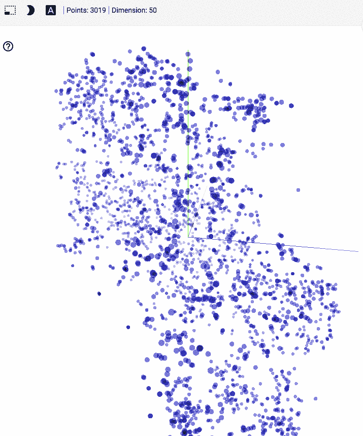
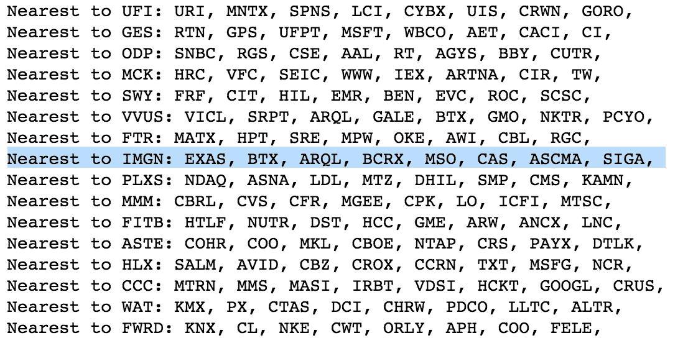
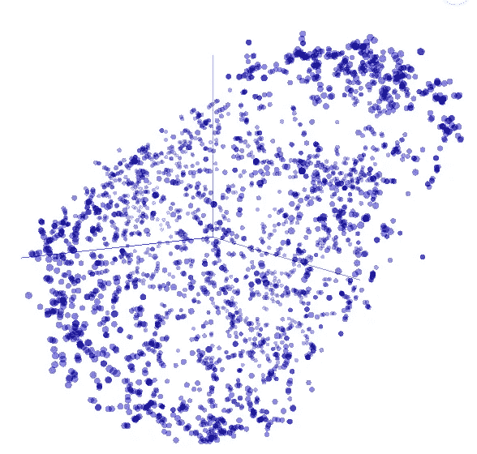
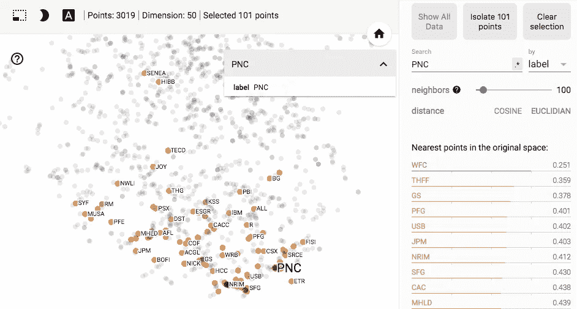

# Stock2Vec —从 ML 到 P/E

> 原文：<https://towardsdatascience.com/stock2vec-from-ml-to-p-e-2e6ba407c24?source=collection_archive---------3----------------------->

希望这篇文章是我通过应用 ML 来了解它的系列文章的第一篇。你可以在这里 *找到这篇博文的代码* [*。*](https://github.com/jperl/stock2vec/blob/master/stock2vec.ipynb)

## [Word2Vec](https://en.wikipedia.org/wiki/Word2vec) 是一个简单却惊人强大的算法。

它构建了[单词向量](https://blog.acolyer.org/2016/04/21/the-amazing-power-of-word-vectors/)来表示单词含义。它仅仅通过周围的单词来学习这些意思。然后，您可以使用这些单词向量作为输入，使机器学习算法[执行得更好](https://ronan.collobert.com/pub/matos/2008_nlp_icml.pdf)并找到[有趣的抽象](http://byterot.blogspot.co.uk/2015/06/five-crazy-abstractions-my-deep-learning-word2doc-model-just-did-NLP-gensim.html)。

如果我们把 Word2Vec 应用到股市会怎么样？

**选择 Stock2Vec 窗口**

在 Word2Vec 中，每个单词的窗口都是周围的单词。对于 Stock2Vec 我们应该如何挑选每只股票的周边股票？

股票市场有大量的变量可供选择:价格、成交量、移动平均线等。在和我在金融行业工作的朋友 Yuhi 讨论后，我们选择了市盈率。市盈率代表了市场对公司成长的预期。

希望它能学到点什么！

**建筑股票 2Vec**

在阅读 Quantopian 的 Zipline 的 API 文档时，我偶然发现了 Quandl Wiki 数据集，其中有 3000 家公司长达 40 年的免费数据。我将[价格数据](https://www.quandl.com/databases/WIKIP/documentation)和[基本面数据](https://www.quandl.com/data/SF1-Core-US-Fundamentals-Data)结合起来，这些数据都是从沙拉达尔那里购买的。然后我用 postgres 合并数据。预处理代码是[这里是](https://github.com/jperl/stock2vec/blob/master/Preprocess%20Stock%20Data.ipynb)。

我改编了[嵌入项目](https://github.com/udacity/deep-learning/blob/master/embeddings/Skip-Grams-Solution.ipynb)，它是我上周刚[完成的](https://drive.google.com/file/d/0Bx6l5GmEYzJJMmtUVktvd1ptZUk/edit) [Udacity 深度学习课程](https://www.udacity.com/course/deep-learning-nanodegree-foundation--nd101)的一部分:在 [FloydHub](https://www.floydhub.com) 上训练模型，并用 [TensorBoard](https://www.tensorflow.org/get_started/embedding_viz) 可视化结果。你可以在这里找到训练代码。

## 从第一个输出可以清楚地看出，Stock2Vec 学会了将相似的行业组合在一起。

Tickers grouped by their vector similarity after 12 epochs

Stock2Vec 将生物制药公司归为一类:Vivus、Vical、Sarepta、ArQule、BioCryst 和 Siga。医疗公司:麦克森和希尔罗姆。医疗保健:安泰和信诺。服装公司:Gap 和 Guess、VF Corp 和 Wolverine World Wide。零售商:Office Depot 和 Best Buy。银行:太阳银行和 CapitalSource。

酷！！

经过 20 个时期的训练后，这些是用 [t-SNE](http://distill.pub/2016/misread-tsne/) 绘制的嵌入。

如果我们选择一只股票，PNC 银行，我们可以看到最近的邻居。

PNC Nearest Neighbors t-SNE

它们都是银行:富国银行、第一金融公司、高盛、信安金融集团、U.S. Bancorp、JP Morgan、Northrim Bancorp、StanCorp Financial Group、Camden National。

让我们再选一个，WTI——一个石油和天然气探索者。

最近的邻居都是能源公司:切萨皮克能源公司、斯通能源公司、Gastar 勘探公司、登伯里资源公司、Bonanza Creek 能源公司。

## **接下来的步骤**

我正在研究一种新的算法，而不是深入研究 Stock2Vec，因为我想学习各种各样的算法。但是还有很多需要改进和未来研究的地方。

预处理可以调整，不经常出现在同一个窗口的股票可以被删除。训练数据可以具有更高的分辨率，每分钟或 15 分钟。窗口函数可以使用其他变量、移动平均、β等。

有没有发现什么有趣的关系？SNAP 减 FB = MSFT 吗？如果你对这方面的研究感兴趣，我很乐意分享矢量数据。

这个项目很有趣，我学到了很多关于单词嵌入、numpy、TensorFlow 和 TensorBoard 的知识。我对我的下一个项目感到非常兴奋！

如果你在评论中有任何问题或建议，请告诉我，或者随时给我发电子邮件。

— —

感谢 Yuhi 和 Gal 帮助购买基本面数据:)。