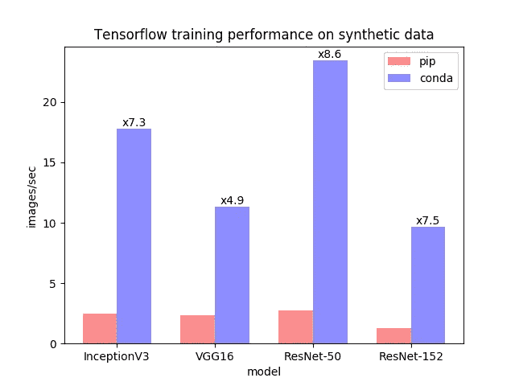

# 出于性能考虑，停止使用 pip 安装 Tensorflow！

> 原文：<https://towardsdatascience.com/stop-installing-tensorflow-using-pip-for-performance-sake-5854f9d9eb0c?source=collection_archive---------1----------------------->

停止使用 pip 安装 Tensorflow！用康达代替。如果你不知道 conda 是什么，它是一个跨平台运行的开源包和环境管理系统。所以它可以在 Mac、Windows 和 Linux 上运行。如果您还没有使用 conda，我建议您开始使用，因为它让管理您的数据科学工具变得更加愉快。

这里有两个很大的理由说明为什么你应该用 conda 而不是 pip 来安装 Tensorflow。

## 更快的 CPU 性能

从版本 1.9.0 开始，conda Tensorflow 软件包利用英特尔数学内核库构建深度神经网络或 MKL-DNN。这个库极大地提高了性能。这里有一张图表可以证明！



Chart taken from [https://www.anaconda.com/blog/developer-blog/tensorflow-in-anaconda/](https://www.anaconda.com/blog/developer-blog/tensorflow-in-anaconda/)

如你所见，与 pip 安装相比，conda 安装的性能可以提供**8 倍的速度提升**。这对那些仍然频繁使用 CPU 进行训练和推理的人来说是非常好的。作为一名机器学习工程师，我使用我的 CPU 对我的代码进行测试，然后将其推送到支持 GPU 的机器上。这种速度的提高将帮助我更快地迭代。我还尽可能在 CPU 上做大量的推理，因此这将有助于我的模型的性能。

MKL 库不仅提高了 Tensorflow 包的速度，还提高了其他广泛使用的库的速度，如 NumPy、NumpyExr、SciPy 和 Scikit-Learn！从下面的链接看你如何设置。

## GPU 版本的安装更简单

conda 安装将自动安装 GPU 支持所需的 CUDA 和 CuDNN 库。pip 安装将要求您手动完成。每个人都喜欢一步到位的过程，尤其是在下载库的时候。

# 快速启动

所以我希望这两个理由足以让你转而使用康达。如果你确信这是开始的步骤。

```
pip uninstall tensorflow
```

如果你还没有安装[巨蟒](https://www.anaconda.com/download)或者[迷你巨蟒](https://conda.io/miniconda.html)的话。Miniconda 只是安装 conda 和它的依赖项，而 Anaconda 会为你预装很多包。我更喜欢 Miniconda 入门。安装 conda 后，尝试以下方法。

```
conda install tensorflow
```

***如果想要 gpu 启用版本，用 tensorflow-gpu 替换 tensorflow。***

除了使用 Tensorflow 更快更简单之外，conda 还提供了其他工具集，使其更容易集成到您的工作流程中。我最喜欢的是他们的虚拟环境功能。你可以在这里阅读更多关于 conda 和 tensorflow [的内容。更多关于 MKL 优化](https://www.anaconda.com/blog/developer-blog/tensorflow-in-anaconda/)[这里](https://docs.anaconda.com/mkl-optimizations/)。希望这有所帮助，一如既往，感谢阅读！

我写了很多这样的帖子！如果你喜欢这个，看看我在 micahelphi.com[的其他内容](https://www.michaelphi.com/)

✍🏽想要更多内容？查看我的博客[***https://www.michaelphi.com***](https://www.michaelphi.com/build-your-own-deep-learning-machine-what-you-need-to-know/)

📺喜欢看基于项目的视频？看看我的 [**Youtube**](https://www.youtube.com/channel/UCYpBgT4riB-VpsBBBQkblqQ?view_as=subscriber) ！

🥇通过注册我的 [**电子邮件简讯**](http://eepurl.com/gwy3hj) **，了解最新的文章和视频！**