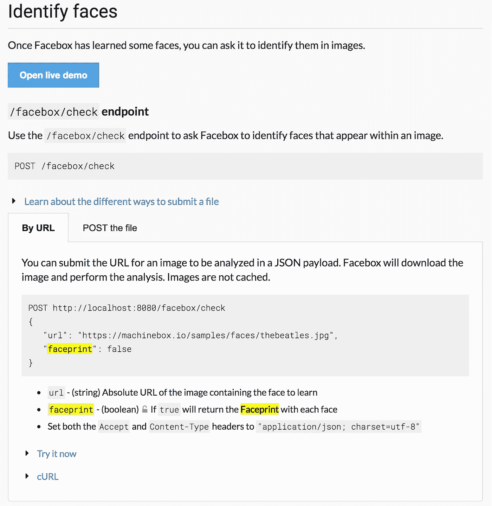

# 在你读完这个之前，停止运行面部识别

> 原文：<https://towardsdatascience.com/stop-running-face-recognition-until-youve-read-this-92d6b94f0fa1?source=collection_archive---------3----------------------->


如今，在视频中使用机器学习驱动的面部识别存在一个非常大的问题。事实上，它可以是一个节目停止。

面部识别可以成为告诉你谁在视频中的强大工具。这对于在我们每天都可以获得的数十亿小时的媒体内容中标记演员、政治家和运动员来说是非常棒的。它也非常适合在安全摄像机镜头中寻找嫌疑人或在旧的家庭照片中定位亲戚。


我们大多数人都不介意花一两秒钟来识别照片中的一些面孔，或者我们不介意在一段视频中找到人所需的处理时间。

但是，如果你把这个乘以成百上千的资产，你会发现大量的时间和资源需要专门用于处理面部识别。

随着今天当前的机器学习即服务(MLaaS)产品，如 Google Vision、Microsoft Azure、IBM Watson 等。您将所有视频资产传递给它们的公共 API 端点，作为回报，您将获得一些元数据，这些元数据是关于谁在某个视频中以及在哪里。元数据可能如下所示:

```
{  
   **"faces"**:[  
      {  
         **"key"**:"Al Roker",
         **"instances"**:[  
            {  
               **"start"**:150,
               **"end"**:150,
               **"start_ms"**:5005,
               **"end_ms"**:5005,
               **"confidence"**:0.6983038746995329
            },
            {  
               **"start"**:480,
               **"end"**:660,
               **"start_ms"**:16016,
               **"end_ms"**:22022,
               **"confidence"**:0.6699914024543004
            },
            {  
               **"start"**:780,
               **"end"**:990,
               **"start_ms"**:26026,
               **"end_ms"**:33033,
               **"confidence"**:0.7077699155373681
            }
         ]
      },
      {  
         **"key"**:"Unknown Face 5abc120a9b25d163",
         **"instances"**:[  
            {  
               **"start"**:60,
               **"end"**:60,
               **"start_ms"**:2002,
               **"end_ms"**:2002
            }
         ]
      }
   }
```

因此，人脸识别或名人检测模型在一些带有他出现时间标记的视频片段中找到了阿尔·罗克。

但它也发现了一张*未知的脸*。如果这被正确地实现到一个 UI 中，那么下一步应该是让看到它的人给那个未知的人加标签。反过来，这应该训练面部识别模型。

对于当前的 MLaaS 产品来说，最后一步本身就是一个挑战，但它实际上会变得更糟。

假设这些数据代表了数百或数千小时的视频(显然在现实生活中会有更多的数据)，假设我已经浏览并教会了它所有未知的面孔是谁。我仍然需要用新训练的面部识别系统重新播放所有视频，以获得训练所有新人的好处。

我们也可以颠倒这个问题。假设我有一张新的嫌疑犯或罪犯的面部照片。我想看看那个人是否出现在我作为执法机构收集的数百万小时的安全镜头或人体摄像机镜头中，*，并且已经通过面部识别系统进行了搜索。使用今天的 MLaaS 工具，我必须首先用新面孔训练人脸识别模型，然后通过新训练的模型重新运行所有这些数百万小时的镜头。*

这些都是表演的绊脚石，因为每当你有一些新的训练想要利用时，重新运行面部识别是不经济的。

这就是为什么我的公司 [Machine Box](https://goo.gl/5FQuWV) 最近在我们的面部识别模型 [*Facebox*](https://goo.gl/N9eGyJ) 中发布了一个叫做 Faceprint 的功能。

这个功能的好处是，你只需要通过 Facebox ***运行一次*** 。处理完之后，你可以追溯应用任何你想要的名人识别训练。你可以不断更新你的模型，用新的人来教它，给它看新的面部照片，你想纠正多少次就纠正多少次，你想纠正多少次就纠正多少次，你永远都不需要重新处理视频来利用所有这些新的知识。

想象一下这意味着什么。您可以继续将新的名人识别模型应用到您的视频中，**而无需重新处理它**。

这将使你不必被锁定在一个预先训练的名人识别模型中，该模型在处理时可能是不合标准的，或者可能没有你想要包括的所有已知的人。

有了 Faceprint，不再需要等到完美的人脸识别模型出现。

## 它是如何工作的？



Faceprint 的工作原理是给你一个由 Facebox 检测到的每个人脸的唯一散列。然后你可以把这个散列和你得到的关于这个人是谁的元数据存储在一起。后来，你可以教 Facebox 新的名人，上传一个预先训练好的人脸的状态文件，或者纠正现有的模型。你只需要给它一个 hash(或 Faceprint ),而不是再次通过 Facebox 运行所有视频，作为回报，你将从更新的模型中获得一个标签。你可以在你的整个面部指纹数据库上以令人难以置信的速度运行整个操作(比处理图像本身快得多)。当你加载了一个新的 Facebox 状态文件时，你可能会手动触发该任务，或者当你的用户整天都在标记未知的面孔以确保你的数据库是最新的时，你可能会更频繁地触发该任务。

Facebox 的这一新功能将通过减少您必须做的不断重新处理来为您节省大量的时间和金钱。如你所知，Facebox 在本地运行，因此你不必将视频上传到网络，就可以利用最先进的人脸识别技术。

# 什么是机器盒子？


[Machine Box](https://goo.gl/5FQuWV) 将最先进的**机器学习**功能放入 **Docker 容器**中，这样像您这样的开发人员就可以轻松地将自然语言处理、面部检测、对象识别等功能融入其中。到您自己的应用程序中。

盒子**是为扩展**而建造的，所以当你的应用真正起飞时，只需水平地添加更多的盒子，直到无限远甚至更远。哦，它比任何云服务**都要便宜**([可能更好](https://hackernoon.com/which-face-recognition-technology-performs-best-c2c839eb04e7))……而且**你的数据不会离开你的基础设施**。

[有戏](https://machinebox.io/docs/facebox/teaching-facebox)让我们知道你的想法。