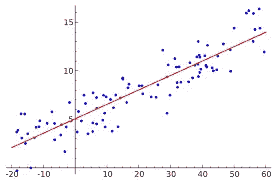
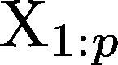
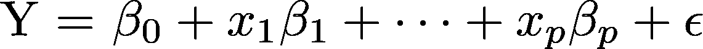
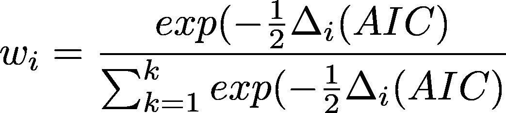
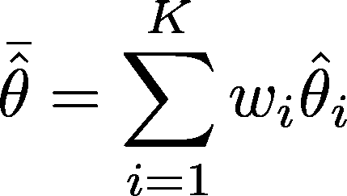
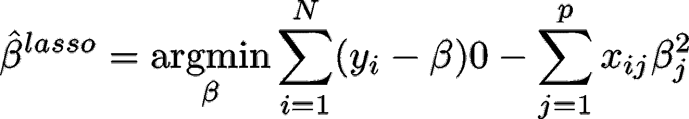
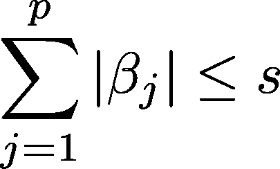

# 逐步停止:为什么逐步选择不好，你应该用什么来代替

> 原文：<https://towardsdatascience.com/stopping-stepwise-why-stepwise-selection-is-bad-and-what-you-should-use-instead-90818b3f52df?source=collection_archive---------0----------------------->



Regression image from Wikipedia

这是从我的统计网站:www。StatisticalAnalysisConsulting.com

# 介绍

在这篇文章中，我讨论了多元线性回归的变量选择方法与一个单一的因变量 y 和一组自变量



根据



特别是，我讨论了各种逐步的方法(定义如下)。我将展示如何在 SAS 中实现它们(PROC GLMSELECT ),并提供如何在 R 和 Python 中实现它们的指导。

逐步方法对于其他类型的回归也是有问题的，但是我们不讨论这些。Frank Harrell (2001)在*回归建模
策略*中出色地总结了逐步方法的基本问题，可以解释如下:
1。R^2 值偏高
2。F9 统计量不具有所声称的分布。
3。参数估计的标准误差太小。
4。因此，参数估计的置信区间太窄。
5。由于多重比较，p 值太低，并且难以校正。
6。参数估计值偏离 0。
7。共线性问题加剧。

这意味着你的参数估计值可能离零太远；您对这些参数估计的方差估计也不正确；所以置信区间和假设检验会是错的；没有合理的方法来纠正这些问题。

最具毁灭性的是，它允许分析师不去思考。换句话说，对于数据分析师来说，使用逐步方法相当于告诉他或她的老板应该减薪。一个额外的问题是，这些方法可能无法确定适合的变量集，即使这些变量集存在(Miller，2002)。

我详细说明了为什么这些方法很差，并提出了一些更好的替代方法。在本节的剩余部分，我将讨论逐步方法的 SAS 实现。接下来，我表明这些方法违反统计理论；然后，我表明，理论违反有重要的实际后果，在常见的情况下遇到的。在倒数第二节中，我简要讨论了一些更好的选择，包括实现 SAS PROC GLMSELECT(带有指向 R 和 Python 代码的指针)。最后，我总结了我们的结果，提出了建议，并建议进一步阅读。

# 术语

变量选择方法是一种选择回归模型中使用的一组特定自变量(iv)的方法。这种选择可能是试图找到“最佳”模型，也可能是试图在有太多潜在虚拟设备时限制虚拟设备的数量。有许多常用的方法，我称之为逐步技术。这些包括

。正向选择从未选择变量开始(空模型)。第一步，添加最重要的变量。在随后的每一步中，它都会添加那些不在模型中的最重要的变量，直到没有满足用户设置的标准的变量。
逆向选择从选择的所有变量开始，每一步都删除最不重要的变量，直到没有一个满足标准。
逐步选择在向前和向后之间交替，引入和移除符合进入或移除标准的变量，直到获得一组稳定的变量。
双变量筛选从查看与 DV 的所有双变量关系开始，并包括任何在主模型中有意义的双变量。

# SAS 实施

SAS 在 PROC REG 中使用 MODEL 语句上的 selection 选项实现向前、向后和逐步选择。默认标准是 p = 0.5 用于向前选择，p = 0.1 用于向后选择，这两者都用于逐步选择。该标准可以通过 SLENTRY 和 SLSTAY 选项进行调整。

# 为什么这些方法不起作用:理论

关键的问题是，我们正在将用于一个测试的方法应用到许多测试中。由 PROC GLM 或 PROC REG(或其他程序中的等效程序)生成的 f 检验和所有其他统计数据都基于被检验的单个假设。在逐步回归中，这一假设以难以确定的方式被严重违反。举例来说，如果你掷一枚硬币十次，得到十个正面，那么你很确定有奇怪的事情发生了。你可以精确地量化这种事件发生的可能性有多大，因为在任何一次投掷中正面朝上的概率是 0.5。如果你让 10 个人每人扔 10 次硬币，其中一个得到 10 个头，你就不那么可疑了，但是你仍然可以量化可能性。但是如果你有一群朋友(你没有数他们)投掷硬币几次(他们没有告诉你有多少次)，有人连续得到 10 个头像，你甚至不知道
有多可疑。那是逐步的。

由于违反了假设，以下情况可以证明是正确的 Harrell (2001):
标准误差偏向 0
p 值也偏向 0
参数估计值偏离 0
模型太复杂

# 这些方法真的行不通:例子

对一项技术的一个测试是，当所有的假设都精确满足时，它是否有效。我们为满足线性回归
1 的所有假设的 a 生成多元数据。e 正态分布，均值为 0，方差为常数。
2。静脉血栓形成与静脉血栓形成的线性关系。
对于我们的第一个例子，我们对 100 名受试者和 50 个独立变量进行了回归分析——都是白噪声。我们逐步使用 SAS 中的默认值，即入门级和停留级 0.15；在前进档，进入水平为 0.50，在后退档，停留水平为 0.10。最终的逐步模型包括 15 个 iv，其中 5 个在 p<0.05 显著。正向选择产生了一个最终模型，在 p < .05 有 29 个 iv，5 个 sig。反向选择产生了 10 个 iv，8 个 sig，p < .05。

当然，这违反了关于每次静脉注射应该有多少受试者的经验法则。因此，对于我们的第二个例子，我们对 1000 名受试者进行了类似的测试。结果并不令人鼓舞:逐步导致 10 个 iv，其中 5 个在 0.05 显著；向前到 28 个 iv，其中 5 个在 0.05 显著，向后到 10 个 iv，其中 8 个在 0.05 显著。这或多或少是我们对这些 p 值的预期，但它并不能让人对这些方法检测信号和噪声的能力充满信心。

通常，当一个人做回归时，至少有一个自变量与因变量确实相关，但还有其他不相关的。对于我们的第三个例子，我们在上面的模型中添加了一个真实的关系。然而，由于测量包含噪声，我们也将噪声添加到模型中，因此“真实”IV 与 DV 的相关性为 0.32。在
这种情况下，有 100 名受试者、50 个“假”静脉注射和一个“真”静脉注射，逐步选择没有选择真的静脉注射，但选择了 14 个假的静脉注射。“向前”和“向后”都包含了真实变量，但“向前”还包含了 23 个其他变量。落后做得更好，包括只有一个错误的 IV。当受试者的数量增加到 1000 时，所有的方法都包括真实变量，但是所有的
也包括大量的虚假变量。

这就是假设没有被违反时会发生的事情。但有时也会有问题。对于我们的第四个例子，我们添加了一个异常值，在有 100 名受试者、50 名假静脉注射和 1 名真静脉注射的例子中，真静脉注射包括在内，但该变量的参数估计值应为 1，为 0.72。有两个异常值(例 5)，参数估计值
减少到 0.44。

# 逐步方法的替代方法

在这一节中，我将回顾逐步选择的一些替代方法。首先，我讨论的方法不是自动的，而是依靠判断的。然后讨论一些自动化方法。然而，我的观点是，没有一种方法能够以真正自动的方式被合理地应用。我们下面讨论的方法比逐步方法表现得更好，但是它们的使用不能代替实质性的和统计的知识。评估解决问题的不同统计方法(如变量选择)的困难在于，一般来说，评估不应依赖于与特定问题相关的特定问题。然而，在实际解决数据分析问题时，这些特殊性是必不可少的。

## 一个完整的模型

在研究中似乎经常被忽视的一个选择是在模型中留下不重要的变量。这在某些情况下是有问题的，例如，如果有太多潜在的 iv，或者如果 iv 是共线的。然而，多重回归中并不存在只需要包含重要变量的内在要求。事实上，尽管这些 IVs 并不重要，但有几个原因可能会引起人们的兴趣。

1.  包含它们可能会影响其他 iv 的参数。
2.  如果理论表明它们将是重要的(理论至少应该表明这一点——或者你为什么把它们列入潜在的 iv 列表？)那么一个小而不显著的结果就有意思了。
3.  虽然对 p 值的全面讨论超出了本文的范围，但一般来说，人们最感兴趣的应该是参数估计值的大小，而不是它们的统计意义。

这种方法的问题在于，向回归方程中添加变量会增加预测值的方差(例如，参见 Miller (2002)) —这是为减少预测值的偏差所付出的代价。这种偏差-方差权衡是选择好方法和好模型的核心。

## 专家知识

另一个经常被忽视的极好的选择是使用实质性的知识来指导变量选择。许多研究者似乎认为统计分析应该指导研究；这种情况很少发生:专家知识应该指导研究。事实上，这种方法不应该被认为是一种替代，而是良好建模的先决条件。
虽然实质性理论的数量因领域而异，但即使是理论最少的领域也必须有一些，否则就没有办法选择变量，无论多么试探性。

## 模型平均

篇幅不允许全面讨论模型平均，但中心思想是首先开发一组可信的模型，独立于样本数据指定，然后获得每个模型的可信指数。例如，该索引可以基于由下式给出的 Akaike 信息标准权重



其中δI 是有序 AIC 的差，K 是模型的数量。然后，使用以下方法组合这些模型:



## 其中θ_ I 是来自各个模型的参数估计。详情见伯纳姆&安德森(2002)。

偏最小二乘法

当一个人有太多的变量时，标准的数据简化技术是主成分分析(PCA)，并且一些人推荐 PCA 回归。这包括通过使用 X'X 的最大特征值来减少 iv 的数量。这种方法有两个问题。

主成分可能没有合理的解释
，主成分可能无法很好地预测因变量，即使自变量的其他线性组合可以很好地预测因变量(Miller (2002))。

偏最小二乘法找到与 DV 相关的 iv 的线性组合。看待这个问题的一种方式是注意主成分回归是基于 X'X 的光谱分解，偏最小二乘法是基于 X'Y '的分解。

## 套索

套索是一类收缩方法中的一种(也许最著名的收缩方法是岭回归)。Trevor Hastie & Friedman (2001)给出的套索参数估计值为:



使遭受



其中
- N 是样本大小
- y_i 是因变量
的值- b_0 是常数，通常通过标准化预测值而参数化为 0
-x _(I j)是预测变量
的值- s 是收缩因子

## 利比亚

Efron，Hastie，Johnstone & Tibshirani (2004)开发了最小角度回归。它从集中所有变量和缩放协变量开始。最初，所有参数都设置为 0，然后基于与当前残差的相关性添加参数。

## 交互效度分析

交叉验证是一种重采样方法，类似于 bootstrap 或 jackknife，它采用了另一种模型评估方法。当人们谈论使用保留样本时，这并不是真正的交叉验证。交叉验证通常取数据的 K 个重复样本，每个样本使用(K-1)/K 个数据来构建模型，剩余的 1/K 个数据以某种方式测试模型。这被称为 K 倍交叉验证。对于大小为 N 的样本，留一交叉验证或 LOOCV 有点像折叠结构，在 N 次系统复制中，取 N-1 个数据点来构建模型，并针对剩余的单个数据点测试结果，第 k 个点在第 k 次复制中被丢弃。所以这就是
K 重交叉验证发挥到极致，K=N，另外，随机 K 重交叉验证并没有把数据分割成 K 个子集的分区，而是取 K 个大小为 N*(K-1)/K 的独立样本。

# 履行

## 斯堪的纳维亚航空公司

PROC GLMSELECT 是在第 9 版早期引入的，现在是 SAS 的标准配置。GLMSELECT 有很多特性，我不会全部讨论；相反，我集中讨论与刚才讨论的方法相对应的三种方法。
glm select 语句如下:

```
PROC GLMSELECT <options>;
CLASS variable;
MODEL variable = <effects></options>;
SCORE <DATA = dataset> <OUT = dataset>;
Key options on the GLMSELECT statement include:
• DATA =
• TESTDATA =
• VALDATA =
• PLOTS =
```

MODEL 语句允许您选择选项，包括:
前进
后退
步进
套索
LAR
还允许您选择 choose 选项:
CHOOSE = criterion 选项根据标准从模型列表中选择
可用的标准有:adjrsq、aic、aicc、bic、cp、cv、press、sbc、VALIDATE
CV 是基于 k 倍 CV 的残差平方和
VALIDATE 是 avg。sq。验证数据错误
停止标准选项停止选择过程。可用的标准有:adjrsq、aic aicc、bic、cp cv、press、sbc、sl、validate。

# LASSO 和 LAR 的结果

当应用于上述问题时，用默认选项 LASSO 和 LAR 表现得相当不错。下面是 LASSO 的结果，LAR 的结果几乎相同。
N = 100，50 个 iv，所有噪声。。。未选择
N = 1000，50 个 iv，所有噪声。。。未选择
N = 100，50 个噪声变量，1 个实数。。。未选择
N = 1000，50 个噪声变量，1 个实数。。。仅选择真实值
N = 100，50 个噪声变量，1 个真实值，1 个异常值。。。….param est now . 99
N = 100，50 个噪声变量，1 个真实值，2 个异常值。。。….不包含变量

限制
尽管 Lasso 和 LAR 方法是其他方法的优秀替代方法，但它们不是万灵药。方法仍然做出假设，并且这些假设需要被检查。除了标准的统计假设之外，他们还假设所考虑的模型具有实质性的意义。正如 Weisberg 在他对 Bradley Efron&TiB shirani(2004)的讨论中所指出的，无论是 LAR 还是自动方法的任何其他方法都“没有任何希望解决[模型构建的问题]，因为自动方法本质上不考虑手边问题的上下文”。或者，正如我在各种场合经常说的:

> 脱离上下文解决统计问题就像蒙着眼睛打拳击一样。
> 你可能会打中对手的鼻子，或者你可能会在环柱上折断你的手。

## 其他实施

我是自愿成为 SAS 用户的。然而，R 在几个包中提供 LASSO，包括 glmnet:

```
fit <- lars(x, y, type="lasso")# summarize the fitsummary(fit)
```

Python 通过 [sklearn](http://scikit-learn.org/stable/modules/generated/sklearn.linear_model.Lasso.html) 提供套索:

```
>>> from sklearn import linear_model
>>> clf = linear_model.Lasso(alpha=0.1)
>>> clf.fit([[0,0], [1, 1], [2, 2]], [0, 1, 2])
Lasso(alpha=0.1, copy_X=True, fit_intercept=True, max_iter=1000,
   normalize=False, positive=False, precompute=False, random_state=None,
   selection='cyclic', tol=0.0001, warm_start=False)
>>> print(clf.coef_)
[ 0.85  0\.  ]
>>> print(clf.intercept_)
0.15
```

# 总结、建议和进一步阅读

尽管没有任何方法可以替代实质性的和统计学的专业知识，LASSO 和 LAR 提供了比逐步分析法更好的替代方法作为进一步分析的起点。这两种方法都有广泛的选择，允许进行大量的探索，并消除没有实质意义的模型。

对于逐步回归所带来的问题的更多信息，Harrell (2001)提供了一个相对非技术性的介绍，以及关于回归建模的一般性建议。Burnham & Anderson (2002)提供了一个更详细的方法，第一章概述了这个问题，其余章节提供了两个解决这个问题的一般框架(一个基于
信息标准，另一个基于多模型平均)。关于 LASSO 和 LAR 的更多信息，请参见 Hastie & Friedman (2001)。

# 参考

Bradley Efron，Trevor Hastie，I. J .和 Tibshirani，R. (2004)，“最小角度回归”，统计年鉴 32，407–499。安德森博士(2002)，模型选择和多模型推理，施普林格，纽约。
Harrell，F. E. (2001)，回归建模策略:应用于线性模型、逻辑回归和生存
分析，斯普林格出版社，纽约州。
米勒，A. J. (2002)，回归中的子集选择，查普曼&大厅，伦敦。《统计学习的要素》，纽约斯普林格出版社，2001 年。