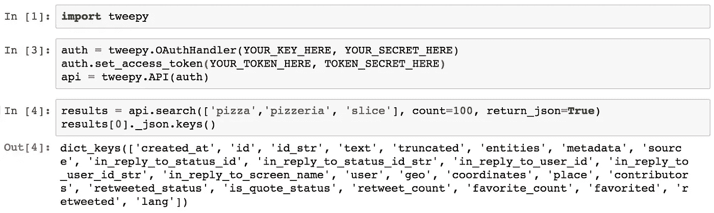
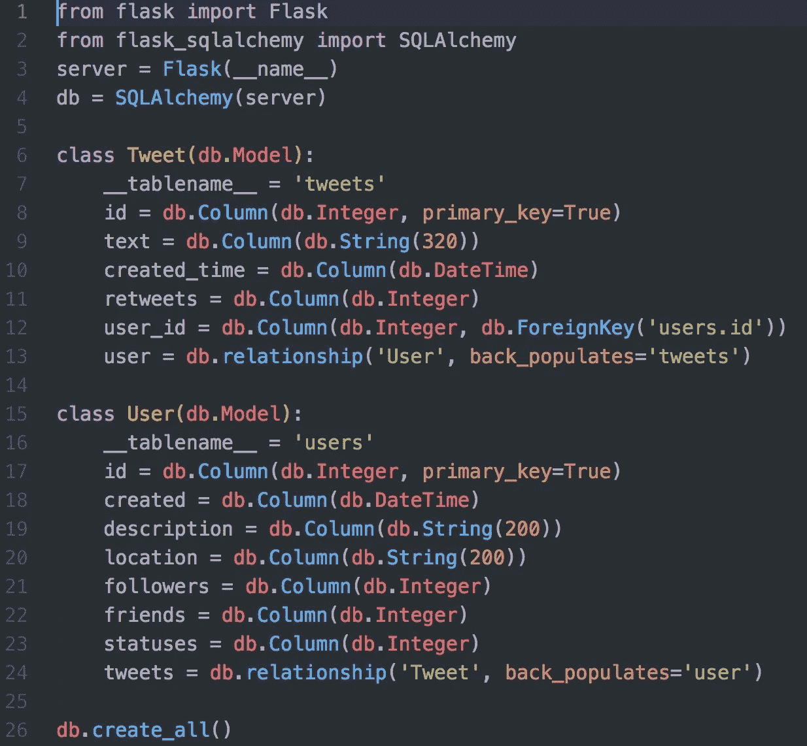
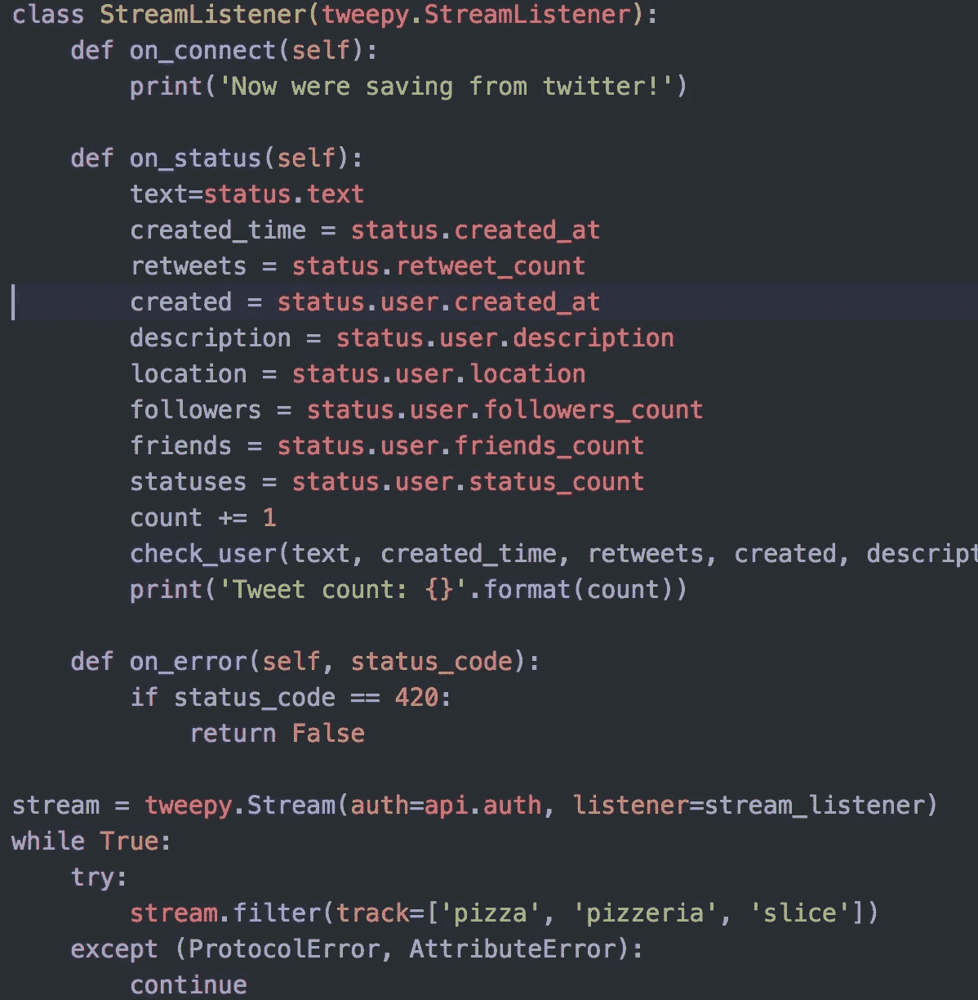
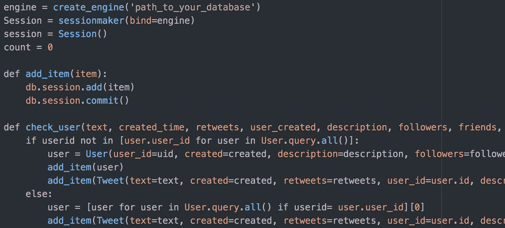

# 在关系数据库中存储推文

> 原文：<https://towardsdatascience.com/storing-tweets-in-a-relational-database-d2e4e76465b2?source=collection_archive---------5----------------------->

Twitter 是一个巨大的平台，每月活跃用户超过 3 亿。由于推文包含的字符数量有限，它们非常适合进行情绪分析，并评估人们对公司或感兴趣的话题的看法。在这篇文章中，我将概述使用 ORM 建立关系 SQL 数据库的步骤，并展示从 Twitter API 提取和存储 tweets 的两种方法。这类任务的用例实际上是无穷无尽的，所以让我们认为我们对**披萨**有一种不健康的(不止一种方式)痴迷。

“pepperoni pizza” by [Vita Marija Murenaite](https://unsplash.com/@runningvita?utm_source=medium&utm_medium=referral) on [Unsplash](https://unsplash.com?utm_source=medium&utm_medium=referral)

首先，我们需要访问 Twitter API。[在这个链接](https://developer.twitter.com/en/apply-for-access)你可以注册一个应用程序并开始收集推文。API 有许多不同的端点，我们将使用其中的两个免费选项。[标准搜索 API](https://developer.twitter.com/en/docs/tweets/search/overview/standard) 将允许我们收集过去 7 天的推文，不幸的是，这是历史推文的限制，无需支付额外费用，但允许我们做一些探索性的数据分析。[实时流 API](https://developer.twitter.com/en/docs/tweets/filter-realtime/api-reference/post-statuses-filter.html) 允许我们筛选实时推文，并收集任何提到感兴趣的查询词的推文。我们将编写一个“倾听”脚本，收集所有与披萨相关的推文，以满足我们不虔诚的低级欲望。在我们建立数据库之前，让我们看一下可以从 Twitter 上获得的数据。

# 从标准搜索中收集推文

您可以使用自己选择的方法向 Twitter API 发出请求，但是 [Tweepy](https://tweepy.readthedocs.io/en/v3.5.0/) 无疑是最容易使用的方法之一，并且它是有据可查的。只要看看入门是多么简单！

正如你所看到的，一条 tweet 包含了丰富的信息，这些键中的大部分对应于嵌套的字典和列表。如果你以前没有使用过 Twitter API，我建议你熟悉一下搜索功能，看看你可以应用的不同过滤器。显而易见，一条推文产生的数据是正文的五倍。在这里，一个请求最多产生 100 条 tweet，但是您可以想象我们可以使用一个循环(小心不要超过速率限制)来收集上一周的所有 tweet，从而链接请求。

# 构建数据库

我们对披萨痴迷的本质是这样的，它超越了关于我们最喜欢的油腻放纵的推特，延伸到了关于它的推特用户。每当我们的模型中有多类以某种方式相关的对象时，这就表明我们可能想要创建一个**关系数据库**。关系数据库保留模型中实体之间的链接，通常使用外键作为表之间的连接(在 SQL 数据库的情况下)。尽管两个类不需要关系数据库，但是可以想象我们可能想要跟踪不同的比萨饼店或感兴趣的浇头。为了方便数据库的设计和播种，我们将使用一个名为 [SQLAlchemy](https://www.sqlalchemy.org/) 的对象关系映射器(ORM)。

我们的问题如下:SQL 数据库有包含整数和文本的表，非常适合存储我们的 tweets 和相关的用户数据。但是我们希望用 Python 来做分析，这是一种面向对象的语言，所以我们希望能够与 tweets 和用户作为对象进行交互。SQLAlchemy 提供了一种完全用 Python 代码设计 SQL 数据库架构的简单方法，以简单的方式映射出我们想要的关系。此外，它还允许我们从 Python 中执行 SQL 查询，基本上是为我们翻译代码，这对于我们以后执行分析时从数据库中提取数据非常有用。让我们看一下我们的简单案例:

这段 python 代码建立了我们的 SQL 数据库的模型。Tweet 和 User 类对应于带有列出的列的 SQL 表。用户和 tweet 之间的关系是一对多的，我们的 tweet 应该有一个用户 id，这样它们就可以归属于它们的父类。现在，当我们想要填充这些表时，我们可以简单地创建 tweet 和 user 类的实例，并传递通过 Twitter API 调用获得的属性。

# 直播推文

现在我们已经建立了数据库，我们可以开始填充它了。请注意，当您第一次建立关系数据库时，确保正确建立所有关系是至关重要的。在这里，我们只需要添加一条 tweet，并确保它有一个用户，反之亦然，但当处理更复杂的系统时，这可能意味着检查许多关系。如果模型的行为不完全如我们所愿，我们可以简单地删除我们的数据库，调整模型文件并重新创建它。

除了几个例外，流式 api 的工作方式与搜索 API 非常相似。我将再次指向[文档](http://docs.tweepy.org/en/v3.5.0/streaming_how_to.html)，但是我们将浏览它。

I can smell the tomato sauce already…

这是 Streamlistener 对象的一般结构。当监听器遇到状态、错误等时，执行不同的功能。还有许多其他类型的函数可以编写，但对于我们的情况，这些就足够了。on_status 的内容允许我们在调用 check_user 函数用传递的属性实例化我们的 tweets 和用户之前提取我们感兴趣的信息。

如你所见，我们正在同时创建我们独特的用户和推文，以确保它们通过用户 id 链接。为了确保我们没有重复的用户，我们首先需要检查用户表，以确保他们不在那里。然后，我们将对象添加到一个会话中，并将它们提交给数据库。这两个简单的代码块组成了一个简单的

当您将所有这些放在一起时，您就有了一个强大的工具来从 Twitter API 中提取推文并将其存储在数据库中，从而保持推文和用户之间的关系。使用 SQLAlchemy，您将能够编写一个查询来返回给定用户的所有 tweets。我希望这是有启发性的，我将在下面留下一些额外的资源。很快，我们将会知道任何人在推特上谈论披萨的一切！

 [## 使用流数据

### 如果你做过任何数据科学或数据分析工作，你可能读过 csv 文件或连接到数据库…

www.dataquest.io](https://www.dataquest.io/blog/streaming-data-python/)  [## 发动机配置- SQLAlchemy 1.2 文档

### 上面的引擎创建了一个为 PostgreSQL 定制的对象，以及一个将建立 DBAPI…

docs.sqlalchemy.org](http://docs.sqlalchemy.org/en/latest/core/engines.html)