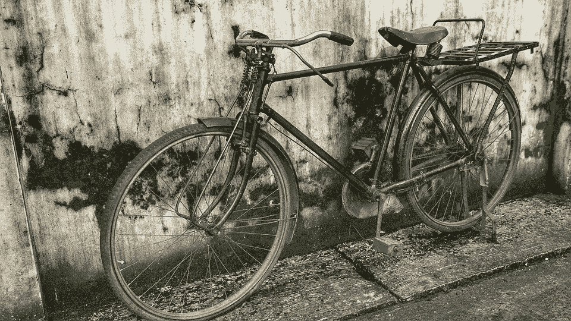
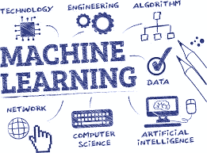

# ML 第 0 天简介:骑自行车的故事

> 原文：<https://towardsdatascience.com/story-of-the-riding-bike-f213256abbba?source=collection_archive---------13----------------------->

我相信我们从我们的经历中学到了最好的东西，当我们分享关于我们经历的故事时，我们可以分享同样的学习。

我喜欢教人东西；我真正喜欢谈论和教授的一个话题是机器学习(ML)。多年来，我教过各种水平的学生 ML。不要相信宣传——学习者不需要任何特定领域的特定背景或领域知识来理解甚至应用 ML 概念解决问题。当然——任何领域的经验都有帮助，但许多潜在的学习者认为，为了开始学习，需要大量的统计数据或数学技能，但事实并非如此。事实上，在这篇文章的剩余部分，我将表明，任何人只需要对我们自己的学习有一个大致的了解，就可以掌握和完全理解整个 ML 过程。

在那些更有经验的人对我大喊大叫之前，请记住，这是为第一天的学习者准备的，目的是提供一个全面的、更容易理解的、不会吓到他们的方法。

那么，让我们开始吧——讲一个简短的故事！

我童年最美好的回忆之一是父亲教我骑新自行车。我想这是我第一次“真正的”艰难经历，因为我父亲没有教我如何骑自行车，而是让我每次尝试时都失败一点，最终摔倒。表面上看，我永远也到不了那里，但慢慢地，我肯定地推断出我做错了什么，这是基于我每次尝试骑自行车时所学到的正确做法。在我的整个经历和实验中，我调整了这些变量中的每一个，直到结果看起来像是需要我自己在我们的死胡同街道上轻快地行驶，并与我最快的朋友一起骑行。

当时我一点也不知道，无论结果是成功还是失败，每一次迭代都代表着一次学习经历，我正在学习如何管理平衡、动力、速度甚至勇气。

> 最崇高的快乐是理解的快乐。
> 
> 列奥纳多·达· 芬奇

**我们如何学习？**

在没有获得所有科学知识的情况下，让我们把学习归结为两件事:某种类型的经历和我们从相同经历中学到的相关技能或任务。

**学习骑行(体验)**

你是怎么学会骑自行车的？你可能会选择两条路中的一条:

你试图在没有任何帮助的情况下学习；你尝试和失败了无数次，但在无数次擦伤膝盖和瘀伤后，你成功地独自骑了一段距离的自行车…然后又摔了下来。

或者

有人帮你学习。也许一个兄弟姐妹(对于我们这些有哥哥姐姐的人来说，这是非常错误的)或父母要么向你展示如何骑自行车，要么你观察他们如何骑自行车并模仿他们的行为。你仍然尝试和失败了无数次，但在无数次擦伤膝盖和瘀伤后，你成功地独自骑了一段距离的自行车…然后又摔了下来。

这两种方法之间的相似之处很容易被简化为这样一种简单的形式: ***一次重复的经历，无论是失败还是成功，都教会了我们:什么该做，什么不该做。***

> 永远不要让正规教育妨碍你的学习。
> 
> *马克·吐温*

**结果(学到的技能)**

每个过程的结束或结果都是一样的——我们学会了做一些事情——现在做什么？

**应用**

这是我在课堂上经常告诉学生的一点——现在使用这项新技能(小时候骑自行车),并用它去骑摩托车！嗯——困惑的表情比比皆是。这怎么可能呢？

这是一个简单而又显而易见的答案(记住——人们说学习这种 ML 的东西很难)——只是在你已经学到的东西上增加新的经验和成果。机会是——这一次学习会更快，痛苦(擦伤和瘀伤)会更少，因为骑自行车和骑摩托车有相似的技能，如平衡和动量。

**那么，所有这些与 ML 有什么关系呢？**

有时候，让 ML 变得困难的并不是学习或者理解这个过程(我会马上讲述这一切)，而是我们正在研究我们自己还没有经历过或者学习过的经验和结果。更简单地说——我们无法理解学习经历，因为在某些时候我们自己没有学到——从字面上来说。

现在——整个 ML 过程——与学习骑自行车有关。

A.预处理

任何成功的分析或 ML 流程都始于良好的数据，而这些数据在使用前往往需要清理甚至转换。你能想象在学习骑自行车的过程中，有一半的步骤被遗漏，甚至是用另一种语言呈现给你吗？为了从经验中全面学习，其中的数据必须没有错误，否则我们无法从经验中全面学习或使用它来学习任何类型的技能——这第一步称为预处理，我们在此过程中纠正错误并清理数据。

B.电子设计自动化(Electronic Design Automation)

还记得我提到的有时候学习 ML 很难吗？如果我请你教我一项你只看过别人做，但自己从未学过的技能，你会教我吗？可能，因为人类是优秀的学习者，但是毫无疑问，你会在这个过程中学习新的东西，而我只会学习一些我需要的东西来完成新的技能。

底线是，当我们之前没有任何学习经验时，我们必须首先对新任务或新技能进行充分的自我教育。在 ML 中，这个尽可能多地学习数据的过程被称为探索性数据分析，简称 EDA。我们使用各种各样的视觉化和工具来帮助我们实现这个目标，但是，现在，只要知道我们为什么这样做——去学习我们不知道的东西。

C.特征选择/特征工程

作为成年人，我们都知道经历是复杂的。部分经历也可能是错综复杂的，重叠的，交叉的，不完整的，甚至是不相关的。在 ML 中，组成体验的部分和片段被称为特征，在高层次上，我们通常只是将特征与结果或学到的技能联系起来。正如我们已经讨论过的，经验在学习过程中经常被重复，但是每次的特征都保持相同的类型。

回到自行车的例子:每次你试图学习骑自行车，你可能每次都改变平衡的量，直到你学会了保持直立的正确量。在每一次重复中，你也学会了改变你的纪念碑，直到你知道需要多少才能让你继续前进，直到你开始自己踩踏板。在这个例子中，平衡和动量都是与结果相关的特征:成功骑行或不成功骑行。

那么——为什么我们需要选择特征？

因为我们最终将在某种类型的流程中使用我们构建的内容，所以我们的 ML 流程必须进行优化，因此我们在 EDA 中内部研究数据，以决定是否可以通过从体验中删除任何不需要的功能来减少问题的规模。这不仅可以加速学习，还可以通过消除 ML 过程可能发现对学习有害的特征来使学习更好(如果有人告诉你错误的骑行方式，想想学骑自行车)。

总的来说，这种减少也有助于优化计算资源。当特征太多而不能手动减少它们的数量时，或者当需要其他更多的、特定的算法方法时，特征工程方法被实施来通常完成类似的目标。

现在，我的数据和要素都准备好了，下一步是什么？

D.系统模型化

记得学骑自行车吗？现在，我们将打包整个过程，包括所有的重复、特征和每次重复的相关结果——所有这些都需要充分再现学习特定技能所需的一切。这个包被称为模型，我们必须将它打包，因为我们需要将它应用于稍后发生的新体验，但不包含任何结果——这些最终将是预测。

但是模型不能只靠自己制造——这就是 ML 发挥作用的地方——我们必须使用适当的 ML 工具(称为学习算法)，并根据我们收集的经验和结果训练它(这是监督机器学习，但还有更多类型)。随着模型的构建，ML 算法将尽最大努力学习体验如何与每个结果相关联——每次重复都会发生这种情况(我们现在可以将重复的体验称为数据中的行)。

模型建立发生在单独的训练和测试阶段，直到达到最佳结果；有许多方法来衡量这一点，它在问题上有很大的不同，但这一点超出了本介绍的范围。现在——只需要理解模型是通过迭代评估的就足够了，如果需要的话，包括使用不同的 ML 工具重新训练模型。在一个最佳模型(请记住，这个模型现在包含了经验如何与每个结果相关的规则)经过训练、测试、评估和接受之后，我们可以在具有相同特征的新数据上使用它来进行预测。

其核心是机器学习，仅此而已。ML 工具只是工具，没有魔法帽。

当然，这个过程还有更多的东西——是的，有，我很快会在这个介绍中添加第二章，进行更深入的探讨，但是初学者可以在这里停下来，简单快速地介绍一下所有这些忙乱是怎么回事。