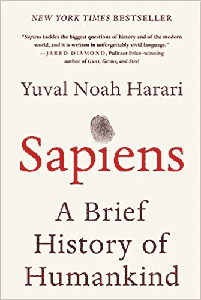
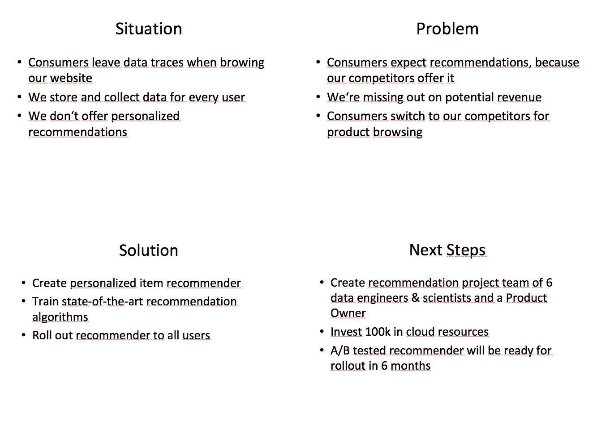
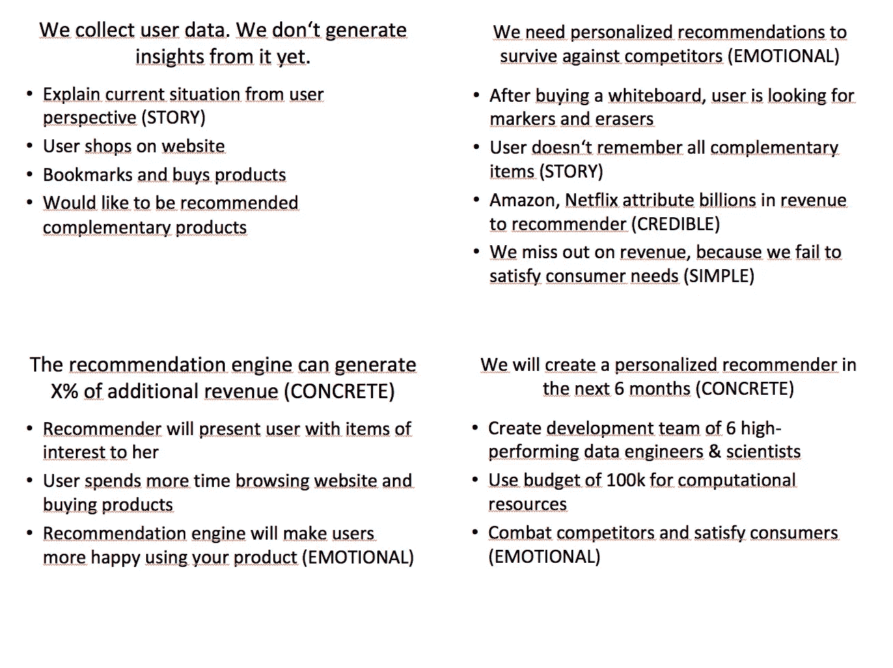

# 为数据科学家讲述故事

> 原文：<https://towardsdatascience.com/storytelling-for-data-scientists-317c2723aa31?source=collection_archive---------4----------------------->

## [人工智能项目管理](https://towardsdatascience.com/tagged/project-management-ai)

## 将数据转化为故事来说服你的听众

Source: [https://bit.ly/2uX5enz](https://bit.ly/2uX5enz)

《哈佛商业评论》最近发表了一篇关于领先数据科学家实际工作的[文章](https://hbr.org/2018/08/what-data-scientists-really-do-according-to-35-data-scientists)。令人惊讶的是，关键技能是*沟通*，而不是统计模型的经验。

亚里士多德认为，要说服人们，你需要使用[精神气质、理性和情感](https://pathosethoslogos.com/)。精神特质建立了说话者的可信度，而标识诉诸于所使用的推理。然而，如果没有悲怆这种打动观众心灵的方式，这两部电影都毫无用处。当介绍他们的工作时，Homo 数据科学家通常会爱上因果的、数据驱动的推理。这通常是正确的辩论方式。但是为了唤起行动，数据科学家需要讲故事。

> 也许故事只是有灵魂的[数据](https://www.ted.com/talks/brene_brown_on_vulnerability)。— [布琳·布朗](https://www.goodreads.com/quotes/556598-maybe-stories-are-just-data-with-a-soul)

这篇文章提出了两个框架来组织演讲，并在情感上与听众建立联系。它会帮助你唤起你想要的行动。负责任地使用。

## 讲故事的语言

畅销书作家兼科学家尤瓦尔·赫拉利认为，语言是为了讲故事而发明的。与公众意见相反，语言的发明不是为了更有效地协调工作或制定军事计划。自石器时代以来，人类就用故事来安慰彼此，争论问题，并形成社会联盟。

> 人类是讲故事的动物。—格雷厄姆·斯威夫特，沃特兰

Source: [https://amzn.to/2P8zum3](https://amzn.to/2P8zum3)

直到今天，人类都不是理性的生物。我们在故事中交谈、思考和梦想。当讨论公共政策选项时，我们会感性地而不是理性地进行推理。当听到一个发生在我们邻居朋友身上的故事时，我们会从这个故事中得出结论，而不是后退一步评估数据。

数据科学家每天都需要简单易懂地向利益相关者解释复杂模型的结果。他们还需要推介项目。无论做哪一件事，讲故事都应该是数据科学家的首选工具。

第一部分解释了 SPSN 框架，以创造一个结果驱动的故事情节。第二部分检查成功框架，使你的故事在情感上尽可能吸引人。

## 为您的演示文稿创建故事情节

Photo by [rawpixel](https://unsplash.com/photos/gNUMZjxd89w?utm_source=unsplash&utm_medium=referral&utm_content=creditCopyText) on [Unsplash](https://unsplash.com/?utm_source=unsplash&utm_medium=referral&utm_content=creditCopyText)

管理顾问们早就知道:你首先要努力创造一个解决方案，然后你需要一个连贯的故事情节来传达这个解决方案。自然，解决这个问题从分析可用数据开始。在这方面，咨询师和数据科学家非常相似。让我们在下一步中利用他们的一些技巧。

> 数据让人思考，情绪让人行动。安东尼奥·达马西奥

一个常用的组织陈述的框架是情况-问题-解决方案-下一步框架，是 SPSN 的缩写。它在 EY 围绕美联社[罗伯特·容](https://www.linkedin.com/in/robert-jung-strategy/)的数字化战略实践中得到完善。仅用四张幻灯片，你就能交流任何问题并触及其解决方案。

**情景:**首先，向你的听众描述一下当前的状态。你试图改变的现状是什么？

**问题:**接下来，图片问题。这种情况有什么问题？你想解决的痛苦在哪里？

**解决方案:**提出解决方案。你如何解决这个问题？你如何治愈疼痛？

**下一步:**你说服了观众。你下一步需要做什么？需要采取哪些措施？

让我们将这个框架应用于一个常见的数据科学目标。你是一家电子商务公司的一员，试图说服你的上司开发一个推荐系统。空白幻灯片可能看起来像这样。

正如你所看到的，SPNS 框架清楚地展示了我们需要的四张幻灯片来说服观众我们的想法。但是仍然缺少一些东西。接下来让我们用成功模型来丰富故事情节。

## 你故事中的盐

既然你已经创造了原始的故事情节，让我们把它变成一个故事。

Photo by [Dan Gold](https://unsplash.com/photos/CwUkXRfjNWo?utm_source=unsplash&utm_medium=referral&utm_content=creditCopyText) on [Unsplash](https://unsplash.com/search/photos/spices?utm_source=unsplash&utm_medium=referral&utm_content=creditCopyText)

奇普和丹·希斯在他们经常被引用的书《粘人》中分析了所有粘人故事的共同点。它们都在某种程度上使用了成功模式的元素。这个模型将帮助你的想法在演示结束后仍能被观众所接受。缩写代表以下内容:

**简单:**保持简单。数据科学家经常会爱上技术细节。真正专注于你试图传达的最重要的信息。

**出乎意料:**利用惊喜的元素来获得观众的注意。打破预期模式。

**具体:**用具体例子。帮助你的听众或读者描绘出你试图解决的情况。

**可信:**获得可信的资源来支持你的主张。使用数据或外部验证，让你的故事可信。

**情感:**记住，不是你的数字会让人在意，而是你的人物故事会让人在意。我们希望帮助人们，而不仅仅是降低成本或提高效率。诉诸于恐惧、快乐、惊讶、悲伤和爱恨五种情绪。

**故事:**每个故事都有一个英雄，一个要克服的障碍和一个幸福的结局。试着用你的观点编一个故事来帮助它坚持下去。

让我们将这些元素添加到空白结构中，为我们的故事增添趣味。

如您所见，我们在故事情节中融入了大部分成功元素。虽然这并不是每个好故事所必需的，但肯定会有所帮助。

第三步，你将为你的演示配上视觉效果。视觉效果越多，要点越少越好。插入贵公司的收入图表并使用公司风格指南。无论你如何进行，你的故事情节现在已经很清楚了。

xPhoto by [rawpixel](https://unsplash.com/photos/9NmEdEZAZus?utm_source=unsplash&utm_medium=referral&utm_content=creditCopyText) on [Unsplash](https://unsplash.com/?utm_source=unsplash&utm_medium=referral&utm_content=creditCopyText)

数据科学家必须有效沟通。您已经看到了如何利用讲故事的力量将数字转化为情感和行动。当你准备下一个演示、帖子或演讲时，请记住这个混合框架。会有回报的。

## **关键要点:**

*   为了说服人们，讲一个故事
*   使用情景-问题-解决方案-后续步骤框架奠定基础
*   整合成功元素，创造一个故事

## 关闭

亚马逊首席执行官杰夫·贝索斯禁止在高管会议上使用幻灯片。相反，他要求演讲者以叙述的方式写 6 页的备忘录。它可以展示用户、团队成员或媒体如何撰写关于虚拟新产品的故事。杰夫明白讲故事的力量。你知道吗？

## 附加材料

*   尤瓦尔·赫拉利— [智人](https://amzn.to/2P8zum3)
*   奇普&丹·希斯— [制成贴](https://smile.amazon.com/gp/product/B000N2HCKQ?pf_rd_p=d1f45e03-8b73-4c9a-9beb-4819111bef9a&pf_rd_r=2W8YS9YZPQMZ7G185VXJ)
*   张克帆·戈特沙尔— [讲故事的动物](https://smile.amazon.com/Storytelling-Animal-Stories-Make-Human/dp/0544002342/ref=mt_paperback?_encoding=UTF8&me=&qid=1535577777)

 [## 如何讲一个有说服力的故事

### 两种讲故事的结构将帮助你在生活和商业中获得成功

medium.com](https://medium.com/the-mission/how-to-tell-a-persuasive-story-e5ab4689cada)  [## 光有数据是不会让你起立鼓掌的

### 几年前，布琳·布朗博士在 TEDx 休斯顿发表了一个关于“脆弱的力量”的演讲。作为一个…

hbr.org](https://hbr.org/2014/04/data-alone-wont-get-you-a-standing-ovation)