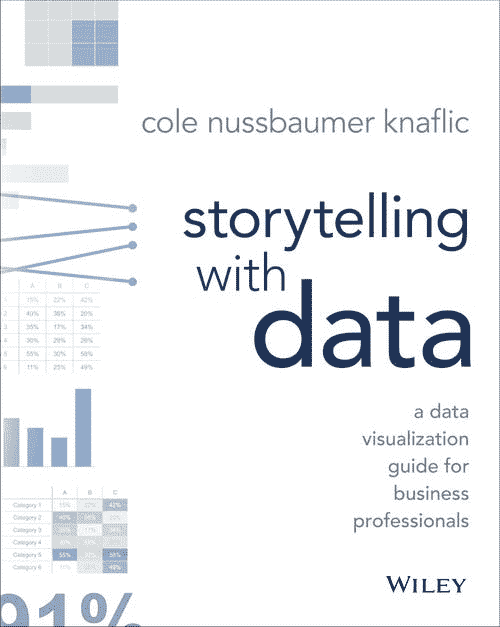

# 用数据讲故事:商业专家数据可视化指南

> 原文：<https://towardsdatascience.com/storytelling-with-data-a-data-visualization-guide-for-business-professionals-97d50512b407?source=collection_archive---------3----------------------->

## 对于任何需要使用数据与他人交流的人

所以你想用数据创造更好的故事。此外，您还希望创建更好的数据可视化，从而更好地了解人们，并潜在地获得一些可行的见解。

如果答案是**是的**，那么继续读下去。

在我的一篇文章[中，我在实际工作经验中从数据科学中学到的 5 个教训](/5-lessons-i-have-learned-from-data-science-in-real-working-experience-3532c1b41fd7)、**沟通技巧和讲故事**是我希望在加入实际工作环境之前能够意识到并学到的两个教训之一，因为这两个教训是如此重要*——我是认真的。*

*不久前，我碰巧读了一本书——**用数据讲故事:商务人士数据可视化指南**——作者是 [**科尔**](https://www.linkedin.com/in/colenussbaumer/),[用数据讲故事](http://www.storytellingwithdata.com/)的创始人，也是一位备受追捧的演讲人和作者，他的主题是“用数据有效沟通”。*

*在对铺天盖地的关于如何用数据提高你的故事讲述的在线资源感到沮丧之后，解释的模糊性和不同方法的普遍性只是让我停滞在同一点上。*

## *为什么是这本书而不是其他的？*

**

*[(Source)](https://www.amazon.com/gp/product/1119002257/ref=as_li_ss_tl?ie=UTF8&linkCode=ll1&tag=admond-20&linkId=af1cb6952e8b9bedac958cc6ffe4777f)*

> ***感同身受，简单明了。***

*在阅读这本书的整个过程中，科尔真的教会了我如何有效地与数据沟通— **同理心** — 以及数据可视化的核心和基础— **简单性**。*

*最棒的是，它教会了我如何在不丢失数据中最重要部分的情况下抓住观众的注意力。*

*好吧，我决定向你展示如何将你的数据转化为吸引你的读者的高影响力的视觉故事的步骤(更详细的说明可以在[书](https://www.amazon.com/gp/product/1119002257?ie=UTF8&creativeASIN=1119002257&linkCode=xm2&tag=storytellingwithdata-20)中找到),而不是详述我从这本书中学到的经验。*

*我们开始吧！*

# *1.理解上下文*

*注重解释性分析(**而非**探索性分析)和沟通。*

*对我来说，理解背景就是以商业背景的形式对你的观众的情境需求感同身受。你必须真正站在他们的立场上，看看他们从哪里来，并尽最大努力通过讲故事来回答他们的问题。*

*在这本书里，你会明白如何将你的数据转化为读者可以消费的信息。下面是它的外观的简要概述:*

*   ***我在和谁**沟通？*
*   ***我想让我的观众知道或做什么？***
*   ***我如何利用数据来帮助阐述我的观点？***

# *2.选择有效的视觉效果*

*如今，在常见的商业环境中，有如此多类型的图表泛滥，但其中只有**少数**将只适合**大多数**你的需求。*

*事实上，在某些情况下，您甚至不需要图形来显示数据，只需简单的文本即可。*

*因此，选择一个有效的视觉效果就是对你选择的视觉效果进行选择。在商业环境中，一些常用的视觉效果(如 Cole 所建议的)包括简单的文本、表格、热图、点和线图、条形图以及区域。*

*这里的描述绝不是详尽的，我强烈推荐你参考这本书以获得更多的细节。相信我，你会喜欢的！*

# *3.消除杂乱*

***对，杂乱。**期。*

*很多时候，我们太喜欢自己创造的视觉效果了，只是意识到(或者没有意识到)在一张图中有如此多的视觉元素占据了空间，却没有增加观众的理解。*

> *人类大脑的精神处理能力是有限的*

*杂乱只会使视觉更加复杂和难以理解，因此，观众的注意力可能会在我们没有注意到的情况下分散，这只是因为我们处于一种**自欺欺人的状态**我们的图表就像它本来应该的那样工作。*

*通过检查每一个视觉元素的需求，你会在书中找到各种实用的方法来逐步消除混乱。*

*还记得这项工作吗——移情？每一个视觉元素都应该满足观众的需求。*

# *4.在你想要的地方吸引注意力*

*一旦我们选择了一个有效的视觉效果并去除了所有不必要的混乱，这就是我们需要想出如何吸引观众注意力的地方。*

*要吸引观众的注意力，就要理解他们是如何看待我们的视觉传达并与之互动的，通常是下意识的。*

*科尔介绍了一个强大的工具——**前注意属性**来做到这一点。她解释复杂主题的独特方式是我喜欢这本书的主要原因之一。*

# *5.像设计师一样思考*

*把你的数据可视化想象成你的产品。*

*制作你自己的视觉效果——瞧！现在你成了设计师。太好了。我们继续吧。*

*从不同的角度像一个设计师一样思考，就是要很好地意识到数据可视化如何与你的观众沟通，以及观众如何与你的视觉效果互动。这两点之间的相互作用是一个优秀的数据可视化的基础。*

*书中讨论了 3 个关键要素，即**可及性和审美**。此外，书中还教授了更多的策略来让读者接受你的视觉设计。*

# *6.讲故事*

*最后一步讲故事的部分来了。*

*想象你刚刚看了一部精彩迷人的电影，故事情节精彩。你被带你踏上难忘旅程的故事所吸引，并最终引起你的情感反应。*

*几个月甚至一年后，你仍能清晰地记得故事情节。*

> *就我个人而言，我喜欢看电影，因为我相信电影是我们生活的反映，也许是以一种更夸张的叙事方式——但教训是一样的。*

*用故事从情感上吸引我们的观众，这是事实所不能做到的。*

*保持简单。*

*要真实。*

*不要为自己而沟通——***要为你的听众而沟通。****

*这个故事不适合你； ***这个故事是为他们准备的。****

*如果你擅长数据可视化，但在讲故事方面有困难。那么这本书是给你的。它教你如何用叙事结构从头到尾构建一个故事。*

*此外，还有一些有用的技巧可以让你的故事对观众来说更加清晰。*

## *最后的想法*

**

*[(Source)](https://unsplash.com/photos/-Q_t4SCN8c4)*

*感谢您的阅读。*

*最终，从数据中获得的见解总是相同的(前提是这些见解是正确的)。*

*但是使这些见解不同的是从这些见解中得出的影响和可行的计划。这种差异可以归结为你如何通过精彩的故事讲述来传达你的数据见解。*

*你可以在这里 得到本书 [**！**](https://www.amazon.com/gp/product/1119002257/ref=as_li_ss_tl?ie=UTF8&linkCode=ll1&tag=admond-20&linkId=af1cb6952e8b9bedac958cc6ffe4777f)*

*一如既往，如果您有任何问题或意见，请随时在下面留下您的反馈，或者您可以随时通过 [LinkedIn](https://www.linkedin.com/in/admond1994/) 联系我。在那之前，下一篇文章再见！😄*

## *关于作者*

*[**Admond Lee**](https://www.linkedin.com/in/admond1994/) 目前是东南亚排名第一的商业银行 API 平台[**Staq**](https://www.trystaq.com)**—**的联合创始人/首席技术官。*

*想要获得免费的每周数据科学和创业见解吗？*

*[**加入 Admond 的电子邮件简讯——Hustle Hub**](https://bit.ly/3pGF8jv)，每周他都会在那里分享可行的数据科学职业技巧、错误&以及从创建他的初创公司 Staq 中学到的东西。*

*你可以在 [LinkedIn](https://www.linkedin.com/in/admond1994/) 、 [Medium](https://medium.com/@admond1994) 、 [Twitter](https://twitter.com/admond1994) 、[脸书](https://www.facebook.com/admond1994)上和他联系。*

* [## 阿德蒙德·李

### 让每个人都能接触到数据科学。Admond 正在通过先进的社交分析和机器学习，利用可操作的见解帮助公司和数字营销机构实现营销投资回报。

www.admondlee.com](https://www.admondlee.com/)*