# 成为成功 Youtube 的策略:广泛的 Youtube 探索性分析(第 1/2 部分)

> 原文：<https://towardsdatascience.com/strategies-to-be-a-successful-youtuber-extensive-youtube-exploratory-analysis-part-1-2-40eee29554e6?source=collection_archive---------9----------------------->

为 Youtubers 开发数据驱动的策略

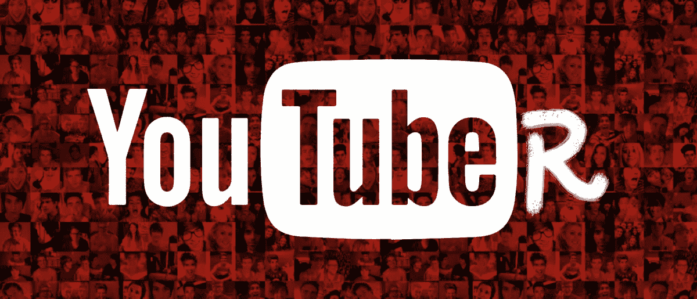

你通常花多长时间看 Youtube？你最喜欢的频道是什么？最近什么频道最受欢迎？Youtube 正在成为主要的社交网络平台之一，甚至是一个正在崛起的搜索引擎。用户甚至数字营销人员都明显将注意力从脸书转移到了 Youtube。Youtuber 现在是一颗冉冉升起的新星。他们用自己独特的内容与人们联系在一起。拥有超过数百万的用户，youtube 明星不仅通过观看视频来盈利，还通过开展自己的业务来盈利。

在这个不断变化的潮流中，我制定了一个计划，为 Youtubers 制定策略，并建立一个模型，根据它们的内容预测观看人数。这篇文章将分为两部分。在第一部分，我们将广泛地探索数据。然后在第二部分的[中，我们将建立一个带有单词嵌入的预测模型。我使用了来自](/strategies-to-be-a-successful-youtuber-extensive-youtube-exploratory-analysis-part-2-2-6862cd4f40be) [Kaggle](https://www.kaggle.com/datasnaek/youtube-new) 的数据，但是用 Youtube API 添加了一些。数据集和完整代码可在 [Github](https://github.com/jjone36/Youtube) 上获得。

# Youtube 上最大的频道有哪些？

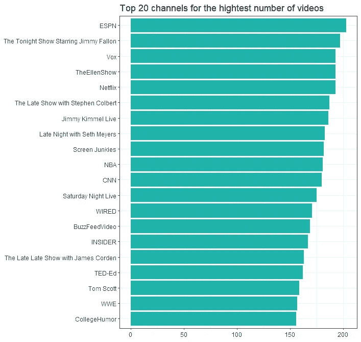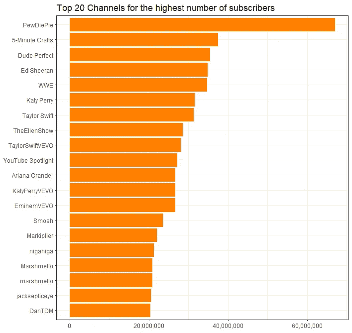

首先，我查找了拥有最多视频和订户的前 20 个频道。正如您在上面看到的，这两个频道列表互不相同。大多数有大量视频的频道都是电视节目、广播或组织，如*今夜秀、Vox、艾伦秀、*和*网飞*。另一方面，那些拥有大量订户的是音乐频道，如*艾德·希兰、泰勒·斯威夫特、阿姆、*和*爱莉安娜·格兰德*。

# Youtube 上最热门的话题是什么？

这次让我们更深入地探讨话题。共有 16 种主题，我统计了每个主题的视频和频道数量。Youtube 上你最喜欢的话题是哪个？有哪些热门且竞争激烈的话题？

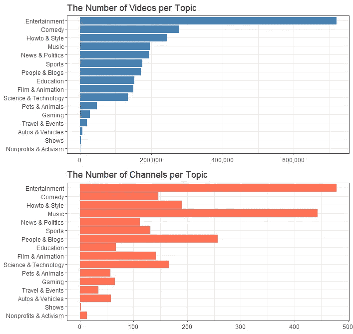

视频和频道号的分布显示出不同的模式。y 轴上的主题顺序是一样的。我按视频数量排列顺序，然后在频道剧情中设置相同，这样就很容易上下查看了。娱乐在两个情节中都是第一位的。*音乐，人物&博客，Howto &风格，*和*科学&科技*有大量的渠道。是否可以推断它们是最热门的话题？

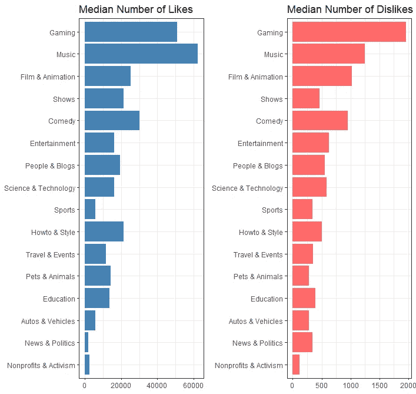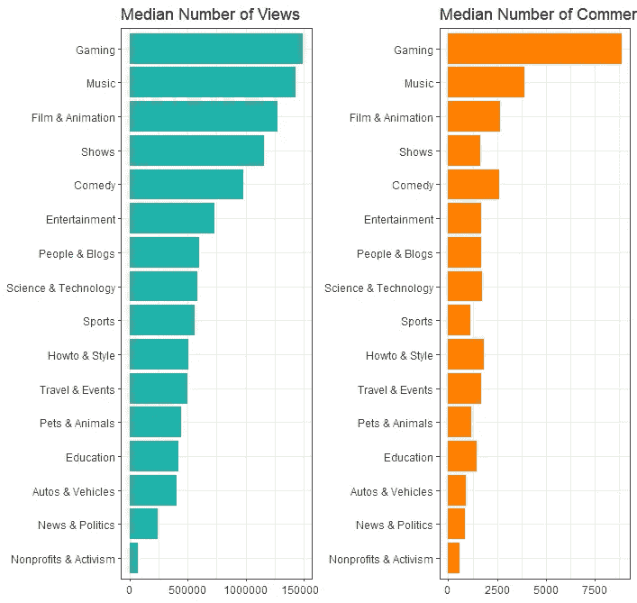

我统计了每个主题的喜欢、不喜欢、观点和评论的中位数。y 轴上的主题顺序也是一样的，所以您可以很容易地比较这四个计数。喜欢、不喜欢和评论计数的图表显示了类似的分布。有趣的是， *Gaming* 是最热门的频道，因为它在之前的剧情中拥有相对较少的频道和视频。

有视频和频道数量的剧情可以告诉你哪个话题有很多竞争对手。一个话题的频道越多，为了获得人们的关注，竞争就越多。另一方面，显示视频或观看次数的图表可以告诉你哪个话题最热门。他们可以告诉你人们的主要兴趣是什么。您还可以找到用户的喜欢和不喜欢的回应水平，每个主题的评论计数。例如，*娱乐*或*人物&博客在*视频数量和订阅量排名靠前，但回复率低于预期。

# 时间响应呢？

响应率也可以从时间段的角度来说。要多久才能成为潮流视频？每个主题的订阅者将有不同的及时性和活跃性，所以我们可以期待在时间分析不同的模式。

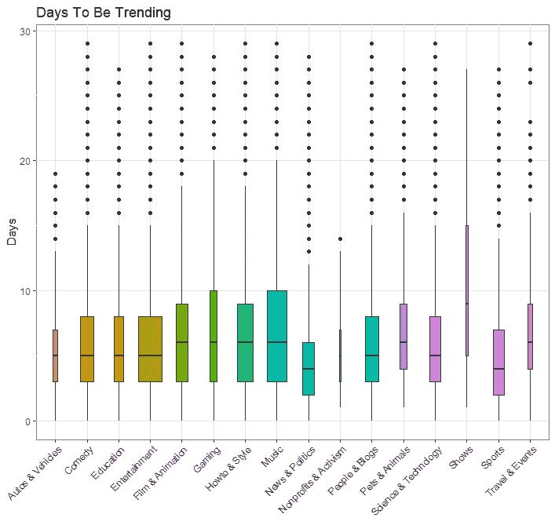

左边的图显示了每个主题需要流行的天数。大多数话题有相似的分布，但是*新闻&政治*和*体育*时间最短，而*节目*时间范围最大。右边的图表显示了一天中最流行的视频的用户数量。我们可以很容易地预计，它将需要大量的订户在一天内成为潮流，然而，它的价值范围很广。这可以推断出，订户数量不是观看的绝对因素。

这里方框的大小表示数据的大小。因此在我们的数据中，当天受到关注的*节目*视频很少，而时尚*娱乐*或*音乐*视频很多。这可以通过下面的柱状图更容易地理解。显示了一天中流行的视频数字，这与盒子的大小告诉我们的完全相同。

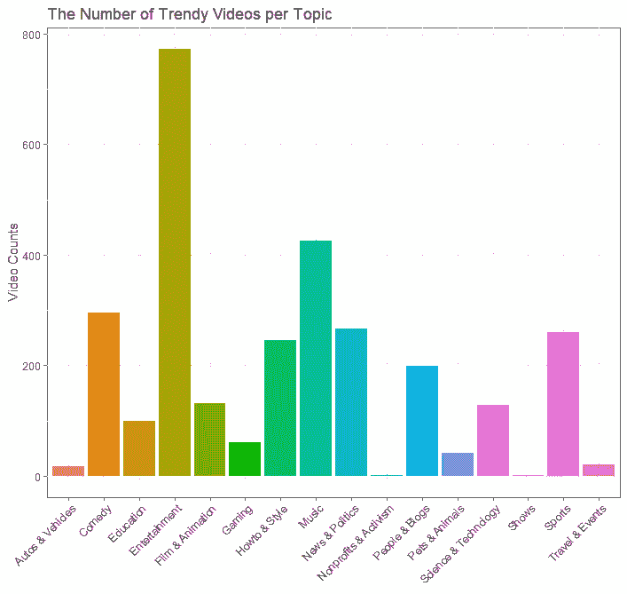

作为结论，视频的反应率在话题之间是不一样的。我们可以说，喜欢看*游戏*的人会积极地表达他们的意见和回应。像*新闻&政治*和*体育*这样传递最新消息的视频时间很短。迄今为止，娱乐和音乐一直高居榜首。但是请记住。很多人喜欢，很多竞争者。

# 建议用什么标题才能获得关注？

当我们浏览文本时，我们的感知是有局限的。所以标题的长度和标题的字数是吸引眼球的重要因素。标题长度对视图有影响吗？标题中包含多少单词是合适的？让我们从下面检查答案。

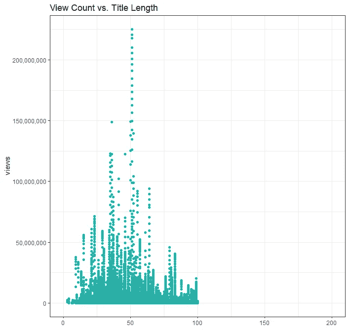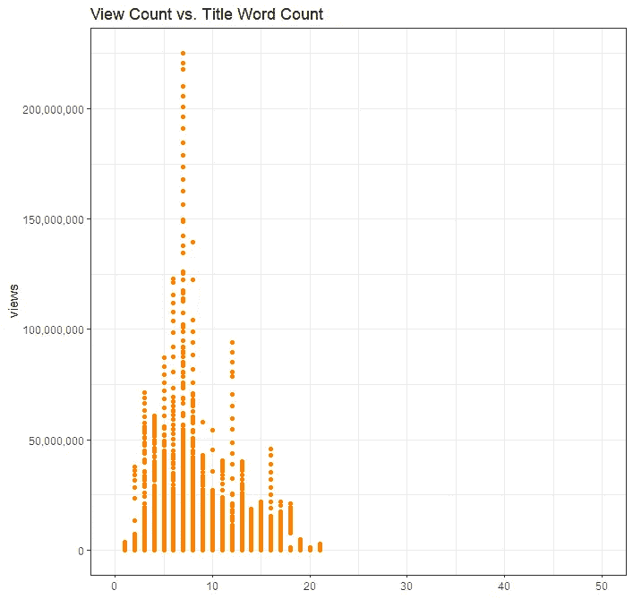

这些视频的标题少于 100 个字符，而浏览量最高的是 30 到 50 个字符。如果我们说一个单词通常有 5 或 6 个字符，这意味着标题中最好有 5 到 10 个单词。这与第二个图一致。字数不到 20，浏览量最高在 7 左右。因此一个 6 到 7 个字的标题可以获得更多的浏览。

# 标签越多真的意味着浏览量越多吗？

标签当然是一个重要的因素。但是我们应该使用多少标签呢？标签越多带来的浏览量越多真的是这样吗？

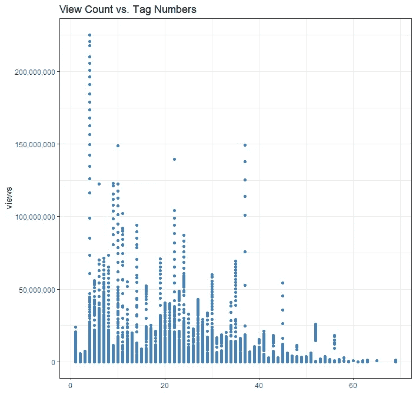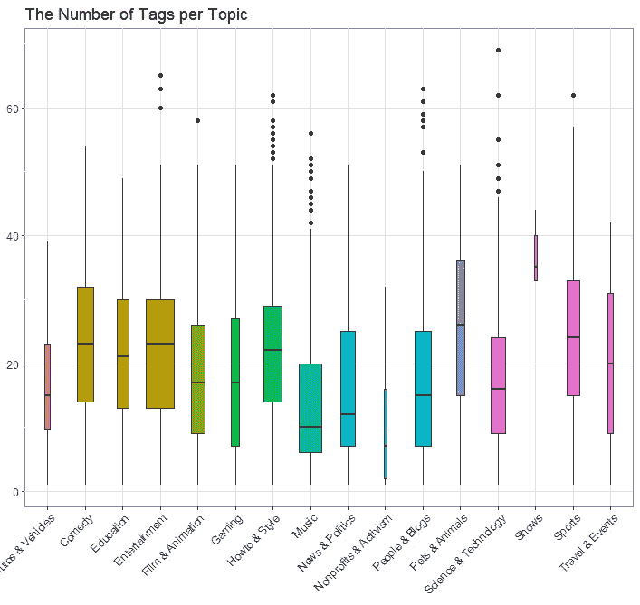

如图所示，标签的数量似乎与视图没有直接关系。最高浏览量为 4 次，但从数字上看没有明显的趋势。此外，通过正确的绘图，我们可以看到每个主题有不同的分布。这表明更多的是关于标签中有什么关键字，而不是有多少关键字。

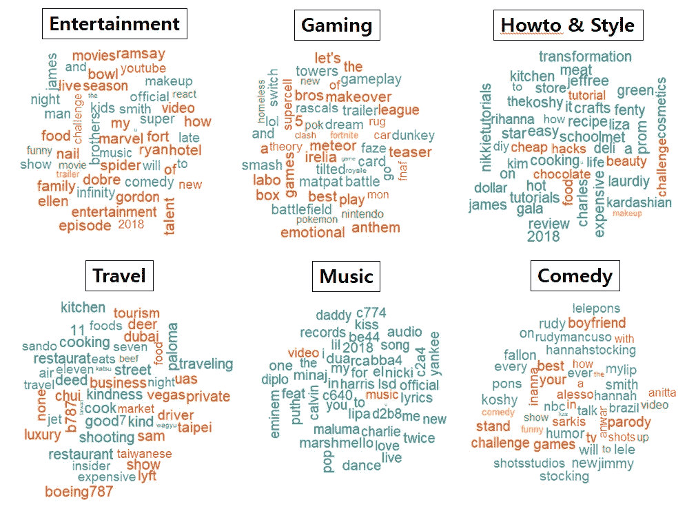

单词 cloud 显示了主题中经常使用的标签。我带来了*娱乐、音乐、游戏、喜剧、Howto &风格、*和*旅游*等例子。这些视频的浏览量超过 180 万次，占总浏览量的三分之一。虽然不能说那些观点是因为标签，但至少我们可以推断出人们对什么感兴趣，内容中有什么。

# 具有数字特征的绘图矩阵

最后，我使用 ggpairs 制作了所有数字变量的绘图矩阵。它有订阅者的数量、浏览次数、喜欢、不喜欢、评论、标题的长度、标题的字数和标签的数量。您可以轻松检查所有对的散点图和相关性。*喜欢*与*浏览量*和*评论数*相关。此绘图矩阵对于在开始更深入的分析之前查看要素之间的整体关系或在构建预测模型之前检查多重共线性非常有用。

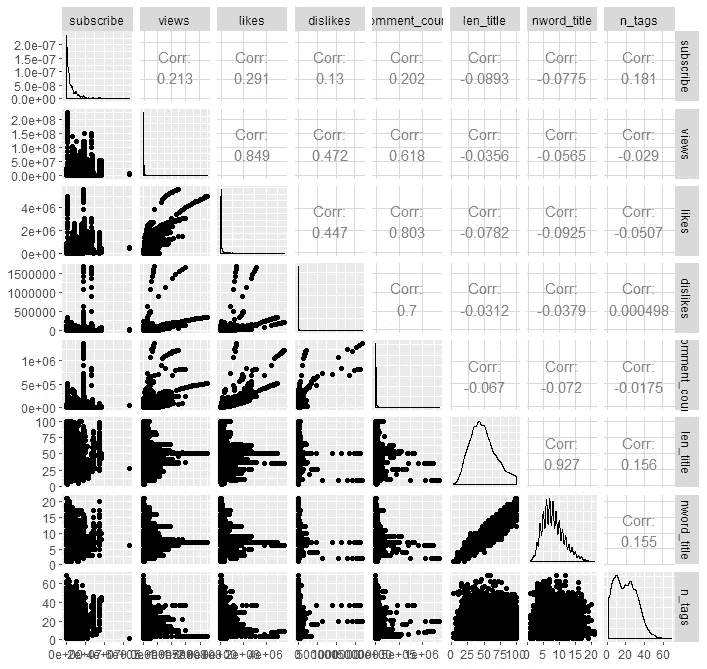

# 结论

让我回顾一下到目前为止我们已经完成的内容。

*   视频数量和订阅用户数量可用于评估热度和竞争力。和话题一起考虑的话，*娱乐*和*音乐*最受欢迎。
*   回复率可以从两个方面来考虑。当考虑喜欢、不喜欢和评论的数量时，*游戏*是高活跃用户最热门的话题。从时间段来看，像*新闻&政治*和*体育*等发布最新消息的频道反应最快。
*   标题的措辞很重要，6 到 7 个单词可以获得更多的浏览。
*   说到标签，包含关键词比仅仅有许多标签更重要。因此，需要知道什么是主要问题。

要成为一个成功的 youtuber，拥有成千上万的订阅者显然很重要。然而，制作包含人们真正关心的内容的视频与用户数量一样重要。因此，它需要有能力阅读什么是趋势，人们有什么样的需求。

为了进一步分析，我们可以选择一个特定的主题，并在副主题上工作。它会给我们更详细的信息。使用通道进行时间序列分析也是可能的。研究流行频道的增长模式就是一个很好的例子。这种研究不仅可以用于 youtubers，也可以用于数字营销人员。如果他们通过评论进行进一步的分析，他们可以收回对如何锁定客户的洞察力。

# 下一步是什么？

下一个故事是关于建立一个模型来预测视图！我将讨论单词嵌入，并建立一个预测视频观看量的模型。

 [## 成为成功 Youtube 的策略:广泛的 Youtube 探索性分析(第二部分)

### 揭开单词嵌入的神秘面纱并拟合模型以预测视图

towardsdatascience.com](/strategies-to-be-a-successful-youtuber-extensive-youtube-exploratory-analysis-part-2-2-6862cd4f40be) 

如果你想鼓励一个有抱负的数据科学家，请给一个或两个或三个掌声！我将非常感谢任何反馈，所以请在下面分享您的想法或通过 [LinkedIn](https://www.linkedin.com/in/jiwon-jeong/) 联系我。感谢您的阅读，再见👋