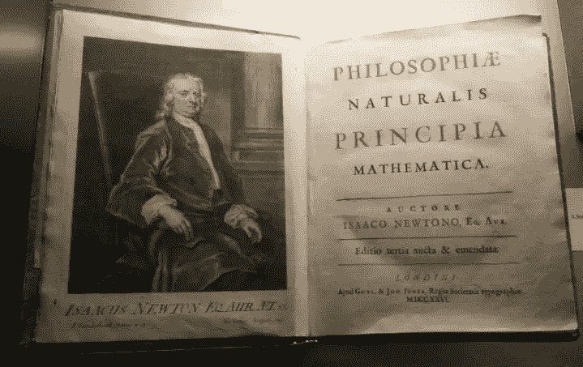
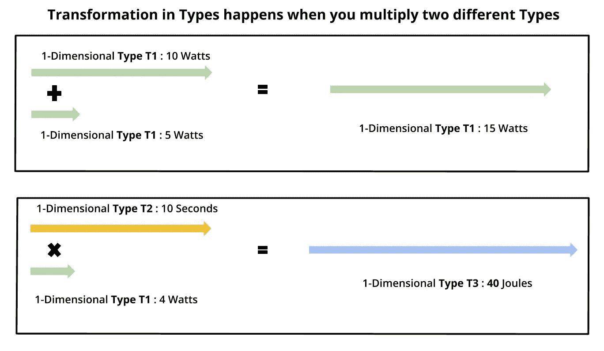
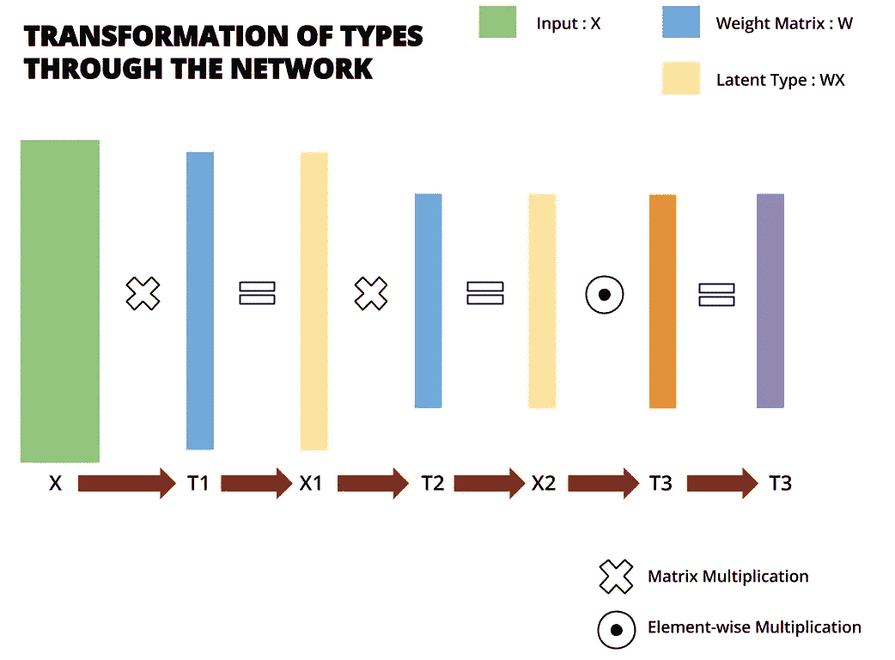
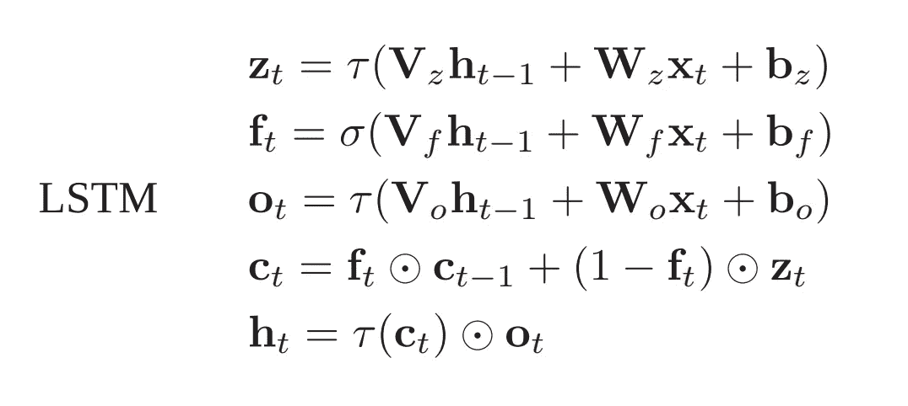
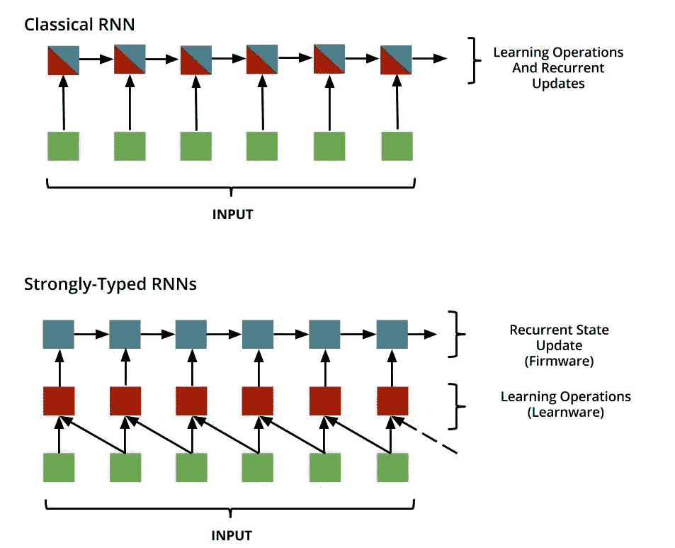
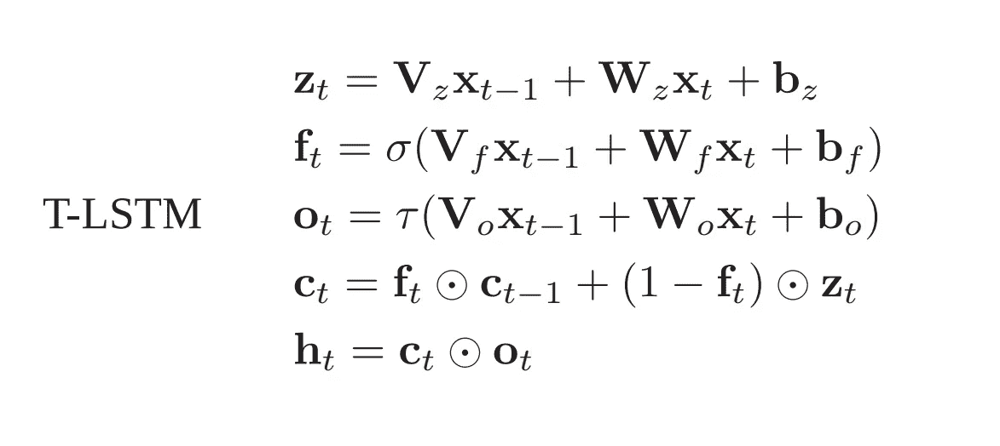

# 强类型递归神经网络

> 原文：<https://towardsdatascience.com/strongly-typed-recurrent-neural-networks-f84772696a86?source=collection_archive---------5----------------------->

## 我对深度学习原理的探索

“Newton” by William Blake.

这篇文章不代表我自己的想法，因为我很少有毫无根据的想法。这是我在寻找深度学习背后的指导原则时，对他人发表的观点进行的分析和思考。在这篇文章中，我提出了对深度学习原理的需求，然后我解释了[强类型递归神经网络的范例。](https://arxiv.org/abs/1602.02218)你可以跳过前半部分，但这能激发你展示后半部分的动力。

假设有递归神经网络的基本知识。

## **数学原理简史**

在艾萨克·牛顿爵士出版“[《哲学自然数学原理》](https://en.wikipedia.org/wiki/Philosophi%C3%A6_Naturalis_Principia_Mathematica)”之前，人们以两种不同的方式对待科学——或者他们称之为自然哲学。大多数科学研究要么基于演绎原理，要么基于归纳原理。定义将有助于:

**演绎法**是一种在假设为真理的前提下，从观察中得出结论的方法。
只要前提为真，演绎就是真的，即演绎在我们已知的基础上解释观察结果。这就限制了演绎方法在前提不成立的情况下得出结论。

**归纳法**是一种通过反复实验和观察来测试新思想和理论的方法。然而，这种方法承认得出的结论可能是错误的。这种方法打开了新思想的研究领域，承认新思想也可能是错误的。

牛顿——在双方的争论中失败了——采取了一种混合的方法来研究自然现象。他首先通过仔细的实验和观察建立了公理，然后他在已经建立的数学原理的基础上，基于演绎将那些公理形式化。这种对观测数据的逐步概括产生了《数学原理》,它给了我们三个运动定律，奠定了万有引力的原理。然后他用平方反比定律从数学上解释了开普勒的椭圆轨道。

“These forces being unknown, philosophers have hitherto attempted the search of Nature in vain; but I hope the principles here laid down will afford some light either to this or some truer method of natural philosophy” — Newton, Principia Preface.

对《原理》的一个有效批评是，牛顿通过自己的数学模型解释了力的定律，但他无法解释力背后的原因。对此，牛顿回答说，他是想解释万有引力的运作，而不是解释万有引力是由什么产生的。承认自己无知，但有一种新的想法，一种看待世界的新方式。它为美国提供了观察世界的新的数学工具和模型，被许多人认为是已经出版的最伟大的科学著作。正是这些源自归纳和演绎方法的结构化原则推动了科学进步，并最终改变了世界。

我们在深度学习中缺乏这些结构化的原则，但这是一个非常新的领域。然而，以目前该领域的进展速度和所做的大量研究来看，寻找深度学习原理还为时不早。

**深度学习指导原则的需求**

形成深度学习主干的想法结构合理。训练过程的工作机制是很好理解的。神经元、损失函数、矩阵运算和我们部署的架构的数学定义非常明确。但是我们无法解释为什么深度神经网络(DNN)工作得如此之好。有一些模糊的想法在流传，但没有确凿的研究来支持证据。随着我们深入架构，我们开始失去每一层学习的抽象概念，因此术语“**黑盒**在深度学习研究的媒体报道中很突出。

然而，这并没有阻止该领域的创新。 [Carlos E. Perez](https://medium.com/u/1928cbd0e69c?source=post_page-----f84772696a86--------------------------------) 在深度学习和炼金术之间进行了类比，在某种意义上，深度学习创新是炮制 DNN 架构、将它们与不同的超参数混合并应用各种成本函数的结果。他写过一篇大胆的帖子，质疑“[的必要性，深度学习创新仅仅是因为蛮力吗？](https://medium.com/intuitionmachine/the-brute-force-method-of-deep-learning-innovation-58b497323ae5)”。这表明，大多数研究都是基于演绎的，试图根据我们已知的理论来解释一个模型的工作原理。

凭借我仅有的一点经验，我开始意识到**我们并不了解通过这些深层神经网络的信息流**。我们不知道当信息通过各种神经网络架构时会发生什么。我们有一个模糊的想法，即隐藏层学习信息的简明表示，但是我们不知道有多少这样的层适合于对信息进行建模以满足我们的需求，并且我们不知道需要哪种层来对该信息进行建模。

很多次我读到一项新的研究，想知道研究人员是如何设计一个特定的模型的。什么思维过程，什么直觉，最重要的，什么数学？答案几乎总是一样的。他们依靠自己的直觉，尝试不同的架构，选择最有效的架构。这自然产生了疑问，有没有更好更简单的模型？**有没有可能，也许，我们对通过这些模型的信息流还不够了解，因此我们被我们能设计的东西所限制。**

这表明需要一种归纳方法来提出定义信息流数学的新思想，而一篇旨在这样做的论文就是强类型递归神经网络。

## **强类型递归神经网络**

本文的思想来源于物理学和函数式编程。在物理学中，我们有同质性原理来约束不同类型的两个量之间的运算。例如，你不能把 27 牛顿的力加到 35 千克的质量上。

同样，本文探讨了信息也可能是不同种类的想法，并在流经深层神经网络时改变其类型。作者使用了优美的措辞:

> “一个范例是物理学家从自然中雕刻出来的测量系统。它规定了表示标准化测量设备读数的单位(例如温度计的开尔文和时钟的秒)以及组合它们的规则。”

在我讨论文件的技术细节之前，我想反映一下这里表达的观点。物理学家观察了这个世界，并为热、力、压力等自然现象设计了一套测量系统。，通过归纳推理。深度思维的戴密斯·哈萨比斯认为信息和能量或物质一样是基本的存在。因此，对于研究人员来说，开拓一种新的信息测量系统，开发一种新的数学来理解通过深度神经网络的信息流是很自然的。这篇论文是朝着这个方向迈出的漂亮的一步。

他们引入**强类型准线性代数**来表示 DNNs 中的信息流，我用我理解的简单术语解释这些定理。

*   **定理 1:一个类型(T)是一个在‘d’维中具有正交基的*向量空间。***
    就像二维欧氏空间中的一个点由两个正交基的组合来表示(x 坐标，和 y 坐标；正交意味着 x 和 y 坐标是彼此独立的)，一个信息可以在称为“类型”的 d 维空间中表示。
*   **定理 2:信息可以有多种类型，代表不同的解读。当信息流经深层神经网络的不同部分时，它的类型会发生变化。**
*   **定理 3:信息可以通过在特定类型中进行一元或二元运算来改变。
    *这些操作保留了信息的类型。
    *不允许两个不同类型之间的二元运算。**
    这类似于通过对特定二维空间中的 x 和 y 分量进行一元或二元运算来改变二维空间中的点的坐标。但是，只允许少数操作。
    **一元运算:{tanh，relu，sigmoid，标量乘法等。}**
    **二元运算:{+，-，max，min}**

我试图通过用一维向量空间进行类比来解释这种类型的范例:

*   **定理 4:** 一个**型变换(T1 → T2)** 是通过两个不同型之间的一个**矩阵乘法**来实现的。
*   **定理 5:**类型 T1、**和**类型 T2** 之间的元素乘法**导致从类型 T1 到类型 T2 的**直接转换。** 这与定理 4 不同，因为 T1 类型与 T2 类型的“矩阵乘法”将产生 T3 类型。但是，类型 T1 与类型 T2 的“元素乘法”将产生类型 T2。

Types of the Information changes as it passes through the Deep Neural Network. This is because of various Matrix Multiplications and Elemenwise Multiplications.

这是基于归纳的推理。这些操作模式是通过观察 rnn 的行为而制定的。他们要带着这个去哪里？

这些定理将深度神经网络分为两类。**强类型**(类型一致)**弱类型**(类型不一致)。

如果将这些约束应用于经典架构，如香草 RNNs、LSTMs 和 GRUs，似乎这些 ***经典网络是*** ***弱类型*** *，*即它们具有由于添加两种不同类型而产生的类型不一致。让我们以 LSTMs 为例；更新公式为:

在文中，一个数学证明表明这种结构是类型不一致的，为了保持简单性，我省略了数学证明。然而我提供了一个直观的解释。考虑上述定理，输出 **h[t]取决于它的前一状态** **h[t-1]和输入 x[t]。**所以:

1.  如果我们假设 h[t-1]是 h 型的。
2.  假设输入 x 是 x 类型。
3.  假设加权矩阵乘以 h[t-1]和 x[t]，将它们各自的类型改变为允许它们之间二元运算的单个类型 Y。这意味着 h[t]将是 y 类型。
4.  现在，h[t]和 h[t-1]表示跨不同时间步长的相同类型的信息。所以，这意味着 Y 型和 h 型是一样的，也就是说，没有类型转换发生。
5.  但是，根据定理 4，矩阵乘法将导致类型转换，本质上意味着类型 Y 不能与类型 h 相同。这推翻了我们在(4)中所做的假设。因此，类型 Y 不同于类型 h，这是不一致的，因为“h”应该在所有状态中保持它的类型。

发生这种情况是因为存在递归关系，即当前状态依赖于前一状态。在经典架构中，递归关系也会导致爆炸梯度。因此，受函数式编程的启发，作者介绍了一种设计 RNN 单元的新范式。这带来了更好、更快的架构，也让我看到了电池设计的前景，我开始觉得它的方程看起来很美。

## **Learnware 和固件的典范**

我们不能从 RNNs 中删除递归关系，因为递归定义了 RNNs。但是，我们可以把 RNN 细胞分成两个区块。一个模块进行学习，另一个模块维护递归关系。术语是 **Learnware(无状态)**和**固件(状态相关)**。

Abstraction showing the difference between RNN and T-RNN. The paradigm of Learnware and Firmware enables parallel operations, thus making computation much faster.

这个想法很简单，但是很强大。Learnware 将具有学习参数，仅取决于输入。并且固件将采用这些学习到的参数并进行依赖于状态的循环操作来保存该存储器。请注意，学习阶段和递归阶段之间的**区别支持学习阶段中的并行性。这使得计算速度更快。**

由于没有状态更新返回到 learnware 中，**在长时间内不会有任何梯度爆炸**，因为学习是在输入上发生的。这也意味着**不需要对输入**应用非线性来抑制它。他们在论文中用数学方法证明了这一点。基于这个范例，他们设计了一个新的 LSTM 单元块，它是强类型的。他们称之为 T-LSTMs:

看看这些方程。输入门、遗忘命运和输出门从输入数据中学习。单元状态包含必须传递给下一时间步的信息，输出取决于该单元状态和输出门。文中还有进一步的探索和推论，我就不深究了。当我获得丰富的计算资源时，我会亲自尝试这些想法。

总之，以我的理解，强类型 RNNs 的优点是:

*   强类型化信息流似乎比假设所有信息都是同类的更合理。
*   Learnware 和固件之间的区别是一个定义性的设计原则，比经典设计更容易理解。它解决了分解渐变的问题，从而消除了对渐变裁剪的需要。
*   借助 Learnware 和固件的强大功能，实现并行处理。
*   由于减少了非线性，计算的复杂性已经降低，并且该论文报道强类型 lstm 比经典 lstm 快大约 1.6 倍。
*   基于元素的状态更新使架构更加稳定。
*   另一个有趣的发现是，强类型体系结构在各种任务中具有较低的训练错误。

强类型指导原则显示出比经典架构稍好的结果，然而，作者说他们没有做足够的实验。虽然后来，**[**qrns**](https://einstein.ai/research/new-neural-network-building-block-allows-faster-and-more-accurate-text-understanding)**出现了，采用了比经典 LSTMs** 快 16 倍的强类型设计的知识。因此，我的结论是，这种限制信息流的想法有些分量，需要进一步探索。**

**最后，我将再次强调深度学习原理的必要性。我个人需要它来尝试不同的架构，但我缺乏资源来进行研究实验室所做的大规模实验。我的直觉告诉我，强类型深度学习不会导致人工智能，而是进一步借鉴深度学习和炼金术之间的类比；炼金术被用来实现一个雄心勃勃的目标，即找到长生不老药——就像深度学习试图解决智力问题一样——但相反，我们发现了化学。天啊，结果还不错。**

***我感谢*[*David Balduzzi*](https://www.linkedin.com/in/david-balduzzi-8a964130/?ppe=1)*，帮助我理解这篇论文背后的思想。***