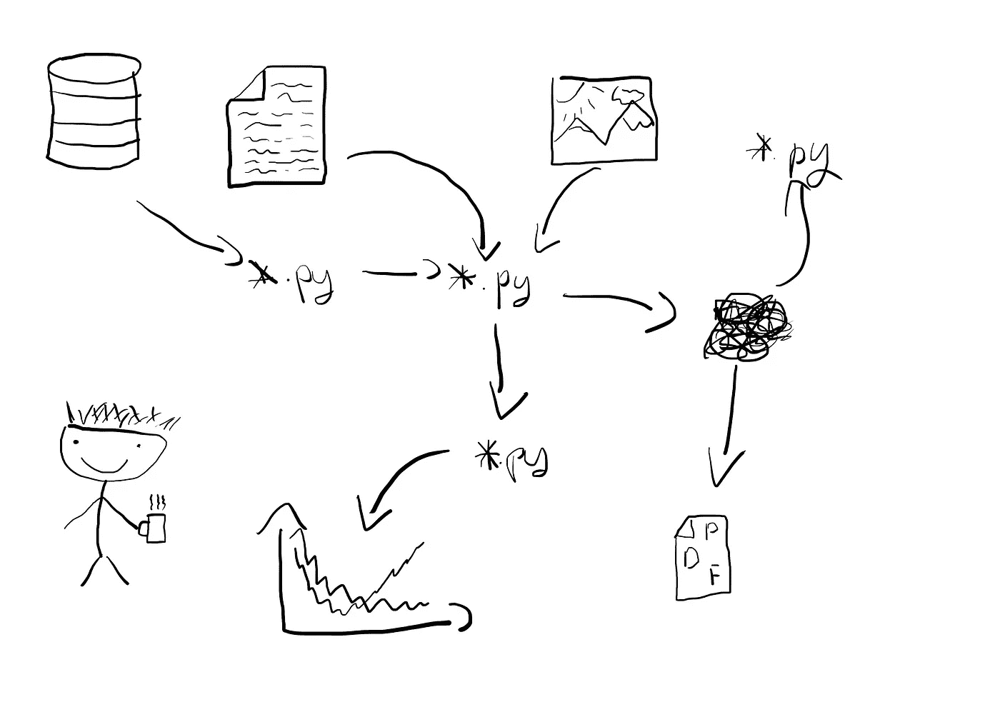
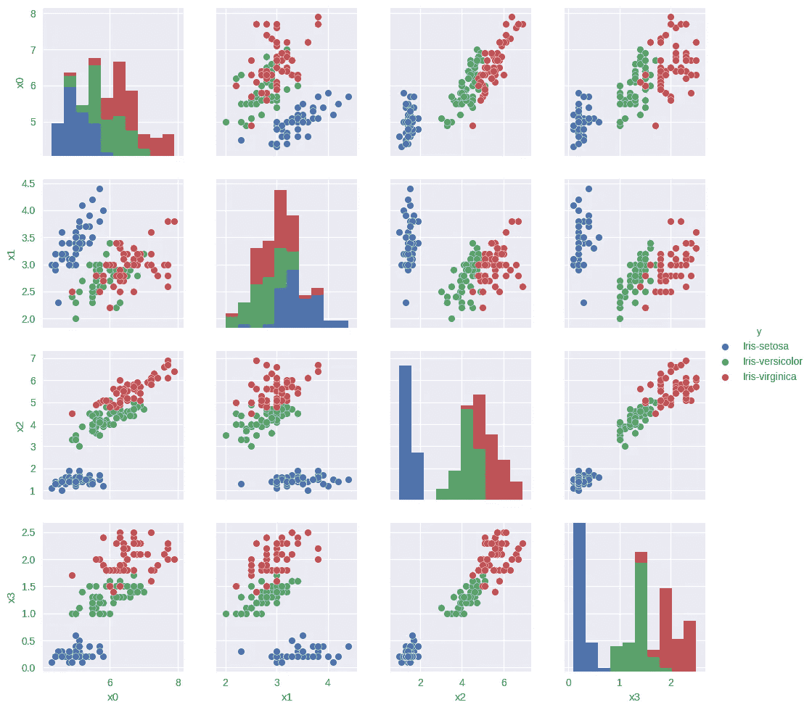
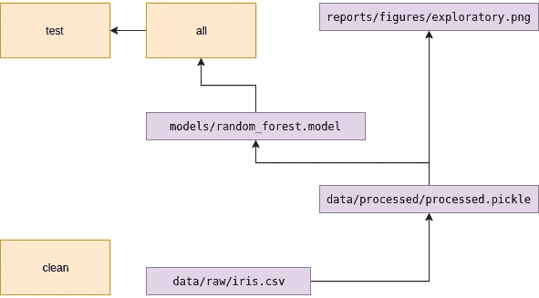

# 机器学习项目的结构和自动化工作流程—第 2 部分

> 原文：<https://towardsdatascience.com/structure-and-automated-workflow-for-a-machine-learning-project-part-2-b5b420625102?source=collection_archive---------1----------------------->



H 我！我希望前一部分是有用的。今天，我们将讨论一些其他方面。我们将从预处理数据开始，并执行简单的探索性分析。然后我将向您展示如何创建自动化测试。最后，我们将训练一个模型。请记住，我将此描述为一个过程，而不仅仅是显示最终结果；)

以防你错过，第一部分是[这里是](https://medium.com/towards-data-science/structure-and-automated-workflow-for-a-machine-learning-project-2fa30d661c1e)。

# 介绍

首先，我们需要添加一些额外的包。这是今天的完整列表。

```
**dependencies:** - python=3.5
 - numpy
 - scipy
 - scikit-learn
 - jupyter
 - requests
 - pandas
 - seaborn
 - click
 - openpyxl
 - **pip:** - watermark
   - pytest
```

对于探索，我个人更喜欢用 jupyter 笔记本。让我们在目录`notebooks/00-initial-exploration.ipynb`中创建一个

```
jupyter notebook
```

这个`00`非常重要——它指示了执行的顺序。

笔记本的第一个单元格包含:

```
%load_ext watermark
%watermark -v -n -m -p numpy,scipy,sklearn,pandas
```

这将加载*水印*扩展并打印关于运行平台的详细信息。这对其他人很有用，特别是当他们很难复制你的结果时。我的机器的输出:

```
Mon May 29 2017CPython 3.5.3
IPython 6.0.0numpy 1.12.1
scipy 0.19.0
sklearn 0.18.1
pandas 0.20.1compiler : MSC v.1900 64 bit (AMD64)
system : Windows
release : 7
machine : AMD64
processor : Intel64 Family 6 Model 69 Stepping 1, GenuineIntel
CPU cores : 4
interpreter: 64bit
```

# 探测

在下一个单元格中，我们导入所需的库并存储根目录——这非常有用。

```
%matplotlib inline
import pandas as pd
import numpy as np
import seaborn as sns
import os
PROJ_ROOT = os.path.abspath(os.path.join(os.pardir))
print(PROJ_ROOT)
```

稍后，我们想要实际加载并查看数据:

```
data_fname = os.path.join(PROJ_ROOT, ‘data’, ‘raw’, ‘iris.csv’)
dframe = pd.read_csv(data_fname, header=None)
dframe.head()
```

输出:

```
0 1 2 3 4 
0 5.1 3.5 1.4 0.2 Iris-setosa 
1 4.9 3.0 1.4 0.2 Iris-setosa 
2 4.7 3.2 1.3 0.2 Iris-setosa 
3 4.6 3.1 1.5 0.2 Iris-setosa 
4 5.0 3.6 1.4 0.2 Iris-setosa 
```

我们知道第 4 列包含我们想要预测的标签。由于 *iris* 是著名的数据集，我们也知道列【0，3】中特征的名称——它们是:*萼片长度*、*萼片宽度*、*花瓣长度*和*花瓣宽度*。但出于练习目的，让我们假设我们不知道它们，并给出通用名称:

```
dframe.columns = [‘x0’, ‘x1’, ‘x2’, ‘x3’, ‘y’]
dframe.head() 
```

输出:

```
 x0 x1 x2 x3 y 
0 5.1 3.5 1.4 0.2 Iris-setosa 
1 4.9 3.0 1.4 0.2 Iris-setosa 
2 4.7 3.2 1.3 0.2 Iris-setosa 
3 4.6 3.1 1.5 0.2 Iris-setosa 
4 5.0 3.6 1.4 0.2 Iris-setosa 
```

现在是施展魔法的时候了:

```
sns.pairplot(dframe, vars=[‘x0’, ‘x1’, ‘x2’, ‘x3’], hue=’y’)
```



哇哦。通过使用 *seaborn* 我们能够绘制所有变量之间的配对分布。这对于直观地检查数据非常有用。而且第一次用的时候印象深刻；)

# 重构

到目前为止，我们执行了两个基本步骤

*   加载和标记数据
*   外观检验

笔记本对于实验来说很棒，但是对于执行这个过程来说却很差。现在，我们将代码转移到`src`。此外，我们将通过两个新项目扩展我们的渠道:

*   标签-数据:添加标签(x0，…，y)并将其保存回来
*   探索性-可视化生成绘图并保存它

我们可能会争论我们是否真的需要仅仅通过添加列名来保存回数据。可能不会，但通常我们的第一轮预处理会更复杂。

在文件`src/data/preprocess.py`中

我们真的需要 read_raw_data 方法吗？只有一行代码。是的，我们需要。您的同事会记住非标准 csv 文件的所有参数吗？请记住，读取数据可能要复杂得多，包括 PCA 之类的东西。在`preprocess_data`中，我复制了一帧。这是因为我喜欢参数不可变的函数式风格。

为了避免枚举所有特征，这里有一个函数。

另外一个值得一提的是这个 excel 文件。它不会在任何地方使用，但是，我发现它非常有用，可以导出 Excel 文件，以便在需要时手动查看。但是这是完全可选的(考虑到这一点，它也使用一个可选参数)。

为了使其完整，创建包含内容的文件`src/data/__init__.py`:

```
**from** .preprocess **import** read_raw_data, read_processed_data, preprocess_data, get_label, get_featues
```

# 重构情节

绘图代码要简单得多:

`src/visualization/exploratory.py`

我将 matplotib 后端设置为`agg`，因为我发现在我的系统上使用默认的(QtAgg)会导致不正确的渲染。

我们还必须像第一部分一样创建`reports/figures/.gitkeep`文件。

# 更新 Makefile

更新依赖关系图的时间。对于绘制代码:

```
reports/figures/exploratory.png: data/processed/processed.pickle
   python src/visualization/exploratory.py $< $@
```

上次我解释了`<@`的意思。概括地说，这是第一个先决条件(本例中为`data/processed/processed.pickle`)。因此，`$<`表示第一个目标。所以，上述规则相当于:

```
reports/figures/exploratory.png: data/processed/processed.pickle
   python src/visualization/exploratory.py data/processed/processed.pickle reports/figures/exploratory.png
```

我他妈的为什么要在乎`$@`和`$<`？

你可能想知道为什么我使用这个疯狂的符号，而不是仅仅粘贴文件名两次。答案是:因为 make 可以使用泛型规则。

设想如下规律:

```
%.o : %.cpp
 gcc $< -o $@
```

这将使用`gcc`将每个`*.c`文件编译成相应的`*.o`。我们将在后面使用这个语法。

预处理规则:

```
data/processed/processed.pickle: data/raw/iris.csv
      python src/data/preprocess.py $< $@ --excel data/processed/processed.xlsx
```

清除规则:

```
clean:
   rm -f data/raw/*.csv
   rm -f data/processed/*.pickle
   rm -f data/processed/*.xlsx
   rm -f reports/figures/*.png
```

和所有:

```
all: data/processed/processed.pickle reports/figures/exploratory.png
```

现在我们可以更新笔记本了！这将为我们提供如下信息:

```
%load_ext watermark
%watermark -v -n -m -p numpy,scipy,sklearn,pandas

%matplotlib inline
import pandas as pd
import numpy as np
import seaborn as sns
import os
PROJ_ROOT = os.path.abspath(os.path.join(os.pardir))
print(PROJ_ROOT)
import sys
sys.path.append(os.path.join(PROJ_ROOT, ‘src’))
```

从`src`导入代码

```
import sys
sys.path.append(os.path.join(PROJ_ROOT, ‘src’))
from data.preprocess import read_raw_data, preprocess_data
from visualization.exploratory import exploratory_visualization
```

加载原始数据

```
data_fname = os.path.join(PROJ_ROOT, ‘data’, ‘raw’, ‘iris.csv’)
raw_data = read_raw_data(data_fname)
raw_data.head()
```

预处理数据

```
preprocessed_data = preprocess_data(raw_data)
preprocessed_data.head()
```

和绘图

```
exploratory_visualization(preprocessed_data) 
```

# 重新加载模块

一切都很好，除了一件事。我改变了主意，决定在图上使用核密度估计。将`exploratory.py`修改为`...pairplot(dframe, diag_kind=**’kde’**, vars=[**‘x0’..**`后，我重新运行笔记本，没有任何反应。这是因为 jupyter 没有重新加载我的模块。要解决这个问题，请添加

```
%load_ext autoreload
%autoreload 2
```

笔记本的开头。它会导致在执行代码时重新加载模块。

# 测试

自动化测试可以提供很多价值。为机器学习项目设计测试是另一篇文章的主题，所以这里我将只介绍非常基础的内容。

现在，我们将只测试我们关于数据形状的假设。创建文件`src/tests/test_data.py`

它包含两个简单的测试。首先，检查原始数据是否具有假定的维度。第二个检查是否有 4 个特征和 1 个标签。实际测试是通过使用内置的`assert`语句来完成的。要运行测试会话，请在项目根目录下打开终端并键入:

```
pytest src
```

结果应该是这样的:

```
=========== test session starts ===========
platform linux -- Python 3.5.2, pytest-3.1.1, py-1.4.34, pluggy-0.4.0
rootdir: /home/xevaquor/code/overcome-the-chaos, inifile:
collected 2 itemssrc/tests/test_data.py ..======== 2 passed in 0.28 seconds =========
```

我们还应该将测试纳入我们的工作流程:

```
test: all
   pytest src
```

不要忘记把它标记为。假的，因为它不创建任何文件

```
.PHONY: all clean test
```

# 创建模型

最后，让我们创建一个模型。它可以使用各种库来实现——sk learn、theano、xgboost 等等，所以最好有一个通用的接口。`src/models/random_forest.py`。

这很简单。我只想提一下保存和加载方法。它们在这里是为了提供一种方便的方法来持久化训练好的模型。每个模型应该自己定义它，因为它有很强的依赖性。

> 注意:我跳过模型评估。这是一个非常重要的话题，但在这里没有它的位置。

# 训练模型

在我们的渠道中，我们还需要模特培训。

这个很简单。只需加载预处理数据并将训练好的模型保存到一个文件中。当然，我们必须确保训练模型目录的存在。

```
mkdir models
touch models/.gitkeep
git add --force models/.gitkeep
```

并更新 Makefile

```
all: reports/figures/exploratory.png models/random_forest.modelclean:
   rm -f data/raw/*.csv
   rm -f data/processed/*.pickle
   rm -f data/processed/*.xlsx
   rm -f reports/figures/*.png
   rm -f models/*.model...models/random_forest.model: data/processed/processed.pickle
   python src/models/train_model.py $< $@
```

> 自动化测试的示例思想是检查模型是否达到合理的精确度水平。

整个依赖关系图现在看起来如下:



# 摘要

我们今天做了很多。在接下来的最后一部分，我将向您展示如何部署您的模型。我们将创建一个简单的 web 服务，并使用 docker 使其在线。如果你想阅读一些东西，请在评论中告诉我。

一会儿见:)