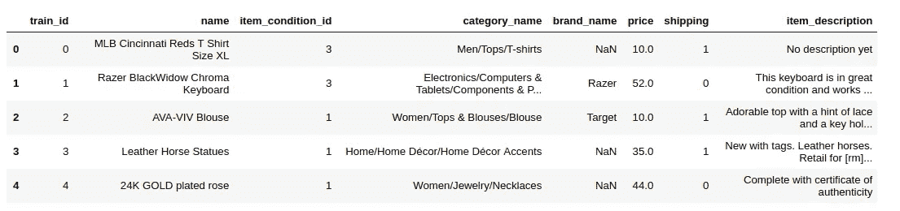
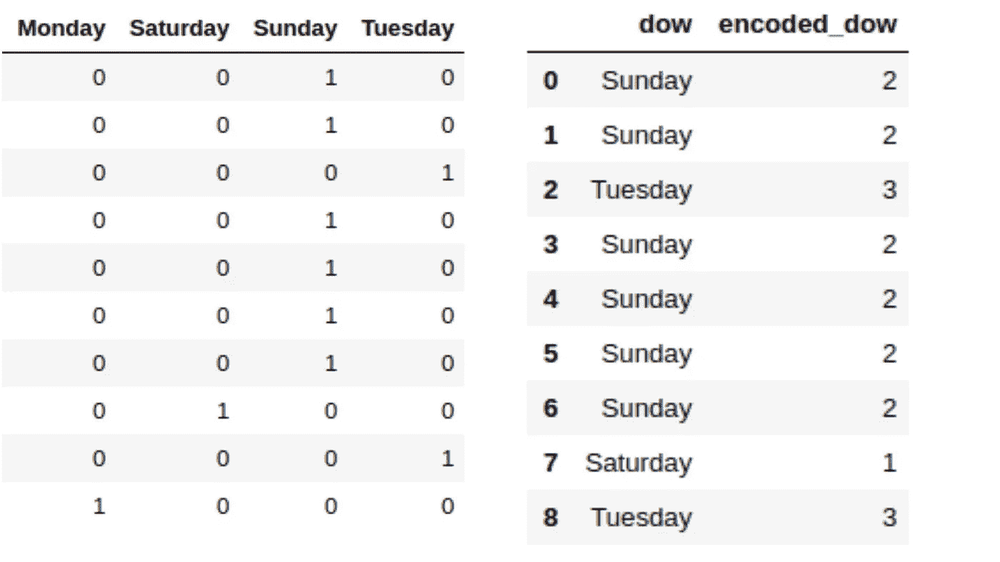
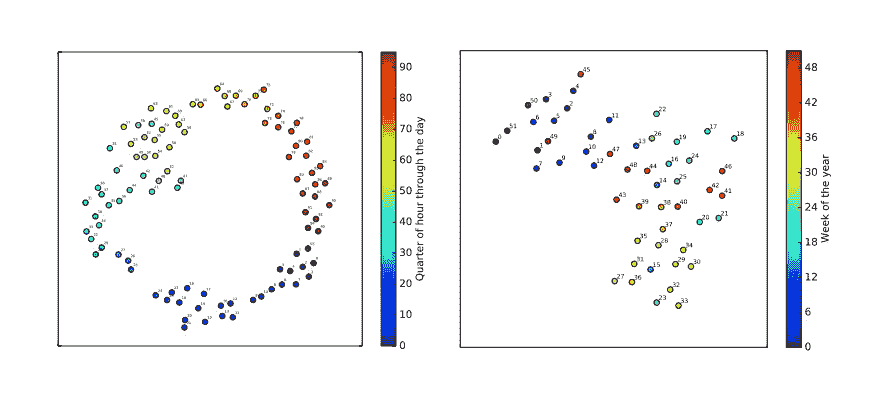
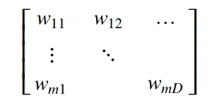
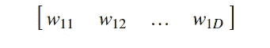
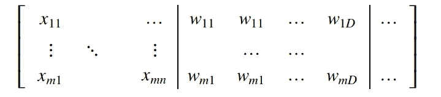
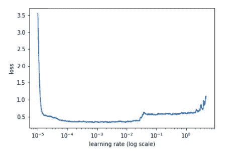
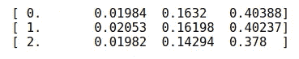
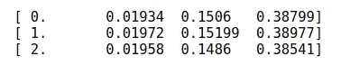

# 结构化深度学习

> 原文：<https://towardsdatascience.com/structured-deep-learning-b8ca4138b848?source=collection_archive---------1----------------------->


*   快的
*   不需要领域知识
*   高性能

这个博客将主要关注深度学习的一个不太广为人知的应用领域，结构化数据。

在机器学习/深度学习或任何类型的预测建模任务中，数据先于算法/方法。这就是为什么机器学习在某些任务之前需要大量的特征工程，如图像分类、NLP 和许多其他“不寻常”的数据，这些数据不能直接输入到逻辑回归或随机森林模型中。相反，这些类型的任务通过深度学习可以很好地完成，而不需要任何讨厌和耗时的功能工程。大多数情况下，这些特性需要领域知识、创造力和大量的反复试验。当然，领域专业知识和巧妙的功能工程仍然非常有价值，但我将在这篇文章中提到的技术足以让你在没有任何相关知识的情况下，在 Kaggle 比赛([http://blog . ka ggle . com/2016/01/22/rossmann-store-sales-winners-interview-3-place-cheng-GUI/](http://blog.kaggle.com/2016/01/22/rossmann-store-sales-winners-interview-3rd-place-cheng-gui/))中获得前三名。


Fig 1\. a cute dog and an angry cat (labeled by me)

由于特征生成的复杂性质和能力(例如 CNN 的卷积层)，深度学习被大量应用于各种图像、文本和音频数据问题。毫无疑问，这些对于人工智能的发展来说是非常重要的问题，并且一定有一个非常好的理由来解释为什么每年这个领域的顶级研究人员都要比上一年更好地对猫、狗和船进行分类。但这些很少是我们在工业上看到的情况。公司使用涉及结构化数据集的数据库，这些领域影响着日常生活。

让我们来定义结构化数据，以便在本文的其余部分更加清晰。在这里，您可以将行视为收集的单个数据点或观察值，将列视为表示每个观察值的单个属性的字段。例如，来自在线零售店的数据可能包含客户销售的行和购买的商品、数量、价格、时间戳等列。

下面我们有在线卖家数据，行是每个独特的销售，列描述了特定的销售。



Fig 2\. pandas dataframe an example to structured data

让我们谈谈如何利用神经网络来完成结构化数据任务。实际上，在理论层面上，创建一个具有任何所需架构的全连接网络，然后使用“行”作为输入是非常简单的。在几次点积和反向传播之后，给定损失函数，我们将最终得到一个训练好的网络，然后可以用来进行预测。

尽管这看起来非常简单，但当涉及到结构化数据时，人们更喜欢基于树的方法而不是神经网络是有主要原因的。这可以从算法的角度来理解，通过探索算法实际上是如何看待和处理我们的数据的。

结构化数据和非结构化数据的主要区别在于，对于非结构化数据，即使它“不常见”，我们也经常用单个单元处理单个实体，如像素、体素、音频、雷达反向散射、传感器测量值等等。相反，对于结构化数据，我们经常需要处理两个主要组下的许多不同类型的数据；数字和分类。分类数据需要在训练之前进行处理，因为大多数算法和神经网络还不能直接处理它们。

有各种选项可用于编码变量，如标签/数字编码和一键编码。但是这些技术在记忆和分类级别的真实表示方面是有问题的。前一个属性可能更明显，可以用一个例子来说明。

假设我们将星期几信息作为一列。如果我们对这个变量进行一次性编码或任意标记编码，我们将分别假设等级之间的距离/差异相等且任意。



Fig 3\. one-hot encoding and label encoding

但是这两种方法都假设每一对日子之间的差异是相等的，但是实际上我们很容易知道这不是真的，我们的算法也应该如此！

> “神经网络的连续性限制了它们对分类变量的适用性。因此，天真地将
> 神经网络应用于用整数
> 表示类别变量的结构化数据并不奏效”[1]

树算法不需要对分类变量的连续性的任何假设，因为它们可以根据需要通过分裂来找到状态，但是对于神经网络来说，情况并非如此。实体嵌入来帮忙了。实体嵌入用于将离散值映射到多维空间，其中具有相似函数输出的值彼此更接近。您可能会想到，如果我们在一个国家中嵌入州来解决销售问题，在这个投影空间中，销售方面的类似州会更加接近。

因为我们不想在我们的分类变量的层次之间做任意的假设，我们将在欧几里得空间中学习每一个的更好的表示。该表示将等于独热编码数据和可学习权重的点积。

嵌入在 NLP 中被广泛使用，因为每个单词都被表示为一个向量。两个著名的嵌入例子是 [Glove](https://nlp.stanford.edu/projects/glove/) 和 [word2vec](https://en.wikipedia.org/wiki/Word2vec) 。我们可以从图 4 [2]中看到嵌入是多么强大。你可以下载这些向量，并根据你的目标使用它们，这实际上是非常酷的想法。


Fig 4\. Word2Vec from tensorflow tutorials

即使嵌入可以以监督或无监督的方式应用于不同的上下文，我们的主要目标是理解如何对分类变量进行这些投影。

# 实体嵌入

即使实体嵌入有不同的名称，它们与我们在单词嵌入中看到的用例没有太大的不同。毕竟，我们唯一关心的是对我们的分组数据有更高维的向量表示；这可能是单词、星期几、国家和许多你能想象的其他东西。这种从单词嵌入到元(在我们的例子中是分类)数据嵌入的交易使 Yoshua Bengio 等人在 2015 年凭借一种简单的自动化方法赢得了 Kaggle 竞赛([https://www . ka ggle . com/c/pkdd-15-predict-taxi-service-trajectory-I](https://www.kaggle.com/c/pkdd-15-predict-taxi-service-trajectory-i))，这不是获胜解决方案的常见情况。

> “为了处理由客户 ID、出租车 ID、日期和时间信息组成的离散元数据，我们通过模型共同学习这些信息的嵌入。这是受神经语言建模方法[2]的启发，其中每个单词都映射到一个固定大小的向量空间(该向量称为单词的嵌入)。”[3]



Fig 5\. Taxi Metadata embeddings visualization with t-SNE 2D projections

我们将逐步探索如何在神经网络中学习这些特征。定义一个完全连接的神经网络，分离数值和分类变量。

对于每个分类变量:

1.  初始化一个随机嵌入矩阵为 m×d。

***m:*** *分类变量的唯一级别数(星期一，星期二，…)*

***D:*** *表示所需的维度，一个可以在 1 和 m-1 之间的超参数(如果为 1，则为标签编码，如果为 m，则为一键编码)*



Fig 6\. Embedding Matrix

2.然后，对于通过神经网络的每次前向传递，我们从嵌入矩阵中查找给定的级别(例如“dow”的星期一)，这将给我们一个向量 1 x D。



Fig 7, Embedding Vector after lookup

3.将这个 1 x D 向量附加到我们的输入向量(数值向量)上。把这个过程想象成扩充一个矩阵，我们为每个类别添加一个嵌入向量，通过查找每个特定的行来嵌入。



Fig 8\. After adding embedding vectors

4.在进行反向传播的同时，我们也以梯度的方式更新这些嵌入向量，这最小化了我们的损失函数。

*通常输入不会更新，但是对于嵌入矩阵，我们有一个特例，我们允许我们的梯度一路流回这些映射的特征，从而优化它们。*

我们可以认为这是一个过程，它允许我们的分类嵌入在每次迭代中得到更好的表现。

**注意:**经验法则是保留基数不太高的类别。就像如果一个变量在 90%的观察中有独特的水平，那么它就不是一个非常有预测性的变量，我们很可能会把它去掉。

# **好消息**

我们可以在我们最喜欢的框架(最好是一个动态框架)中很好地实现上述架构，方法是通过查找并在嵌入向量中允许 requires_grad=True 并学习它们。但所有这些步骤和更多步骤都已经在 Fast.ai 中完成了。除了简化结构化深度学习，这个库还提供了许多最先进的功能，如差异学习率、SGDR、循环学习率、学习率查找器等。这些都是我们想要利用的东西。你可以从这些非常酷的博客文章中进一步了解这些话题:

[https://medium . com/@ bushaev/improving-the-way-we-work-with-learning-rate-5e 99554 f163 b](https://medium.com/@bushaev/improving-the-way-we-work-with-learning-rate-5e99554f163b)

[https://medium . com/@ surmenok/estimating-optimal-learning-rate-for-a-deep-neural-network-ce32f 2556 ce 0](https://medium.com/@surmenok/estimating-optimal-learning-rate-for-a-deep-neural-network-ce32f2556ce0)

[https://medium . com/@ markkhoffmann/exploring-random-gradient-descent-with-restructs-sgdr-fa 206 c 38 a 74 e](https://medium.com/@markkhoffmann/exploring-stochastic-gradient-descent-with-restarts-sgdr-fa206c38a74e)

[](http://teleported.in/posts/cyclic-learning-rate/) [## 传送进来

### 学习率(LR)是需要调整的最重要的超参数之一，是更快、更有效地学习的关键

传送进来](http://teleported.in/posts/cyclic-learning-rate/) 

# **用 Fast.ai 走一遍**

在这一部分中，我们将看看如何绕过上述所有步骤，建立一个对结构化数据更有效的神经网络。

为此，我们来看看一场活跃的 Kaggle 竞赛[https://www . ka ggle . com/c/mercari-price-suggestion-challenge/](https://www.kaggle.com/c/mercari-price-suggestion-challenge/l)。在这个挑战中，我们试图预测一个在线卖家出售的物品的价格。这是一个非常适合实体嵌入的例子，因为数据大多是相对较高基数(不太多)的分类数据，没有太多其他数据。

**数据:**

大约 140 万行

*   **item_condition_id** :项目的条件(基数:5)
*   **类别名称:**类别名称(基数:1287)
*   **品牌名称**:品牌名称(基数:4809)
*   **运费:**运费是否包含在价格中(基数 2)

**重要提示:**在本例中，我不会使用验证集，因为我已经找到了最佳模型参数，但是您应该始终使用验证集进行超参数调整。

**第一步:**

将缺失值填充为一个级别，因为缺失本身就是一个重要的信息。

```
train.category_name = train.category_name.fillna('missing').astype('category')
train.brand_name = train.brand_name.fillna('missing').astype('category')
train.item_condition_id = train.item_condition_id.astype('category')test.category_name = test.category_name.fillna('missing').astype('category')
test.brand_name = test.brand_name.fillna('missing').astype('category')
test.item_condition_id = test.item_condition_id.astype('category')
```

**第二步:**

预处理数据，对数字列进行缩放，因为神经网络喜欢标准化数据，或者换句话说，喜欢同等缩放的数据。如果不缩放数据，网络可能会过分强调某个特征，因为它完全是关于点积和梯度的。如果我们通过训练统计来扩展训练和测试，那会更好，但是这不会有太大影响。想想每个像素除以 255，同样的逻辑。

我结合了训练和测试数据，因为我们希望相同级别有相同的编码。

```
combined_x, combined_y, nas, _ = proc_df(combined, 'price', do_scale=True)
```

**第三步:**

创建模型数据对象。Path 是 Fast.ai 存储模型和激活的地方。

```
path = '../data/'
md = ColumnarModelData.from_data_frame(path, test_idx, combined_x, combined_y, cat_flds=cats, bs= 128
```

**第四步:**

决定 D(嵌入的维数)。cat_sz 是每个分类列的元组列表(col_name，cardinality + 1)。

```
# We said that D (dimension of embedding) is an hyperparameter
# But here is Jeremy Howard's rule of thumb
emb_szs = [(c, min(50, (c+1)//2)) for _,c in cat_sz]# [(6, 3), (1312, 50), (5291, 50), (3, 2)]
```

**第五步:**

创建一个学习者，这是 Fast.ai 库的核心对象。

```
# params: embedding sizes, number of numerical cols, embedding dropout, output, layer sizes, layer dropouts
m = md.get_learner(emb_szs, len(combined_x.columns)-len(cats),
                   0.04, 1, [1000,500], [0.001,0.01], y_range=y_range)
```

第六步:

这一部分在我之前提到的其他帖子中有更详细的解释。

充分利用 Fast.ai joy。

我们选择的学习速度是从损失开始增加之前的某个点开始的…

```
# find best lr
m.lr_find()# find best lr
m.sched.plot()
```



Fig 9\. learning rate loss plot

合适的

```
we can see that with just 3 epochs we have
lr = 0.0001
m.fit(lr, 3, metrics=[lrmse])
```



更适合

```
m.fit(lr, 3, metrics=[lrmse], cycle_len=1)
```



还有一些…

```
m.fit(lr, 2, metrics=[lrmse], cycle_len=1)
```


所以，这些简单而有效的步骤可以让你在几分钟内达到 10%,而不需要任何进一步的努力。如果你真的想力争上游，我建议你利用 item_description 列，使它成为多个分类变量。然后把工作留给实体嵌入，当然不要忘记栈和系综:)

这是我的第一篇博文，希望你喜欢！我必须承认这东西有点上瘾，所以我可能会很快回来…

感谢你为我鼓掌:)

我现在是 USF 的一名研究生，攻读分析硕士学位。我已经应用机器学习 3 年了，目前正在用 Fast.ai 练习深度学习。

**领英:**[https://www.linkedin.com/in/kerem-turgutlu-12906b65/en](https://www.linkedin.com/in/kerem-turgutlu-12906b65/en)

**参考文献:**

[1]郭城，菲利克斯·伯克哈恩(2016 年 4 月 22 日)*分类变量的实体嵌入。从 https://arxiv.org/abs/1604.06737 的*T2 取回。

[2] TensorFlow 教程:【https://www.tensorflow.org/tutorials/word2vec 

【3】yo shua beng io 等*人工神经网络应用于出租车目的地预测。检索自*[https://arxiv.org/pdf/1508.00021.pdf](https://arxiv.org/pdf/1508.00021.pdf)。