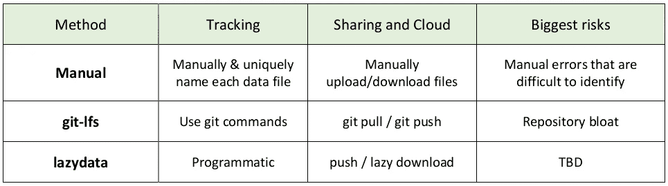

# 构建 ML 项目，使其能够成长

> 原文：<https://towardsdatascience.com/structuring-ml-projects-so-they-can-grow-b63e89c8be8f?source=collection_archive---------18----------------------->

我从事过许多大大小小的数据科学和机器学习项目。从只需要几个笔记本的项目到成长为数万行代码的项目。

**我发现，开始一个项目时，假设它会增长，这总是一件好事。**

只需要在开始时付出少量额外的努力，就能够保持长期的生产力。

使用 git 管理代码是必须的。管理数据的方法也是必须的，但是什么是最好的方法还没有定论。

在这里，我将展示一个我最近开源的名为 [**lazydata**](http://github.com/rstojnic/lazydata) 的库，它是专门为不断增长的 ML 项目管理数据而构建的。

# 传统的数据管理方式

如果您正在进行一个机器学习项目，您将不可避免地使用各种版本的数据集(原始的、以各种方式处理的、训练/开发分割的、增强的)，并将尝试不同的模型(基线、不同的参数、架构、算法)。

你还需要将这些内容从你的本地电脑转移到云端，并与你的队友和未来的自己分享。

要管理这种激增的数据和模型文件，传统上有两种选择:手动文件管理和存储它得到的一切。

下表总结了不同的方法及其最大的风险。



Comparison of data management approaches

# 懒散的数据方式

lazydata 的核心概念是，嗯，懒惰。假设随着项目的发展，你将会产生大量的文件，而你只需要其中的一小部分。

能够回到你几个月前生产的那个模型总是好的。

但是，这并不意味着每个想要查看您的项目的人都需要下载整个历史，他们很可能只想要一小部分。

# 启用 lazydata 只需几行代码

那么如何使用 lazydata 呢？首先，安装它(这需要 Python 3.5+):

`$ pip install lazydata`

然后转到您的项目根目录并键入:

`$ lazydata init`

这将创建一个新的文件`lazydata.yml`，其中将包含您的跟踪数据文件的列表。

接下来，您可以在代码中使用 lazydata 来跟踪数据文件:

```
**# my_script.py****from lazydata import track** 
import pandas as pddf = pd.read_csv(**track("data/my_big_table.csv")**)print("Data shape:" + df.shape)
```

当您第一次运行这个脚本时，lazydata 将开始跟踪您的文件。

跟踪包括:

*   在`~/.lazydata`中创建文件的副本——这是您的本地缓存，保存您的文件版本，以便您可以在需要时返回并将其推送到云。
*   将数据文件的唯一引用(SHA256)添加到`lazydata.yml`。您将这个 yml 文件添加到 git 中，以跟踪您在这个特定提交中拥有的数据文件。这使您能够在以后需要时进行取证，并像跟踪代码一样跟踪您的数据文件。

你完了！如果您更改了数据文件，将会记录一个新的版本，您可以像往常一样继续工作。

若要与您的队友共享您的数据文件，或者只是备份数据文件，请将遥控器添加到您的项目并推送您的文件:

```
$ lazydata add-remote s3://mybucket
$ lazydata push
```

一旦你的队友下载了最新的代码，他们也会得到`lazydata.yml`文件。然后，他们可以使用您设置的 S3 遥控器和 SHA256 唯一引用通过`lazydata pull`提取文件。

或者，他们可以简单地运行您的脚本来延迟下载丢失的文件:

```
$ python my_script.py
## lazydata: Downloading tracked file my_big_table.csv ...
## Data shape: (10000,100)
```

就是这样！现在，您可以将您的 S3 视为所有数据文件的永久存档，而不必担心您的合作者将不得不下载他们不需要的任何文件。

在上面的例子中，我们将 lazydata 应用于数据输入，但是您也可以在数据输出上使用`track()`，例如在您刚刚保存的模型权重文件上——它以完全相同的方式工作。

这种惰性语义使您能够两全其美:存储所有内容，同时随着项目的增长，保持对数据文件的管理和组织。

要了解更多关于库的信息，请访问 GitHub 页面:

[](https://github.com/rstojnic/lazydata) [## rstojnic/lazydata

### lazy data:Python 项目的可伸缩数据依赖——rstojnic/lazy data

github.com](https://github.com/rstojnic/lazydata)