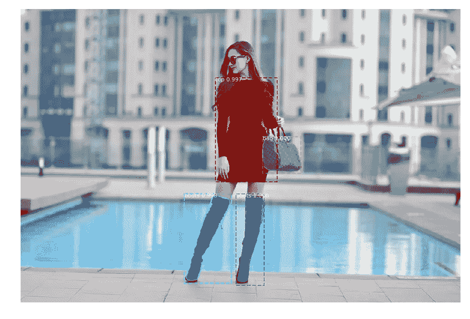
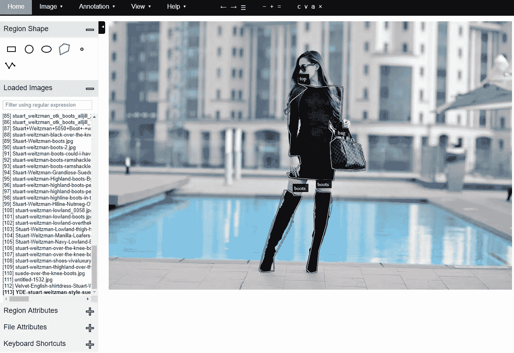
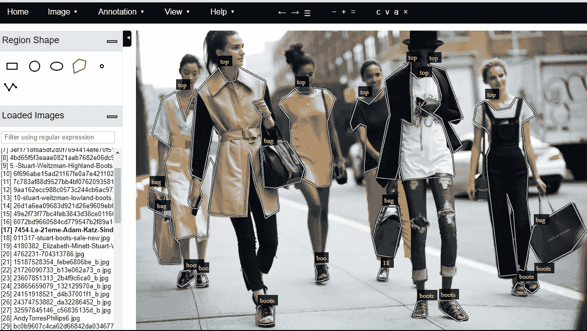
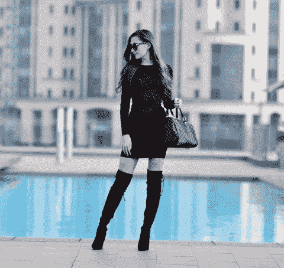
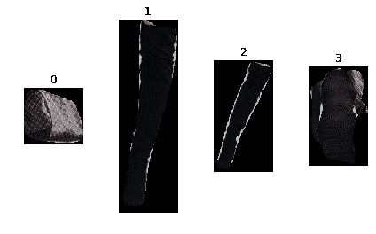
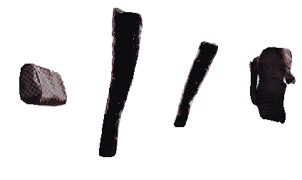

# 斯图尔特·威茨曼靴子、名牌包和带面具的套装

> 原文：<https://towardsdatascience.com/stuart-weitzman-boots-designer-bags-and-outfits-with-mask-r-cnn-92a267a02819?source=collection_archive---------8----------------------->

我最近和一些人聊天，讨论如何为深度学习管道建立多阶段模型。具体的问题是如何将图像中的对象与已知的对象数据库进行相似性比较，以便进行匹配。这个问题与吴恩达在深度学习课程中为面部识别铺设的管道非常相似。他的方法是有两个模型，第一阶段和第二阶段。第一阶段可以是对象检测模型以定位到图像中的面部，然后第二阶段模型可以基于定位的面部进行面部相似性比较。分两个阶段构建管道是有用的，因为它让第二阶段模型处理更少的任意噪声，因此它可以专注于与您关心的任何对象进行比较。

在我的第一篇媒体文章中，我讲述了我是如何为游戏《彩虹六号围攻》构建一个面部识别管道的。然而在这篇文章中，我想建立一个多类图像分割模型，作为第一阶段模型的例子。我的理由是，有时检测对象的边界框是好的，但是在逐像素级别分割图像应该给第二阶段提供更清晰的输入，因为第二阶段模型将很少或没有背景需要处理。

正如标题所暗示的，这篇文章的主题是一个多类图像分割模型，我定制了这个模型来检测衣服。



除了作为引子的对话，我认为这将是一个很好的练习，因为很难找到关于如何做多类图像分割项目的教程。对于这个项目，我将使用 Matterport 的 Mask R-CNN，这是 Mask R-CNN 的 Keras 实现，它执行得很好。将来用原始的 Tensorflow 实现来做可能也不错，但我想尽快完成这个原型。(我说的快速是指我决定在周六晚上 10 点做这件事，收集数据，对其进行注释，并在凌晨 4 点之前对其进行训练，上床睡觉，然后第二天写这篇博客 XD)

# 掩模 R-CNN 的简要背景

对于许多任务来说，重要的是不仅要知道存在对象以及它在图像中的位置(对象检测)，而且要知道给定图像中的哪些像素对应于该对象(图像分割)。掩模 R-CNN 是对先前的对象检测架构 R-CNN 和更快的 R-CNN 的修改，以服务于此目的。执行图像分割的能力是通过在现有网络架构上添加一个完全卷积的网络分支来实现的。因此，当主分支生成边界框并识别对象的类别时，从主分支获得特征的完全卷积分支生成图像遮罩。

我看到的另一个帖子是来自( [here](https://blog.athelas.com/a-brief-history-of-cnns-in-image-segmentation-from-r-cnn-to-mask-r-cnn-34ea83205de4) )的，其中我学到了很多关于掩模 R-CNN 和图像分割的知识。最后，如果你真的想看，你可以看看原版的 R-CNN 报道，它值得一读([这里](https://arxiv.org/abs/1703.06870))。

# **采集数据并标注**

虽然我选择了帖子的主题，但我对设计师品牌的衣服了解相对较少。然而，我的一个好朋友喜欢斯图尔特·威茨曼的靴子，所以我想我可以用它来帮助缩小这个项目的图像范围。我在谷歌上做了一些快速搜索，调出了相关图片，收集了大约 130 张模特的图片，其中大部分都穿着斯图尔特·威茨曼的靴子，但我想说，这个数据集是关于那些看起来相当时尚的人的。

对于我的注释，我使用了 [VGG 图像注释器](https://www.robots.ox.ac.uk/~vgg/software/via/)，这是一个很好的接口，用于牛津大学的对象检测或图像分割注释。



screenshot of the VGG annotator

对我来说，这里的主要变化是通过使用注释器中的区域属性来确保每个多边形区域都标记有一个类名。我添加了一个名为“name”的字段，稍后我可以在输出 JSON 文件中引用它，这样模型就会知道每个多边形区域的底层类。

在我的三节课中，我使用了靴子(包括鞋子和凉鞋，如下图所示)，包(大多数是不同尺寸的手提包，也有购物袋和一两个背包)，最后，我最麻烦的类别是“顶级”。我最初打算做大便，外套，裤子等。但是那会大大增加这个注释过程，所以我把其中的大部分压缩到一个“顶级”类别，决定不注释裤子。如果我决定建立一个更强大的模型，所有这些都可以调整。



When I remembered that I had included this picture I immediately regretted it because of the amount of annotation. It also shows how my class system is probably not ideal… I have to label a one piece outfit as a “top” but don’t include jeans/pants so the system seems a bit convoluted…

使用 VGG 注释器，我生成了 json 文件，其中包含了模型的所有多边形分割区域以及多边形的相关名称。

# 代码和培训的修改

这部分实际上对我来说很好，因为它迫使我挖掘 Matterport [代码](https://github.com/matterport/Mask_RCNN)来尝试并找出如何修改它来实现多类分段。

> 查看我的 [**fashion.py**](https://github.com/sugi-chan/clothes_segmentation/blob/master/fashion.py) 文件中的所有代码，我在这里只展示一些片段。

第一次修改发生在第 46 行。

```
NUM_CLASSES = 1 + 3  # Background + bag +top +boots
```

而不是基本的:

```
NUM_CLASSES = 1 + 1  # Background + single_class
```

在 load_balloon 函数中的第 70 行(在后面我应该修改了这些函数名，因为它们不是描述性的)

```
self.add_class("fashion", 1, "top") #adjusted here
self.add_class("fashion", 2, "boots") #adjusted here
self.add_class("fashion", 3, "bag") #adjusted here
```

我查看了为 coco 数据集生成后端数据集的方式，发现所需的信息是数据集/模型名称，在本例中为“时尚”,然后添加了类别号和相关联的标签映射供模型使用。

因此，现在数据集和模型在物理上能够接受多个类，我必须确保在加载图像时记录类信息。

为此，我插入了几行代码(94–102)来为给定的图像生成到区域多边形的标签映射。

```
class_names_str  = [r['region_attributes']['name'] for r in a['regions'].values()]
class_name_nums = []
for i in  class_names_str:
    if i == 'top':
        class_name_nums.append(1)
    if i == 'boots':
        class_name_nums.append(2)
    if i == 'bag':
        class_name_nums.append(3)
```

这个部分只是从 json 文件的 region_attributes 部分获取给定图像的区域名称，然后遍历它以创建一个输出列表，该列表将字符串转换为与上面的类标签映射相匹配的数字 1、2 和 3。

接下来在第 119 行，我在 add_image 调用中添加了一个新字段，这样我就可以存储给定图像的类列表，然后在脚本稍后生成掩码时提取该列表。

```
class_list = np.array(class_name_nums)
```

对我来说，最有趣的部分是认识到 load_mask 函数通过生成一个全 1 的 numpy 数组来处理类标记，其思想是它只是进行单个类分类，这在大多数自定义数据集训练中是常见的。所以我在这里要做的就是引用我附加到 load_mask 函数引用的图像上的 class_lists(第 143 行)。

在这种情况下，return 函数返回一组表示该图像中要分割的 N 个多边形的图像遮罩，加上我的添加，它现在返回一个长度也为 N 的多边形类的数值数组。

```
class_array = info['class_list']
return mask.astype(np.bool), class_array
```

一旦这些细节得到解决，我就能够使用 coco challenge 的预训练权重来训练 Mask R-CNN 模型。我让模型在 Nvidia 1080 GPU 上训练了 20 个时期，在那里它调整了图像的大小，使长边为 1024 像素，我通过 GPU 一次输入 2 幅图像，但没有对我可以处理多少图像进行大量实验。

# 关于建立更强模型的当前结果和想法

鉴于我使用的数据集只有 100 张训练图像，另外还有 20-30 张用于评估，结果实际上相当不错。鉴于这是一个比我在使用 Mask R-CNN 之前完成的单个类自定义分段任务更难的任务，我感到惊喜。



Shows original and the predicted image masks

显然还有很大的提升空间。该模型在外套和服装的边缘等领域仍不确定。很大程度上可能是因为我不一致的标签/在如何处理不是靴子和包的衣服项目上糟糕的职业选择。

如果我要改进这个快速原型，有两个方面需要下大力气。首先是定义我们到底想用这个模型做什么。例如，如果第二阶段模型/多个第一阶段模型能够辨别不同类型的服装，则第一阶段模型实际上可能不需要辨别这些服装。这意味着你可以使用一个单一的分类模型，用一个普通的类别“衣服”或者类似的东西。如果我们反其道而行之，增加更多的粒度，那么从长远来看，这将只需要经过深思熟虑的类。这将意味着我们必须弄清楚如何处理不同的事情，比如一个人穿着外套和衬衫，即使我们只有衬衫的一部分，我们也要给外套和衬衫贴标签吗？还是大多被高筒靴遮挡的裤子？这些都是需要根据手头的任务/问题进行检查的领域。

第二个需要改进的地方是收集更多的图像。这个模型只训练了 100 张图像，模型有很多不确定性，例如它不总是包括外套或其他衣服的边缘。这看起来像是不包括他们的模型，因为鉴于其有限的暴露，它仍然是不确定的。这部分性能应该有所提高。

# 还没完！提取衣物

正如我在开始时所说的，目标不仅仅是分割图像中的服装，而是将其用作第一阶段的模型，以帮助减少后续模型用作输入的噪声。

Mask R-CNN 模型的输出是具有许多不同数据字段的结果数组。

我发现对此有用的是“ROI ”,它包含对象的边界框坐标，“masks”是每个预测遮罩的二进制数组。

因此，要分离出这些衣服，我所要做的就是使用二进制图像蒙版只显示特定的衣服，然后使用“roi”字段中的边界框来裁剪图像，只显示特定的衣服。结果是一个相当接近的裁剪图像，而不是原来的嘈杂的衣服！我参考了 Brad Sliz 2017 年的一篇帖子,从中获得了如何隔离面具的灵感。

请参见下面的输入阶段:

首先是原图。


接下来生成分段掩码。该模型标识了一个“top”、一个“bag”和两个“boots”类的实例。


predicted image segmentation and classifications

最后，通过使用分割多边形作为遮罩，我们可以隔离衣服。本质上，掩模通过将 RGB 阵列的 3 个维度中的每一个乘以二进制图像掩模来工作。这意味着不在蒙版中的所有区域变为 0，蒙版中的区域保持不变。这是它的原始输出…但是我不喜欢黑色背景。



我很快地拼凑了一些代码，只是将数组中值为 0 的纯黑色替换为值为 255 的白色。然而，这也扰乱了黑色衣服的其他部分的颜色…所以它不太理想，但为了演示的目的，我会调整它。



Brute force changing values of 0 to 255 causes odd outlines and such.

所以现在我们可以生成这些裁剪过的图像，这些图像只分离出衣服，你可以用它来做很多事情！例如，您可以查看在线商店中与用户提交的照片最匹配的商品，或者使用经过清理的图像为一件衣服生成标签，使其可被搜索。这两种方法的想法都是，第二级模型需要处理的输入噪声更少，因此会更好。

如果你去建立一个相似性模型，它没有首先将输入本地化，那么你可以让两个模特穿着相同的上衣，但是如果他们的肤色不同，那么相似性模型将需要能够解释额外的变化。相反，如果你使用像这样的分割模型作为第一阶段，那么模型的肤色并不重要，因为你现在只需要比较上衣。

# **最终想法**

这个快速项目是一个例子，说明如何建立一个自定义的多类图像分割模型，然后展示如何使用该模型来帮助其他模型做得更好。如上所述，我认为根据使用情况，这种类型的模型可以在广泛的情况下有所帮助，在这些情况下，能够定位到图像中的特定对象/区域而不是通过网络提供原始图像通常是有用的。

我也很高兴，因为我以前没有训练过多类分割网络。主要是因为我使用了大多数对象检测/分割模型来为第二阶段网络清理数据，而不是训练它们在粒度级别上进行分类。部分原因是重新训练第二阶段模型并使第一阶段模型保持良好和灵活更容易。例如，一家公司建造了一个人工智能迎宾器，并使用对象检测模型来识别走进大厅的员工，并为他们开门。这在技术上是可行的。但从长远来看，这是不方便的，因为每次你为公司增加新员工(或有人离开)时，你都必须重新培训检测机。但更容易的是让检测器保持一般化，只做面部，在后端，你可以建立一个第二阶段的网络，像一个暹罗网络，它擅长区分人，从第一阶段的对象检测器中提取特征，并将其与你的员工进行匹配。这也解决了如何增加或减少雇员的问题，因为您只需要对您维护的雇员数据集进行适当的修改。

> [**github repo**](https://github.com/sugi-chan/clothes_segmentation) 哪里有培训和测评代码