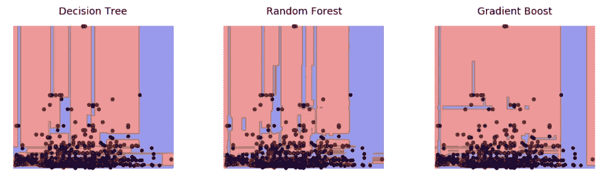

# Scikit-Learn 上决策树和集成的研究

> 原文：<https://towardsdatascience.com/study-of-decision-trees-and-ensembles-on-scikit-learn-e713a8e532b8?source=collection_archive---------6----------------------->

现在科技界最热门的话题之一是机器学习领域。应用范围包括算法金融、图像识别、基因组测序和物联网的最新发展。

考虑到这一点，监督学习算法的一个常见分支包括决策树，以及它们的集成(随机森林和梯度提升树)。在下面的链接中，我分析了 Python 在 Kaggle 的 Titanic 数据集上对这些分类器的 scikit-learn 实现。

链接:[https://www . ka ggle . com/creepykoala/titanic/study-of-tree-and-forest-algorithms/notebook](http://www.kaggle.com/creepykoala/titanic/study-of-tree-and-forest-algorithms/notebook)