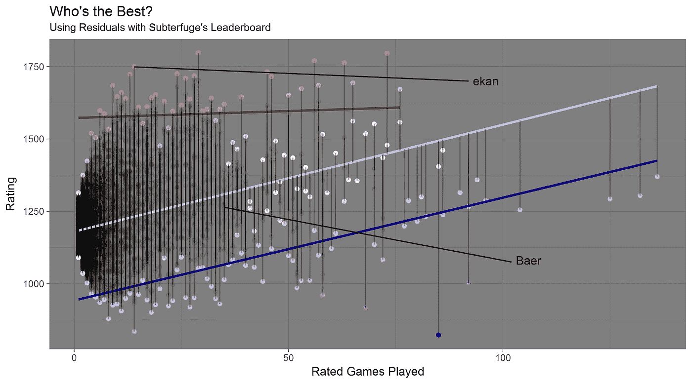

# 托词:谁是最好的？

> 原文：<https://towardsdatascience.com/subterfuge-whos-the-best-7269bef45358?source=collection_archive---------6----------------------->

## 使用残差，经验和评级，看看谁打败了正常

我之前写过游戏次数和每周游戏次数如何与玩家的等级相关。你可以在这里阅读相关内容。数据中有一些噪音，但我的总体假设是正确的:你玩得越多，你就越好。

从[排行榜](http://subterfuge-game.com/leaderboards.html)，你可以很容易地看到谁排名第一。截至 2017 年 4 月 1 日，Dane69 以 1797 的评分蝉联冠军。你可以说他/她拥有最好的头衔，这是没有错的。对于这篇文章，我想要一个更加细致入微的外观。我的问题是:

> 对于他们的经验水平来说，谁是最好的诡计玩家？

为了确定这一点，我使用了一种叫做残差的统计方法。简而言之，残差是实际值与由模型计算的预测值之间的距离。残差用于确定任何模型的拟合优度。更多信息，我喜欢汗学院的残差解释[发现这里](https://www.khanacademy.org/math/ap-statistics/bivariate-data-ap/least-squares-regression/a/introduction-to-residuals)。

在这篇文章中，我决定使用游戏的等级作为每个玩家的经验等级。例如，我(用户名:Baer)玩了 35 个分级游戏，分级为 1264。为了简单起见，我使用了一个线性模型，这将在下面进一步讨论。

# 可视化残差

下图类似于我的上一篇文章，但是做了一些美学上的改变来突出残差。

图表上的注释:

*   距离线性模型最远的距离(即每个经验水平的最大残值)用红色表示在上方，蓝色表示在下方。颜色越深，距离越大。
*   线性模型(中间浅蓝色的直线)代表已评价的游戏和预期评价之间的关系。未来的分析将受益于一个更细致的模型。
*   我为 0 以上的红色残差和 0 以下的蓝色残差添加了一个线性模型。看着图的最右边，我们可以看到线性模型最终失败了。大约 75 场比赛后，没有人击败模型(即没有红点)。
*   埃坎是所有球员中正剩余价值最大的。这意味着他/她已经大大超出了他/她的期望值。虽然有更高的评级，但没有一个玩家比 ekan 更远离他们经验水平的期望值。
*   Baer(我)刚好在中间。在我的辩护中，我在我的最后一场比赛中由于缺乏互联网连接而自动辞职，并受到了很大的收视率打击。
*   我不想包括谁的名字有最大的低于标准的剩余。为他/她辩护的是，在大约 80 场比赛中，他们评级的期望值非常高。然而，他们的名义评级也是所有球员中最低的。我想他们已经输了很多次了。(我从数据集中删除了一个评分低于 600 的观察值。有人创建了一个帐户来测试他们可以获得多低的评级)。

西蒙·杰克逊博士关于残差的非常容易理解的帖子[在这里找到](https://drsimonj.svbtle.com/visualising-residuals)是这篇帖子的一个很好的指南。

# 结论

没有一个模型是完美的，但它们都可以提供一定的洞察力。同样，我们可以看到经验确实会导致更高的评级。然而，顶部较平的红线表明你可以很快达到上限。蓝线的斜率几乎与模型的斜率相匹配。即使你已经跌到谷底，你也可以变得更好！

尽管如此，一个更灵活的模型可以解释图表右侧实际评分的下降。很明显，在玩了 40 个左右的分级游戏后，线性模型无法解释这种关系。我计划继续学习如何使用更复杂的模型计算残差。

恭喜伊坎！保持胜利(除非我们在同一场比赛中比赛)。

这篇文章的代码可以在我的 GitHub repo [找到这里](https://github.com/AlexJF12/subterfuge/tree/master/Residuals)。