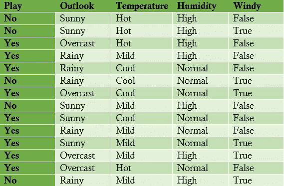
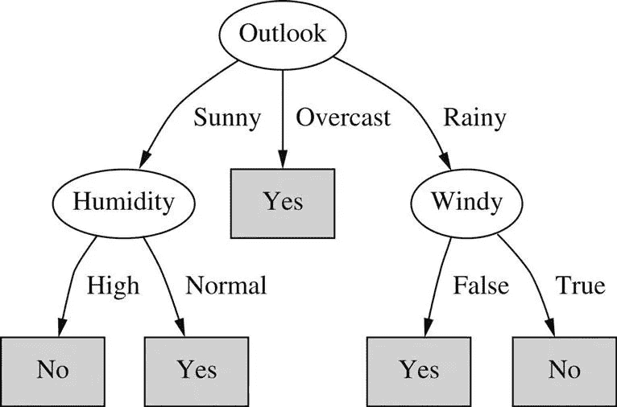

# 成功的管理不是机器学习的问题…

> 原文：<https://towardsdatascience.com/successful-management-isnt-a-question-of-machine-learning-but-of-people-taking-the-right-5654f06d51ee?source=collection_archive---------11----------------------->

在春季学期的最后几周，学生们不是唯一期待夏天的人。一个星期二的早上，当我聚精会神地听小组报告时，我不禁想，那天下午我会不会去网球场。上午课间休息时，我接到一个朋友打来的电话，邀请我去玩，我评估了一下天气状况:晴朗、炎热、有风，还有点潮湿。在过去的 14 次我考虑参加比赛时，条件并不完全相同。在其他条件相同的情况下，你能预测那天下午我是否在球场上吗？

Written, Frank and Hall, 2010

成功的管理不是机器学习的问题，而是人们在其工作环境中做出正确决策的问题。探索这种背景可以帮助您了解您所面临的挑战的性质——您是在完美信息的确定性环境中工作，还是在有缺失信息的随机环境中工作？你能假设手头的数据包含期望的结果(监督学习)或不包含(非监督学习)吗？你必须处理哪种数据(定性的、定量的、离散的、连续的、名义的、顺序的… …)？你愿意花多少时间去寻找答案，你期待的答案有多好(置信区间)？业务分析是学习理解要解决的问题的本质，然后使用适当的方法将数据转化为个人和集体的行动。

决策树可用于使用分类或连续数据直观地表示监督学习环境。决策树是使用估计值和概率来改进管理决策的预测模型。当正确使用时(无论是否依赖软件…)，决策树允许管理者利用对问题的观察(用分支表示)得出关于要采取的适当行动的结论(用树叶表示)。在上面的网球问题中，可以使用一个简单的决策树来有效地预测我那天下午的行为。

决策树在减少监督学习环境中行动过程的不确定性方面非常有用。把问题想成“二十问”的游戏。我有一个秘密(在什么情况下我会打网球)——你可以使用数据来制定问题，可以用是或不是来回答(我在什么时候打网球了？).选择每个封闭式问题，尽可能深入了解我的行为(当我打网球时)。问题的排序被称为决策表，每个答案的值就是信息增益。在上面的案例中，两个问题足以预测我的行为，包括今天和未来。

此处提供的数据最初是由 Written、Frank 和 Hall 作为练习提供的。使用具有分类属性(热、温和、凉爽；等等。).决策列表从识别变量(outlook)开始，当已知变量时，将产生最大数量的正确答案。下一步是确定变量，因为 outlook 的值将提供最大的信息增益(湿度)。有了第二个问题(变量)，我们有了答案——是的，那天下午我在打网球，因为天气晴朗而潮湿。

改善管理决策是[商业分析研究所](http://baieurope.com)的核心和灵魂。在我们位于巴约纳的[暑期学校](http://baisummer.com)，以及我们在欧洲的[大师班](http://baimaster.com)，我们让数据科学为您和您的组织服务。该研究所专注于管理者数据科学的五个应用:在数字时代工作、数据驱动的决策、机器学习、社区管理和可视通信。数据驱动的决策会对你未来的工作和职业生涯产生影响。*提高做出正确决策的能力只需点击一下鼠标。*

*Lee Schlenker 是 Pau 商学院的教授，也是 http://baieurope.com 商业分析学院的负责人。* *他的 LinkedIn 简介可以在*[*www.linkedin.com/in/leeschlenker.*](http://www.linkedin.com/in/leeschlenker.)*你可以在*[*https://twitter.com/DSign4Analytics*](https://twitter.com/DSign4Analytics)关注我们

[【我】](#_ednref1)撰写，即 Frank E .和 Hal，M. (2010)，*数据挖掘:实用的机器学习工具和技术，第三版*，Elsevier