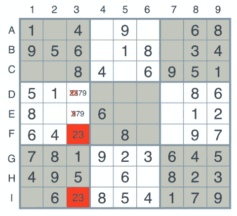
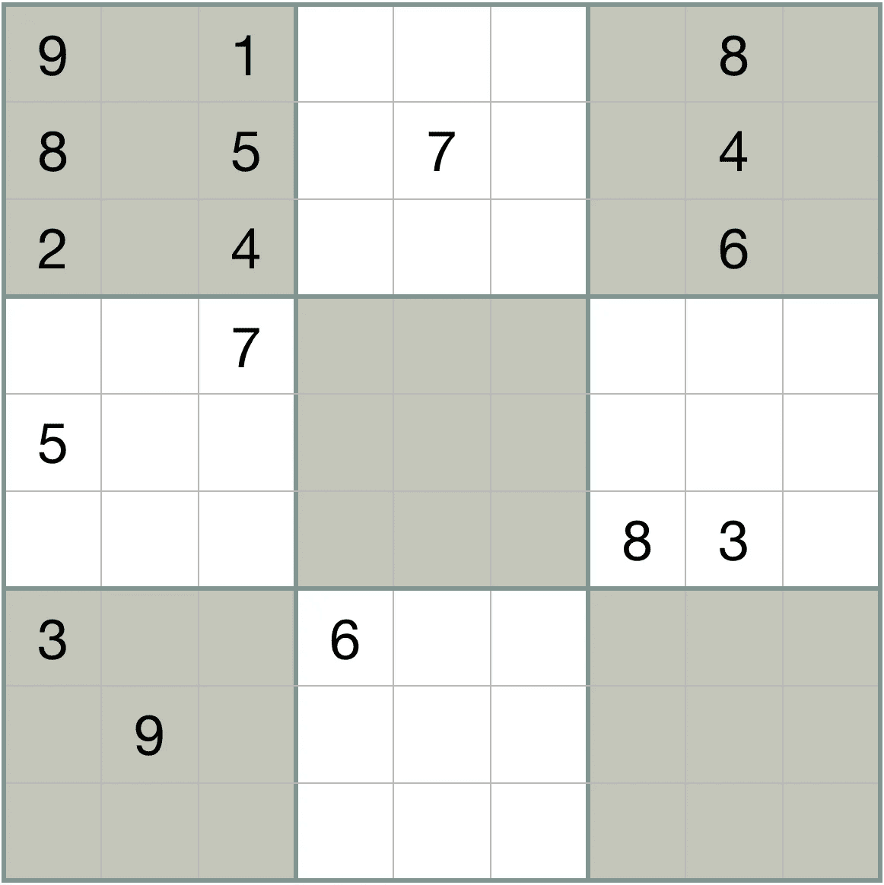

# 数独和尽力而为

> 原文：<https://towardsdatascience.com/sudoku-and-doing-your-best-work-44b9f906e9f9?source=collection_archive---------2----------------------->

我们的很多生活，无论是工作生活还是个人生活，都是在做重复的、没有创造性的事情。这些任务中有许多是令人愉快的:它们包括像园艺或烘焙这样的爱好，我们出于难以表达的原因而喜欢这些爱好。但是，它们也包括我们不想做的事情，比如洗衣服或洗碗。

虽然我们不能简单地给机器人编程来完成上面列出的任务，但有很多重复性的任务，尤其是那些不涉及操纵物理对象的任务，我们可以做到。比如像 Wolfram Alpha 这样的科学软件包可以[自动求解大部分微分方程](https://www.wolframalpha.com/examples/DifferentialEquations.html)，这样人类就不用再手动求解了。

鉴于这些软件包的存在，如果一个数学家根据他用手快速求解微分方程的能力来衡量自己的素质，我们会觉得很奇怪，因为计算机求解微分方程的速度要快得多。只有当他把时间花在数学系，而不是冒险去学习计算机科学时，这才有意义——他可能*不知道微分方程可以用计算机求解，因此可能会把手动求解视为对时间的有效利用。*

这正是人们解数独谜题时发生的事情。数独是一个基本上重复的任务，可以根据简单的规则用计算机程序解决。数独仍然是世界上最受欢迎的益智游戏之一，而且大多数玩数独的人并不认为这是一项可以用算法来描述的任务，这一事实很好地说明了将*活动*与*生产力*相混淆是多么容易， 它应该让我们所有人清醒过来，审视我们工作的哪些方面只是让自己习惯于遵循一套明确规定的规则，并不断提高效率——换句话说，就是做相当于“擅长解决数独”的事情——而我们应该学习如何做相当于让计算机处理这项工作的事情。

# 为什么我一直在想这个

在过去的几个月里，我一直在完成设计非常好的 [Udacity 人工智能纳米学位](https://www.udacity.com/ai)的项目，该项目通过让你将经典的人工智能技术应用于实际问题并通过自己编码来学习算法，来教授这些技术。

第一个问题是写一个解决数独难题的算法。鉴于这种纳米程度的“经典人工智能”倾向，解决方案是*而不是*简单地建立一个神经网络，它看到一堆正面和负面的例子，并通过调整其权重来迭代学习如何解决难题，和/或使用强化学习算法，该算法惩罚将数字放在违反规则的地方的代理，并在它正确解决难题时奖励它。不，数独很简单，我们可以“教”计算机如何玩数独，通过明确地告诉它在棋盘上看到的数字该做什么。这是一个有趣的练习——我发现弄清楚你将如何告诉计算机解决数独比自己解决它们更有价值。

下面是解决方案的概要。我会注意到，这个解决方案和 Udacity 解决方案紧跟彼得·诺维格的经典文章[解决每一个数独难题](http://norvig.com/sudoku.html)。

# 如何解决每一个数独

首先定义一个数据结构来跟踪棋盘上已经有的数字。这个数据结构还应该跟踪空单元格的所有“候选”数字——也就是说，那些单元格中可能包含的数字。

然后，反复遵循几个步骤来解决这个难题，直到它被解决:

*   第一步:“淘汰”。使用数独规则从空单元格中排除候选数字。例如，如果某一行中有一个 9，则使用此规则从该行的其他单元格中排除 9 作为候选单元格。
*   一旦我们在一个单元格中只剩下一个数字，继续“消除”策略，从棋盘上的其他单元格中消除该数字。据我所知，这在经典人工智能中被称为“约束传播”。
*   如果有必要，使用高级技术来“消除”数字，例如下面描述的“裸体双胞胎”技术:

An illustration of the Naked Twins strategy. Credit [Ronald Eddings](https://medium.com/@ronaldeddings)

理论上，人类可以做到这一切。然而，如果他们遇到了障碍——没有更多的数字可以很容易地从细胞中消除。然后呢？

计算机可以很容易地解决这个问题——不仅仅是通过尝试所有可能的板组合，直到找到一个有效的组合。他们可以简单地做以下事情:假设有两个单元格，单元格 1 和单元格 2，给定所有关于棋盘的信息，我们知道单元格 1 包含 5，单元格 2 包含 6，反之亦然。但是，我们没有信息告诉我们哪个是哪个。在这里，一个人被卡住了，但计算机可以简单地尝试第一种可能性，在单元格 1 中放一个 5，在单元格 2 中放一个 6，然后尝试继续遍历整个棋盘，直到谜题被解决，或者直到它找到一个没有可能值的单元格——如果发生这种情况，它知道它在“岔路口”的最初选择是错误的，6 应该在单元格 1 中，5 应该在单元格 2 中。这可以使用一种称为“深度优先搜索”的经典算法来实现。

事实上，项目的最后一步是让我们的程序解决一个数独游戏，这个游戏既需要搜索来解决，也需要额外的约束，即除了行、列和九个“子块”之外，数字 1-9 不能在每个主对角线上重复*:*

A diagonal Sudoku that would be extremely difficult for a human to solve. Go ahead, try it.

(理论上，人类也可以做到这一点，但这需要大量的擦除工作，而且擦除工作很麻烦。)

所以，数独完全可以用一种算法来描述——(我的 GitHub 中解决谜题的代码包含在这里的)。那么，人们真的会做这些事情，这真是太不可思议了！毕竟，人们通过各种方式跟踪信息，并采用与上述类似的策略(通常不太复杂)来解决这些问题。

简单地说:许多被认为类似数独*的“益智”游戏本质上是*算法，但不是全部。例如，单词搜索谜题是算法上的:你可以很容易地给计算机编程，在一个字母网格中搜索一组特定的单词。相比之下，填字游戏是有创造性的，不仅需要了解自然语言的微妙之处，还需要了解填字游戏所处的社会和文化背景。

# 尽你所能

我曾经写过[关于许多白领工作——甚至是“感觉富有成效”的工作——本质上是组织性的。有些工作，比如写更新状态的邮件，是非重复性的，特别是在大型组织中，是有用的，并且需要技巧。但其中的大部分，就像咨询或金融领域许多基于电子表格的分析一样，只是重复。](https://medium.com/towards-data-science/organizing-vs-creating-64bb807f34db)

此外，大部分白领工作*将最终被取代——这并不是说这些工作将完全消失，但是将会有一些工具建立起来，例如，以更少的人工方式在 Excel 中进行大量的人工分析，这样我们将需要更少的人来完成同样多的工作。这对整个社会来说当然是一件好事——但从目前正在努力在这些工作中脱颖而出的人们的角度来看，这是一件令人不快的事情。我认为问题的根源是，从事这些工作的大多数人并不认为他们所做的事情是从根本上的算法——他们相当于一遍又一遍地做数独，而有人可能会出现并简单地为你编写一个数独程序。*

The problem.

所以，我认为人们把数独之类的东西视为令人愉快的活动，这实际上是个问题。将精神刺激与实际上需要批判性思维、创造力和反思的事情混为一谈，不仅会混淆忙碌和生产力，导致糟糕的时间管理，还会导致糟糕的职业选择，让你寻找“感觉”自己“做了很多工作”的工作，而不是专注于寻找“增加了很多价值”的工作。

这里最直接的教训是:如果你在做这种重复性的工作:走出去(如果你想进入[数据科学](http://www.cbsnews.com/media/the-best-11-jobs-in-america-for-2017/12/)，参加[梅蒂斯](https://www.thisismetis.com/data-science-bootcamps)的沉浸式项目可能是一个很好的方式)——“机器人”——或者至少知道如何教它们(即编程)的人——正在找你。然而，第一步是要认识到，做相当于“一遍又一遍地做数独”的事情，虽然可能会让你很忙，但实际上并没有什么成效。

更一般地说:不要停止玩数独。总是寻找方法来自动化工作和生活中重复的、有组织的任务。做到这一点，利用你节省下来的时间来培养你的创造性、创新性和更人性化的一面——这是你最终需要做的最有价值和最有回报的工作。