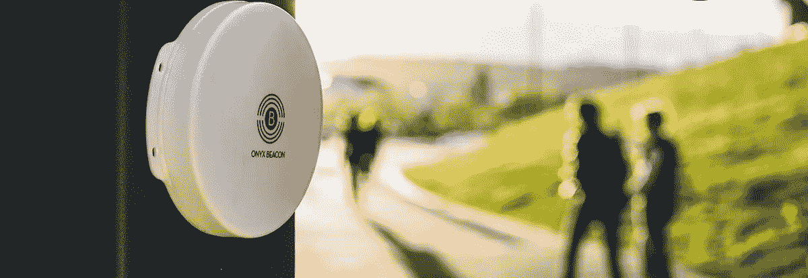
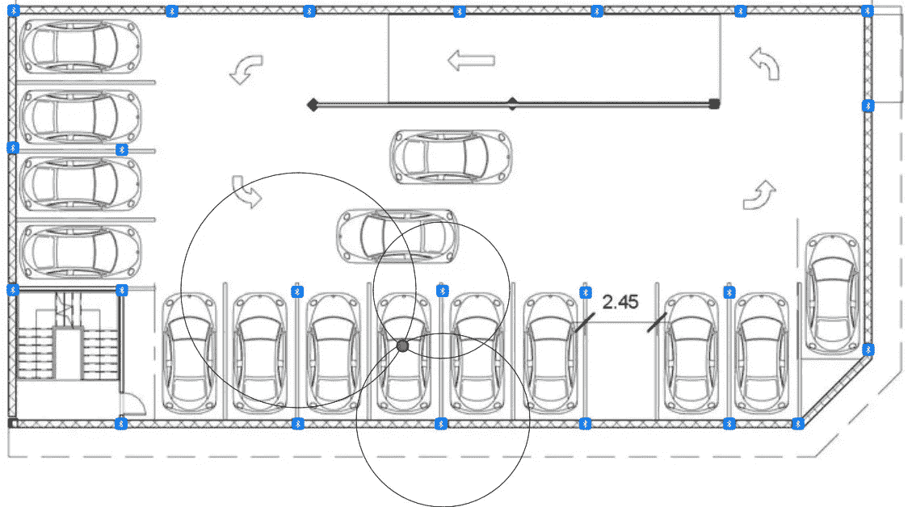
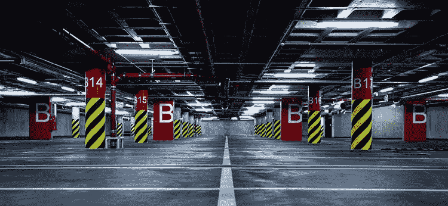

# 对斯里兰卡政府停车场系统的建议…

> 原文：<https://towardsdatascience.com/suggestion-for-sri-lankan-government-car-parking-system-5c3219b6312?source=collection_archive---------21----------------------->

在斯里兰卡的城市中，由于车辆数量和车辆尺寸的持续增长，停车是一个更加棘手的问题。停车不仅是斯里兰卡的一个大问题，也是世界各地的一个大问题。我们知道，每天有一辆 ***百万辆*** 烧机油。因此，我想在这篇文章中给斯里兰卡 ***政府*** 一个建议。这是我在 Medium 的第 11 篇文章。

如今，斯里兰卡城市的停车场有摄像头，他们可以观察车辆数量并计算时间。相机消耗更多的电能，因此我建议用传感器来解决这个问题。在这里我们将看到如何实现这个问题。

这里我想用 ***蓝牙信标*** 。蓝牙信标会发射 5 年的蓝牙电波。蓝牙信标是低能耗设备。我们想造一个装置来接收蓝牙电波。该设备将计算蓝牙连接的时间和离信标的距离。在停车场，我们希望为每个信标设置不同的频率，因为我们应该知道汽车的确切位置。为了防止信号干扰，蓝牙信标的蓝牙波将在特定区域受到控制。通过计算至少三个蓝牙信标的距离，可以找到汽车的位置，这就是为什么我们应该使用不同频率的蓝牙信标。通过画三个半径与计算的距离相对应的圆，并使用圆的公共交点(三角测量)，我们建立的设备将找到汽车的位置。下图描述了 ***三角测量***

当汽车要停车时，我们制造的接收蓝牙电波的装置应该与汽车连接。有些停车系统有不同的设施，例如有些停车场有电梯。如果你使用这些设施，而不是传统的，你应该支付额外的停车费。有人不会支付额外的费用，他们只支付停车费。通过三角测量法，没有人能逃避支付额外的设施使用费。停车的人通过 ***NFC*** (近场通信)支付。

这里有一个问题，那就是每辆车都应该安装接收蓝牙电波的设备，但是斯里兰卡政府可以安装这个系统。这种更 ***消耗能源*** 的问题不仅在斯而且在很多国家都存在。所以那些政府可以像这样改变系统。

***感谢您阅读至此。如果你喜欢这篇文章，请分享、评论并发表👏几次(最多 50 次)。。。也许会对某个人有帮助。***

***关注我的***[***Twitter***](https://twitter.com/TheSabesan)***和 Medium 如果你将来对这些更深入、更翔实的文章感兴趣的话！***