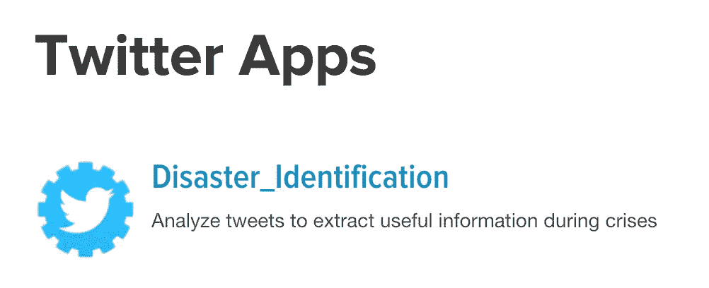
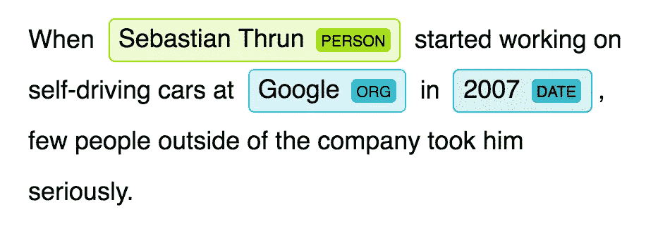
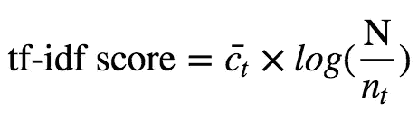
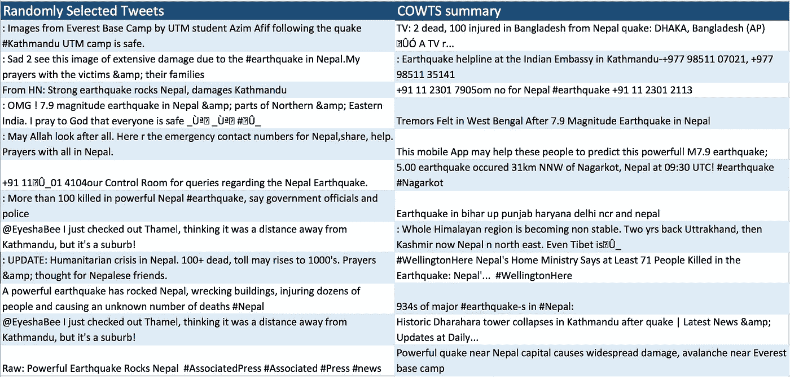
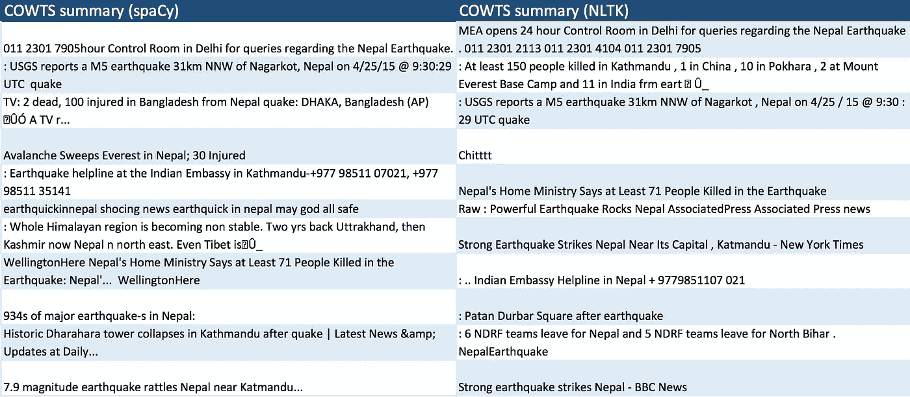

# 总结灾难中的推文

> 原文：<https://towardsdatascience.com/summarizing-tweets-in-a-disaster-e6b355a41732?source=collection_archive---------6----------------------->


Map of the Nepal’s second earthquake’s intensity, credit: [https://www.washingtonpost.com/graphics/world/nepal-earthquake/](https://www.washingtonpost.com/graphics/world/nepal-earthquake/)

2015 年 4 月 25 日，就在中午之前，尼泊尔经历了一场矩震级 [7.8](https://earthquake.usgs.gov/earthquakes/eventpage/us20002926#executive) 的地震。地震席卷了加德满都山谷，一系列余震夷平了整个村庄。

地震发生后，来自世界各地的志愿者在指导紧急行动中发挥了重要作用，他们使用[卫星图像](http://news.nationalgeographic.com/2015/05/150501-nepal-crisis-mapping-disaster-relief-earthquake/)来确定整个地区基础设施的破坏情况。

然而，尼泊尔地面上的人们也在 twitter 上产生了大量可能对救援行动有用的信息，尽管不那么直接。从 4 月 25 日到 5 月 28 日，[有 33610 条推特被尼泊尔人转发。这些推文充满了有用的信息，但 33，610 条推文对于救援行动来说太多了，难以梳理。](https://www.int-arch-photogramm-remote-sens-spatial-inf-sci.net/XLI-B2/567/2016/isprs-archives-XLI-B2-567-2016.pdf)

这是这个项目的动机:

我能从大量的推文中提取出有用的简短摘要吗？这些摘要可能对地面救援行动有用。

## 内容:

0.获取推文

1.  使用内容词和 tf-idf 分数查找所有有用的推文
2.  挑选最好的推文做一个简短的总结
3.  结论

# 0.获取推文

[链接至代码](https://github.com/GabrielTseng/LearningDataScience/blob/master/natural_language_processing/twitter_disasters/1%20-%20Tweets%20from%20IDs.ipynb)

我从“ [Twitter 作为生命线:危机相关消息的 NLP 的人类注释 Twitter 语料库](https://arxiv.org/abs/1605.05894)”获得我的推文；该项目从危机中提取了数千条推文，并将其分为 8 个不同的类别(例如，“流离失所者和疏散”，或“同情和情感支持”)。

然而，由于救援队无法标记推文，我只使用推文本身的数据集，而不是标签。

Twitter 的政策规定，只能保存推文 id，而不是推文本身——这样，如果用户删除了他们的推文，那么它们就不会存储在其他地方。因此，我不得不使用 twitter 的 API 从这个语料库中获取 tweet 内容。这需要我注册一个应用程序:



I am now an app developer!

然后我用 Twython 下载了这些推文，然后就上路了！

# 1.提取情景推文

[链接到代码](https://github.com/GabrielTseng/LearningDataScience/blob/master/natural_language_processing/twitter_disasters/spaCy/2%20-%20Tweet%20Summarization.ipynb)

很明显，并不是所有的推文对救援队都同样有用。举个例子，

```
@Gurmeetramrahim: #MSGHelpEarthquakeVictims Shocked!!!hearing earthquake in Nepal n some parts of India. I pray to GOD to save His child‰
```

不包含对救援队有用的信息，尤其是与以下信息相比:

```
MEA opens 24 hour Control Room for queries regarding the Nepal #Earthquake.
Numbers:
+91 11 2301 2113
+91 11 2301 4104
+91 11 2301 7905
```

有用的推文被归类为**情景推文**，可能包含状态更新，或即时有用的信息(如附近医院的号码)。

**非情境推文**包含(例如)情绪、观点或事件分析。这些并不能立即帮助救援工作。

在我开始总结推文之前，我需要把情景推文和非情景推文分开。我用两种方法做到了这一点:我首先**手动分离推文的特征**(1.1-内容词)，这些特征有助于推文的有用性。然后，我使用了一个名为 **tf-idf** (1.2)的文档分析工具来寻找对这个特定事件和这组推文有意义的词。

## 1.1.实词

在他们 2015 年的论文中。al 确定了在灾难中提供重要信息的三类术语:**数字**、**名词**和**主要动词**。属于这些类别的词被称为实词。我发现这太笼统，无法区分推文，于是自己定义了两个类别:

1.  数字(如伤亡人数、重要电话号码)
2.  [实体](https://spacy.io/docs/usage/entity-recognition)(如地点、日期、事件、组织等。)

[SpaCy](https://spacy.io/) (一个[自然语言处理](https://www.wikiwand.com/en/Natural_language_processing)库，自动从文本中分析提取信息)是一个非常有用的识别实词的工具；当 SpaCy [对](https://nlp.stanford.edu/IR-book/html/htmledition/tokenization-1.html)文本进行标记时，它会向标记添加许多附加信息，例如它是否是实体(如果是，它是什么类型的实体)，它的词性是什么(即它是名词吗？一个动词？一个数字？)，甚至是令牌的情绪。



SpaCy’s awesome [entity recognizer](https://spacy.io/docs/usage/entity-recognition)

我使用 SpaCy 来标记推文。这意味着将推文分解成它们的组成部分(主要是单词，但也包括标点和数字)，并将这些组成部分转化为**符号。**例如，

```
: Over 110 killed in earthquake: Nepal Home Ministry (PTI)
```

成为

```
[:, Over, 110, killed, in, earthquake, :, Nepal, Home, Ministry, (, PTI, )]
```

SpaCy 的强大之处在于这些令牌充满了附加信息；例如，我可以找出所有这些标记的词性:

```
[u'PUNCT', u'ADP', u'NUM', u'VERB', u'ADP', u'NOUN', u'PUNCT', u'PROPN', u'PROPN', u'PROPN', u'PUNCT', u'PROPN', u'PUNCT']
```

令牌的另一个非常有用的属性是它的实体类型；SpaCy 可以告诉我`Kathmandu`是一个城市，或者`25 April`是一个日期。如果实体类型(`token.ent_type_`)是:

1.  `NORP`:国籍、宗教或政治团体
2.  `FACILITY`:建筑、机场、高速公路、桥梁等。
3.  `ORG`:公司、机关、机构等。
4.  `GPE`:国家、城市、州。
5.  非 GPE 地区，山脉，水体。
6.  `EVENT`:命名飓风、战役、战争、体育赛事等。
7.  绝对或相对的日期或时期。
8.  `TIME`:小于一天的时间。

如果单词的词性(`token.pos_`)将它们标记为数字，或者如果它们是关键词列表中的一个(例如‘杀死’，‘受伤’，‘伤害’)，我也会包含这些单词。

这种分类大体上允许我开始整理我的推文；情景推文包含的内容词较多，非情景推文包含的内容词较少。举个例子，

```
@timesofindia: #Earthquake | Helpline numbers of the Indian Embassy in Nepal:\r+9779581107021\r\r+9779851135141'
```

是一条非常有用的推文，正如所料，提取了许多内容词:

```
[the, Indian, Embassy, Nepal, 977, 9581107021, 977, 9851135141]
```

另一方面，

```
Pray for #Nepal where a powerful earthquake has struck. May the Almighty grant them ease to face this calamity with utmost s‰Û_
```

包含的情景信息很少，从中提取的唯一内容词是`[Nepal]`。

## 1.2.tf-idf 分数

实词的一个缺点是它们不能捕捉到关于单词本身的任何信息。例如，对于这场灾难，单词`Nepal`将是一个强有力的指标，表明一条推文是否是情境性的，但它现在与任何其他内容单词的权重没有任何不同。

可以使用[术语频率—逆文档频率](https://www.wikiwand.com/en/Tf%E2%80%93idf) (tf-idf)得分来引入这种加权。

尽管 tf-idf 的名称很长，但其背后的逻辑却很简单:

> 在文档主体中出现频率相当高的单词可能更重要，但是如果它们出现得太频繁，那么它们就太笼统而没有帮助。

基本上，我想给“尼泊尔”这个词打高分(它应该在许多推文中出现一次)，而不是“the”(它应该在许多推文中出现多次)。

数学上，某个单词 *t* 的 tf-idf 分数可以描述为



其中 c 是单词 *t* 在文档中出现的平均次数，N 是文档总数， *n* 是单词 *t* 出现的文档数。

[Textacy](http://textacy.readthedocs.io/en/latest/api_reference.html) ，一个建立在 [SpaCy](https://spacy.io/docs/api/token) 之上的库，让我给推文中的单词分配 tf-idf 分数变得超级简单:

```
WORD:morning -- tf-idf SCORE:6.45446604904
WORD:bishnu -- tf-idf SCORE:8.06390396147
WORD:nagarkot -- tf-idf SCORE:12.2359876248
WORD:search -- tf-idf SCORE:6.35915586923
WORD:kathmandu -- tf-idf SCORE:5.27350744616
```

现在，如果我只选择有很多内容词的推文，或者甚至只选择有很多 tf-idf 分数高的内容词的推文，我仍然会有太多的推文供救援队实际使用。

我想做的是找到一个简短的推文摘要，但它也包含了尽可能多的 tf-idf 得分最高的词。

# 2.基于内容词的推文摘要

为了生成对救援队有用的东西，我需要生成一些简短的东西(因此可以快速阅读)。它还需要包含对救援队有用的信息——因此摘要需要充满具有高 tf-idf 分数的内容词。

我可以很容易地将它定义为一个带约束条件的方程:

**等式:**最大化我的摘要中内容词的总分。

**约束 1:** 摘要必须短于 150 字。

**约束 2:** 如果我选择一个内容词出现在我的摘要中，那么我必须选择一些包含该内容词的 tweet 出现在我的摘要中。

**约束 3:** 如果我选择某条推文放在我的摘要中，那么这条推文中的所有内容词都必须包含在内。

我需要在约束条件下解方程。我求解的变量(一个实词是否在摘要里)是**整数。**具体来说，选择是二进制的——如果包含该单词，选择 1；如果不包含，选择 0。

这种用整数变量来求解受一些约束的一些方程(最大化内容词的得分)的方法被称为[整数线性规划](https://www.wikiwand.com/en/Integer_programming) (ILP)。

使用 ILP，我可以从数学上定义我上面写的最大化


其中 x 和 y 是 1 和 0 的数组，取决于是否选择了 tweet *i* 和内容词 *j* ，Score( *j* )是内容词 *j* 的 tf-idf 分数。约束条件定义如下


See my [jupyter notebook](https://github.com/GabrielTseng/LearningDataScience/blob/master/Natural_Language_Processing/TwitterDisasters/2%20-%20COWTS.ipynb) for more info on what these mean

使用 [pymathproj](http://pymprog.sourceforge.net/) 来优化这个 ILP 问题产生了以下总结:

```
1\. TV: 2 dead, 100 injured in Bangladesh from Nepal quake: DHAKA, Bangladesh (AP) ‰ÛÓ A TV r...
-------------
2\. : Earthquake helpline at the Indian Embassy in Kathmandu-+977 98511 07021, +977 98511 35141
-------------
3\. +91 11 2301 7905om no for Nepal #earthquake +91 11 2301 2113
-------------
4\. Tremors felt in West Bengal after 7.9 Magnitude Earthquake in Nepal 
-------------
5\. This mobile App may help these people to predict this powerfull M7.9 earthquake 
-------------
6\. 5.00 earthquake occured 31km NNW of Nagarkot, Nepal at 09:30 UTC! #earthquake #Nagarkot 
-------------
7\. Earthquake in bihar up punjab haryana delhi ncr and nepal 
-------------
8\. : Whole Himalayan region is becoming non stable. Two yrs back Uttrakhand, then Kashmir now Nepal n north east. Even Tibet is‰Û_
-------------
9\. WellingtonHere Nepal's Home Ministry Says at Least 71 People Killed in the Earthquake: Nepal'...  WellingtonHere
-------------
10\. 934s of major earthquake-s in Nepal:
-------------
11\. Historic Dharahara tower collapses in Kathmandu after quake | Latest News &amp; Updates at Daily...
-------------
12\. Powerful quake near Nepal capital causes widespread damage, avalanche near Everest base camp
```

将此与随机推文进行比较:



A comparison of the tweets selected by COWTS to a random selection from the database.

肯定有一些噪音，但并不坏！摘要尤其擅长提供位置信息，例如描述震中在哪里以及哪些区域受到地震影响。

# 3.结论

如果我再次做这个项目，我会**使用一个** [**twitter 特有的**](http://www.nltk.org/howto/twitter.html) **标记器**。SpaCy 的 tokenizer 实际上在标记数据方面相当糟糕，因为所有的缩写和 twitter 专用术语。我还会对数据进行更多的清理，因为拼写错误和缩写也可能会损害记号赋予器的性能。

总的来说，用除了[单词嵌入](https://www.wikiwand.com/en/Word_embedding)之外的方法来比较和量化文本数据是很棒的。此外，这种方法的速度让我相信它可以由救援队实施；特别是，如果使用更小的推文子集(例如，每日推文，而不是覆盖整个事件的推文)，这将非常有用！

## 3.1 进一步阅读

这个项目涉及实施各种不同的文件；这里有一些很酷的论文，可以进一步探索灾难中的 twitter 摘要:

[Twitter 作为生命线:危机相关消息的自然语言处理的人类注释 Twitter 语料库](https://arxiv.org/abs/1605.05894)

[自然语言处理拯救？在大规模突发事件中提取“情境感知”推文](https://www.aaai.org/ocs/index.php/ICWSM/ICWSM11/paper/view/2834)

[总结危机场景中的情景推文](http://dl.acm.org/citation.cfm?id=2914600)(本帖实质上实现了本文)

# 更新—使用 NLTK 的 twitter 标记器

[链接到代码](https://github.com/GabrielTseng/LearningDataScience/blob/master/Natural_Language_Processing/TwitterDisasters/NLTK/2%20-%20Tweet%20Summarization.ipynb)

我用 NLTK 代替 spaCy 重复了这个练习。这允许我使用 NLTK 的 [twitter 特定标记器](http://www.nltk.org/_modules/nltk/tokenize/casual.html#TweetTokenizer)对 tweets 进行标记，产生以下摘要(与 spaCy 输出相比):



NDRF: India’s [Natural Disaster Response Force](https://www.wikiwand.com/en/National_Disaster_Response_Force)

因为内容词的定义不同，所以很难定量地比较这两个输出，但是值得注意的是 NLTK 的实体识别系统(我用的是斯坦福的 NER)明显比 spaCy 的慢。

我(试图)在第 2 部分中使用这些精选的 tweets 建立一个抽象的总结:

[](https://medium.com/towards-data-science/summarizing-tweets-in-a-disaster-part-ii-67db021d378d) [## 总结灾难中的推文(第二部分)

### 现在是 2015 年 5 月，救援队正在努力重建 4 月地震(及其余震)后的尼泊尔。可以…

medium.com](https://medium.com/towards-data-science/summarizing-tweets-in-a-disaster-part-ii-67db021d378d)