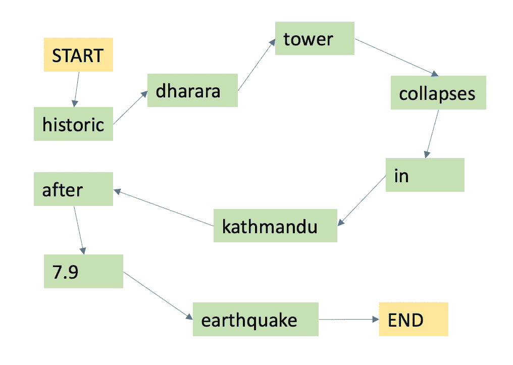
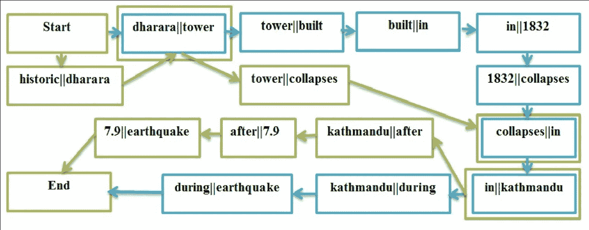
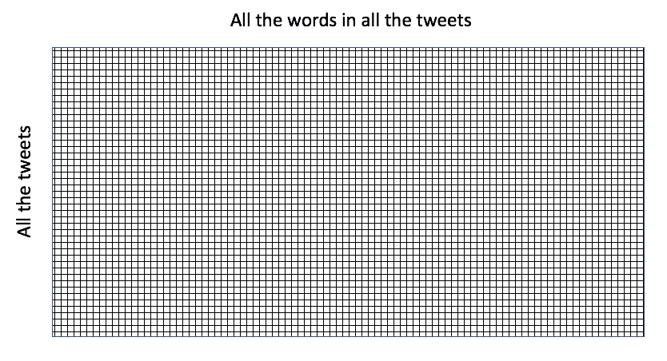
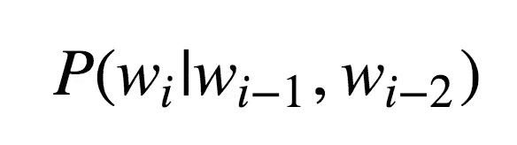
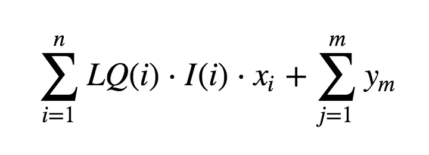
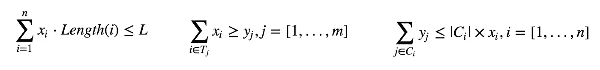

# 总结灾难中的推文(第二部分)

> 原文：<https://towardsdatascience.com/summarizing-tweets-in-a-disaster-part-ii-67db021d378d?source=collection_archive---------7----------------------->

现在是 2015 年 5 月，救援队正在努力重建 4 月[地震](https://www.wikiwand.com/en/April_2015_Nepal_earthquake)(及其余震)后的尼泊尔。这些努力能得到 twitter 的帮助吗？

在之前的帖子中，我构建了一个推文摘要器，它收集了 4 月 25 日至 5 月 28 日之间的所有推文，并选择了对救援队最有用的推文摘要:

[](https://medium.com/towards-data-science/summarizing-tweets-in-a-disaster-e6b355a41732) [## 总结灾难中的推文

### 在危机中使用数据科学帮助救援团队

medium.com](https://medium.com/towards-data-science/summarizing-tweets-in-a-disaster-e6b355a41732) 

现在，我想更进一步:不仅仅是选择最好的推文，我能生成我自己的句子，有效地总结推文中所有有用的信息吗？

**注**:本帖本质上是[本文](http://itra.medialabasia.in/data/Documents/DISARM/publications/26.pdf)的一个实现；如果你对这个主题感兴趣，它绝对值得一读！

## 内容:

1.  **制作文字图表**
    我已经使用内容文字推文摘要生成了最佳推文的摘要(在[之前的帖子](https://medium.com/towards-data-science/summarizing-tweets-in-a-disaster-e6b355a41732)中)。我将使用这些推文，并考虑它们包含的所有可能的单词路径(使用单词图)。
2.  **调查信息含量和语言质量**
    然后，我将通过定义一些新的指标来选择最佳的单词路径:信息含量和语言质量。
3.  **生成抽象摘要** 最后，我将使用这些最佳单词路径来生成推文的抽象摘要。

我做了两次这个练习，使用了 [spaCy](https://spacy.io/) 和 [NLTK](http://www.nltk.org/) 作为标记器(并使用了它们各自从内容词 tweet 摘要中选择的 tweet)。

链接到[空间](https://github.com/GabrielTseng/LearningDataScience/blob/master/natural_language_processing/twitter_disasters/spaCy/3%20-%20Abstractive%20Summary.ipynb)和 [NLTK](https://github.com/GabrielTseng/LearningDataScience/blob/master/natural_language_processing/twitter_disasters/NLTK/3%20-%20Abstractive%20Summary.ipynb) 的笔记本。

# 1.制作单词图表

为了生成我自己的句子，我将选择最好的推文，并考虑其中包含的所有可能的单词路径。

这到底是什么意思？

为了理解什么是单词路径，我首先要考虑一个**单词图**。单词图是句子的图形表示，节点表示单词，边表示单词之间的连接。例如，句子“7.9 级地震后加德满都历史性的 dharara 塔倒塌”可以用下面的单词 graph 来表示:



当添加多个句子时，单词图变得强大。比如，我加了一句话:“建于 1832 年的达卡纳尔塔在加德满都地震中倒塌”:



Credit to [Rudra et al](http://dl.acm.org/citation.cfm?id=2914600) for this figure. [Bigrams](https://www.wikiwand.com/en/Bigram) rather than words are used at the nodes, but the principle is otherwise the same.

现在，我可以通过这个图表找到与原始输入句子不同的单词路径，例如“1832 年建造的 dharara 塔在加德满都 7.9 级地震后倒塌”。我已经能够从两个输入的句子中提取一些信息，来制作我自己的。

抽象摘要的目标本质上是这样做的:生成我自己的单词路径，以便从 tweets 中分离出最好的信息。

以我自己的推文为例，我可以使用二元模型从它们生成一个单词图，然后我可以用它来生成所有可能的价值路径。许多单词路径会产生无意义的句子，例如

```
[Nepal quake - Buildings collapse in Delhi for queries regarding tragic Earthquake Rocks Nepal victims']
```

所以我希望得到**有用的**字路径，这也**有意义**。

# **2。信息量和语言质量**

为了获得有用的有意义的单词路径，我将测量两个指标:信息量和语言质量。

## 2.1.信息量

信息含量实际上意味着这条推文在我拥有的推文语料库中的代表性。幸运的是，有一种简单的方法可以量化这一点。当我为上一篇文章的摘要选择推文时，我生成了一个叫做 tf-idf [术语矩阵](https://www.wikiwand.com/en/Document-term_matrix)的东西。这是一个矩阵，包含了所有推文的所有词汇:



每一列代表一个单词。如果`row [i]`中的一条 tweet 包含由`column [j]`表示的单词，那么矩阵元素`[i][j]`将包含该单词的 [tf-idf 得分](https://www.wikiwand.com/en/Tf%E2%80%93idf)。否则，它将包含一个 0。

因此，我可以通过计算每一列的平均值来生成一个向量，该向量近似表示推文的主体:


An array of height 1 with a length equal to the total vocabulary size of all the tweets, populated by the column mean of each value for all the tweets.

我可以为每个单词路径生成一个类似的行，并比较这个平均向量和单词路径向量之间的差异。我这样做是为了找到它们的[余弦相似度](https://www.wikiwand.com/en/Cosine_similarity)，它测量两个向量之间的余弦角(越小越相似)。

## 2.2.语言质量

因为许多单词路径是无意义的，所以选择有意义的语法正确的句子很重要。我该怎么做？

一种方法是看看我选择的单词路径中的单词序列出现在“正确英语”中的可能性有多大。我可以通过分析“正确英语”的文本，并测量不同单词序列出现的频率来做到这一点。然后，我可以将它与我的单词路径进行比较；如果一个单词路径充满了频繁出现的单词序列，那么它在语言学上更有可能是正确的，所以我会给它更高的分数。

长度为 n 的单词序列被称为 n-gram，因此这种语言质量的方法被称为 n-gram 语言模型。



The probability being found by a trigram

三元模型(n = 3 时的 n 元模型)计算上面的等式:考虑到在它之前出现的两个单词，单词路径中的下一个单词是它所在的单词的概率是多少，其中该概率与英语语料库进行比较。

幸运的是，有一个名为 [kenlm](https://kheafield.com/code/kenlm/) 的工具包，它就是为做这件事而设计的(这里的是一个很棒的帖子，它详细介绍了如何从 n 元语法中提取语言质量)。

使用 kenlm，我使用了[当代美国英语语料库(COCA)](https://corpus.byu.edu/coca/) 作为我的“正确英语”参考，并对单词路径的语言质量进行了评分。

# 3.生成抽象的摘要

就像在第 1 部分中一样，我使用这些组件生成一个整数线性问题，这个问题是可以解决的。考虑到所有的单词路径，我想选择具有最高信息量分数和最高语言质量的单词路径，这些路径也包含最多的内容单词。

数学上，我可以这样写



其中，LQ 是语言质量，I 是第 i *个*单词路径的信息含量，服从以下约束:

1.  我的总结必须少于 150 字
2.  如果选择了内容词，还必须选择包含该内容词的词路径
3.  如果选择了单词路径，则必须选择该单词路径中的所有内容单词。

我也可以用数学来描述它



For more information on exactly how I programmed these, check out the [NLTK](https://github.com/GabrielTseng/LearningDataScience/blob/master/Natural_Language_Processing/TwitterDisasters/NLTK/3%20-%20Abstractive%20Summary.ipynb) and [spaCy](https://github.com/GabrielTseng/LearningDataScience/blob/master/Natural_Language_Processing/TwitterDisasters/spaCy/3%20-%20Abstractive%20Summary.ipynb) Jupyter notebooks.

然后我使用 [pymathprog](http://pymprog.sourceforge.net/) ，和整数规划模块，来求解这些方程(通过最大化第一个方程，服从第二个三个方程的约束)。

这为空间产生了以下结果:

```
**spaCY:**
--------------
 valanche sweeps everest base camp , 34 minute of major earthquake 
--------------
: mea control room no for nepal 25/04/2015 07:13 utc , april 25,nepalquake kathmanduquake
--------------
 high alert after 7.9 magnitude earthquake perso _thquake 
--------------
earthquake m7.5 strike 89 km nw of 4.5 + 91 11 2301 7905
--------------
thr r safe . apr 25 14:14 at 7.7 richter scale , via
--------------
sad day for the last 1 hour(s ) .   associatedpress associated press news
--------------
: whole himalayan region be up and lalitpur make kathmandu 's 19th century nine - witness
--------------
: 09771 4261945/ 4261790 emergency helpline number in 80 year - typical indian
--------------
 9779851135141 square   afganistan bhutan emb 
--------------
building collapse , 400 people kill in kathmandu-+977 98511 07021 , 9851135141
--------------
 nepal n north east . kathmandu contact mr. adhikari 00977 - cnn
```

对于 NLTK:

```
--------------
: LATEST Nepal's Kantipur TV shows at Ahmedabad from Kathmandu RestlessEarth GeographyNow
--------------
MEA opens 24hr Control Room in Nepal 20 00 29 UTC quake
--------------
: EarthquakeInNepal Helpline Numbers of Lamjung , Purvanchal & Kochi too !
--------------
: Warning India Bangladesh Pakistan Afganistan Bhutan Nepal Earthquake Rocks Nepal BBC
--------------
Dharahara also called Bhimsen Tower , 2 at 09:30 UTC , 9851135141
--------------
( Houston _0998 ) Avalanche Sweeps Everest in Nepal - New York Times
--------------
Kathmandu's Darbar Square after 7.9 magnitude in Tibet Nepalquake Embedded image permalink
--------------
5.00 earthquake Kathmandu Ambulance and 11 2301 2113 011 2301 4104 011 2301 7905
--------------
Update on 4/25 / 2015 06:37 UTC , Katmandu - Fox News
--------------
: 09771 4261945 / 15 @ 9:30 : Nepal AssociatedPress Associated Press news
--------------
Bravo Google You are faster than 300 people within 100km . 9 - France 24
--------------
: Patan Durbar Square after 7.7 quake : 079-2325190 0/902 / 9779851135 141
```

这些都不太好，比起抽象的摘要，tweet 摘要绝对是捕捉最好的有用 tweet 的更好的方法。有些单词路径确实有意义，但绝大多数没有意义。

# 4.结论

这是对自然语言处理的一次有趣的入侵。特别是，看到数据科学如何应用于机器学习和神经网络之外，并使用另一种优化方法( [ILP](https://www.wikiwand.com/en/Integer_programming) )真是太棒了。

探索不同的 NLP 技术也很棒，比如单词图和 n-gram。

我怀疑这种方法失败的原因是因为选择的推文太不一样了；word graph 擅长获取相似的 tweets，然后找到一个单词路径，只从中提取有用的信息。自从我*用[考茨](https://medium.com/towards-data-science/summarizing-tweets-in-a-disaster-e6b355a41732)选择的推文开始*，推文就已经是摘要了。

如果我再试一次，我会使用更广泛的推文，尝试并利用这一点。