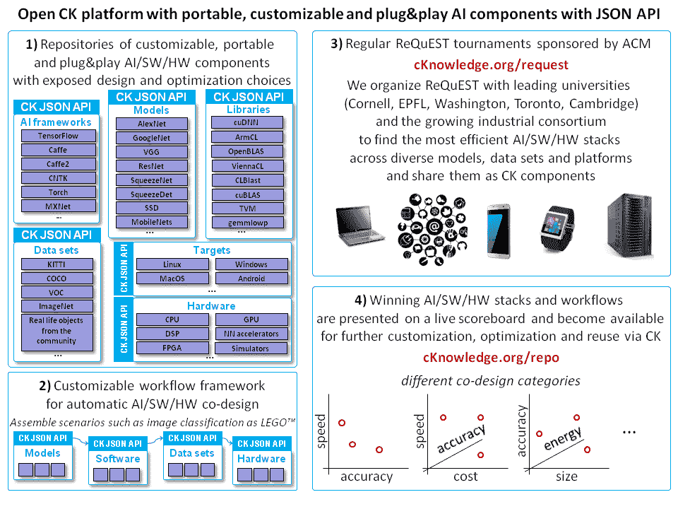

# 2017 年与开放和可重复研究相关的活动总结

> 原文：<https://towardsdatascience.com/summary-of-2017-activities-related-to-open-and-reproducible-research-e2033946207b?source=collection_archive---------12----------------------->

去年对于 [cTuning foundation](http://ctuning.org/) 和[divideti](http://dividiti.com/)来说是非常紧张的一年——我们继续与 AI、ML 和系统社区密切合作，以自动化实验，同时基于我们的[长期愿景](https://hal.inria.fr/inria-00436029)提高结果的可重复性和可重用性。

首先，在 ACM[CGO 2018](http://ctuning.org/ae/cgo2018.html)和[PPoPP 2018](http://ctuning.org/ae/ppopp2018.html)年会上，我们有机会应用新的 [ACM 工件审查和标记政策](https://www.acm.org/publications/policies/artifact-review-badging)(该政策是我们一年前作为新的 [ACM 再现性工作组](https://www.acm.org/publications/task-force-on-data-software-and-reproducibility)的一部分，基于我们之前的[工件评估经验](http://ctuning.org/ae)而共同制定的)。好消息是，我们又有了一个创纪录的提交数量:近一半被接受的论文提交了工件进行验证，总数达到 30 个！我们还从 EasyChair 切换到 [HotCRP](https://hotcrp.com/) 用于工件提交和评估，因为最后一个在评估期间提供了作者和评审者之间更方便和匿名的通信机制，以持续解决问题！这也促使我们在未来的会议上取消工件评估期间的“技术澄清”会议，因为我们的评审员已经在评估期间与作者进行了沟通！

我们还注意到，我们几年前准备的试图统一 CGO、PPoPP 和 PACT AE 的[工件附录模板](http://ctuning.org/ae/submission.html)现在被用于其他会议，包括[超级计算](https://sc18.supercomputing.org/tag/reproducibility/)(参见这篇[SC’17 论文](https://dl.acm.org/citation.cfm?id=3126948)中的工件描述，它将用于 SC’18 的[集群竞赛)！作为](https://sc18.supercomputing.org/sc18-announces-selected-paper-for-next-student-cluster-competition-reproducibility-challenge/) [ACM 试点项目的一部分，我们计划与集群同事合作，以自动化工件评估并引入工作流框架](https://www.acm.org/publications/dl-pilot-integrations)来将这些工件转换为我们的集体知识格式(参见 [SC'16 论文](https://dl.acm.org/citation.cfm?doid=2807591.2807619)和 [CGO'17 文章](https://www.cl.cam.ac.uk/~sa614/papers/Software-Prefetching-CGO2017.pdf)，工件和工作流以 CK 格式共享)。

最后，我们从过去的 CGO/PPoPP’17 中获得了社区对我们的开放工件评估的非常积极的反馈，我们考虑在未来更多地使用它(参见[我们的动机](http://adapt-workshop.org/motivation2016.html)):

*   [https://github.com/thu-pacman/self-checkpoint/issues/1](https://gitlab.com/michel-steuwer/cgo_2017_artifact/issues/1)
*   [https://git lab . com/Michel-steuwer/CGO _ 2017 _ artifact/issues/1](https://gitlab.com/michel-steuwer/cgo_2017_artifact/issues/1)
*   [https://github . com/SamAinsworth/reproduce-CGO 2017-paper/issues/6](https://github.com/SamAinsworth/reproduce-cgo2017-paper/issues/6)

与此同时，我们注意到“可用工件”和“可重用工件”徽章的新策略有几个模糊之处。

在与我们的 ACM 同事协商后，我们更新了[http://cTuning.org/ae/reviewing.html](http://ctuning.org/ae/reviewing.html)的“可用工件”徽章的审核标准:

与本文相关的作者创作的工件只有被放置在公共可访问的档案库中，如[芝诺多](https://zenodo.org/)、[菲格舍](https://figshare.com/)或[得律阿德斯](http://datadryad.org/)，才能获得 ACM“可用工件”徽章。DOI 将被分配给他们的工件，并且必须在工件附录中提供！作者也可以通过 ACM DL 共享他们的工件——在这种情况下，他们应该联系 AE 主席以获得 DOI(不像上面的库，还没有自动化)。

“工件可重用”徽章的标准变得更加模糊，特别是对于系统研究，在系统研究中，实验工作流经常涉及非常复杂和不断变化的算法/软件/硬件堆栈。许多作者认为，让他们的工件公开一个 ReadME，几个特别的脚本来构建和运行实验，以及一个 Docker 映像就足以获得“工件可重用”的徽章。

每年，我们都看到我们的评估人员承受着各种各样的负担和痛苦，他们要弄清楚如何处理大量临时的、不可移植的、经常失败的脚本、不统一的数据格式和临时验证。这就是为什么我们认为必须使用某种通用的工作流框架，结合跨平台的包管理器和通用的 API，以使工件易于重用、可移植和可定制(参见[集体知识](https://github.com/ctuning/ck/wiki/Portable-workflows)、 [spack](https://spack.io/) 、 [easybuild](https://github.com/easybuilders/easybuild) 等)。).这样的自动化和统一有助于使工件评估在更长的时间内是可持续的，特别是当提交更多工件的时候。

然而，由于我们不想强加我们的观点，并且还没有设法得出令人满意的结论，我们在 CGO/PPoPP’18 的开放工件评估讨论会上开始讨论这些问题。我们还在 CNRS 2017 年的演讲“[支持开放和可复制的计算机系统研究:好的、坏的和丑陋的](https://www.slideshare.net/GrigoriFursin/enabling-open-and-reproducible-computer-systems-research-the-good-the-bad-and-the-ugly)”中描述了其中一些问题和可能的解决方案。

与此同时，我们继续与 [ACM](http://acm.org/) 、 [Raspberry Pi foundation](https://www.raspberrypi.org/) 和 [the community](http://cknowledge.org/partners.html) 合作，使用我们的开源[集体知识平台](http://cknowledge.org/)改善自动化和实验众包，并通过公共 Python API 和 JSON 元信息将工件和工作流作为可移植、可定制和可重用的组件进行共享。

您可以在我们最近基于 CK 的交互式可复制文章“[多目标自动调整和机器学习技术协作研究的集体知识工作流](http://cknowledge.org/repo/web.php?wcid=report:rpi3-crowd-tuning-2017-interactive)中看到这种“即插即用”工件和工作流的实际例子。它展示了我们的长期教育计划，教导学生如何以协作和可复制的方式，为自我优化的计算机系统进行软件和硬件堆栈的基准测试和共同设计。它通过 [GitHub](https://github.com/ctuning/ck-rpi-optimization-results) 和 [FigShare](https://doi.org/10.6084/m9.figshare.5789007.v2) 将所有工作流、工件和结果共享为可移植、可定制和可重用的 CK 组件，让社区验证、重用、改进和构建它们，同时通过我们的[公共 CK 库](http://cknowledge.org/repo)进行众包实验。此外，我们希望研究人员在反馈指导的编译和自动调优过程中，快速重用和比较特定平台和编译器上常见基准和数据集的共享性能结果，而不是花费大量精力重新构建和重新运行此类实验！

我们也非常高兴能与一流大学联盟(康乃尔、华府、多伦多、EPFL、剑桥)和强大的顾问委员会(http://cKnowledge.org/request[)在集体知识平台的基础上组织第一届 ACM 请求锦标赛](http://cknowledge.org/request)。这一新颖的竞赛系列专注于在速度、准确性、功耗和成本方面，针对 AI、ML、深度学习和其他新兴工作负载，对整个应用/软件/硬件堆栈进行可重复和 Pareto 高效的共同设计和优化。更重要的是，越来越多的[参与者](http://cknowledge.org/partners.html)将继续改进通用的和[基于 CK 的](http://cknowledge.org/)优化工作流，并共享在从物联网到 HPC 的不同模型、数据集和平台上优化的可移植和可定制的 AI/ML 模块。基准测试结果和获胜的软件/硬件/型号配置将在[公共交互式仪表板](http://cknowledge.org/repo)上显示，并根据特定类别(例如嵌入式与服务器)进行分组。得益于通用的 CK 框架，它们还可以被复制、重用、改进和比较。我们的最终目标是将所有获奖算法和相关工件作为“即插即用”CK 组件与通用 API 共享，让社区立即验证、定制、重用和构建它们，从而消除技术转移差距，实现开放系统/人工智能/人工智能研究！

Collective Knowledge approach to enable efficient and intelligent computer systems

ReQuEST 的第一版将主要作为我们的方法、框架和知识库的测试平台，因此我们决定将提交内容仅限于图像分类的深度学习算法。它将与 ASP los ' 18-ACM 编程语言和操作系统的体系结构支持会议同期举行，这是一个跨计算机体系结构和硬件、编程语言和编译器、操作系统和网络的多学科系统研究的主要论坛。帕累托效率或原始提交的作者将被邀请在相关的 ACM 研讨会上介绍他们的发现。在锦标赛结束时，我们将向我们的顾问委员会提供一份报告，介绍锦标赛的结果、问题、可能的解决方案和后续步骤。

您可以在以下文档中找到有关请求长期愿景的更多详细信息:

*   [介绍请求:可再生和高质量系统的开放平台——ML 锦标赛](https://www.slideshare.net/GrigoriFursin/adapting-to-a-cambrian-aiswhw-explosion-with-open-codesign-competitions-and-collective-knowledge)
*   [通过开放的合作设计竞赛和集体知识来适应寒武纪的人工智能/软件/硬件爆炸](https://www.slideshare.net/GrigoriFursin/adapting-to-a-cambrian-aiswhw-explosion-with-open-codesign-competitions-and-collective-knowledge)
*   [在 ASP los’18](http://cknowledge.org/request-cfp-asplos2018.html)上举办的第一届帕累托有效图像分类可再现锦标赛

我们期待在 2018 年与大家合作，实现研究和实验的自动化，提高已发布结果的可重复性，为人工智能和其他新兴工作负载开发高效的系统，加速人工智能/人工智能/系统研究，在人工智能方面取得突破，并使智能系统无处不在！

# 杂项资源(2017 年)

# 事件

*   [SC ' 17](http://sc17.supercomputing.org/2017/02/07/submitting-a-technical-paper-to-sc17-participate-in-the-sc17-reproducibility-initiative/)的工件评估(使用我们的[工件附录模板](http://ctuning.org/ae/submission.html))
*   [NIPS 的 17 纸实施挑战](https://nurture.ai/nips-challenge)
*   [用于研究的数字基础设施(2017)](https://indico.egi.eu/indico/event/3455)
*   [亿亿次计算研讨会上的计算再现性(CRE2017)](http://www.cs.fsu.edu/~cre)
*   [开源超级计算研讨会(OpenSuCo-2017)](http://www.opensuco.community/2017/04/28/opensuco-2/)
*   [ACM SIGCOMM 2017 再现性研讨会(再现性' 17)](http://conferences.sigcomm.org/sigcomm/2017/workshop-reproducibility.html)

# 主动权

*   [ACM 数字图书馆](http://dl.acm.org/)中的工件示例:
*   [*https://dl.acm.org/citation.cfm?doid=2807591.2807619*](https://dl.acm.org/citation.cfm?doid=2807591.2807619)*—SC ' 16 纸哪用* [*集体知识*](http://github.com/ctuning/ck) *分享神器*
*   [*【CGO’18 复制包(神器)*带链接纸](https://dl.acm.org/citation.cfm?id=3190425)
*   **—SC ' 16 纸哪用了* [*集体知识*](http://github.com/ctuning/ck) *分享神器**
*   *[*CGO‘18 复制包(神器)*](https://dl.acm.org/citation.cfm?id=3190425)*
*   *[开放评论](https://openreview.net/)*
*   *[ACM 数字图书馆中的人工制品徽章示例](https://dl.acm.org/citation.cfm?doid=2882903.2915964)*
*   *[ACM SIGPLAN 的经验评估清单(测试版)](https://docs.google.com/document/d/1l6IXVNdtVloYaRY_WvcsK0qN40O0Uf0b0_rq3M1RmJo/edit?usp=sharing)*
*   *波普尔:实践的可证伪性研究*
*   *[丹麦奥尔胡斯大学推出首个开放科学平台](https://starbios2.eu/2017/open-science-platform-aarhus-university/)*
*   *[OpenNeuro 平台——开放且可复制的科学服务](http://reproducibility.stanford.edu/announcing-the-openneuro-platform-open-and-reproducible-science-as-a-service/)*
*   *[开源软件杂志](http://joss.theoj.org/about)*
*   *[协同开放计算机科学](http://www.gitxiv.com/)*
*   *[可再生科学项目](https://reproduciblescience.org/)*
*   *[用于链接数据的 JSON](https://json-ld.org/)*
*   *[通用工作流语言，v1.0](https://figshare.com/articles/Common_Workflow_Language_draft_3/3115156/2) ( [GitHub](https://github.com/common-workflow-language) )*
*   *[数据科学工作流程:概述和挑战](https://cacm.acm.org/blogs/blog-cacm/169199-data-science-workflow-overview-and-challenges/fulltext)*
*   *[通用工作流语言的自动化工具包装器/转换器](http://obf.github.io/GSoC/ideas/#automated-tool-wrapperconverter-for-cwl)*
*   *[在 2017 年 ACM 多媒体系统大会上公开数据集和软件专题](http://mmsys17.iis.sinica.edu.tw/dataset-track)*
*   *[下一代测序生物信息学软件的可重复性和综合评估](https://www.nsf.gov/awardsearch/showAward?AWD_ID=1718479&utm_content=buffera0235&utm_medium=social&utm_source=linkedin.com&utm_campaign=buffer)*
*   *[code meta 项目](https://codemeta.github.io/)*

# *仓库*

*   *[施普林格自然公司的研究数据](https://researchdata.springernature.com/)*
*   *ACM“文物可用”徽章可接受的永久档案:*
*   *[*芝诺多*](https://zenodo.org/)*
*   *[*FigShare*](https://figshare.com/)*
*   *[*得律阿德斯*](http://datadryad.org/)*

# *工具*

*   *[使用集体知识框架的可移植工作流程](https://github.com/ctuning/ck/wiki/Portable-workflows)*
*   *[Spack:用于 HPC 的便携式包管理器](https://github.com/llnl/spack)(我们计划将来连接 [CK](https://github.com/ctuning/ck) 和 Spack)*
*   *Scons:一个软件构建工具(我们给 CK 增加了[对 Scons](https://github.com/ctuning/ck-env/tree/master/soft/tool.scons) 的支持)*
*   *[脸书·巴克(一个快速构建系统)](https://github.com/facebook/buck)*
*   *[基因组分析工具包 4 (GATK4)作为开源资源加速研究](https://www.broadinstitute.org/news/broad-institute-release-genome-analysis-toolkit-4-gatk4-open-source-resource-accelerate)*
*   *[NextFlow:一种用于数据驱动计算流水线的 DSL](https://github.com/nextflow-io/nextflow)*
*   *LabPal:在电脑上轻松运行实验*
*   *[匿名 Github:一个代理服务器，支持匿名浏览开放科学代码和数据的 Github 库](https://github.com/tdurieux/anonymous_github)*
*   *[奇点容器](http://singularity.lbl.gov/)*
*   *[VC++打包工具](https://github.com/Microsoft/vcpkg)*
*   *[Google CoLab](https://colab.research.google.com/notebooks/welcome.ipynb)*
*   *基准和数据集*
*   *[英国国家高性能计算基准](https://www.archer.ac.uk/documentation/white-papers/benchmarks/UK_National_HPC_Benchmarks.pdf)*
*   *[Yfcc100m:多媒体研究的新数据](http://cacm.acm.org/magazines/2016/2/197425-yfcc100m/fulltext)*

# *文章*

*   *[关于自动调整和机器学习的交互式和可复制文章示例](http://cknowledge.org/rpi-crowd-tuning)*
*   *[通过开放的合作设计竞赛和集体知识来适应寒武纪人工智能/软件/硬件爆炸](https://www.slideshare.net/GrigoriFursin/adapting-to-a-cambrian-aiswhw-explosion-with-open-codesign-competitions-and-collective-knowledge)*
*   *[什么是好的博士？作者 Lasse Natvig](http://www.ntnu.no/wiki/download/attachments/98080956/Lasse_What_is_a_Good_PhD_22_Mars_2017.pdf)*
*   *[通过研究透明度应对再现性威胁](https://osf.io/c5n6y/)*
*   *[实证软件工程使用 R](http://www.knosof.co.uk/ESEUR)*
*   *[机器学习系统中隐藏的技术债务](https://papers.nips.cc/paper/5656-hidden-technical-debt-in-machine-learning-systems.pdf)*
*   *[确保计算实验再现性的新方法](http://www.crg.eu/en/news/new-method-ensure-reproducibility-computational-experiments)*
*   *我为什么要相信你的超级计算研究？*
*   *[通往再现性的艰难道路](http://science.sciencemag.org/content/354/6308/142)*
*   *[如何运行实验室进行可重复研究](https://speakerdeck.com/labarba/how-to-run-a-lab-for-reproducible-research)*
*   *[驯服工件再现性的复杂性](https://dl.acm.org/citation.cfm?id=3097770)*
*   *[未来的科学界应该是什么样子？](https://www.digital-science.com/blog/guest/scientific-community-tomorrow-look-like)*
*   *[Barbagroup 再现性大纲](http://lorenabarba.com/blog/barbagroup-reproducibility-syllabus/)*
*   *[似曾相识:Github 上的代码副本图](http://delivery.acm.org/10.1145/3140000/3133908/oopsla17-oopsla176.pdf?ip=176.186.152.185&id=3133908&acc=OA&key=4D4702B0C3E38B35%2E4D4702B0C3E38B35%2E1726AE1D664D39CD%2E6D218144511F3437&__acm__=1518040602_bf514115b061428c3996a21c8fcb60a7)*
*   *[研究软件项目的可持续性模型指南](https://github.com/danielskatz/sustaining-research-projects)*
*   *[保持你成功的科学软件存活的 10 种方法](https://blog.esciencecenter.nl/10-ways-to-keep-your-successful-scientific-software-alive-61ac81f36a87)*
*   *[Linux 基金会发布开放数据许可协议](https://www.linuxinsider.com/story/84903.html?rss=1)*
*   *[自举博客](http://www.bootstrapworld.org/blog/curriculum/Data-Science-Is-Coming.shtml?t=1&cn=ZmxleGlibGVfcmVjcw%3D%3D&refsrc=email&iid=3d2e7ad52616431a91a08a285a49bd75&fl=4&uid=235137889&nid=244+272699400)*
*   *[管理科学](http://www.blakemcshane.com/Papers/mgmtsci_pvalue.pdf)*
*   *真正可复制的科学论文？*
*   *[RCE 播客关注科学成果的再现性](https://insidehpc.com/2017/05/rce-podcast-looks-reproducibility-scientific-results)*
*   *[SIAM CSE 17 PP 108 Minisymposterium 上展示的海报:CSE 和数据科学的软件生产力和可持续性](https://figshare.com/collections/Posters_presented_at_SIAM_CSE17_PP108_Minisymposterium_Software_Productivity_and_Sustainability_for_CSE_and_Data_Science/3703771/4)*
*   *[我是如何学会停止担忧并热爱科学软件中即将到来的可存档性危机的](http://ivory.idyll.org/blog/2017-pof-software-archivability.html)*
*   *[可复制科学软件:让我们不要有误解](http://gael-varoquaux.info/programming/software-for-reproducible-science-lets-not-have-a-misunderstanding.html)*
*   *[对文物和实验的动态监管正在改变数字图书馆的运作方式](http://wssspe.researchcomputing.org.uk/wp-content/uploads/2016/06/Mon_Childers_paper.pdf)*
*   *[第一届 IEEE 未来研究监管和研究可重复性研讨会报告](http://www.ieee.org/researchreproducibility) (2016.11)*
*   *[CGO/PPoPP 联合工件评估讨论会幻灯片](https://www.slideshare.net/GrigoriFursin/enabling-open-and-reproducible-computer-systems-research-the-good-the-bad-and-the-ugly)*
*   *[支持开放和可复制的计算机系统研究:好的、坏的和丑陋的](https://www.slideshare.net/GrigoriFursin/enabling-open-and-reproducible-computer-systems-research-the-good-the-bad-and-the-ugly)*

*点击查看所有相关资源[。](https://github.com/ctuning/ck/wiki/Enabling-open-science#resources)*