# Google Deepmind 对 PixelRNN 的总结

> 原文：<https://towardsdatascience.com/summary-of-pixelrnn-by-google-deepmind-7-min-read-938d9871d6d9?source=collection_archive---------4----------------------->

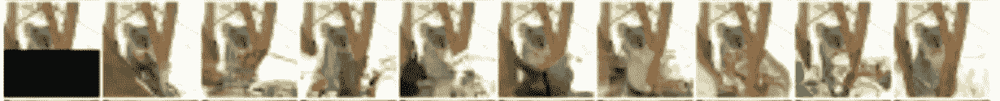

Figure 1: Completion of masked image

# 简介:

自然图像的分布建模是无监督学习中的一个核心问题，它在图像去模糊、图像压缩、文本到图像的转换等方面都有应用。图 1 显示了如何使用 pixelRNN 模型来完成图像。

变分自动编码器、GANs 和自回归模型是三种可用的图像生成方法。这篇文章关注自回归，特别是 pixelRNN。

# 为什么是 RNN？

在图像中，通常一个像素依赖于所有先前预测的像素，这导致像素之间产生长程相关性。因为 RNNs 已被证明在具有长范围相关性的时间序列预测中是有效的。因此，RNN 用于生成图像中的像素。

在本文中，像素生成的顺序是由作者确定的——从上到下和从左到右(图 2)。(注意:可以有许多可以预测像素的序列，但是需要预先选择其中的一个。)

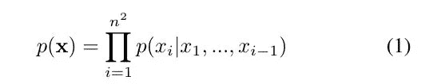

Equation 1: Probability of predicting an image

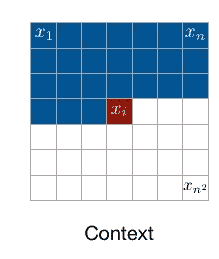

Figure 2

在等式 1 中，p( **x** )表示预测图像的概率( **x** )，其等于给定所有先前预测的像素的条件概率 x *i* 的乘积。

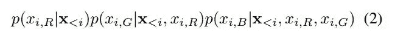

Equation 2

等式 2 表示在给定先前生成的像素的情况下预测像素 x *i* 的 R、G、B 值的概率。在像素 x *i* 的预测中，包括先前预测像素的 R、G、B 值。在 x *i，G* 的预测中，预测值 x *i，R* 也与先前生成的像素的 R，G，B 值一起被包括。

# **图像生成中的 LSTM 图层:**

LSTM 层以前已经用于图像生成。他们逐个像素地训练图像。考虑到图像数据集中的像素数量，训练 LSTM 需要大量的时间。

隐藏状态(I，j)=隐藏状态(i-1，j)，隐藏状态(I，j-1)，p(i，j)

像素(I，j)的隐藏状态取决于像素(I，j-1)和像素(i-1，j)的隐藏状态。因此，除非计算出先前像素的隐藏状态，否则无法计算像素(I，j)的隐藏状态。因此，在计算隐藏状态时不可能有并行化，因此也不会节省训练时间。

作者引入了两种类型的 LSTM 层来克服上述问题:行 LSTM 和对角 LSTM

# **排 LSTM:**

隐藏状态(I，j) =隐藏状态(i-1，j-1)，隐藏状态(i-1，j+1)，隐藏状态(i-1，j)，p(i，j)

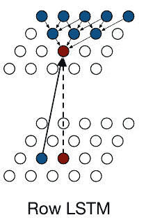

Figure 3: Computing hidden state of red pixel; blue pixels are part of the triangular context

如图 3 所示，一个像素的隐藏状态直接取决于它上面 3 个像素的隐藏状态。这 3 个像素又分别直接依赖于其他 3 个像素。因此，像素的隐藏状态具有三角形上下文(图 3)。这个三角形上下文可以被视为用于预测像素值的“历史”。

如图 3 所示，在红色像素之前预测的几个像素不包括在三角形上下文中。因此，用于计算红色像素值的“历史”不包括所有先前生成的像素。这可以被称为“上下文丢失”。像素的隐藏状态取决于它上面的 3 个像素，而不取决于它所在行中的任何像素。因此，可以并行计算同一行中所有像素的隐藏状态。

因此，行 LSTM 解决了如在 LSTM 中的高训练时间的问题，但是产生了用于计算像素的隐藏状态的不完整“上下文”的问题。

# 对角线 BLSTM:

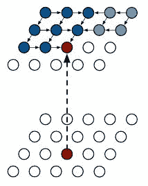

Figure 4: Computing hidden state of red pixel; blue pixels are part of the context

对角 BLSTM 的引入是为了解决行 LSTM 中“上下文”不完整的问题。在对角线 BLSTM 中，像素(I，j)的隐藏状态取决于像素(I，j-1)和像素(i-1，j)。由于双向 LSTM 覆盖了前向和后向相关性，所有先前生成的像素都包括在用于预测像素值的“上下文”/“历史”中。

# 像素 CNN:

行和对角线 LSTM 层覆盖图像中的长程相关性。由于 LSTM 层的复杂性质，学习长程相关性需要计算成本。标准卷积层可以捕捉一个有界感受域，并同时计算所有像素位置的特征。保持图像的空间信息很重要；PixelCNN 中不使用池层。为了避免在像素预测中使用未来上下文(未来像素)，在 PixelCNN 中使用了遮罩。

# 掩蔽卷积:

Figure 5: Value of pixel xi depend on values of previous pixels

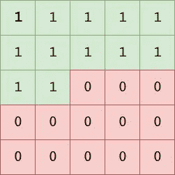

Figure 6: Mask to zero out the future pixel values.

将所有不可用于模型的像素值清零。
像素 x *i* 只取决于像素 x *1…*x*I 1，*因此我们必须确保它不会访问后续像素:x *i+1。*。x *n^2*

作者在论文中使用了两种类型的掩码，即掩码 A 和掩码 b。

# 面具 B:

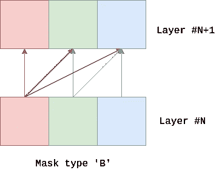

Figure 7: Mask B

如前所述，保留空间信息对于精确预测像素值非常重要，因此 PixelCNN 中不使用池层。因此，在网络中不会发生图像的上采样或下采样。因此，在整个网络中，图像必须具有 R、G、B 值，在本文中，掩码 B 用于此目的。

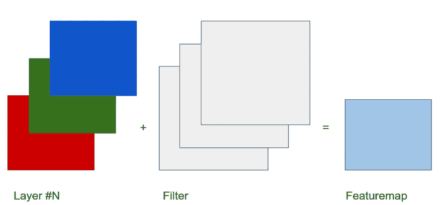

Figure 8: Convolution without using mask B

如图所示，如果在卷积期间不使用掩码 B，则输出特征图中的通道数与输入不同。

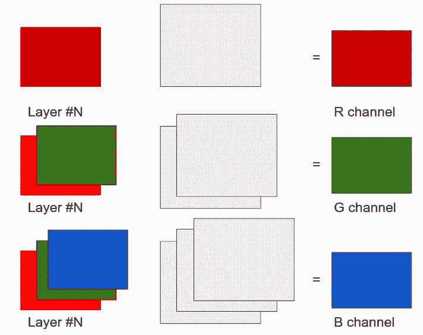

Figure 9: Convolution with using mask B

使用屏蔽 B(图 7)，卷积的输出也将 R、G、B 通道作为输入。

# 盲点问题:

PixelCNN 减少了行 LSTM 和对角线 BLSTM 中所需的计算成本，但是存在盲点问题。盲点问题基本上不包括用于计算像素隐藏状态的上下文/历史中的所有先前像素。我们稍后将深入探讨盲点问题。

# 使用 PixelRNN 的图像完成:

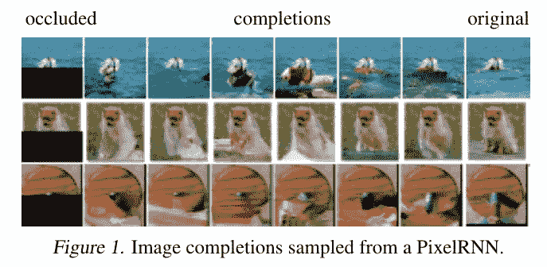