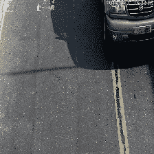
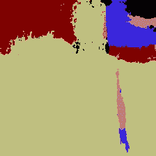
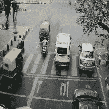
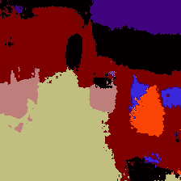
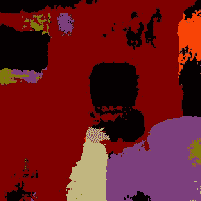
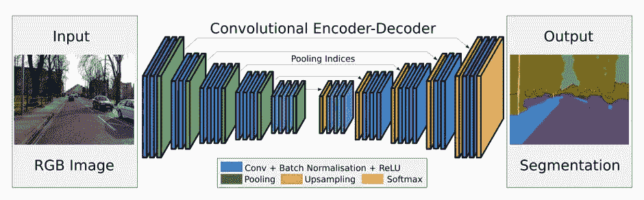
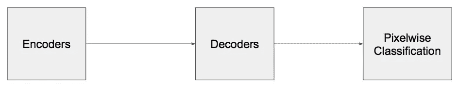
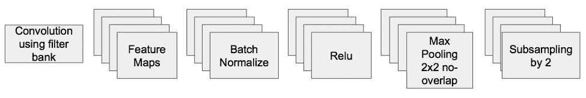
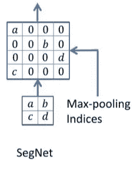

# SegNet 概述:一种用于图像分割的深度卷积编解码器架构

> 原文：<https://towardsdatascience.com/summary-of-segnet-a-deep-convolutional-encoder-decoder-architecture-for-image-segmentation-75b2805d86f5?source=collection_archive---------1----------------------->

*论文发表者:Vijay Badrinarayanan、Alex Kendall、Roberto Cipolla 在 CVPR 第 15 届年会上发表*

Some videos I used to play around with SegNet

*欲了解更多关于复制这一点的信息，请访问我的回购* [*这里*](https://github.com/saytosid/segnet_docker_cs671)

# TLDR:

*   使用一种新颖的技术来对编码器输出进行上采样，该技术涉及存储池层中使用的最大池索引。这提供了相当好的性能和空间效率
*   仅具有前向连接和不可训练层的 VGG16 用作编码器。这导致参数非常少。

# 问题

*   语义逐像素标记，即将图像的每个像素标记为属于图像中所示的某个类别(树、道路、天空等)。

Fig 1: Segmentation of a road scene imagess

一些应用包括自动驾驶、场景理解等。直接采用分类网络进行逐像素分割会产生较差的结果，这主要是因为*最大池*和*子采样*会降低特征图分辨率，从而降低输出分辨率。即使外推至原始分辨率，也会产生有损图像。

# SegNet —挑战

*   在道路场景数据集上训练，因此，类表示宏观对象，因此期望分割是平滑的
*   边界信息对于像道路标记和其他小物体这样的物体是至关重要的。(*边界划定*
*   主要用例将是嵌入式系统，因此它必须*计算高效*

# SegNet-架构

编码器-解码器对用于为不同分辨率的分类创建特征图。

Fig 2: Nut-shell architecture

# 编码器

*   13 个 VGG16 Conv 层
*   没有完全连接，这将参数从 134 米减少到 14.7 米
*   良好的初始权重是可用的，因此这些层是不可训练的

Fig 3: Encoder architecture

每个编码器如图 3 所示。新颖性在于二次采样阶段，最大池用于实现图像中小空间位移的平移不变性，将其与二次采样相结合，导致每个像素管理一个*更大的输入图像上下文*(空间窗口)。这些方法实现了更好的分类精度，但是减小了特征图的大小，这导致了具有模糊边界的有损图像表示，这对于分割目的来说是不理想的。希望输出图像分辨率与输入图像相同，为了实现这一点，SegNet 在其解码器中进行上采样，为此它需要存储一些信息。在子采样之前，需要*捕获并存储*编码器特征图中的边界信息。为了有效地利用该空间，SegNet 只存储*最大汇集索引*，即每个汇集窗口中最大特征值的位置是为每个编码器映射存储的。2x2 的每个窗口只需要 2 位，精度略有损失，但是*折衷*。

**优势**

*   改进的边界划分
*   参数数量较少

Fig 4: Upsamplig in SegNet

这种形式的上采样可以结合到任何编码器-解码器架构中

# 解码器

*   对于 13 个编码器中的每一个，都有一个相应的解码器，该解码器使用存储的*最大池索引*对特征图进行上采样
*   生成更高分辨率的稀疏特征地图
*   稀疏地图通过*可训练滤波器组*生成密集特征地图
*   最后一个解码器连接到对每个像素进行分类的 *softmax 分类器*

SegNet 论文将其技术与其他几种解码器进行了比较，如图 5 所示。

Fig 5: Several decoders compared

*最初发布于*[*say tosid . github . io*](http://saytosid.github.io/segnet)*。*