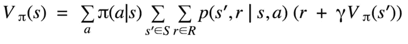
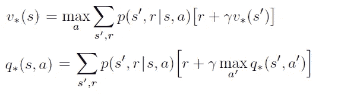
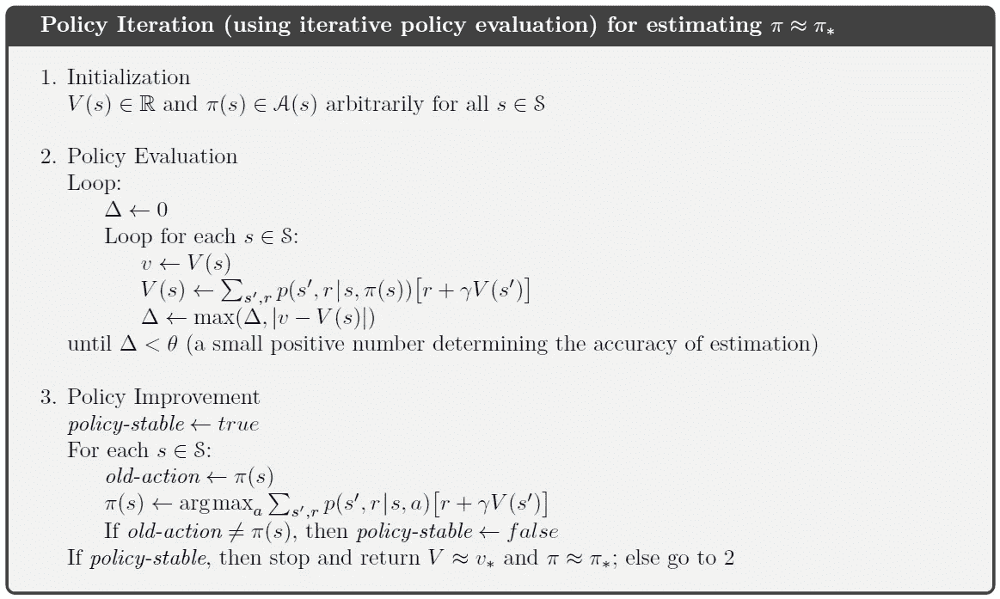
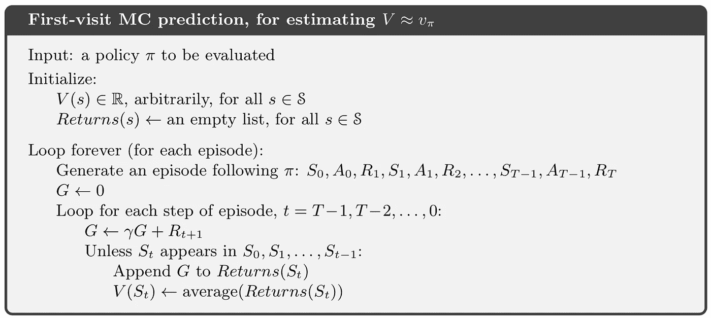
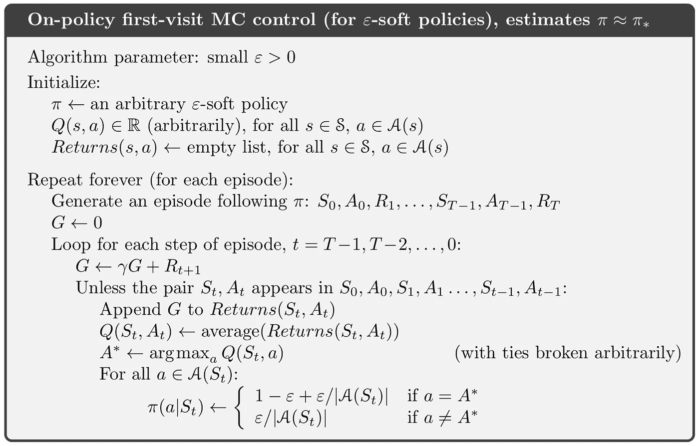
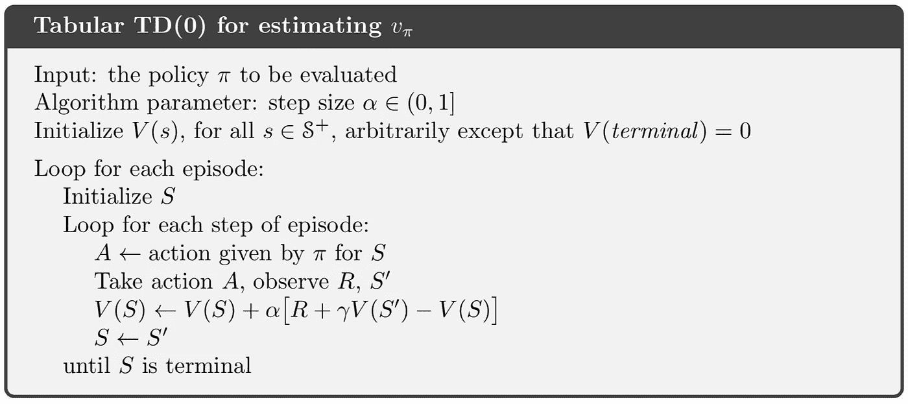
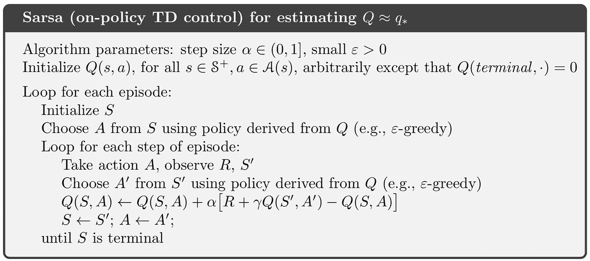
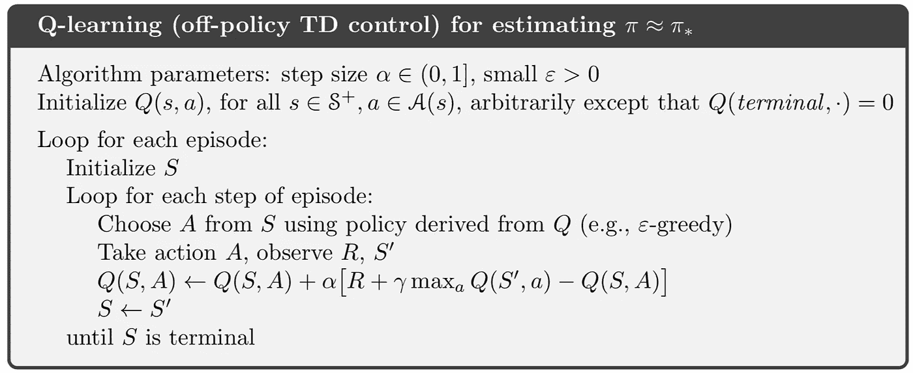
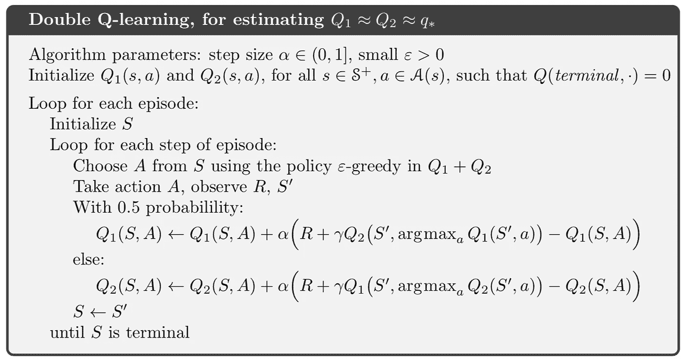

# 强化学习中的表格方法综述

> 原文：<https://towardsdatascience.com/summary-of-tabular-methods-in-reinforcement-learning-39d653e904af?source=collection_archive---------7----------------------->

## 强化学习中不同列表方法的比较

**更新**:学习和练习强化学习的最好方式是去 http://rl-lab.com

# 介绍

表格方法指的是这样的问题，其中状态和动作空间足够小，以至于近似值函数可以表示为数组和表格。

# 问题是

强化学习的目的是找到以下方程的解，称为贝尔曼方程:

我们解贝尔曼方程的意思是找到使状态价值函数最大化的最优策略。

由于很难得到解析解，我们使用迭代方法来计算最优策略。最佳状态和动作值函数表示如下:

# 动态规划

动态规划是一种方法，其中通过将周围状态的值作为输入来计算状态下的每个值(不管这些值是否准确)。一旦计算了一个状态的值，我们就转移到另一个状态，并重复相同的过程(考虑在先前状态中计算的任何新值)。

这个过程重复足够多次，直到每个状态的变化小于我们定义的某个极限。

更多关于 DP 学习的内容可以在文章《[强化学习中的动态编程，简易方法](https://medium.com/@zsalloum/dynamic-programming-in-reinforcement-learning-the-easy-way-359c7791d0ac)》中找到

## 赞成的意见

DP 是有效的，在大多数情况下，它能在多项式时间内找到最优策略。

DP 保证找到最优策略。

## 骗局

DP 不适合处理有数百万或更多状态的大问题。

DP 需要转移概率矩阵的知识，然而这对于许多问题来说是不现实的要求。

# 蒙特卡洛

在蒙特卡罗(MC)中，我们玩游戏的一集，在各种状态中逐一移动，直到结束，记录我们遇到的状态、动作和奖励，然后计算我们经过的每个状态的 V(s)和 Q(s)。我们通过播放更多的剧集来重复这个过程，在每一集之后，我们得到状态、动作和奖励，并且我们对发现的 V(s)和 Q(s)的值进行平均。

MC 预测算法包括播放尽可能多的剧集，并在每集之后计算我们已经经过的状态的值，然后将这些结果与这些状态的当前值进行平均。

保单首次就诊 MC 控制旨在找到最佳保单。它会播放剧集，但会跟踪每个状态下使用的每个动作。这样，就有可能知道什么动作产生了最佳 Q 值。
最后，将具有最大 Q 值的行动添加到最佳策略中。

蒙特卡罗的详细解释可以在文章《[强化学习中的蒙特卡罗，简易方法](https://medium.com/@zsalloum/monte-carlo-in-reinforcement-learning-the-easy-way-564c53010511)》中找到

## 赞成的意见

MC 可以用来直接从与环境的交互中学习最优行为。它不需要环境动力学的模型。

MC 可用于模拟或样本模型。

MC 可用于聚焦于一个特别感兴趣的区域，并且被准确地评估，而不必评估状态集的其余部分。

## 骗局

MC 只适用于偶发(终止)环境。它不适用于没有终止状态的环境。

MC 必须有一个完整的情节，它没有引导，这意味着它没有给出其他状态的估计。

MC 必须等到一集结束才知道回归。对于长时间发作的问题，这将变得太慢。

# 时间差异

TD 可以看作是 DP 和 MC 方法的融合。它播放剧集但不必等到结尾才知道回报。它根据对其他状态的估计来计算当前状态的值。
TD(0)是指只向前看一步的事实，然后计算当前状态值。

为了找到最优策略，TD 提供了不同的方法，其中之一是 SARSA。
SARSA 包括对状态 S 采取行动 A，注意奖励和下一个状态 S’，然后从状态 S’中选择行动 A’，然后使用所有这些信息更新 Q(S，A)，然后移动到 S’并执行之前选择的行动 A’。

Q-learning 是寻找最优策略的另一种方法。
像 SARSA 一样，它对状态 S 采取行动 A，注意奖励和下一个状态 S’，然后与 SARSA 不同，它选择状态 S’中的最大 Q 值，然后使用所有这些信息来更新 Q(S，A)，然后移动到 S’并执行ε贪婪行动，这不一定导致采取在状态 S’中具有最大 Q 值的行动。

双 Q 学习是一种解决 Q 学习中特定问题的算法，特别是当 Q 学习可以基于一些积极的奖励被诱骗采取坏的行动，而这个行动的预期奖励肯定是负的。
它通过维护两个 Q 值列表来做到这一点，每个列表从另一个列表更新自身。简而言之，它在一个列表中找到最大化 Q 值的动作，但是它不是使用这个 Q 值，而是使用这个动作从另一个列表中获得 Q 值。

要了解更多关于 TD 学习的细节，请查看文章“ [TD 在强化学习中，简单的方法](/td-in-reinforcement-learning-the-easy-way-f92ecfa9f3ce)”。

关于双 Q 学习的更多细节可以在“[双 Q-学习简单方法](/double-q-learning-the-easy-way-a924c4085ec3)”中找到

## 赞成的意见

TD 不需要像 DP 中那样知道转移概率矩阵。

TD 不需要等到剧集结束才知道回报，它增量更新状态值和动作值。

## 骗局

SARSA 可能会陷入局部最小值。

Q-Learning 在一些随机环境中表现不佳。

# 参考

算法取自萨顿和巴尔托。强化学习:导论。