# 知识图嵌入的翻译模型综述

> 原文：<https://towardsdatascience.com/summary-of-translate-model-for-knowledge-graph-embedding-29042be64273?source=collection_archive---------3----------------------->

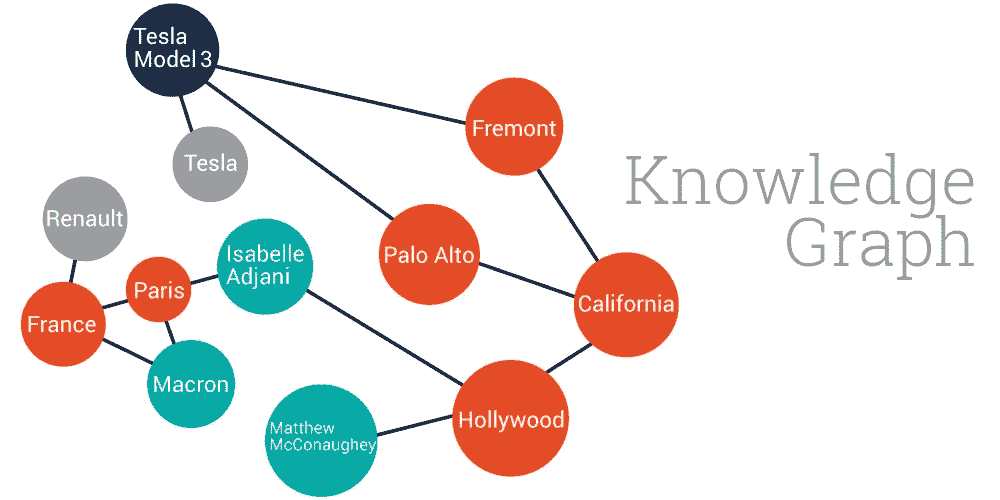

本文旨在对知识图嵌入/知识表示的翻译模型做一个简要的总结。可以从[**TensorFlow-TransX**](https://github.com/thunlp/TensorFlow-TransX)找到开源 tensor flow 代码。

# 知识表示的一些背景

通常，我们用一个三元组(头、关系、尾)来表示一个知识。在这里，头和尾是实体。比如，(天空树，地点，东京)。我们可以用独热向量来表示这些知识。但是实体和关系太多，维度太大。并且如果两个实体或关系是接近的，则单热点向量不能捕获相似性。受 Wrod2Vec 模型的启发，我们想用分布式表示来表示实体和关系。

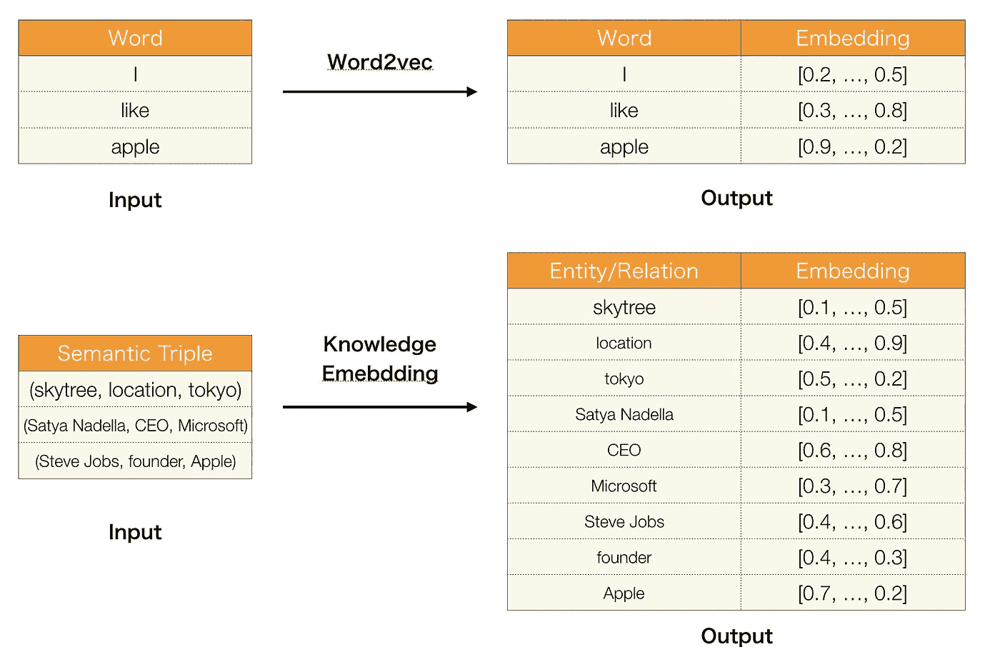

# 下游任务中的应用

以防万一，如果你不熟悉知识图，我会介绍一些知识图可以做的应用。

## 链接预测

链路预测通常是指预测一个与另一个给定实体有特定关系的实体的任务，即预测给定`(r,t)`或给定`(h, r)`的`t`，前者表示为`(?,r,t)`，后者表示为`(h,r,?)`。例如，`(?, DirectorOf,Psycho)`是预测电影的导演，而`(Venom, DirectorOf,?)`相当于预测那个特定的人导演的电影。这本质上是一个知识图完成任务。

## 推荐系统

推荐系统向用户提供关于他们可能希望购买或检查的项目的建议。在不同的推荐策略中，协同过滤技术取得了显著的成功。然而，并不总是工作得很好，因为用户-项目交互可能非常稀疏。在这种情况下，结合用户-项目交互和用户或项目的辅助信息的混合推荐系统通常可以实现更好的性能。

知识图也被用来提高协同过滤的质量。具体来说，他们使用存储在 KG 中的三种类型的信息，包括结构知识(三重事实)、文本知识(例如，一本书或一部电影的文本摘要)和视觉知识(例如，一本书的封面或一部电影的海报图像)，来导出项目的语义表示。为了对结构知识建模，应用典型的知识图嵌入技术，即 TransR，其学习每个项目的结构表示。对于其他两种类型的信息，堆叠去噪自动编码器和堆叠卷积自动编码器分别用于提取项目的文本表示和视觉表示。

知识图嵌入还有一些应用，比如实体解析、关系抽取、问题回答等。你可以从这篇论文中找到更多信息:知识图嵌入:方法和应用调查(2017)。

# 迷睡

标题:**Trans**lating**E**mbeddings 用于多关系数据建模(2013)

这是翻译模型系列的第一部作品。该模型的基本思想是使首向量和关系向量之和尽可能接近尾向量。这里我们用 L1 或 L2 范数来衡量他们有多接近。

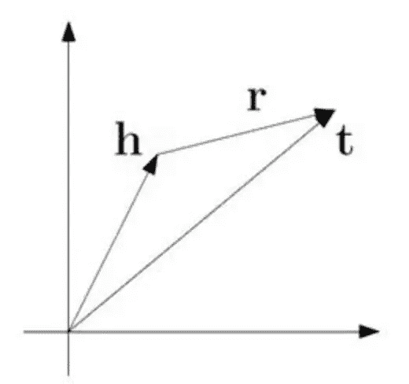

损失函数是负抽样的最大利润。

L(y，y') = max(0，margin -y + y ')

`y`是阳性样本的分数，`y'`是阴性样本的分数。最小化这个损失函数分数。两个分数之差和 margin 一样大就够了(我们设置这个值，通常是 1)。

因为我们用距离来表示分数，所以我们在等式上加一个减号，用于知识表示的损失函数是:

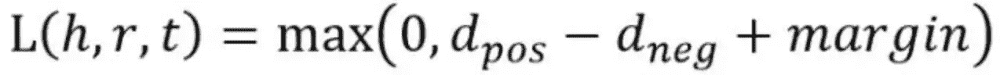

d 是:

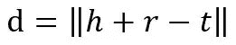

这是 L1 或 L2 的标准。至于如何得到负样本就是用三元组中的随机实体替换头实体或尾实体。

参见代码:

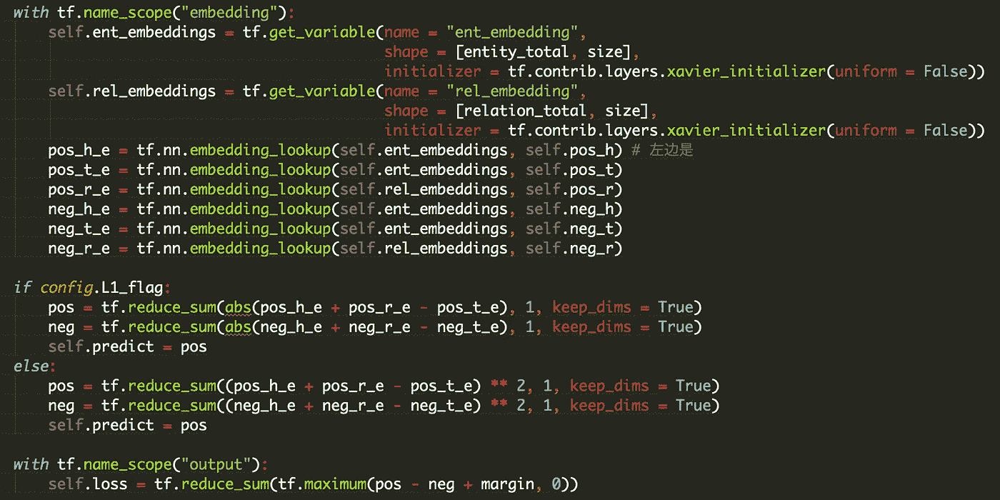

使用`embedding_lookup`得到头部、关系、尾部的向量，并计算(头部、关系)和尾部之间的距离。

但是这个模型只能处理一对一的关系，不适合一对多/多对一的关系，比如有两个知识，`(skytree, location, tokyo)`和`(gundam, location, tokyo)`。训练后,‘天空树’实体向量将与‘高达’实体向量非常接近。但是他们在现实中并没有这样的相似性。

# 转运

标题:在 **H** 超平面上**转换**嵌入知识图(2014)

TransH 的目标是处理一对多/多对一/多对多的关系，并且不增加模式复杂度和训练难度。

基本思想是将**关系**解释为超平面上的平移操作。每个关系有两个向量，超平面的[范数向量](https://www.khanacademy.org/math/linear-algebra/vectors-and-spaces/dot-cross-products/v/normal-vector-from-plane-equation) (Wr)，以及超平面上的平移向量(dr)。

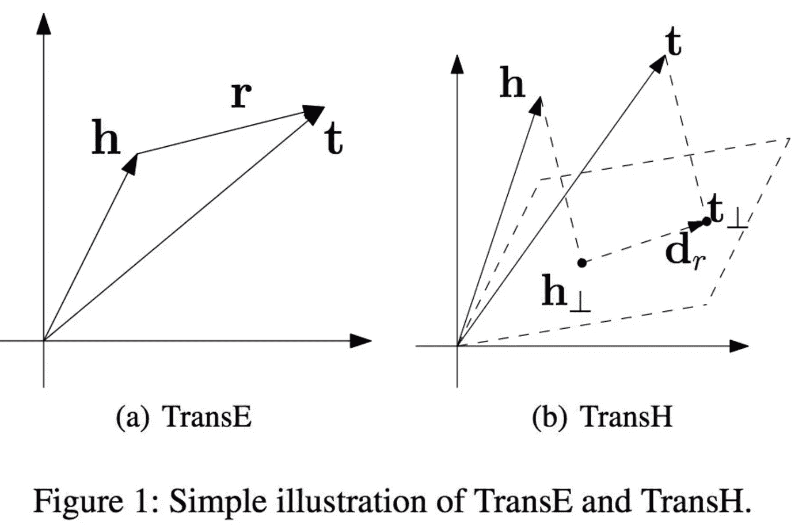

我们将每个头向量(h)和尾向量(t)投影到超平面，并得到新的向量(h⊥和 t⊥).在这个超平面中存在一个关系(d_r ),我们可以像 TransE 模型一样训练它。

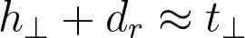

分数函数:

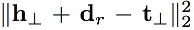

如何计算超平面中的投影:

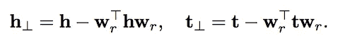

其中 w_r 的范数被限制为 1。

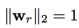

*h⊥* 是 h 在超平面中的投影， *wrT* 是 h 在 wr 中的投影。这意味着我们将头尾向量分解成两部分。

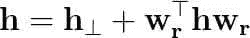

损失函数和训练方法与 TransE 相同。

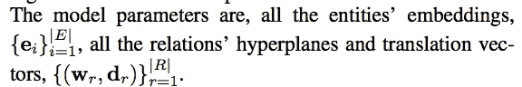

我们将头/尾向量分解成两部分，并且仅使用一部分(h⊥或 t⊥)来训练模型。这样可以避免模型训练时两个实体(头部或尾部)靠得太近，处理好一对多/多对一/多对多的关系。

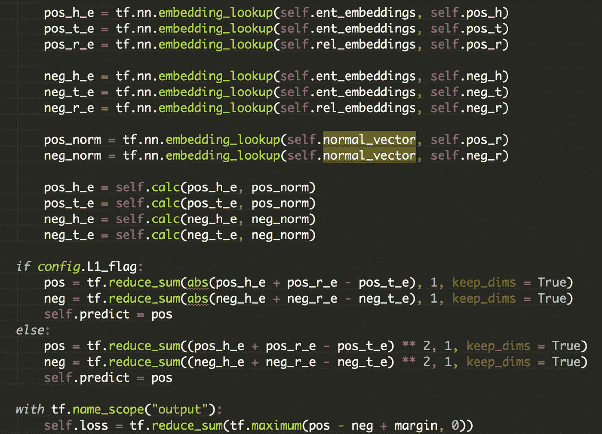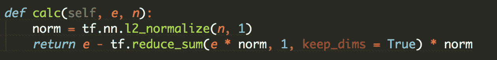

代码与 TransE 模型几乎相同。唯一的区别是计算投影向量的步骤。在这一步之前，我们应该将 w_r 归一化为长度 1。

# TransR

题目:知识图完成的学习实体和关系嵌入(2015)

TransE 和 trans 模型都假设实体和关系是语义空间中的向量，因此相似的实体在同一个实体空间中会彼此靠近。

然而，每个实体可以有许多方面，不同的关系关注实体的不同方面。比如`(location, contains, location)`的关系是‘包含’，而`(person, born, date)`的关系是‘出生’。这两种关系非常不同。

为了解决这个问题，我们让 TransR 在两个不同的空间中建模实体和关系，即**实体空间**和**多重关系空间**(特定于关系的实体空间)，并在相应的关系空间中执行翻译，因此命名为 TrandR。

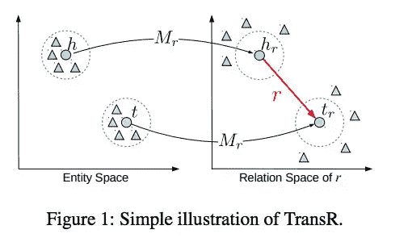

TransR 的基本思想如图 1 所示。对于每个三元组(h，r，t)，实体空间中的实体首先用操作 Mr 作为 hr 和 tr 投影到 r-关系空间中，然后 hr + r ≈ tr。损失函数和训练方法同 TransE。 **h** 和 **t** 是实体嵌入， **r** 是关系嵌入。

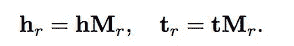

特定于关系的投影可以使实际保持关系的头/尾实体(表示为彩色圆)彼此靠近，并且远离那些不保持关系的头/尾实体(表示为彩色三角形)。

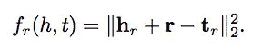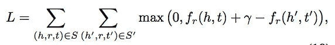

得分函数和目标函数与 TransE 相同。

TransR 有一个变种模型，叫做 CTransR，C 的意思是集群。首尾相连的实体通常表现出不同的模式。仅构建单个关系向量来执行从头到尾实体的所有翻译是不够的。比如三联`(location, contains, location)`有国家-城市、国家-大学、洲-国家等多种模式。为了解决这个问题，CTransR 将不同的头尾实体对聚类成组，并为每个组学习不同的关系向量。

构造 CtransR 的过程是，对于一个特定的关系 r，将训练数据中的所有实体对 *(h，t)* 聚类成多组，期望每组中的实体对表现出相似的 *r* 关系。我们使用向量偏移量( **h-t** )来表示实体对 *(h，t)* 。我们从 TransE 得到 **h** 和 **t** 。之后，我们分别学习每个聚类的独立关系向量 **r_c** 和每个关系的矩阵 Mr。

当我们创建负样本时，我们只替换头部或尾部，而不替换关系。这样我们就分别得到了正样本和负样本的两个变换矩阵。除了我们先用矩阵变换变换实体向量，然后计算 L2 范数，其余的代码与 TransE 基本相同。

# TransD

标题:通过 **D** 动态映射矩阵嵌入知识图(2015)

TransR 也有其不足之处。

*   首先，头部和尾部使用相同的变换矩阵将它们自己投影到超平面，但是头部和尾部通常是不同的实体，例如，`(Bill Gates, founder, Microsoft)`。‘比尔盖茨’是一个人，而‘微软’是一家公司，这是两个不同的范畴。所以应该用不同的方式改造。
*   第二，这个投影与实体和关系有关，但投影矩阵只由关系决定。
*   最后，TransR 的参数个数比 TransE 和 TransH 的大。由于复杂性，TransR/CTransR 很难应用于大规模知识图上。

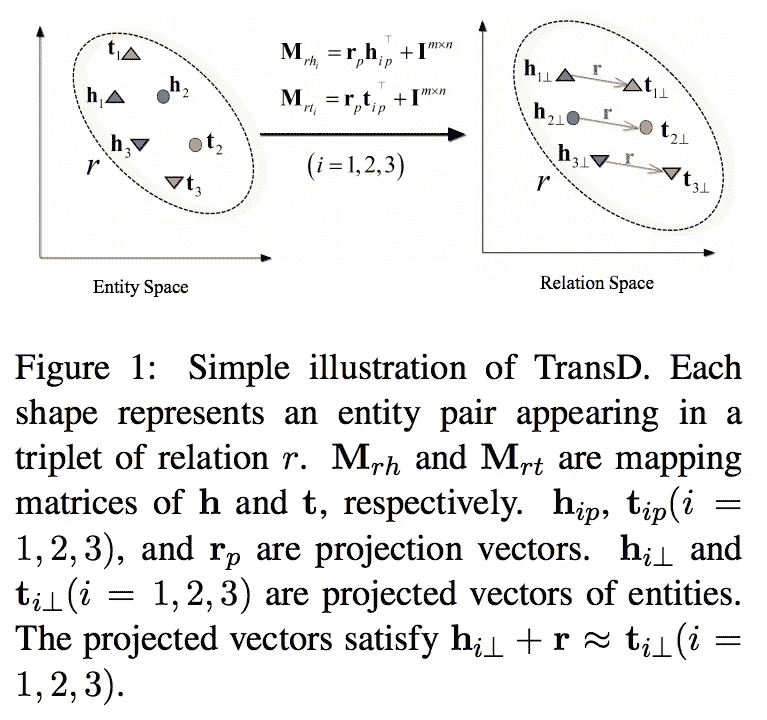

TransD 使用两个向量来表示每个实体和关系。第一个向量表示实体或关系的含义，另一个向量(称为投影向量)将用于构建映射矩阵。

两个映射矩阵定义如下:

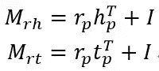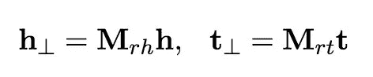

其中映射矩阵由实体和关系定义， *I* 是单位矩阵。该等式意味着我们使用生成的矩阵(通过 r 和 h 向量)来修改单位矩阵。投射和训练与 TransR 相同。

TransE 是 TransD 的一个特例，当向量的维数满足 m=n 且所有投影向量都设置为零时。

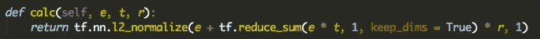

代码结构可能与其他模型类似。我们可以看到每个实体和关系都由两个向量表示。但是该代码没有实现实体空间的维度与关系空间的维度不同的情况。

# 模型摘要

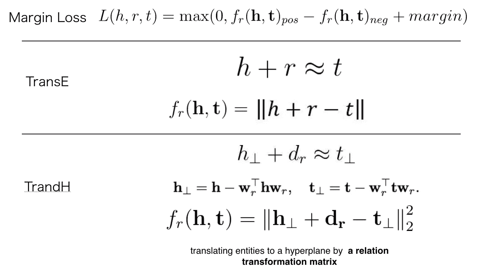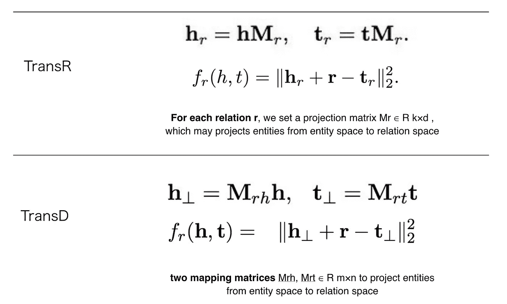

利润损失适用于所有型号。所有这些模型都是基于 TransE 的，使用头部向量和关系向量的和来预测尾部向量。这些模型的不同之处在于它们使用不同的方式来表示实体/关系向量。

# 评估结果

这是数据集 FB15k 和 WN18 中各种方法的结果。

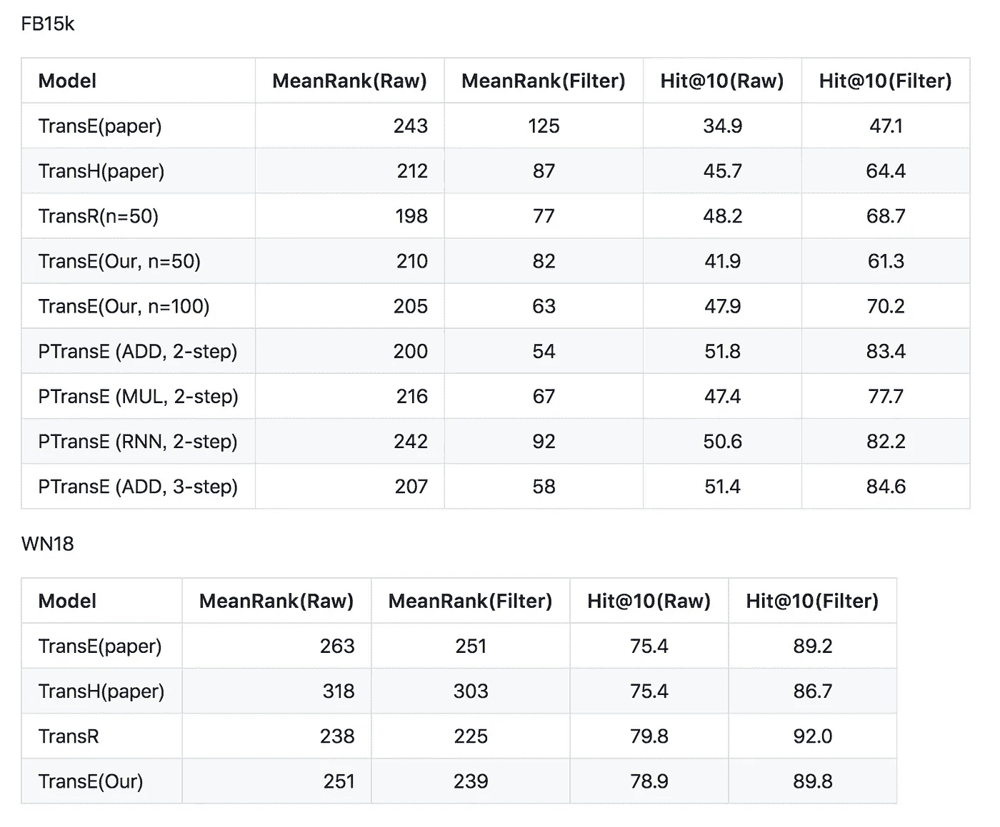

你可以找到更多关于数据集和代码的细节， [thunlp/KB2E](https://github.com/thunlp/KB2E) 用 C++实现，TensorFlow 版本， [TensorFlow-TransX](https://github.com/thunlp/TensorFlow-TransX) 。

# 最后的

每个型号都有自己的招数，这里就不多说了。

正如我在模型总结部分所说。这些模型的基本思想是相同的，都是利用头部向量和关系向量的和来预测尾部向量。向量的和就是信息的积累。但是实体和关系可能比这更复杂。寻找一种更有效的方法来表示知识可能是一个具有挑战性的研究课题。

> ***查看我的其他帖子*** [***中等***](https://medium.com/@bramblexu) ***同*** [***一分类查看***](https://bramblexu.com/posts/eb7bd472/) ***！
> GitHub:***[***bramble Xu***](https://github.com/BrambleXu) ***LinkedIn:***[***徐亮***](https://www.linkedin.com/in/xu-liang-99356891/) ***博客:***[***bramble Xu***](https://bramblexu.com)