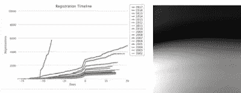
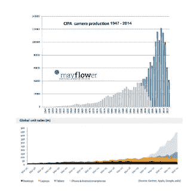
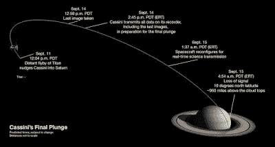
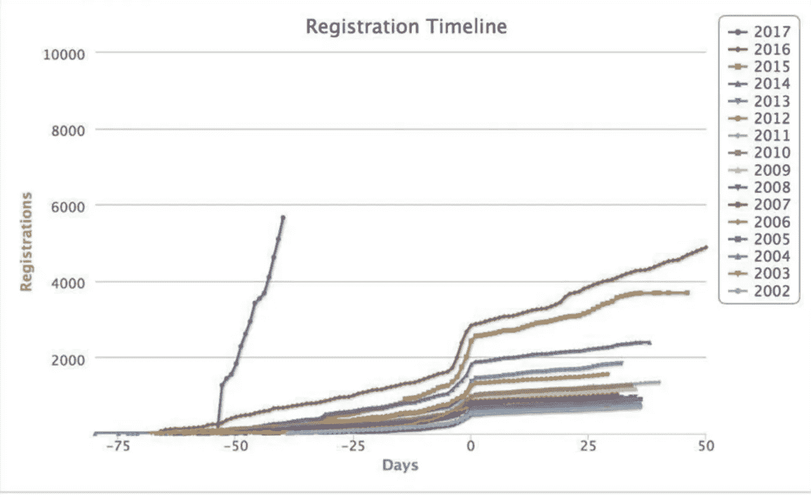

# 周日早晨的洞察力:卡西尼号的灭亡和人工智能的兴起

> 原文：<https://towardsdatascience.com/sunday-morning-insight-the-demise-of-cassini-and-the-rise-of-artificial-inteiligence-c924c654bec6?source=collection_archive---------8----------------------->

在过去的几周内，发生了两件与整个人工智能叙事相关的事件:[卡西尼号坠入土星](https://saturn.jpl.nasa.gov/)而[号取消了](http://nips.cc/)会议注册，时间之长前所未闻。

通常，人工智能叙事围绕着一个因素，然后解释为什么这个领域不能继续下去，因为这个因素不是新的，不再是好的，不是什么……这种叙事是由[科技评论推出的，当时它提到人工智能可能会停滞不前](https://www.technologyreview.com/s/608911/is-ai-riding-a-one-trick-pony/),因为“神经网络”已经有三十年或更长的历史了。是的，神经网络已经存在了很长时间，没有人工智能不会停滞不前，因为它实际上取决于几个因素，而不是一个。

这是其中一个因素的故事。

这在很大程度上要归功于太空探索，不，我们不是在谈论令人敬畏的深空 1 号宇宙飞船[1],尽管它很像那艘宇宙飞船，但这个故事也始于 JPL。

当丹·戈尔丁成为美国国家航空航天局局长时，他对新的太空任务施加了一系列的限制，使得整个美国国家航空航天局在设计成本较低的太空任务时更快地整合更新、更好的技术。事实上，卡西尼号被视为*任务的未来规避者。从 JPL 网站上讲述的故事中，在“更快、更好、更便宜”的口号下，我们可以读到:*

> *由于没有找到大幅削减成本的方法，JPL 面临着灭亡。美国宇航局的预算将不会支持足够的卡西尼规模的任务，以保持实验室的运作。*

*在那之前，太空任务中的绝大多数相机都使用 CCD 设备。虽然这项技术提供了高质量的图像，但它很脆弱。首先，它需要冷却以获得良好的信噪比。这种冷却反过来意味着成像仪需要更多的电力来运行，并可能在发射阶段更系统地出现故障。这也是一种基于行的设计，意味着你可能会一次丢失一整行像素。简而言之，它很脆弱，更重要的是，这项技术使传感器变得更重，这是太空探索中的一个大罪。*

*然后是[埃里克·福萨姆](http://ericfossum.com/)。这是你可以在[的维基百科条目](https://en.wikipedia.org/wiki/Eric_Fossum)上读到的内容:*

> *….仪器的目标之一是使星际航天器上的电荷耦合器件(CCD)照相机系统小型化。作为回应，Fossum 发明了一种新的 CMOS [有源像素传感器](https://en.wikipedia.org/wiki/Active_pixel_sensor) (APS)，采用像素内电荷转移片上相机技术，现在只称为 CMOS 图像传感器或 CIS[【5】](https://en.wikipedia.org/wiki/Eric_Fossum#cite_note-5)[【6】](https://en.wikipedia.org/wiki/Eric_Fossum#cite_note-6)(没有像素内电荷转移的有源像素传感器在更早以前就有描述，由 Noble 于 1968 年提出。作为戈尔丁尽可能将空间技术转移到公共部门的指示的一部分，Fossum 领导了 CMOS APS 的开发以及随后向美国工业的技术转移，包括伊士曼柯达公司、贝尔实验室、国家半导体公司和其他公司。尽管根深蒂固的 CCD 制造商最初持怀疑态度，但 CMOS 图像传感器技术现已用于几乎所有的手机相机、许多医疗应用，如胶囊内窥镜和牙科 x 射线系统、科学成像、汽车安全系统、DSLR 数码相机和许多其他应用。*

*由于 CMOS 依赖于计算芯片中使用的相同工艺，它的规模很大，变得非常便宜。事实上， ***大规模的*** 图像和视频数据集的创建是由 YouTube、Google、Flickr 和 Yahoo！InstaGram，然后是脸书和大多数其他互联网公司，由于 CMOS 在消费成像领域的到来，首先是在相机领域，然后是在智能手机领域，而变得独一无二:*

**

*这些数据集的规模使得能够训练玩具模型之外的非常大的神经网络。基于神经网络和大型数据集的新算法开发将错误率降至这样一个水平，即大型互联网公司很快就可以开始对自 21 世纪初以来在其服务器上收集的数据使用这些技术。*

*2017 年 9 月 14 日，卡西尼正在下载其最后一张基于 CCD 的图像，NIPS(最知名的 ML/DL/AI 会议之一)的所有注册在会议前三个月售罄:这是一个专家会议闻所未闻的壮举。会议将在离 JPL 不远的长滩举行，不知何故，启动这一切的传感器就诞生在这里。*

****

*还有一件事: [Eric Fossum](http://ericfossum.com/) 正在构建[QIS，下一代成像传感器](http://image-sensors-world.blogspot.fr/2017/03/eric-fossum-founds-gigajot-startup.html)【3】将产生 ***更多*** 像素…..*

*这个故事最初是在 Nuit Blanche 上播出的。*

*笔记。*

*[1] [约翰·加勒特在 JPL 口齿不清的故事](http://www.flownet.com/gat/jpl-lisp.html)*

*[2]如今每个人都在使用的 [TRL 标度](https://en.wikipedia.org/wiki/Technology_readiness_level)(第一次用法语翻译[是在 Nuit Blanche](http://nuit-blanche.blogspot.fr/2007/06/france-technologies-de-rupture-et.html) 号卫星上)就是在那个时候诞生的，这样美国宇航局就可以评估哪些技术可以更快地整合到太空任务中。*

*[3]查看[我们关于 QIS 和压缩传感的讨论](http://nuit-blanche.blogspot.fr/2014/02/sunday-morning-insight-compressive.html)。*