# 超级简单的机器学习—多元线性回归第 1 部分

> 原文：<https://towardsdatascience.com/super-simple-machine-learning-by-me-multiple-linear-regression-part-1-447800e8b624?source=collection_archive---------3----------------------->

在这篇超长的文章中，我简要描述了多元线性回归的工作原理以及你需要注意的标准。所以给自己找些水和零食，因为这需要一段时间。

*大部分的基本概念都包含在我的简单线性回归帖子中，这些帖子可以在* [*她的*](/super-simple-machine-learning-by-me-simple-linear-regression-part-1-concept-and-r-4b5b39bbdb5d) *e 中找到。我曾打算在一篇帖子中快速涵盖 MLR，但实在有太多的事情要解决。叹气。*

# 多元线性回归是简单的线性回归，但是有更多的关系(更多的 x。更多前任。哈哈。)

这就像当你的姐姐有了一个婴儿，他曾经是房子里所有噪音的唯一贡献者，但后来她又有了两个，现在这三个都是噪音的贡献者。

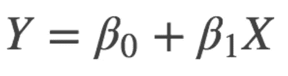

成为

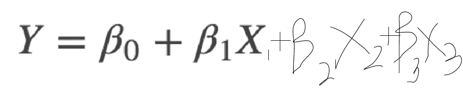

A multiple linear regression with 2 more variables, making that 3 babies in total. Too many babies.

多元线性回归解释了**一个连续因变量** ( *y* )和**两个或多个自变量** ( *x* 1， *x* 2， *x* 3…等)**之间的关系。**

请注意，它显示的是**连续的**因变量。由于 *y* 是 *beta* 、 *beta* 1 *x* 1、 *beta* 2 *x* 2 *等*之和，因此得到的 *y* 将是一个数字，一个连续的变量，而不是一个“是”、“否”的答案(分类)。

例如，使用线性回归，我将试图找出**产生了多少分贝的**噪音，而不是噪音是否有(噪音|无)。

> 为了找到分类变量(例如“*是*或“*否*”、“ *1* 或“ *0* ”)，将使用逻辑回归。我下次会谈到这一点。

# 让我们从数据开始

到处都可以找到测试代码的数据集。

sklearn 有[玩具数据集](http://scikit-learn.org/stable/datasets/index.html#datasets)用于不同类型的算法(回归、分类等),非常适合实践。Kaggle 还有现实生活中的[数据集](https://www.kaggle.com/datasets)。

请注意，在野外，当您遇到数据集时，它将是一个丑陋的 AF。它会有丢失的值、错误的条目、格式错误的列、不相关的变量……甚至在清理之后，可能你的 p 值看起来很糟糕，你的 R 平方太低。你需要选择好的特征，尝试不同的算法，调整你的超参数，添加时间延迟，转换列的数据…

在现实生活中，运行一个模型并不是那么简单，这就是为什么人们做这件事会得到很多报酬，这样他们就可以资助他们的头皮治疗，以从压力引起的脱发中恢复过来。

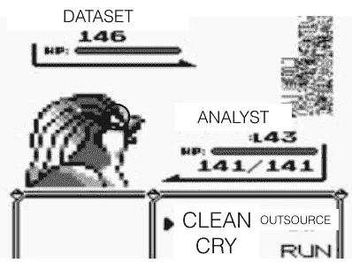

Exploring a dataset is like surfing along the coast of Cinnabar Island… you’ll find MissingNo(s). *badum tss*

# 分类变量>>>连续变量

由于回归方程的性质，**你的 *x* 变量也必须是连续的**。因此，你需要把你的分类变量变成连续变量。

连续变量简单来说就是流水号。分类变量是类别。

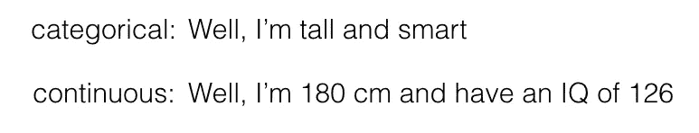

**当你的分类变量在第一次**连续出现时，会有点混乱。

例如，如果有一列邮政编码或电话号码会怎么样？

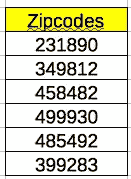

Continuous at first glance, but actually categorical.

每个邮政编码代表一个唯一的地址，每个电话号码只是一个唯一的联系号码。增加/减少这个数字没有任何意义——它们只是没有内在数值的标识符，因此,**被认为是分类的**。

分类变量也被称为**离散**或**定性**变量。有 3 种类型:

*   **标称**:2 种以上。例如颜色
*   **二分的**:两种类型，例如是或否
*   **顺序**:多于两种类型，但有一个等级/顺序，例如低于平均值、平均值、高于平均值

# 我们该拿他们怎么办？

有几种方法[将分类数据转换成可用于回归的连续变量](https://www.analyticsvidhya.com/blog/2015/11/easy-methods-deal-categorical-variables-predictive-modeling/)。

## **标签编码器:**

## 对于二分变量

对于**二分变量**的简单解决方案是将其转换为二进制——“1”表示“是”,“0”表示“否”,反之亦然。您的标签应该从 0 开始。

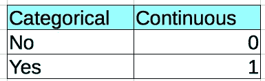

**名义变量和序数变量**稍微麻烦一点。

## 对于名义变量

假设你有三种不同的颜色:红色、蓝色和灰色。按照上面的概念，你把红色标为 0，蓝色标为 1，灰色标为 2。


这样做的问题是，它意味着灰色比红色和蓝色更高级，蓝色比红色更高级，如果你认为所有三种颜色都具有相同的“价值”，这些颜色中没有一种比另一种更高级。


Reckless labelling can lead to disastrous consequences (The Office S3 E1)

## 对于序数变量

带标签的“排名”对顺序变量更有效，因为它们确实有排名，并且应该被赋予不同的权重。

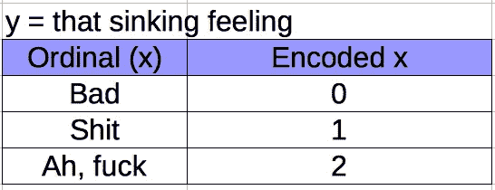

当面对**不应有不同权重**、[的标称变量时，首选一个热编码](http://forums.fast.ai/t/to-label-encode-or-one-hot-encode/6057/4)。

## 一个热编码/创建虚拟变量:

为了不给处于相同竞争环境的类别任何不相等的值，我们使用一个热编码。这是通过创建虚拟变量来实现的，这意味着创建更多的“*x*”s。这些将是假的/虚拟的变量，因为它们是实际变量的占位符，并且是由您自己创建的。

很简单。对于变量所在的每一层，只需为每一层创建一个新的 x。

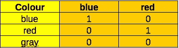

easy peasy

等等……格雷呢？

如果你的变量只能是 3 种颜色，那么你只能使用 2 个虚拟变量。灰色成为参照类别，在你的 *X* (蓝色)和 *X* (红色)都为 0 的情况下，则默认变量为灰色。

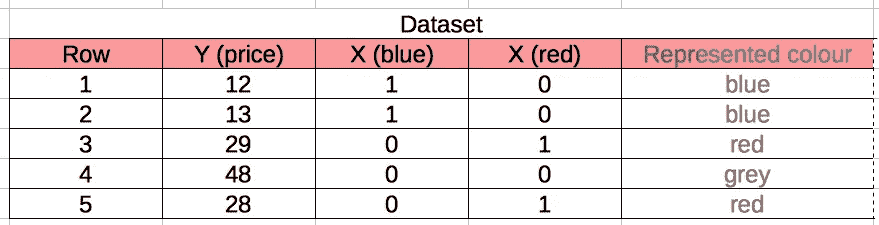

您选择排除哪个变量并将其用作[参考类别](https://www.theanalysisfactor.com/strategies-dummy-coding/)有关系吗？

不会。但最佳实践是使用最常出现的类别(例如，如果数据集的 70%是灰色的，那么灰色将是参考类别)。

## 合并级别:

回到邮政编码这一栏，假设您有 500 行客户，它们都有自己唯一的邮政编码。对 500 个不同的邮政编码进行热编码有意义吗？

这将向您的数据集中添加 500 列，使您的模型变得混乱，并使您患上偏头痛。


这也是毫无意义的，因为每个邮政编码都是唯一的。它没有给你的模型增加洞察力，因为你如何使用这样的信息来预测新数据的结果？如果您需要预测居住在邮政编码 323348 的人的收入水平，如果您的数据集中没有这样的邮政编码，您的模型将如何处理呢？它从来没有见过这个邮政编码，也不能告诉你任何关于它的信息。

你*所能做的*是**将**转换成你可以用来对未来数据进行分类的东西，比如按照它们的**区域**对这些邮政编码进行分组(这些数据不在数据集中，但需要来自领域知识或研究)。

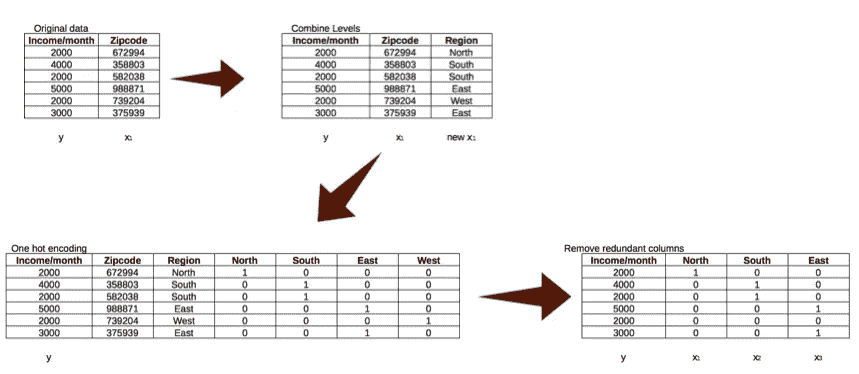

what is this, tables for ants?! Apologies for the tiny font.

所以你得到的不是 **500** 不同的邮政编码，而是 **4** 个地区，北部、南部、东部或西部(或者根据你想要得到的具体程度，它可以是实际的地区，如后港、义顺、贝多克、果园等。这些是新加坡的地区名称)。

这意味着如果新的数据出现在你需要预测结果的地方，你可以根据新的邮政编码属于哪个区域来预测 *y* 。

## 有意义的标签:

有一点要时刻牢记，不要盲目贴标签。

> 它必须有意义。

例如，在对序数变量(有秩的分类变量)进行编码时，必须确保秩值对应于每个秩的实际显著性(也可以看作是它与因变量的关系)。

例如，如果你正在出售一栋房子，而 *y* = *价格*，而 *x* 变量之一是公寓所在的楼层，如果楼层随着楼层的升高而涨价，则将楼层编码为整数是有意义的:

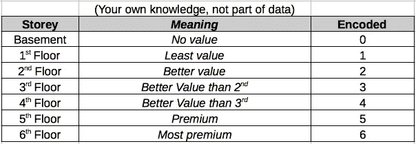

Encoding it this way is appropriate to show its relationship with the Y variable (price)

然而，如果该值没有相应地增加，也许一个热编码和合并级别会更合适:

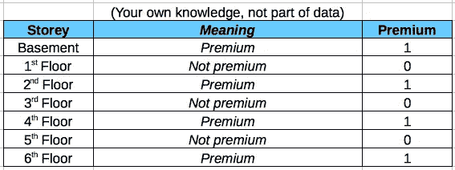

或者

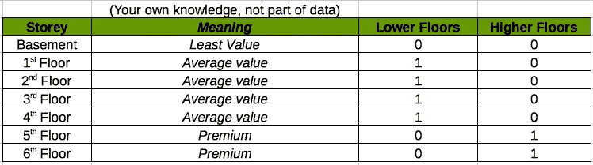

或者如果你不知道这是什么关系:

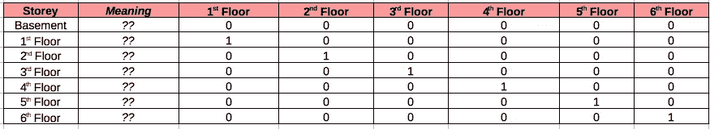

One hot encode everything!!!! There are packages that can do this for you, don’t worry.

永远确保无论你如何转换你的分类变量，确保你回头看它，问自己“这有意义吗？”

有时没有正确的答案，所以问题就变成了“这样做是否让**更有**意义？”

可能会变成，“但是什么有意义？”并引出“什么是意义？”变成了“是什么？”然后进入一周的存在主义虚无主义。

底线是:*了解你的数据*

# 特征选择

变量过多可能会导致模型变得不准确，尤其是当某些变量对结果没有影响或对其他变量有显著影响时。


Variables that have no significant effect or high collinearity can ruin the model

让我们以三个婴儿的尖叫为例。如果我要对我的回归方程建模，以找出基于这 4 个变量产生的噪音分贝数=婴儿 1、婴儿 2、婴儿 3、灯(开或关)，这将不是一个好的模型。这是因为我的蜘蛛感官告诉我，灯不应该产生噪声，因此灯和噪声之间的任何可能的相关性都是虚假和不准确的。

> 功能选择的基本步骤:使用您的常识和/或商业感觉

选择要素的另一种方法是使用 p 值。正如我们[上一次讨论](https://medium.com/swlh/super-simple-machine-learning-simple-linear-regression-part-3-validation-65b8c11fa36b)时，p 值告诉您变量的统计显著性。**移除具有**高 p 值**的**变量会导致您的精确度/R 平方增加，甚至其他变量的 p 值也会增加——这是一个好迹象。

这种省略变量的行为是[逐步回归](https://en.wikipedia.org/wiki/Stepwise_regression)的一部分。有三种方法可以做到这一点:

*   **正向选择**:从 0 开始。反复运行模型，尝试每个变量。找到给出最佳指标的变量(例如 p 值、调整后的 R 平方、SSE、准确度百分比)，并坚持使用它。使用选择的变量再次运行模型，每次尝试剩余变量中的一个，并坚持使用最佳变量。重复该过程，直到添加不再改善模型。

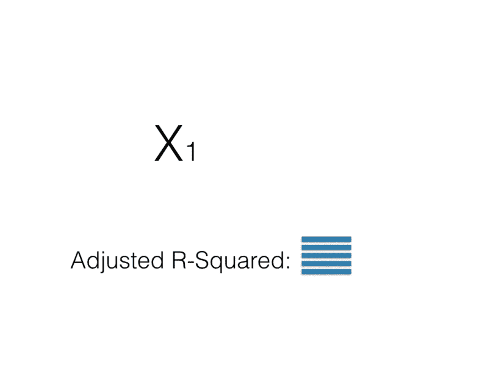

*   **逆向淘汰**:从所有变量开始。多次尝试模型，每次排除一个变量。当遗漏变量时，移除使模型改进最多的变量。在不移除变量的情况下重复该过程，直到您所判断的指标不再提高。

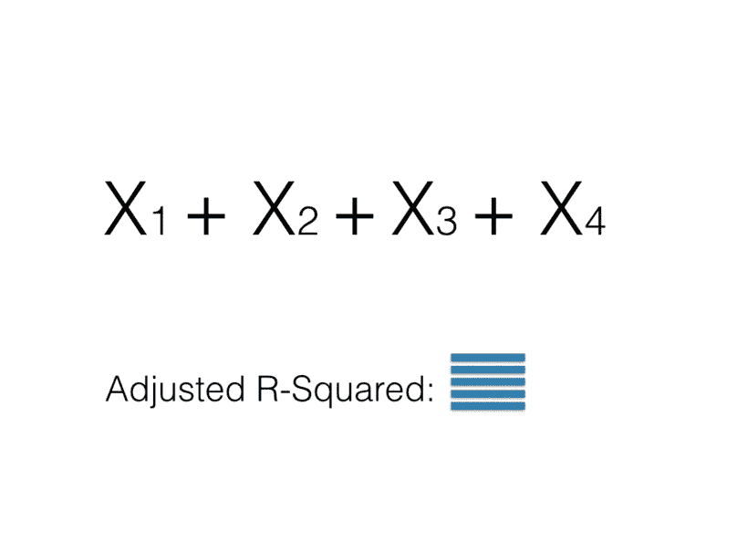

*   **双向淘汰**:进行正向选择，但在某些阶段也进行反向淘汰。因此，你可以在一个阶段，你已经添加了 X1，X2，X5 和 X8，然后做消除 X2。[这是一个很好的例子](https://stats.stackexchange.com/questions/97250/stepwise-regression-in-r-with-both-direction)。

一些了不起的人创造了 R 和 Python 包，它们自动完成这些过程，根据特定的度量标准(如调整后的 R 平方或 AIC 或 p 值)选择“最佳模型”。[这里的](https://planspace.org/20150423-forward_selection_with_statsmodels/) [都是我找到的](https://cran.r-project.org/web/packages/olsrr/vignettes/variable_selection.html) [的一些](https://www.statmethods.net/stats/regression.html)。

**注意:**逐步回归是一种快速获得更好评分模型的方法，尤其是在运行简单模型时。它被广泛使用，但是 [**也被广泛批评**](https://www.quora.com/Regression-statistics-Why-is-stepwise-so-criticised-What-are-the-flaws-in-this-method) 不准确。我一直被教导使用逐步，所以我很想听听你的意见。

逐步回归的替代方法是 LASSO(最小绝对收缩和选择算子)方法，我将在下一次介绍。或者你可以在这里读到它。

# 相关性和共线性

检查共线性有助于通过与另一个变量有**显著关系**来消除扭曲数据的变量。

变量之间的**相关性**描述了两个变量之间的**关系**。如果它们是**极相关**，那么它们就是**共线**。

[**自相关**](http://www.statisticssolutions.com/assumptions-of-linear-regression/) 发生在一个变量的数据影响到同一个变量的另一个实例(同一列，不同行)时。只有当数据集中很少或没有自相关，并且每个实例相互独立时，线性回归才有效。如果实例是自相关的，那么您的残差不是相互独立的，并且将显示一个模式。这通常发生在时间序列数据集中，所以当我介绍时间序列回归时，我会更详细地介绍。


In stock market data, based on prices at a certain time, you can roughly guess what the prices will be in the future following that, showing the dependancy of the future instance on the previous one.

**当回归模型中的两个或多个预测值( *x 变量*)中度或高度相关时(不同列)，存在多重共线性**。当我们的一个**预测者能够强有力地预测另一个预测者或者彼此之间有怪异的关系**(可能是 *x* 2 = *x* 3 或者*x*2 = 2(*x*3)+*x*4)，那么你的回归方程将会变得一团糟。


Multicollinearity: One x variable = Orange colour, Other x variable = number of oranges. They would be highly correlated as the number of oranges affects the orange-ness of the juice. Orange you pleased with this simple analogy?

为什么多重共线性是回归的一个问题？嗯，回归方程是代表预测值和因变量影响的**最佳拟合线，而**不包括一个预测值对另一个**的影响。**

预测值之间的高度共线性(相关性为 1.00)将影响您的系数和准确性，以及降低 SSE(误差平方和-您需要通过回归最小化的东西)的能力。

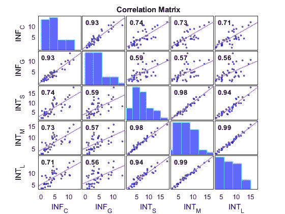

Example of a correlation plot taken from [https://www.mathworks.com/help/econ/corrplot.html](https://www.mathworks.com/help/econ/corrplot.html) comparing 5 variables with each other

检测共线性的最简单的方法是用图表示出来，或者查看相关矩阵来检查成对的相关性(两个变量之间的相关性)。

如果你有两个高度相关的变量，你最好的办法就是去掉其中一个。

# 共线性正在影响你的回归生活的 4 大迹象——你会被第 3 个震惊！

1.  当你的系数( *bx* 中的 *b* )为*负*时，但你从常识和商业知识中知道该变量的作用应该是*正的。*或当系数*过小时*对于一个应该有*更大影响的变量*。
2.  当你用那个 *x* 变量运行一个模型，而你不用那个 *x* 变量运行另一个模型，这些模型的系数*完全不同*。
3.  当每个单独斜坡的*t*-测试不显著，但总的*F*-测试显著时。这是因为多重共线性导致一些变量看起来没有用，因此降低了 t-stat，但对总体来看的 F-统计量没有影响。
4.  当你的 VIF 偏离图表是 5 或更多

# VIF 是什么国家？！

VIF:差异通货膨胀系数

**VIF** 是从模型中导出的系数的**方差被共线性**夸大了多少的度量。它有助于检测仅通过目测两两相关图无法发现的多重共线性，甚至可以检测 3 个或更多变量之间的密切关系。

它是通过[所有系数的方差]除以[当一个变量是模型中唯一的变量时，该变量的系数的方差]的比率**来计算的。**

> VIF = 1:预测值和其他变量之间没有相关性
> 
> VIF = 4:可疑，需要调查
> 
> VIF = 5-10:“休斯顿，我们有一个问题。”调查一下或者放弃这个变量。

```
[**Finding VIF in Python:**](https://etav.github.io/python/vif_factor_python.html)**from** **statsmodels.stats.outliers_influence** **import** variance_inflation_factory, X = dmatrices('y ~ x1 + x2', dataset, return_type='dataframe')vif_df = pd.Dataframe()
vif_df["vif"] = [variance_inflation_factor(X.values, i) **for** i **in** range(X.shape[1])]vif_df["features"] = X.columns
print(vif_df)[Finding VIF in R](http://minato.sip21c.org/msb/man/VIF.html)

 reg <- lm(y ~ x1+x2,x3, data=dataset)
 summary(reg)

 VIF(lm(x1 ~ x2+x3, data=dataset))
 VIF(lm(x2 ~ x1+x3, data=dataset))
 VIF(lm(x3 ~ x2+x1, data=dataset))
```

# 调整后的 R 平方

我们在上一篇文章中学习了 R 的平方。概括地说，它衡量回归线与实际结果的吻合程度**。让我们潜入更深的地方。**

它的公式是:

*R 平方=解释偏差/总偏差*

***解释方差*** = [回归平方和(SSR)](https://en.wikipedia.org/wiki/Explained_sum_of_squares) 【不要与 RSS(残差平方和)混淆，RSS 也称为 SSE】

总平方和(SST) = SSR + SSE(误差平方和)

你可以把它看成 SSE 是“*无法解释的变异*”。记住 SSE 是你的实际值( *y* )和你的预测值( *y-hat* )之间的误差

***总变差*** = SST(总平方和)。每个变量与该变量总体平均值之间的平均平方差(y- ybar)。

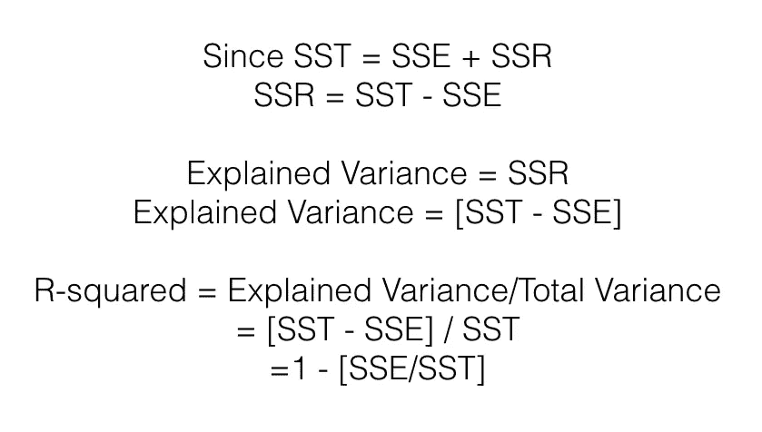

SOS.

所以 R 平方基本上是这样的:

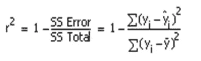

http://blog.minitab.com/blog/statistics-and-quality-data-analysis/r-squared-sometimes-a-square-is-just-a-square

现在这一点已经清楚了，让我们来看看调整后的 R 平方。

## 为什么要调整？

因为您的分子是**方差之和**，所以添加更多的预测值( *x* 变量)将**总是增加**的 R 平方，从而随着预测值的增加而变得不准确。

另一方面，**调整的 R 平方**，**说明了预测器数量的增加。**

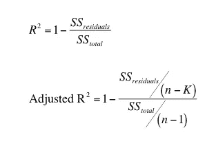

[https://www.graphpad.com/guides/prism/7/curve-fitting/index.htm?reg_interpreting_the_adjusted_r2.htm](https://www.graphpad.com/guides/prism/7/curve-fitting/index.htm?reg_interpreting_the_adjusted_r2.htm)

*   *n* 指的是数据点的数量(例如数据集中的行数)
*   *k* 指 x 个变量的个数

由于等式的性质，调整后的 R 平方应始终低于或等于 R 平方。

## 如何评价什么好什么不好？

使用调整后的 R 平方的一个好方法是用不同的变量对模型进行几次迭代(例如进行逐步回归)。你可以看到调整后的 R 平方是如何增加的，当增加更多变量时，可能会在减少之前达到一个最佳点。然后你应该把它保持在那些给你最佳调整 R 平方的变量上。

任何能够显著预测结果变量，从而提高您的准确性的变量，都将导致更高的调整后 R 平方。

# 那都是乡亲们！暂时如此。

喘口气。祝贺你到达这篇文章的结尾！


Take this cute photo - of a sleeping cat that I pet-sit — as your reward.

下一篇文章将介绍使用 gretl 和 python 的实际建模，以及更多检查准确性的方法。

下次见！