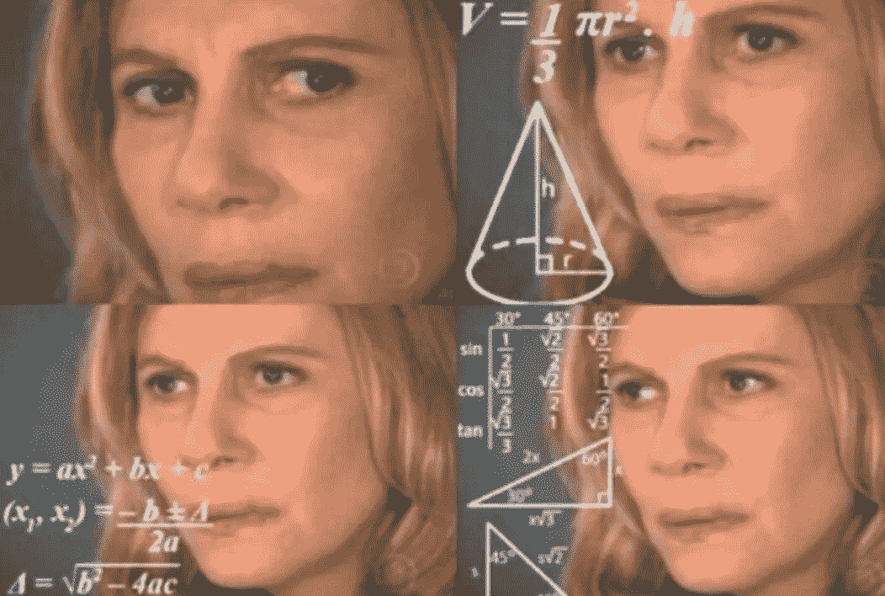
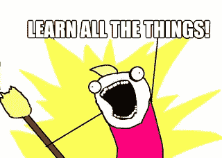
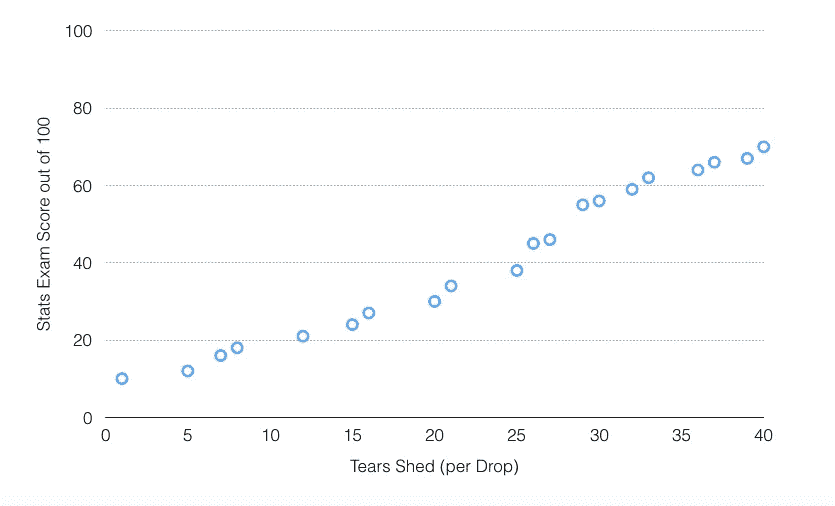
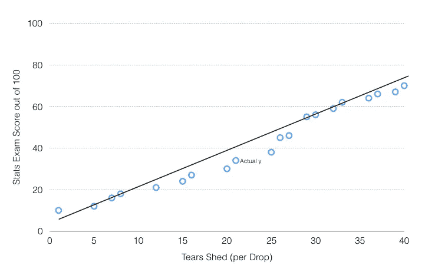
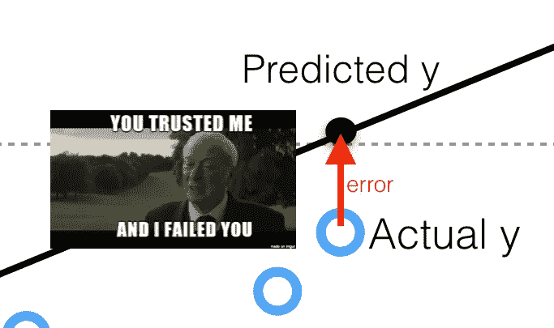
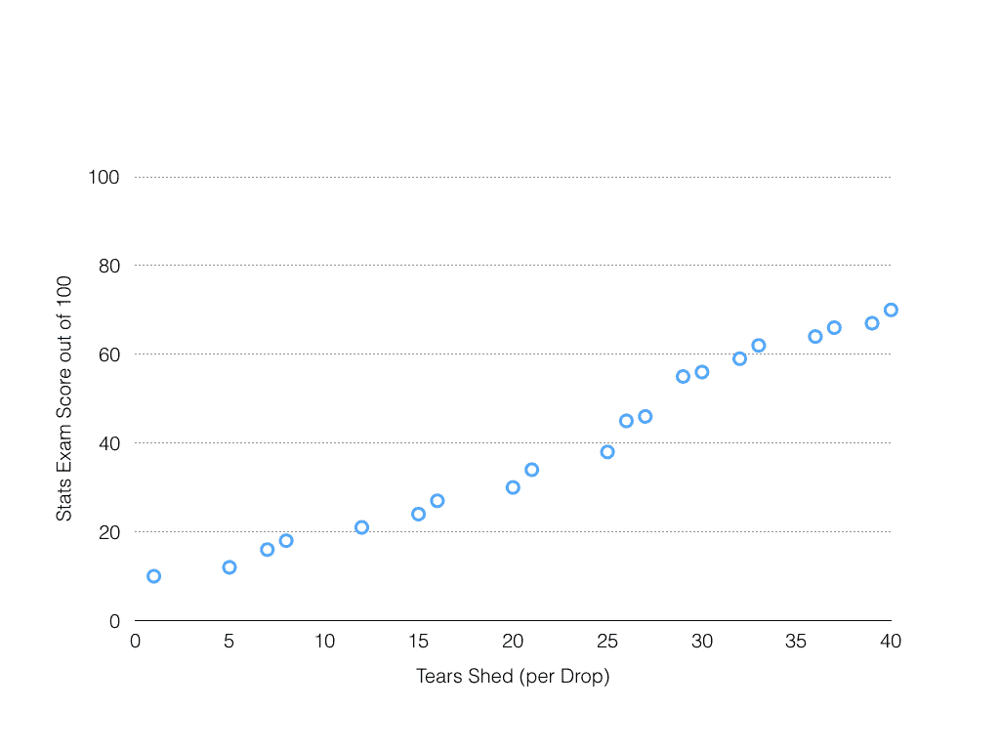
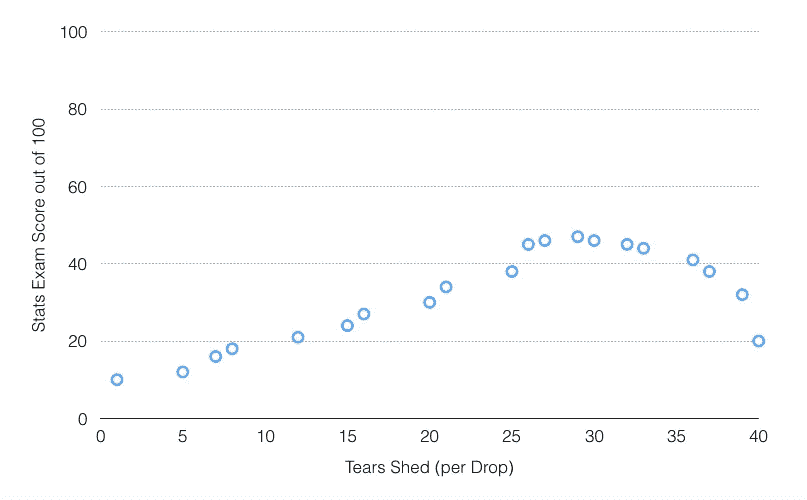

# 超级简单机器学习—简单线性回归第 1 部分【概念和 R】

> 原文：<https://towardsdatascience.com/super-simple-machine-learning-by-me-simple-linear-regression-part-1-concept-and-r-4b5b39bbdb5d?source=collection_archive---------4----------------------->

在我们开始之前…一句咆哮:

我不擅长统计学。

我可能不应该在网上写这个，它将被永远记录下来，并可能在我职业生涯的某个时候被用来反对我，但我很诚实，也很愚蠢，所以我会说出来:

我对统计一窍不通。

When you’re trying to figure out the volume of a cone, simple formulae and basic trigonometry. What, were you expecting an unrelated meme joke?

我知道你在想什么。

> “没关系，每个人都有自己的长处和短处，而数据不是你的强项”

嗯，是的，但是……出于某种原因，我决定从事数据分析工作。

过去很艰难，现在仍然很艰难；我记得在一堂分析课结束后，大家都离开了，我坐在大学教室里，盯着我的笔记本电脑屏幕，试图忍住眼泪，因为我不知道这该死的课是关于什么的。

最终，我确实想出了足够的方法来应付，但是如果我不理解模型，那么和模型打交道就没有任何意义。因此，我做了大量的阅读，一篇接一篇的文章，回顾基本的[统计理论](https://www.youtube.com/watch?v=LA4Uv6PMRTM)，观看教程等等。

我必须说，我非常感激我可以访问万维网，那里的资源是无穷无尽的。这有助于我的教育不依赖于一个为了完成博士学业而不得不教一门课，但没有任何教学技能而只是朗读幻灯片的人。

Meme made from a comic by Allie Brosh. Check out her amazing stuff @ [http://hyperboleandahalf.blogspot.sg/](http://hyperboleandahalf.blogspot.sg/)

在互联网上，我开始学习概念，用不同的方式解释，最后终于有了‘T4’的时刻。

也就是说，这里是我选择的一些向自己解释基本机器学习模型的方法。对我来说，我学习的最好方法是当我试图向别人解释的时候。

如果我的解释不正确，请随时告诉我。我不会生气的，我保证！

—

# 简单线性回归

> 简单线性回归模型是如此简单，以至于许多人认为它不值得被归类为“机器学习”。这很简单，只是统计建模。然而，为了这个系列的目的，我将把它归类为机器学习，因为它是一个时髦词，因此会让我听起来超级酷。

简单的线性回归模型允许你预测事情。多酷啊。基于已知的因素，你可以告诉你所有的朋友，即使某件事没有发生，你也有 87%的把握它会发生。Wooo~好神奇~

# 第一步

让我们回到简单的数学。 [*快克 MAF*](https://www.youtube.com/watch?v=3M_5oYU-IsU) *。*

你如何划清界限？

除了用尺子，哈哈好吧，爸爸的笑话放在一边，如果你想用微积分在图上做，它是

# **y = ax + b**

*   y 是结果。*就像统计学试卷上的分数。*
*   x 是变量。*喜欢流泪的数量。*
*   a 是一个有待确定的值。它被称为系数，类似于 x 变化时 y 的变化幅度。
*   b 是一个待定的常数。它被称为截距，因为当 x 为 0 时，y=b

简单的线性回归遵循这样一个假设，即利用迄今为止找到的所有数据，你可以画一条线[y = ax + b]来确定这些点的趋势，然后计算出在 x 为任意值时 y 为多少。

看得出来，眼泪越多，考试分数也越高。这是你应该注意到的第一个趋势。

你的任务是:

*我)找一个*

*ii)查找 b*

*iii)？？*

*四)利润*

It could look something like this

## 它是如何工作的

回归模型找到最佳拟合线的一种方法是使用最小平方标准(最小误差平方和)。[Actual y] -[Predicted y]是误差，求平方，使差值成为绝对值，然后求和。:D)。

因此，回归模型有时被称为**普通最小二乘**回归。

在最小化所有讨厌的误差平方和(SSE)后，你会得到一条很好的拟合线，你可以在这条线上进行预测。

“这有什么好奇怪的？”你可能会沮丧地大喊大叫。

这个模型很棒，因为找到最佳拟合线不是一件容易的事情。

简而言之，不要尝试每一条可以想到的线，然后计算误差平方和，一遍又一遍地重复，直到找到最小的一条线，结果却不是最小的，因为你永远不会知道…

别那样做，你这个笨蛋。

This is the moment you admit that the robot is smarter than you

这个模型，以及你喜欢的统计软件，不管是 R、python 还是 gretl，都会为你做所有的事情。你甚至不用去想它背后的数学。

换句话说，简单的线性回归模型找到了在做预测时**搞砸最少**的那条线。

它为你找到了 a 和 b 的值，所以当你想知道多少眼泪能让你在考试中得 90 分时，你会知道并能朝着那个方向努力。

# 在 R 中做行为

关于 R 的伟大之处在于，已经有一些包和函数将所有复杂的数学编程到其中，你所要做的就是输入输入。

对于简单的线性回归，您只需要:

*型号< - lm(y ~ x，data=your_data_source)*

然后你可以做一个
*总结(示范)*

来看看你的 a(系数)和 b(截距)是什么样子的。

在这里查看这个[教程](https://www.r-bloggers.com/r-tutorial-series-simple-linear-regression/)。

# 注意事项

然而，就像其他不好玩的事情一样，有很多 T2 规则要遵守。

1.  x 和 y 应该是线性关系。如果在某个时候流了太多的眼泪，导致眼睛疼痛，导致你在纸上做得更差(但愿不会如此)，那么图表将如下所示:

也就是说，你妈妈会打你的屁股，所以把眼泪擦掉，孩子。但这也意味着任何用直线做出的预测都是错误的。

这个时候，[转换](http://stattrek.com/regression/linear-transformation.aspx?Tutorial=AP)(我会在另一篇文章中详细阐述)就派上用场了，把皱眉变成一条线。

2.为了使用一个回归模型，你应该有至少 20 个数据点来使它准确。这是为了确保您的样本大小足够大，可以作为预测的基础。

就像我不能确定 chokers 是否会重新成为一种潮流，直到我看到大约 23 个易受影响的青少年(当然，在个别场合，同龄人的压力会扭曲观察结果)穿上它。

These things!!! I don’t understand them!!! You can get one at [https://www.fashionnova.com/products/throwback-choker](https://www.fashionnova.com/products/throwback-choker) I guess, but I’ll judge you for it

3.实现模型后，检查残差(实际预测的误差)是否是随机的。如果他们在做一些有趣的事情，并显示出清晰的趋势，这意味着你的模型显然没有抓住趋势。

> 它只有一项任务。一份工作！！

[这](http://blog.minitab.com/blog/adventures-in-statistics-2/why-you-need-to-check-your-residual-plots-for-regression-analysis)是一篇非常好的文章，它解释了当一个简单的线性回归做得好或不好时检查你的残差图。

# 坚持学习！

这仅仅是机器学习的表面(我不知道它是否被认为是机器学习)，如果你对它感兴趣，我建议你多读一些。我遗漏了许多方程和统计摘要，需要查看它们来确定我在这篇文章中没有提到的模型的准确性，所以请记住，这只是线性回归模型的基本思想。

期待第 2 部分，它将解释回归模型背后的数学，你应该注意什么参数，如何在我的新朋友 Python 中编写这些代码，并解释为什么我在这篇文章中给出的例子(眼泪与考试分数)是一个可怕的例子。

# 链接什么的

其他值得一读的网站:

 [## 线性回归简介

### 编辑描述

onlinestatbook.com](http://onlinestatbook.com/2/regression/intro.html)  [## 线性回归的假设-统计解决方案

### 首先，线性回归需要自变量和因变量之间的关系是线性的。这是…

www.statisticssolutions.com](http://www.statisticssolutions.com/assumptions-of-linear-regression/) 

通过 R 上的编码学习:

 [## 简单线性回归

### 统计学中最常用的技术之一是线性回归，在这种方法中，我们研究潜在的…

www.r-bloggers.com](https://www.r-bloggers.com/simple-linear-regression-2/) 

Udemy 有一个非常好的课程，涵盖了 Python & R 上的机器学习，他们解释了每个模型，并为不同的模型编写了代码，包括一个简单的线性回归模型:

 [## 机器学习 A-Z:数据科学中的 Python & R 实践

### 向两位数据科学专家学习用 Python 和 R 创建机器学习算法。包括代码模板。

www.udemy.com](https://www.udemy.com/machinelearning/) 

如果你想从一个更统计的角度来看，Coursera 上也有一个约翰·霍普斯金回归模型课程:

 [## 回归模型| Coursera

### 关于本课程:线性模型，顾名思义，使用…

www.coursera.org](https://www.coursera.org/learn/regression-models/) 

希望这对你有所帮助，或者至少引起你的兴趣！

如果你发现任何错误和误解，请在下面留下评论。