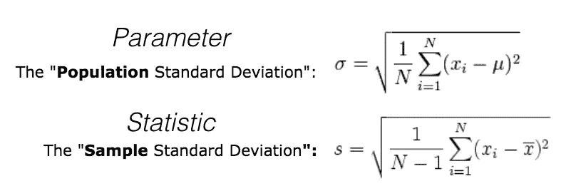
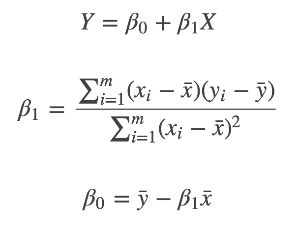
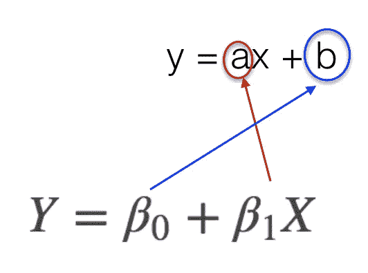
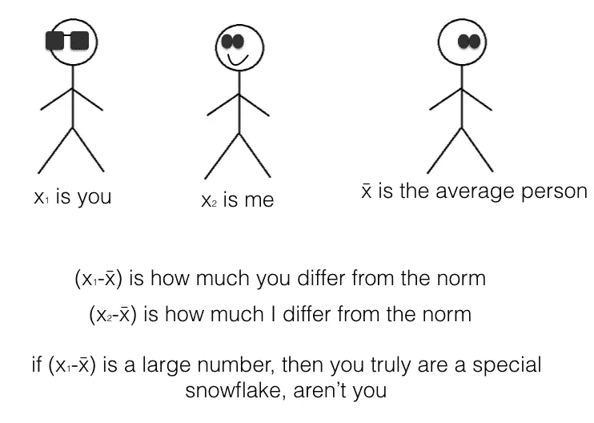
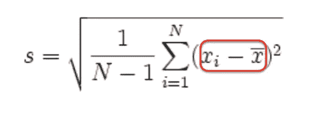
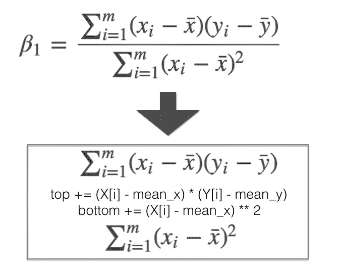
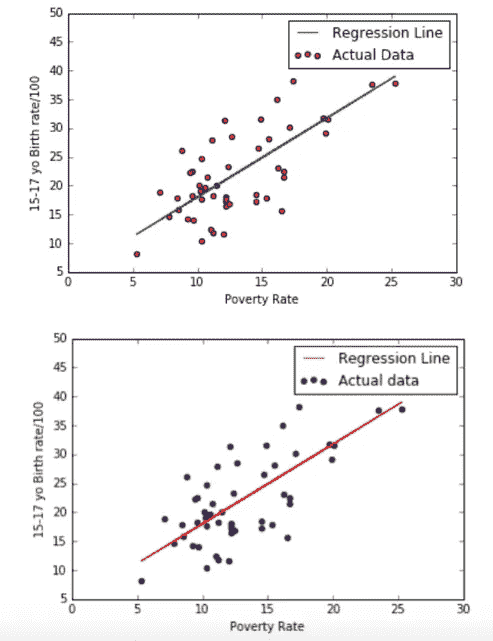

# 超级简单的机器学习—简单线性回归第 2 部分【数学和 Python】

> 原文：<https://towardsdatascience.com/super-simple-machine-learning-simple-linear-regression-part-2-math-and-python-1137acb4c352?source=collection_archive---------3----------------------->

这是我正在撰写的一系列文章的一部分，涵盖了 ML 算法，以简单轻松的方式进行了解释，以便于理解。 *我确实会掩饰更多的技术方面和术语，因为这里的目标是创造一些以最基本的方式推动理解概念的东西，而不是仅仅遵循步骤和盲目地抛出术语。然而，如果我的解释根本不正确，请告诉我。*

[*第 1 部分*](https://medium.com/@bernie.low93/super-simple-machine-learning-by-me-simple-linear-regression-part-1-concept-and-r-4b5b39bbdb5d) *对于简单的线性回归可以在这里找到。*

现在，您已经从第 1 部分中了解了简单线性回归的基本概念，让我们来看看本质。

在这篇文章中，我将深入一些 Python 编码及其背后的数学知识，并触及数据集的某些特征。

我们开始吧！

# 奇妙的参数/统计数据以及在哪里可以找到它们

> ***编辑！！！！！

我想先弄清楚一些术语。

一个朋友告诉我，我之前对参数的定义不正确。

参数是群体的特征(例如所有*可能的*结果)。很可能无法导出。

统计数据是样本的特征(例如我们可以记录的结果)。统计数据允许您估计参数:[“推断统计数据允许您对总体参数进行有根据的猜测”](https://www.cliffsnotes.com/study-guides/statistics/sampling/populations-samples-parameters-and-statistics)

到目前为止，您应该已经熟悉的特征示例如下:

*   **平均值:**平均值
*   **中位数:**中间值
*   **方差**:每个 x 与平均值 x 之间的**平方**差的平均值。它描述了数据的分布范围。如果方差很大，你的“低数值”很低，你的“高数值”很高，想象一个弹性带被拉得越来越远，方差相应地增加。方差越低，越“稳定”,因为它收敛于均值。
*   **标准差:方差的平方根**。基本上找到 x 的分布有多宽，这与方差**相同，但**是单位的**问题。如果你在看一个身高(厘米)的数据集，方差会给你平方厘米，但标准差是它的平方根，会给你一个厘米的答案，这有时更好计算，更适合你的强迫症。**

the two different standard deviation formulae

首先弄清楚方差和标准差，因为你会在统计建模中遇到 ALOT。[这个解释](http://www.mathsisfun.com/data/standard-deviation.html)挺好的……另外还有小狗！

超参数:

> 值得注意的是，机器学习中有称为超参数的参数，这些参数基本上是您必须决定使用的值，这些值无法从算法中“学习”，但会影响您的模型。
> 
> 超参数优化/调优是一个完全不同的话题，关于你如何决定你的超参数应该是什么值。我将在下一次解释 K-最近邻分类时谈到这一点。或者你可以在这里阅读[。](https://datascience.stackexchange.com/questions/14187/what-is-the-difference-between-model-hyperparameters-and-model-parameters)

*非常感谢 Michael Chia Wei Aun 澄清了什么是参数！*

# 好吧，那么…回归？

还记得在第 1 部分[中，我说过如何绘制不同的线以找到误差平方最小的线，以及 R 和 Python 包如何能帮你解决这个问题吗？](https://medium.com/@bernie.low93/super-simple-machine-learning-by-me-simple-linear-regression-part-1-concept-and-r-4b5b39bbdb5d)

好吧，让我们看看这些包在做什么。

请记住这一点:

> y = ax + b

直线方程。

让我们看看寻找最佳拟合线背后的数学原理。

普通最小二乘法背后的等式如下:

Figure 1: ??????

第一个方程是不是很眼熟？那是因为它和我在上面提到的方程完全一样——一条线的方程，只是写法不同

因此，第二个和第三个方程是您需要找到 **a** 和 **b、**的方程，这基本上是我们在 R 和 python 包中尝试做的事情。

a 和 b 在线性回归中被称为“β”,并被视为**学习参数**,因为它们在运行线性回归算法后最终被“学习”。

> *你可以在这里找到上面的方程式***及其背后的数学可以在这里找到***。***
> 
> **那些公式/公式是怎么回事？**
> 
> **他们试图最小化误差平方和(实际值和预测值的平方差)。如果不确定，请参考[第 1 部分](https://medium.com/@bernie.low93/super-simple-machine-learning-by-me-simple-linear-regression-part-1-concept-and-r-4b5b39bbdb5d)您是否注意到了？！).**
> 
> **要做到这一点，a 和 b 的偏导数必须为 0。因为 0 是曲线最小时的拐点。是的是的衍生品。**

**导数不是我要解释的，但是你可以在这里快速修改一下。**

# **x 和 Y 有比你妈妈更酷的头饰**

**你会注意到图 1 的第二个和第三个方程，x 和 y 的头上有有趣的东西。**

> **x̄ = x 酒吧**
> 
> **̅y = y 酒吧**

**除了是一个总屁股打字，酒吧基本上意味着，意味着。所以 x̄指的是 x 的均值**

**所以(x- x̄)是 x 的值和所有不同 x 值的平均值之差。**

**这被称为偏差分数，意思是偏离值有多远。**

****

**A quick explanation on x- xbar**

**(xi-x̄)看起来真的很熟悉，不是吗？这是因为它也用于计算方差和标准差。**

****

**看看平均值有多有用！这解释了为什么参数/统计如此重要。**

**另一个需要注意的符号是帽子**

> **ŷ = y 帽**

****

**how I remember y-hat: guy with fedora, always assuming, trying to predict things, most likely wrong**

**这是指预测方程中 y 的预测值。**

**换句话说，更准确地说，**

> **y = ax + b**

**应该是**

> **ŷ = ax + b**

**误差基本上是**

> **真实 Y -预测 Y**

**可以写成**

> **y - ŷ**

**这也被称为**残差。(** *还记得* [*第一部分*](https://medium.com/@bernie.low93/super-simple-machine-learning-by-me-simple-linear-regression-part-1-concept-and-r-4b5b39bbdb5d) *中关于检查你的残差是随机的，不应该显示出一个模式的那一步吗？)***

**总之，因为生活是艰难而复杂的——预测的误差平方和被写成 **SSE****

**但也可以称为:**

*   ****残差平方和****
*   ****残差平方和(SSR)****

# **好了，酷的编码从这里开始**

**既然我们已经解决了所有这些数学问题，让我们来编写代码吧。**

**我们将从使用 Python 中的 **sklearn** 库中的**线性回归**模块开始。这类似于我在第 1 部分中给出的 R 的一行代码，其中我使用已经预先编码的东西来寻找我的回归线。**

**我不会在这里讨论 Python 编码，因为我不认为我是合格的 lol，但我尽力在代码本身的#注释中解释了每个步骤。**

**耶，你完成了建模！**

**看那条*华丽的*线。这是不是一个好的线还没有决定(等待第三部分..就等着吧)，不过目前已经决定了这一行有**最少的 SSE(或者 RSS，或者 SSR)** 。**

**然而，由于我花了大量时间研究 LinearRegression()方法背后的等式，我想证明它实际上是我们刚刚使用的 python 模块背后的数学。**

****

**Figure 1 makes a 2nd appearance!**

**注意:**

****

> **python 里的权力符号不是“^”，是“**”**

**两者给出完全相同的结果:**

**回归方程为 y = 1.37x + 4.27**

****

# **我们结束了。**

**希望你现在对简单线性回归的工作原理有了更好的了解:)我当然知道。**

**这只是线性回归的第一步，但是你可以自己尝试。我用[这篇文章](https://mubaris.com/2017/09/28/linear-regression-from-scratch/)作为指南，它被证明是非常全面的，尤其是数学部分。**

**你可以在 [Jupyter 笔记本](https://jupyter-notebook-beginner-guide.readthedocs.io/en/latest/)中设置和编码，或者只使用 [Python IDE](https://www.datacamp.com/community/tutorials/data-science-python-ide) 。**

**在下一集，我将会谈到评估模型的准确性，以及如何从中得出预测。**

**敬请期待！**

# **额外额外！！语境很重要！！**

**在第一部分中，我举的关于‘流泪’和‘考试分数’的例子事后看来很糟糕。**

**尽管统计数据可以证明这种相关性，但请永远记住**

> ****相关性不是因果关系* ***

***对着镜子念 6 遍，希望相关的鬼魂出现给你祝福~***

**也许流泪的次数*会影响分数，因为我花在学习上的时间越多，哭得越厉害(在这种情况下，更好的方法是建立学习时间与考试分数的模型)，但这都是假设，可能只是巧合。***

**流泪次数与考试成绩之间的相关性可能是一个重要的因素。**

***鼓声***

> **[虚假相关](https://en.wikipedia.org/wiki/Spurious_relationship)**

**这就是商业知识和常识发挥作用的地方，也是防止机器偷走你工作的地方。什么是相关的，什么是不相关的，不仅仅是由程序定义的。特征选择在很大程度上是人类和计算机的工作。**

**查看泰勒·维根[的超级有趣的虚假相关性。](http://www.tylervigen.com/spurious-correlations)**

**我们已经到了第 2 部分的结尾！谢谢你坚持到现在。请在第 3 部分继续关注，如果发现任何错误，记得告诉我。**