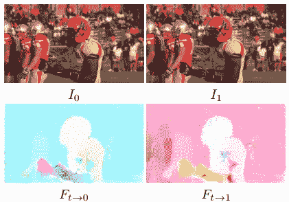

# 超级 SloMo 的乐趣。或者你如何用人工智能制作超赞的 YouTube 视频

> 原文：<https://towardsdatascience.com/super-slomo-fun-or-how-you-can-make-awesome-youtube-videos-with-ai-2d6459f6de14?source=collection_archive---------17----------------------->


> 想获得灵感？快来加入我的 [**超级行情快讯**](https://www.superquotes.co/?utm_source=mediumtech&utm_medium=web&utm_campaign=sharing) 。😎

你有没有想过 YouTubers 或者国家地理是怎么制作那些超级慢动作视频的？它们太酷了，简直就像魔术一样！

过去制作这样的视频非常昂贵。唯一干净利落的方法就是用超高 fps 的相机。

幸运的是，现在不再是这样了！过去几年发生的人工智能爆炸改变了一切。要制作一个史诗般的慢动作视频，你只需要下载一点代码，安装一两个库，剩下的就交给计算机视觉了。

# 超级慢动作

[Super SloMo](https://people.cs.umass.edu/~hzjiang/projects/superslomo/) 是一种新的计算机视觉技术，用于帧间插值。它来自 Nvidia，并在去年的 CVPR 会议上发表。



Super SloMo Optical Flow

简而言之，Super SloMo 试图计算视频中的中间帧。*给定 2 帧，我们如何在没有任何进一步信息的情况下准确估计它们之间的帧(如果我们有一个高 fps 的摄像机)*。它通过深度卷积神经网络来实现这一点，训练该网络来预测帧之间的[光流](https://docs.opencv.org/3.4/d7/d8b/tutorial_py_lucas_kanade.html)。

光流是由物体或摄像机的运动引起的图像物体在两个连续帧之间的表观运动模式。通过这种光流，Super SloMo 将知道图像中的每个像素如何从一帧移动到另一帧。一旦它知道了移动路径，它就可以确定如果我们真的有一个中间帧，每个像素会在哪里。一旦你知道所有的像素应该在哪里，你就可以简单地将它们组合起来形成中间帧！

Results from Super SloMo, courtesy of Nvidia

# 让你的视频慢下来

感谢 AI 社区中开放源代码思想的美丽，这里有一个公开可用的超级 SloMo [实现](https://github.com/avinashpaliwal/Super-SloMo)！这是你如何使用它。

首先克隆存储库

```
git clone [https://github.com/avinashpaliwal/Super-SloMo.git](https://github.com/avinashpaliwal/Super-SloMo.git)
```

安装所需的库

```
pip install torch torchvision
pip install tensorflow-gpu
pip install numpy
pip install matplotlib
sudo apt install ffmpeg
```

你可以从[这里](https://drive.google.com/open?id=1IvobLDbRiBgZr3ryCRrWL8xDbMZ-KnpF)下载预先训练好的模型。将该检查点放在 Super-SloMo 目录中。

要将您的视频从常规转换为慢动作，您只需运行一个小脚本！

```
python video_to_slomo.py --video=test.mp4 \
                         --sf=4 \
                         --checkpoint=SuperSloMo.ckpt \
                         --fps=25 \ 
                         --output=output.mp4
```

*视频*参数是输入视频的路径。 *sf* 控制你想让视频慢下来多少，在这种情况下是 4 倍。*关卡*是通往预训练模型关卡的路径。 *fps* 是原始视频的帧率；你可以通过右击视频并进入“属性”找到答案。*输出*是您希望输出视频的名称。

如果你在一台 Ubuntu 机器上，你可能需要注释掉下面两行，就像我在我的机器上一样:

```
FILE_ATTRIBUTE_HIDDEN = 0x02ctypes.windll.kernel32.SetFileAttributesW(extractionDir,                FILE_ATTRIBUTE_HIDDEN)
```

自己尝试代码，这很有趣！看看你是否能制作自己的超赞 SloMo 视频。欢迎在下面发布链接，与社区分享您的视频。

Results from Super SloMo, courtesy of Nvidia

# 喜欢学习？

在 twitter 上关注我，我会在这里发布所有最新最棒的人工智能、技术和科学！