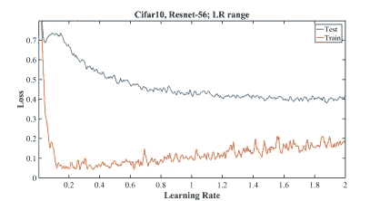

# 超收敛——内置正则化的快速训练

> 原文：<https://towardsdatascience.com/superconvergence-with-inbuilt-regularization-49f914173cd8?source=collection_archive---------13----------------------->

你有像我一样在训练大型神经网络时陷入局部极小值的恐惧症吗？等待长时间用大量的 epocs 训练网络，以获得对你的测试数据的良好准确性。

并且仍然得到一个像哑巴一样坐在局部最小值中的模型，以及如何尝试越来越多的正则化方法并再次等待很长时间的开销。

> 你需要这个家伙一个超级收敛的魔术，节省你的时间，把你从深度学习实践者生活中的问题中拯救出来，如局部最小值，泛化错误，训练数据过度拟合等。

> **超收敛-**

通常，在超收敛方法中，我们试图以大的学习速率学习到一个比传统的低学习速率学习更少的总迭代次数。

**Left: getting fast progress in starting, Right: in valley areas very little progress on a large number of epochs**

从较小的学习速率开始，在正确的方向上获取梯度，然后我们增加学习速率以快速通过平坦的山谷区域，在平坦区域之后，我们再次使用较低的学习速率来收敛到最佳损失值。这样在更少的时间内找到一个更好的超收敛解。

但是在固定学习率的情况下，我们可能会在开始时迅速减少损失，但是当我们停留在山谷区域时，我们会在大量迭代中取得一些进展，如右图所示。

> **自动正规化背后有什么魔力-**

有几种方法，如辍学，下降连接，噪声与大学习率和批量大小等。超参数这种方法给我们提供了梯度噪声。另一方面，我们可以用我们的神经网络的输入来添加一些正则化，如数据增强或添加噪声，这种正则化提供了梯度多样性。

## 核心是，我们需要一种既能提供梯度噪声又能提供多样性的方法来训练神经网络模型以获得良好的泛化能力。

下面是实验结果来了解一下——

因此，当我们从较低的学习率开始，但逐渐增加它们，并在训练期间达到较高的学习率时，我们将梯度噪声赋予我们的优化方法，这些方法充当我们模型的正则化器，如图所示，可能我们的训练损失增加了，但我们的验证损失降低了。最后对学习率进行退火处理，得到更平坦、更好的极小点。

这支持了*【Wu et al .，2017】*的论文，该论文指出宽的、**平坦的局部极小值产生比尖锐极小值概括得更好的解。**

我们可以利用这一点与数据扩增，以获得梯度经验噪声和多样性。

> **为什么我使用这种方法而不是其他的正则化方法-**

因为我已经很快完成了训练部分，这对我一直都很有效。当我第一次在 [**FastAI**](https://www.fast.ai/) 从[**【杰瑞米·霍华德】**](https://medium.com/u/34ab754f8c5e?source=post_page-----49f914173cd8--------------------------------) 中了解到这个方法，第二次看了 [Sylvain Gugger](https://sgugger.github.io/) 的这个[博客](https://sgugger.github.io/the-1cycle-policy.html#the-1cycle-policy)时，我就对这个方法印象深刻。

**为了更好地理解和实际使用，推荐阅读-**

*   [*1 周期政策*](https://sgugger.github.io/the-1cycle-policy.html#the-1cycle-policy)
*   [https://www.fast.ai/2018/07/02/adam-weight-decay/](https://www.fast.ai/2018/07/02/adam-weight-decay/)
*   [循环学习率](https://medium.com/@lipeng2/cyclical-learning-rates-for-training-neural-networks-4de755927d46)
*   [超收敛:使用大学习率非常快速地训练神经网络](https://arxiv.org/pdf/1708.07120.pdf)